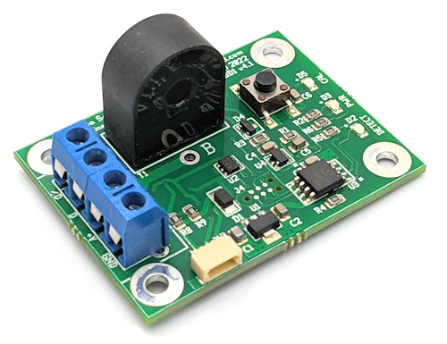
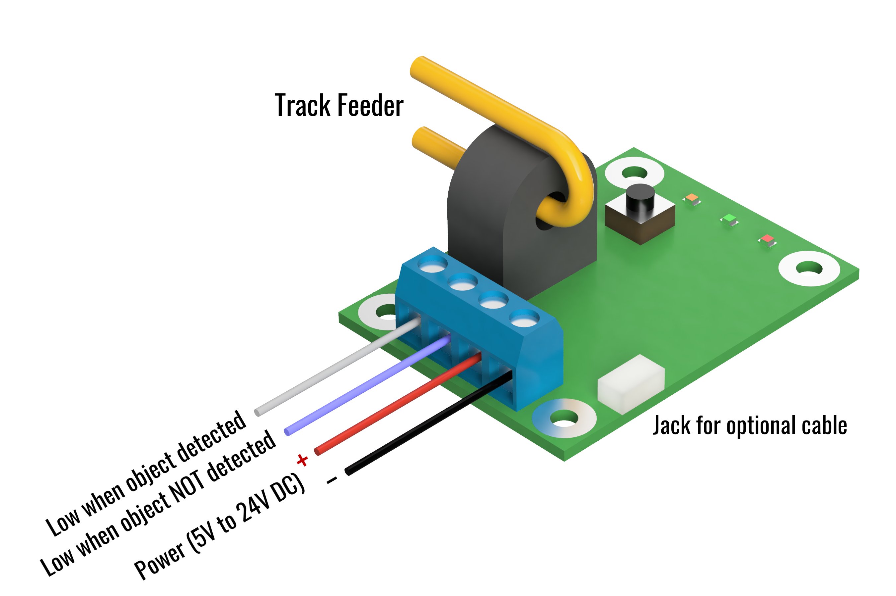

# CKT-BD1 (ATOM) User Manual {align=right style="height: 75px; margin-top:0px; margin-bottom: 0px"}

## Overview

The Iowa Scaled Engineering [ATOM](https://www.iascaled.com/store/CKT-BD1) is a reliable, easy-to-install,
single-channel DCC block detector.  Compatible with a wide variety of other
block detectors on the market, the ATOM provides two open collector outputs
(one for detection, one for no detection) with optional pull-up resistors
and easy pushbutton sensitivity adjustment.  Since it's based on a current
transformer, the detector maintains isolation between your track and signal
systems.

For those invested in C/MRI, we offer an alternate version ([CKT-BD1-CMRI](https://www.iascaled.com/store/CKT-BD1-CMRI))
that replaces the screw terminals with a plug that connects directly into
Dr.  Chubb's detector motherboard (ODMB) and provides full compatibility
with the DCCOD.

### Features
* Isolated, current-transformer based detection for DCC
* Highly sensitive (~1mA, equivalent to a 10k ohms)
* Simple single button sensitivity adjustment
* Two opposite polarity, open-collector outputs (40V / 250mA capable)
* Optional built-in 10k output pull-up resistors
* 0.4s turn on and 2.5s turn off delay to eliminate glitching
* Powered from 5V to 24V

### Typical Applications
* Detect block occupancy for signal systems
* Activate grade crossing signals
* Trigger sounds
* C/MRI track occupancy inputs

---

## Quick Start Guide

There are three options for connecting to the ATOM block detector: terminal
blocks, an optional JST-style cable (available separately), or an optional
Molex connector that makes the ATOM compatible with C/MRI-style detector
motherboards.

The ATOM needs 5V to 24V of clean DC power.  When using the terminal blocks,
power should be supplied to the +V (positive) and GND (negative) terminals.

**Please do not use old power packs as a source of “DC” power.**  Their DC
outputs are usually unfiltered and generally have peak voltages that far
exceed the nominal voltage listed.  Often these peaks are 35+ volts, and far
more than enough to destroy low voltage electronics.

If using the optional cable, power should be applied to the red (positive)
and black (negative/ground) wires.  The Molex connector on the C/MRI version
provides power automatically when plugged into a compatible motherboard.

The /D terminal (or white wire when using the JST-style cable) will conduct
current to ground/negative when a train is detected within the block.  The D
terminal (or blue wire when using the JST-style cable) will conduct current
to ground/negative when a train is NOT detected within the block.

In order for the ATOM to work, a block of track needs to be electrically
isolated, at least on one rail, from the blocks around it.  (We recommend
that both rails are isolated for each block, and that dedicated feeders run
to each, as this eliminates potential sources of interference.)  The feeders
for only one of the isolated rails need to run through the center hole in
the black “tombstone” current transformer on the ATOM.  The track feeder
should only pass through the hole one time, as shown by the yellow wire in
the diagram.

Normally the two outputs are in an “open drain” configuration, meaning they
act like a switch to ground – either they conduct current or they look like
an open circuit.  **Do not exceed 40V on either of the two output terminals. 
Also, do not attach loads that will draw more than 250mA of current or the
output transistors may be damaged.**

If your application requires pull-up resistors, such as for connecting to a
logic-level input, short jumpers JP1 and/or JP2 using a blob of solder to
enable the on-board 10k pull-up resistors.  These resistors pull the D and
/D outputs up to the +V voltage.  JP1 is for the D terminal (or the blue
wire) and JP2 is for the /D terminal (or the white wire).

---

## Operation

When the detector is powered, the green “PWR” light should be illuminated.

During normal operation, when the ATOM senses enough current to trip, the
red DETECT light will turn on.  There is a slight turn-on delay of 0.4s and
a 2.5s turn-off delay to eliminate glitching.

The ATOM comes factory calibrated to start detecting at 1mA of current so
that just a single 10k resistor wheelset will trigger detection.  Most users
will not need to recalibrate the detectors.  However, if the DETECT light is
on while your track block is empty, you may need to calibrate out leakage
current.

If your block is empty and the red DETECT light is on, first make sure that
your block is truly isolated from others and that no equipment is sitting on
the block.  Wiring mistakes or a piece of equipment sitting on the rails can
often be mistaken for detection issues.

Once you’re sure of that, you may just need to recalibrate the leakage
current.  An empty block theoretically draws no current.  However,
capacitance between track feeders as well as ballast and other scenery
materials in contact with the rails can cause additional leakage currents to
flow.  This may not happen initially, but may occur with seasonal humidity
variations, as ballast will naturally soak up humidity and your leakage
current may rise.

The ATOM can quickly compensate for up to 10mA of leakage current.  If you
do need to adjust for sensitivity Press and hold the pushbutton on the ATOM. 
You should see the orange CAL light start to blink slowly.  Once the CAL
light stays on solid, release the switch.  Within a few seconds, the CAL
light should blink rapidly three times and the red DETECT light should go
out, indicating that the calibration was a success.  If the DETECT light
does not go off, it is likely that you have either an error in your DCC
wiring or excessively high leakage current in the block.

---

## C/MRI and Circuitron-Style Motherboards 

In order to use the detector with C/MRI-style detector motherboards, a Molex
09-48-1054 (5 position, right angle female connector) must be soldered on to
the end of the PCB.  Holding the PCB with the connector holes on the left, a
5 position connector should be installed in the lower five holes.

Circuitron makes a compatible motherboard with an additional pin for the
high when detecting output (D).  For those, a Molex 09-48-1064 (6 position,
right angle female connector) should be used and attached in all six holes.

In addition to the connector, a short wire needs to be soldered between the
holes labeled A and B, passing through the current transformer hole only
once.  This will carry DCC track power, so 16 gauge or larger stranded
copper wire is recommended.

---

## Specifications

**Input Power:**  5 to 24 volts DC  
**Input Supply Current:**  5.5 milliamps (typical)  
**Turn On Delay:**  0.4 seconds  
**Turn Off Delay:**  2.5 seconds  
**Sensitivity:**  1mA at DCC frequencies  
**Size:**  2.0"(L) x 1.5"(W) x 0.875"(H)

---

## Open Source 

Iowa Scaled Engineering is committed to creating open designs that users are free to build, modify,
adapt, improve, and share with others.

The design of the CKT-BD1 hardware is open source hardware, and is made available under the
terms of the [Creative Commons Attribution-Share Alike v3.0 license](http://creativecommons.org/licenses/by-sa/3.0/). 
Design files can be found in the [ckt-bd1](https://github.com/IowaScaledEngineering/ckt-bd1) project on 
GitHub.

The firmware for the CKT-BD1 is free software: you can redistribute it and/or modify it under the 
terms of the GNU General Public License as published by the Free Software Foundation, either [version 3 of the 
License](https://www.gnu.org/licenses/gpl.html), or any later version. Firmware for the CKT-BD1 can be 
found in the [ckt-bd1](https://github.com/IowaScaledEngineering/ckt-bd1) project on GitHub.
