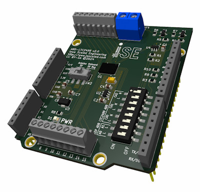
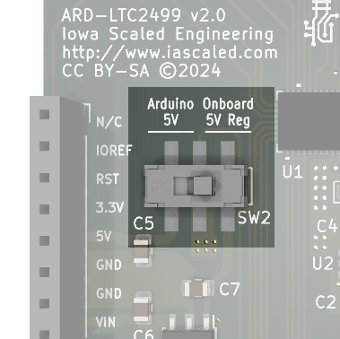
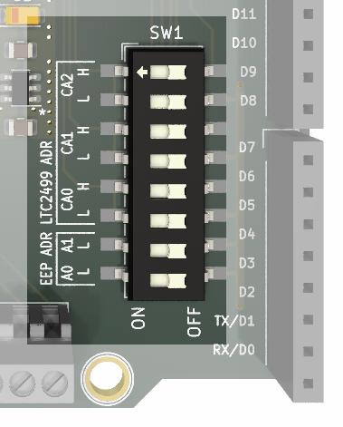
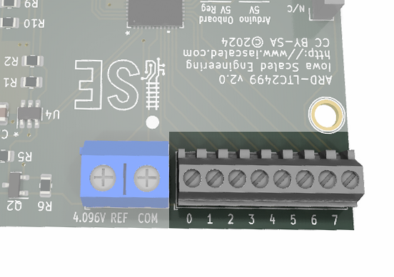
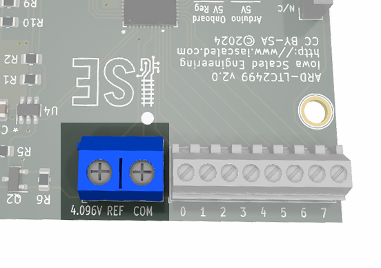

# ARD-LTC2499 16-channel, 24-bit ADC Shield User Manual

## Overview

{align=right}The ARD-LTC2499 is an Arduino-compatible shield that contains an Analog Devices (former Linear Technology) LTC2499 24-bit ADC coupled with an LT6654 precision voltage reference. It is capable of converting 16 single-ended channels, 8 differential channels, or any other combination. In addition to measuring voltage, the ADC can interface directly to a variety of sensors including strain gauges, thermocouples, and current shunts. The onboard EEPROM can be used to store calibration and configuration information directly on each ARD-LTC2499 board. A 6-byte EUI-48-compatible globally unique ID number is also provided. The ARD-LTC2499 can be used with other Arduino shields to make a simple, yet very accurate, data acquisition system.

The ARD-LTC2499 can be purchased from the [Iowa Scaled Engineering store](https://www.iascaled.com/store/ARD-LTC2499).

### Features

* Precision 24-bit delta sigma ADC in an Arduino-friendly form factor
* 16 single-ended channels, 8 differential channels, or any combination
* 7.5 samples/sec (or 15 samples/second without automatic offset cancellation)
* Input measurement range of 0-2.048V (single-ended) or -2.048V to 2.048V (differential)
* Input common mode voltage range of -0.3V to 5.3V
* 4.096V LT6654 A-grade precision voltage reference on board
* Onboard 5V linear regulator provides clean power to the ADC and reference
* 128 bytes of onboard EEPROM for storing configuration or calibration values
* Read-only 6-byte EUI-48-compatible globally unique ID
* Arduino software library for easy use
* Compatible with 3.3V & 5V I2C interfaces

### Typical Applications

* Direct thermocouple measurements
* Precision sensor instrumentation

---

## Quick Start Guide

The Golden Rule: When in doubt, check the [LTC2499 datasheet](https://www.analog.com/media/en/technical-documentation/data-sheets/2499fe.pdf). This guide is intended to get you started and not designed to be a comprehensive guide to the LTC2499.  The datasheet includes many important tips and details regarding how to make very accurate measurements using the part.

Mount the board on to your choice of Arduino and then configure it before applying power.

The older version 1.x ARD-LTC2499 boards had jumpers instead of switches.  See the [Legacy Configuration](#configuring-older-1x-boards) section further down.

### Power Switch

{align=right} The ARD-LTC2499 can derive the 5 volt power that it needs either from the Arduino's 5V supply pin or by regulating it onboard from the Vin supply.

Using the 5 volt supply from the Arduino is often convenient, as it can be derived from the USB connection and no external power source is needed.  However, this 5 volt supply will often be noisy and that noise can affect precision ADC readings.

If an external (7 volt or greater) power supply is connected to the Arduino and present on the Vin header pin, the ARD-LTC2499 can create its own local, regulated, clean 5 volt power.  This will help minimize noise to the ADC.

Slide the switch to the "Arduino 5V" position (left) to use 5 volt power from the Arduino.  Slide the switch to the "Onboard 5V Reg" position (right) to use Vin power regulated on board.

If the green power LED does not come on once you power up the board, the power selector switch should be the first thing to check.

### LTC2499 Address

{align=right}Each device on the I2C bus must have a unique device address.  There are six switches on the board under "LTC2499 ADR" that allow you to select from 27 possible addresses for the LTC2499.

For each address line (CA0, CA1, and CA2), there are a pair of switchess marked H and L that allow you to set that line high (set the H switch on and the L switch off), low (set the L switch on and the H switch off) or floating (set both H and L switches off).  If you're only using a single ARD-LTC2499 and don't have anything else on the I2C bus, then the default will work fine and there's no need to change it.  However, if you do have other devices on the I2C bus, or you want to run multiple ARD-LTC2499 shields, you will need to configure each of them for a unique address.

The table below shows the combinations and how they correspond to both the 7-bit I2C address and the define you'll pass into the library.

| CA0    | CA1    | CA2    | 7-bit I2C Address | Ard2499 Library Define       |
|--------|--------|--------|-------------------|----------------------|
| Low    | Low    | Low    | 0x14              | ARD2499_ADC_ADDR_000 |
| Low    | Low    | Open   | 0x15              | ARD2499_ADC_ADDR_00Z |
| Low    | Low    | High   | 0x16              | ARD2499_ADC_ADDR_001 |
| Low    | Open   | Low    | 0x17              | ARD2499_ADC_ADDR_0Z0 |
| Low    | Open   | Open   | 0x24              | ARD2499_ADC_ADDR_0ZZ |
| Low    | Open   | High   | 0x25              | ARD2499_ADC_ADDR_0Z1 |
| Low    | High   | Low    | 0x26              | ARD2499_ADC_ADDR_010 |
| Low    | High   | Open   | 0x27              | ARD2499_ADC_ADDR_01Z |
| Low    | High   | High   | 0x28              | ARD2499_ADC_ADDR_011 |
| Open   | Low    | Low    | 0x35              | ARD2499_ADC_ADDR_Z00 |
| Open   | Low    | Open   | 0x36              | ARD2499_ADC_ADDR_Z0Z |
| Open   | Low    | High   | 0x37              | ARD2499_ADC_ADDR_Z01 |
| Open   | Open   | Low    | 0x44              | ARD2499_ADC_ADDR_ZZ0 |
| Open   | Open   | Open   | 0x45              | ARD2499_ADC_ADDR_ZZZ |
| Open   | Open   | High   | 0x46              | ARD2499_ADC_ADDR_ZZ1 |
| Open   | High   | Low    | 0x47              | ARD2499_ADC_ADDR_Z10 |
| Open   | High   | Open   | 0x54              | ARD2499_ADC_ADDR_Z1Z |
| Open   | High   | High   | 0x55              | ARD2499_ADC_ADDR_Z11 |
| High   | Low    | Low    | 0x56              | ARD2499_ADC_ADDR_100 |
| High   | Low    | Open   | 0x57              | ARD2499_ADC_ADDR_10Z |
| High   | Low    | High   | 0x64              | ARD2499_ADC_ADDR_101 |
| High   | Open   | Low    | 0x65              | ARD2499_ADC_ADDR_1Z0 |
| High   | Open   | Open   | 0x66              | ARD2499_ADC_ADDR_1ZZ |
| High   | Open   | High   | 0x67              | ARD2499_ADC_ADDR_1Z1 |
| High   | High   | Low    | 0x74              | ARD2499_ADC_ADDR_110 |
| High   | High   | Open   | 0x75              | ARD2499_ADC_ADDR_11Z |
| High   | High   | High   | 0x76              | ARD2499_ADC_ADDR_111 |

### EEPROM Address

Each ARD-LTC2499 board also comes with a 24AA025E48 EEPROM that provides both non-volatile storage and the globally unique ID number.  This can be useful for uniquely identifying a particular board for calibration reasons, or for storing calibration data on the board itself.  Just like the LTC2499, the EEPROM also needs a unique address on the I2C bus.  Here you only have four choices, however.  The table below shows the combiantions and how they correspond to both the 7-bit I2C address and the define you'll pass into the library.

For a switch to be "Low" it should be set to "ON".  If a switch is "OFF" that address bit will be "High", because it's pulled up by onboard resistors.

| A0  | A1  | 7-bit I2C Address | Ard2499 Define      |
|--------|--------|-------------------|---------------------|
| Low  | Low  | 0x50              | ARD2499_EEP_ADDR_00 |
| Low  | High | 0x51              | ARD2499_EEP_ADDR_0Z |
| High | Low  | 0x52              | ARD2499_EEP_ADDR_Z0 |
| High | High | 0x53              | ARD2499_EEP_ADDR_ZZ |

If you don't plan to use the EEPROM feature, then it's not necessary to make sure each board has a unique address.  However, if you do plan to use it, that does limit you to four ARD-LTC2499s attached to a single Arduino.

### Analog Inputs

!!! warning ESD Sensitive
    To eliminate any possibility of introducing gain or offset errors from buffering, the analog input pins of the LTC2499 and the 4.096V reference output are brought directly to the terminal headers. Please be careful when handling and using the board. Errant electrostatic discharge or voltages applied outside the absolute maximum limits specified in the datasheet will cause immediate damage.

!!! note Input Range
    The useful measuring range of the inputs is 0V to 2.048V in single-ended mode, and a +/-2.048V in differential mode. Be careful of common mode limits! Inputs have an absolute maximum common mode limit of -0.3V to +0.3V above VCC (nominally 5V) before damage to the part will occur, so while the differential inputs can have -2.048V between them, neither side of the input may violate the limit of -0.3V to 5.3V without damaging the part.

{align=right} The part includes 16 analog inputs on green 0.1" terminal blocks along the top and bottom of the board.  The channel numbers are displayed below the terminal block position, corresponding to the channel numbers in the LTC2499 documentation and in the Ard2499 control library.

These may be used in single-ended mode, where their voltage is measured against the "COM" pin (nominally system ground), or in differential mode where the measurement is taken between two channel pins.

### Reference Output

!!! warning ESD Sensitive
    To eliminate any possibility of introducing gain or offset errors from buffering, the analog input pins of the LTC2499 and the 4.096V reference output are brought directly to the terminal headers. Please be careful when handling and using the board. Errant electrostatic discharge or voltages applied outside the absolute maximum limits specified in the datasheet will cause immediate damage.

{align=right} The LT6654 precision 4.096 volt reference is brought out to a terminal block at the edge of the board.  This is useful for providing a reference voltage for resistive divider or Wheatstone bridge-type sensor applications.  Be aware that the LT6654 is rated for a maximum of +/- 10mA. Also note that any current drawn from this pin will degrade the accuracy of the reference by a small amount (see the Electrical Characteristics table, "Load Regulation", in the LT6654 datasheet).

### Install the Library

The final step, of course, is to install the Ard2499 library that allows you to control the board.  You're of course welcome to write your own to talk directly to the hardware, but our library should help save time in getting things up and running.

Full details on how to install the library and work with the interface are available in the [Developer's Guide](library.md).

We recommend running the "ard2499_example" example sketch that comes with it first to just verify connectivity and that everything works.

----

## Configuring Older 1.x Boards

The ARD-LTC2499 underwent a significant resign in late 2024 to change to a more manufacturable design.  The boards are nearly electrically the same but use pin jumpers to configure the options instead of switches.  Of particular note is that the version 2 board is compatible with a wide range of I/O voltages, and it includes I2C pull-up resistors that are always enabled.  Otherwise, the two are nearly electrically identical.

!!! note Different Versions
    Version 1.x ARD-LTC2499 boards came in two variants - the ARD-LTC2499 which worked with 5 volt Arduinos, and the ARD-LTC2499-3V3 that integrated I2C level shifting circuitry to work with Arduinos using I/O voltages other than 5V.  Unlike the newer version 2 boards, which will work with any I/O voltage, the old ones were specific to the application.  The regular 5V (ARD-LTC2499) version also was offered with both A and B-grade LT6654 references depending on the version purchased, which affects reference initial accuracy and drift.

* JP1 - I2C Pull-up Enable
* JP2 - I2C Pin Selection
* JP3 - Onboard 5V Linear Regulator Enable
* JP4, JP5 & JP6 - LTC2499 I2C Address
* JP7 & JP8 - EEPROM I2C Address

_JP1 - I2C Pull-up Enable_

The I2C bus depends upon a set of pull-up resistors to function correctly. Each I2C bus should have one and only one set of
pull-ups enabled. The ARD-LTC2499 includes a set of 1.6k pull-up resistors that can be enabled by jumpering pins 1-2 and pins 3-4 of JP1.
Note that Arduino boards do not typically provide I2C pull-ups, so at least one board connected to I2C must provide them.

(The version 2 boards always provide I2C pull-up resistors.)

_JP2 - I2C Pin Selection_

Not all Arduinos provide I2C on the same pins. With the Rev 3 hardware designs (almost all of them as of 2021), there are now a
dedicated set of pins above AREF and GND marked "SDA" and "SCL". If you see those on your board, then place jumpers between
pins 3-5 and 4-6 on JP2 to connect the I2C bus to them.

If you board does not have explicit SDA and SCL pins, then most likely they're shared with pins A4 and A5. Place jumpers
between pins 1-3 and 2-4 to select those instead.

(The version 2 boards always use the SDA/SCL pins.)

_JP3 - Onboard 5V Linear Regulator Enable_

To free the LTC2499 from any noise on the Arduino's 5V supply caused by the AVR or other shields, the ARD-LTC2499 includes an
onboard 78L05 regulator coming from the Arduino's "VIN" pin. If you are powering the Arduino with >8VDC via the power jack,
you can use the ARD-LTC2499 onboard 5V regulator to provide nice quiet power by jumpering pins 3-4 of JP3.

If you are powering the Arduino off of the 5V provided by USB or via some other means that does not place >8VDC on the VIN pin,
then the regulator will not work and must not be used. JP3 must be placed between pins 1-2 in this case.

_JP4, JP5 & JP6 - LTC2499 I2C Address_

Each device on the I2C bus must have a unique device address. The LTC2499 has 27 possible addresses depending on how
JP4, JP5, and JP6 are set. Each may be set high (jumpering pins 1-2, the two closest to the LTC2499), low (jumpering pins 3-4,
the ones furthest from the 2499) or floating (no jumpered pins or pins 2-3 jumpered).  JP4 corresponds to CA0, JP5 to CA1, and JP6 to CA2 on the LTC2499.

See the [LTC2499 Address](#ltc2499-address) section above for details.

_JP7 & JP8 - EEPROM I2C Address_

Each device on the I2C bus must have a unique device address. The 24AA025E48 EEPROM that provides both non-volatile storage
and the globally unique ID number has four possible addresses depending on how JP7 and JP8 are set. Each may be set high (no jumper)
or low (jumper in place). See the [EEPROM Address](#eeprom-address) section above for the details about individual addressses.

---

## Schematics and CAD Files

The current (v2.0) version of the ARD-LTC2499 is done in Kicad 6.  Prior versions are in gEDA (gschem/pcb).

Github Project:

* [ARD-LTC2499 Hardware Project](https://github.com/IowaScaledEngineering/ard-ltc2499)  
* [Ard2499 Arduino Library Project](https://github.com/IowaScaledEngineering/arduino-ard2499)  

Schematics:

* [Version 2.0](https://github.com/IowaScaledEngineering/ard-ltc2499/raw/0e5e6ba72611d856ce3cbafdbe2237de77f31177/pg/ard-ltc2499-v2.0-4a42bed/ard-ltc2499.pdf)  
* [Version 1.3](https://github.com/IowaScaledEngineering/ard-ltc2499/raw/0e5e6ba72611d856ce3cbafdbe2237de77f31177/pg/ard-ltc2499-v1.3-83eb2df/ard-ltc2499.pdf)  
* [Version 1.3 - 3.3V Version](https://github.com/IowaScaledEngineering/ard-ltc2499/raw/0e5e6ba72611d856ce3cbafdbe2237de77f31177/pg/ard-ltc2499-v1.3LS-ffd4822/ard-ltc2499.pdf)  
* [Version 1.2](https://github.com/IowaScaledEngineering/ard-ltc2499/raw/ed31852352ba30830b3bb7c2c7d59020d6dc1feb/pg/ard-ltc2499-v1.2-r1124/ard-ltc2499.pdf)  

Other:

* [STEP file for v2.0](https://github.com/IowaScaledEngineering/ard-ltc2499/raw/ed31852352ba30830b3bb7c2c7d59020d6dc1feb/mech/ard-ltc2499.step)  

Component Parts Datasheets:

* [LTC2499 16-ch, 24-bit ADC](https://www.analog.com/media/en/technical-documentation/data-sheets/2499fe.pdf)  
* [LT6654 4.096V Reference](https://www.analog.com/media/en/technical-documentation/data-sheets/lt6654.pdf)  
* [24AA025E64 EEPROM](http://ww1.microchip.com/downloads/en/DeviceDoc/20002124G.pdf)  

---

## Specifications

**Input Power:**  5 to 24 volts DC  
**ADC Inputs (common mode):**  -0.3V to 5.3V with respect to ground  
**ADC Inputs (differential):**  0-2.048V (single ended) or -2.048 to +2.048V (differential)  
**Sample Rate:**  7.5 samples/sec or 15 samples/sec with no offset correction  
**Size:**  69mm(L) x 54mm(W)  

---

## Open Source 

Iowa Scaled Engineering is committed to creating open designs that users are free to build, modify,
adapt, improve, and share with others.

The design of the ARD-LTC2499 hardware is open source hardware, and is made available under the
terms of the [Creative Commons Attribution-Share Alike v3.0 license](http://creativecommons.org/licenses/by-sa/3.0/). 
Design files can be found in the [ard-ltc2499](https://github.com/IowaScaledEngineering/ard-ltc2499) project on 
GitHub.

The firmware for the ARD-LTC2499 is free software: you can redistribute it and/or modify it under the 
terms of the GNU General Public License as published by the Free Software Foundation, either [version 3 of the 
License](https://www.gnu.org/licenses/gpl.html), or any later version. Firmware for the ARD-LTC2499 can be 
found in the [ard-ltc2499](https://github.com/IowaScaledEngineering/ard-ltc2499) project on GitHub.
