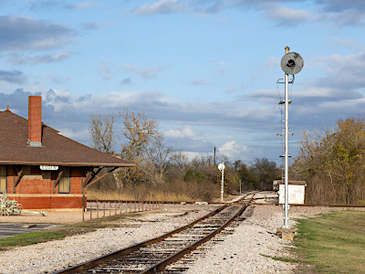

# Interlocking In A Box {align=right style="height: 75px; margin-top:0px; margin-bottom: 0px"} User Manual

## Overview

{align=right style="width: 40%; min-width:200px; margin-top:0px; margin-bottom: 0px"}
The Iowa Scaled Engineering [Interlocking In A Box](https://www.iascaled.com/store/CKT-IIAB)
is a simple solution for an automatic or manual interlocking (diamond) where
one track crosses another at grade.  Stand-alone automatic interlockings
were common, particularly on grainger roads in the midwestern US where
competing branchlines criss-crossed running to every little dot on the map. 
Some of the larger ones had towers and operators controlling them, but many
were simpler operations that involved automatic signals where the first
train to approach - or the first crew to unlock the cabinet and push the
button in manual cases - would get a signal to cross.  The Interlocking In A
Box helps add this sort of operational interest to your layout - a way to
slow down your operators from just barreling across that diamond without a
care in the world.

This version concentrates on the core use case - a simple, single track
crossing, where one track is real and the crossing track isn't, and the goal
is to force your crews to slow down, wait to get the light, and then
proceed.  It's designed to be easy to install and configure - the sensors
just plug in, configuration of delays is done by switches on the board, and
signals just connect into the terminal blocks.

**FIX ME** Insert diagram here

When set up for an automatic interlocking, the Interlocking In A Box comes
with three TrainSpotter optical detectors to sense the presence of a train
on the approaches and in the diamond.  Since these are optical detectors, no
resistive wheelsets are required, simplifying the installation.  To use it
as a manual interlocking, the approach detectors can be replaced with
pushbuttons mounted on the fascia.  In both case, conflicting traffic on the
diamond can be simulated through an adjustable, and randomized, delay.  This
delay causes an arriving train to wait some period of time before the signal
turns green, adding some variety to the operations.

!!! note "Please Note"
    The Interlocking In A Box is meant for use with a single operational
    track that crosses modeled, but inoperable track(s), at a diamond
    crossing.  For a crossing where both tracks are operational, or for use
    with double track, look for a future "Pro" version with more
    functionality.

### Features

* Simulates a manual or automatic interlocking at a diamond 
* Designed for simplicity and to cover most use cases
* Triggered by either TrainSpotter sensors (automatic interlocking) or pushbuttons (manual interlocking)
* Controls a 2-aspect signal, typically displaying red and green, in each direction
* Optional delay time (fixed or randomized) between arrival and green signal
* Compatible with both common anode (positive) and common cathode (negative) signals
* Realistic signal fading during changes for both tri-light and searchlight style signals
* Simple plug-and-play compatibility with most Atlas HO and N scale signals
* Includes control board and TrainSpotter optical detector(s)
* Powered from 6V to 24V DC, AC, or DCC power.

### Typical Applications

* Automatic interlocking
* Manual interlocking

---

## Quick Start Guide

!!! warning "Please Note"
    All wiring and setup of the board should be done with the power off.  This significantly reduces the chances of accidentally slipping and causing a short circuit that damages the board, the block detectors, or the signals.

The two approaches to the diamond are called A and B, respectively.  Both
operate identically, but be sure to keep the A inputs with the A outputs and
B inputs with B outputs when installing on the layout.

### Install Signals

Most applications will want to use two signals, one on each approach to the
diamond.  Three aspect signals can be used, but the Interlocking In A Box will
only drive two of the LEDs.  In most cases, this will be red and green.

LED signals with the usual red/green leads can be wired into the terminal
blocks.  The common wire should be connected to the **COM** terminal,
and the individual color leads should be attached to the respective **R** (red)
and **G** (green) positions on the **Signal A** and **Signal B** terminal blocks.

If you are using signals from Atlas, they will plug directly into the
off-white connectors marked **Signal A** and **Signal B**.  If the signal leads
aren't long enough to reach the main board, Iowa Scaled Engineering offers
extension cables.

Set the **COMMON** switch to **ANODE / +** if your signals are common anode /
common positive (this is most common).  Likewise, set the switch to **CATHODE
/ -** if your signals are common cathode / common negative.

The Interlocking In A Box powers the signals from 5 volts and has 330 ohm
resistors on each of the signal outputs to protect the signal LEDs, so no
additional resistors are needed externally.  If your signals already have
resistors built in, you will likely need to remove them or disable the
onboard resistors.  See the section below.

### Install the Diamond TrainSpotter Detector {align=right style="width:20%; margin-left:20px; margin-bottom:10px"}

The TrainSpotter provides optical detection.  One TrainSpotter is always
installed in the diamond to detect when a train crosses the diamond.  Use
one of the included 8 foot cables to connect the TrainSpotter to the
**Diamond** connector on the main board.

### Install the Approach Detectors

#### Automatic Interlocking

For a fully automatic interlocking, install the other two TrainSpotter
detectors at the approaches to the diamond on either side.  These should be
sufficiently in front of each signal to trigger the Interlocking In A Box
before the train reaches the signal.  Use the included 8 foot cables to
connect the TrainSpotter to the **Block A** and **Block B** connectors on
the main board.  Be sure the "A" detector is on the same side of the diamond
as the "A" signal, and similarly for the "B" side.

#### Manual Interlocking

In the case of a manual interlocking, connect pushbuttons (typically mounted
on the fascia) to the **Inputs** terminal block.  One pushbutton for the "A"
approach connects between the **A** terminal and a **GND** terminal.  The
other pushbutton for the "B" approach connects between the **B** terminal
and a **GND** terminal.  Leave the **D** terminal empty.

### Connect Power

Connect power to the board - it requires 6V to 24V of DC, AC, or DCC power. 
This power can come from a dedicated power supply, an accessory power bus,
or from the track bus directly (but before any block detectors).

### Initial Testing

Apply power and check that the green power LED glows on the main board. 
This verifies that the Interlocking In A Box is getting good power. 
Immediately after power up, the signals will display both red and green in
sequence.  This is normal and verifies that the signals are connected
correctly.  The status LED on the main board will also flash through a
sequence of color.  Once that finishes, the Interlocking In A Box is ready.

!!! note "Please Note"
    The status LED on the main board provides diagnostic information. 
    Normally, you can ignore this.  But, in the event you need technical
    support, you may be asked for what this LED is displaying.

Place your hand over the TrainSpotter detector on one approach to the
diamond.  Verify the red light on the detector comes on and the signal on
that approach turns green.  Remove your hand and verify that the red light
on the TrainSpotter detector turns off.  Note that the approach signal
should remain green.

Next, place your hand over the diamond TrainSpotter detector.  Verify that
the red light on the detector comes on and the approach signal turns red. 
Remove your hand and verify that the red light on the TrainSpotter detector
turns off.  Wait 20 seconds (or more) before proceeding.

Finally, using the opposite approach, repeat the steps above to verify
correct operation on that approach.

Congratulations!  You've now successfully installed and verified your
Interlocking In A Box!

---

## Options

The Interlocking In A Box allows you to customize some delay times and light
options to suit your prototype and operating needs.  These options are set
using the DIP switches on the main board.

### Delay

{align=right style="width:30%; margin-top:0px; margin-left:20px; margin-bottom:10px"}

The delay setting controls how long the Interlocking In A Box waits from the
time a train is detected until it gets a green signal.  This allows you to
simulate traffic on the opposing track or just simply add some wait time to
your operations.

The delay time can be fixed or random.  In the case of fixed delays, the
same delay will always be used.  Every time a train arrives, the
Interlocking In A Box will wait the selected amount of time.  Simple
randomized delays pick a delay time from a selectable range of times. 
Prototypical randomized delays are a bit more complicated, but better
represent what would be experienced on the prototype.  In this case, the
Interlocking In A Box first randomly determines, based on a selectable
probability, if a delay will be applied this time or not.  In the event of
no delay, the signal will turn green almost immediately.  On the other hand,
when a delay is applied, the delay time will be randomly selected from a
programmable range.  This behavior better mimics what would be seen on the
prototype where a train gets the signal almost immediately when no opposing
traffic is present, but has to wait some time, possibly a significant time,
when there is opposing traffic.

To select fixed delays, set the **RANDOMIZED** switch to OFF.  Then, set the
**A**, **B**, **C**, and **D** switches as shown in the table below to get
the desired delay time.

**Fixed Delays**

| Delay Time |  D  |  C  |  B  |  A  |
| ---------- | :-: | :-: | :-: | :-: |
| 0 sec      | OFF | OFF | OFF | OFF |
| 5 sec      | OFF | OFF | OFF | ON  |
| 10 sec     | OFF | OFF | ON  | OFF |
| 15 sec     | OFF | OFF | ON  | ON  |
| 20 sec     | OFF | ON  | OFF | OFF |
| 25 sec     | OFF | ON  | OFF | ON  |
| 30 sec     | OFF | ON  | ON  | OFF |
| 35 sec     | OFF | ON  | ON  | ON  |
| 40 sec     | ON  | OFF | OFF | OFF |
| 45 sec     | ON  | OFF | OFF | ON  |
| 50 sec     | ON  | OFF | ON  | OFF |
| 55 sec     | ON  | OFF | ON  | ON  |
| 60 sec     | ON  | ON  | OFF | OFF |
| 65 sec     | ON  | ON  | OFF | ON  |
| 70 sec     | ON  | ON  | ON  | OFF |
| 75 sec     | ON  | ON  | ON  | ON  |

To select randomized delays, set the **RANDOMIZED** switch to ON.  Then, set
the **A**, **B**, **C**, and **D** switches according to the tables below,
depending on whether you want simple or prototypical random delays.

**Simple Random Delays**

| Delay Range  |  D  |  C  |  B  |  A  |
| ------------ | :-: | :-: | :-: | :-: |
| 0 to 10 sec  | OFF | OFF | OFF | OFF |
| 5 to 20 sec  | OFF | OFF | OFF | ON  |
| 15 to 30 sec | OFF | OFF | ON  | OFF |
| 30 to 60 sec | OFF | OFF | ON  | ON  |

**Prototypical Random Delays**

| Probability | Delay Range    |  D  |  C  |  B  |  A  |
| ----------- | -------------- | :-: | :-: | :-: | :-: |
| 10%         | 15 to 30 sec   | OFF | ON  | OFF | OFF |
| 30%         | 15 to 30 sec   | OFF | ON  | OFF | ON  |
| 70%         | 15 to 30 sec   | OFF | ON  | ON  | OFF |
| 10%         | 30 to 60 sec   | OFF | ON  | ON  | ON  |
| 30%         | 30 to 60 sec   | ON  | OFF | OFF | OFF |
| 70%         | 30 to 60 sec   | ON  | OFF | OFF | ON  |
| 10%         | 60 to 120 sec  | ON  | OFF | ON  | OFF |
| 30%         | 60 to 120 sec  | ON  | OFF | ON  | ON  |
| 70%         | 60 to 120 sec  | ON  | ON  | OFF | OFF |
| 10%         | 180 to 300 sec | ON  | ON  | OFF | ON  |
| 30%         | 180 to 300 sec | ON  | ON  | ON  | OFF |
| 70%         | 180 to 300 sec | ON  | ON  | ON  | ON  |

### Timeout

{align=right style="width:30%; margin-top:0px; margimargin-left:20px; margin-bottom:10px"}

The timeout is used to cleanly handle some special situations.  One such
situation is when a train pulls up to the diamond, triggering a TrainSpotter
detector on the approach, but then backs away, never crossing the diamond. 
In this case, when the TrainSpotter detector is uncovered, the timeout timer
starts running.  If the diamond detector is not triggered before time runs
out, then the Interlocking In A Box will reset and the signal will return to
red.  This prevents locking up the diamond indefinitely.

Another situation where the timeout is used is when the diamond detector is
uncovered before the TrainSpotter detector on the opposite approach is
triggered.  This is similar to above, where a train approaches, enters the
diamond, but then backs out without fully crossing to the other side.  In
this case, when the diamond detector is uncovered and the timeout time
expires, the system will be reset.

The timeout time is set using the **E** and **F** switches according to the
following table.

| Timeout Time |  F  |  E  |
| ------------ | :-: | :-: |
| 15 sec       | OFF | OFF |
| 30 sec       | OFF | ON  |
| 45 sec       | ON  | OFF |
| 60 sec       | ON  | ON  |

### Searchlight Emulation

{align=right style="width:30%; margin-top:0px; margin-left:20px; margin-bottom:10px"}

By default, the Interlocking In A Box is set up to emulate the operation of
typical signal heads with two independent sets of lights.  Or, in the case of
Pennsylvania position lights or B&O/N&W color position lights, drive two
lights around the outside of a disk.  Regardless, the logic will fade one in
as the other fades out.

Searchlight-type signals, such as the Union Switch & Signal types H, H2 and
H5 as well as the General Railway Signaling SA type, used a signal lamp with
a set of mechanically-changed color filters inside known as roundels.  Three
roundels were mounted on an armature that could be moved by electromagnetic
coils.  When unenergized, the arm sat in the middle and placed the red
filter in front of the single lamp.  Green would be on one side.  By
energizing the coil, it would pull the arm to the side and place the green
in front of the lamp.

This leads to interesting effects when changing aspects.  Going from red to
green will result in a bit of flickering as the armature bounces around
before settling.  The Interlocking In A Box emulates this rather precisely. 
If the **SEARCHLIGHT** switch is set to **ON**, this bouncing and flashing will be
reflected in the signal output giving a very prototypical appearance to
model searchlight signals.

---

## Advanced Use Cases

### Bypassing the LED Resistors

The Interlocking In A Box includes resistors to protect your signals against
excessive current that will destroy them.  There may be use cases where your
signals already have resistors installed, or you want to change the resistor
values used, and you need to bypass the resistors on the board.  There are
solder jumpers provided to let you do that, but be **very sure** that you
know what you're doing before using them.

!!! warning "Don't Destroy Your Signals!"
    Be sure you really need to do this before even considering bypassing the
    onboard current limiting resistors for the signals.  You must then install
    external resistors or the current will blow up your signal LEDs!

JP1 and JP2 on the back side bypass the resistors for Signal A red and green
respectively.  JP3 and JP4 bypass the resistors for Signal B red and green
respectively.

If you just wish to dim your signals further, we recommend adding additional
resistance between the terminal block and the signal, and leaving the
onboard resistance alone.  Then, if for some reason your external resistor
gets shorted or you forget to put one in, your signal is still protected
against overcurrent that will destroy the LEDs.

---

## Specifications

**Input Power:**  6 to 24 volts DC, AC, or DCC  
**Input Supply Current:**  10 milliamps @ 12V (typical)  
**Size:**  3.75"(L) x 2.25"(W) x 0.5"(H) (main board)

---

## Open Source 

Iowa Scaled Engineering is committed to creating open designs that users are free to build, modify,
adapt, improve, and share with others.

The design of the CKT-IIAB hardware is open source hardware, and is made available under the
terms of the [Creative Commons Attribution-Share Alike v3.0 license](http://creativecommons.org/licenses/by-sa/3.0/). 
Design files can be found in the [mss-siding](https://github.com/IowaScaledEngineering/ckt-iiab) project on 
GitHub.

The firmware for the CKT-IIAB is free software: you can redistribute it and/or modify it under the 
terms of the GNU General Public License as published by the Free Software Foundation, either [version 3 of the 
License](https://www.gnu.org/licenses/gpl.html), or any later version.
