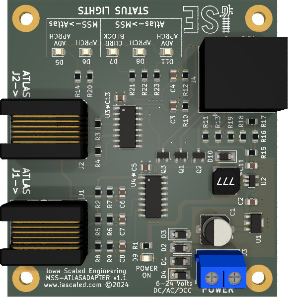
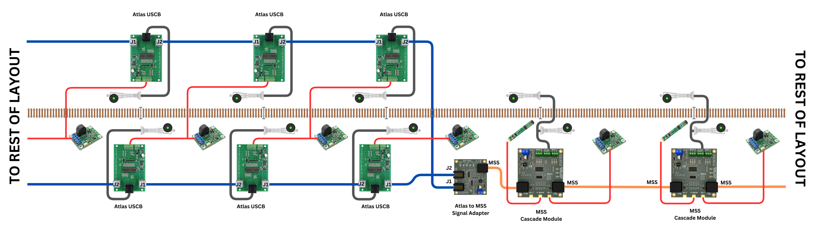

# MSS-ATLASADAPTER v1.1 User Manual

## Overview

The MSS-ATLASADAPTER is designed to allow users of the Atlas All Scales Signal System to bridge to standard [Modular Signal System (MSS)](https://modularsignalsystem.info/) modules.  This gives users the capability of extending their signals using a variety of vendors' MSS modules without needing to tear out and replace their existing investment in Atlas boards.  It's not really intended for modular users, but rather focused at home layouts that already have an Atlas system in place.

MSS provides a number of advantages over the Atlas system:

* As a standardized system, interoperable modules are available from a variety of different vendors, or you can build your own to the specification
* MSS only requires one cable and one set of modules to handle bi-directional signaling, rather than separate modules and separate wiring for each direction
* MSS detects the whole train even without resistor-equipped axles by using a combination of optical and current detection

---

## Specifications

**Key Features:**

* Combines two directional Atlas All Scales Signal System buses into a single MSS-compatible connection
* Powered from 6V to 24V of AC, DC, or DCC
* Onboard diagnostic LEDs help debug problems between the two systems
* Robust, protected bus interfaces assure reliable operation

**Input Power:**  6 to 24 volts DC, AC, or DCC  (must be shared with the Atlas modules)  
**Input Current:**  <100mA maximum  
**MSS Standard Compatibility:** 1.x, 2.x, and (proposed) 3.x  

---

## Quick Start Guide

!!! info "Please Note"
    Since the wiring nomenclature gets a bit confusing in terms of directions, looking at the wiring diagram below is highly recommended rather than just relying on the text.    

Step 1: The Atlas adapter needs 6V to 24V of DC, AC, or DCC power, and it must be the same power supply that is used to power the Atlas modules, since the Atlas signal bus does not carry a ground wire.  

Step 2: Connect J1 on the adapter to J2 on the last Atlas Universal Signal Control Board (USCB) for signals headed away from the connection point.  Likewise, connect J2 on the adapter board to J1 on the last Atlas USCB for signals headed towards the connection point.  Connections should be made with standard 4 or 6 wire, "straight through" RJ11 cables.

Step 3: Using a normal (NOT crossover) cable, connect the adapter board's MSS port to the next MSS cascade (signal) module.  The MSS cascade module does not need current detection for the block between it and the last Atlas module - it will get that block's occupancy from the previous Atlas module and the detector attached to it via the MSS interface.

---

## Simplified Wiring Diagram

[Simplified Wiring Diagram for Atlas-MSS System](img/atlas-mss-wiring-diagram.png)

---

## Diagnostic LEDs

For describing the purpose and meaning of the diagnostic LEDs on the board, we'll use the Simplified Wiring Diagram above as a reference.  Atlas boards along the bottom will be described as "eastbound", meaning a train moving from left to right (or east if this were a map) would be seeing those signals.  Atlas boards along the top will be described as "westbound", meaning a train moving right to left (or west if this were a map) would see signals controlled by those boards.

| Direction | LED&nbsp;Name/Color | If Indicator is On |
|-------------------|--------------------|-----------------|
| Atlas->MSS | *ADV APRCH* Blue (D11) | The right-most top (westbound) Atlas USCB is sending an "advance approach" indication to MSS, indicating that it is currently displaying an approach indication and the Atlas module immediately to its left is displaying a stop indication for westbound trains. | 
| Atlas->MSS | *APRCH* Amber (D8) | The right-most top (westbound) Atlas USCB is sending an "approach" indication to MSS, indicating that it is currently displaying a stop indication for westbound trains. | 
| Atlas->MSS | *CURR BLOCK* Red (D7) | The right-most bottom (eastbound) Atlas USCB is sending occupancy for the block immediately to its right, between it and the first MSS signal. | 
| MSS->Atlas | *APRCH* Amber (D8) | The left-most MSS Cascade module is sending that it is displaying a stop indication, and that it expects the right-most bottom (eastbound) Atlas module to display an approach indication. | 
| MSS->Atlas | *ADV APRCH* Amber (D8) | The left-most MSS Cascade module is sending that it is displaying an approach indication, and that it expects the right-most bottom (eastbound) Atlas module to display an advance approach indication if 4-aspect signaling is enabled, or green if only 3-aspect signaling is enabled. | 

---

## Open Source 

Iowa Scaled Engineering is committed to creating open designs that users are free to build, modify,
adapt, improve, and share with others.  

The design of the MSS-ATLASADAPTER hardware is open source hardware, and is made available under the
terms of the [Creative Commons Attribution-Share Alike v3.0 license](http://creativecommons.org/licenses/by-sa/3.0/).  

Design files can be found in the [mss-atlasadapter project](https://github.com/IowaScaledEngineering/mss-atlasadapter) on 
Github.

