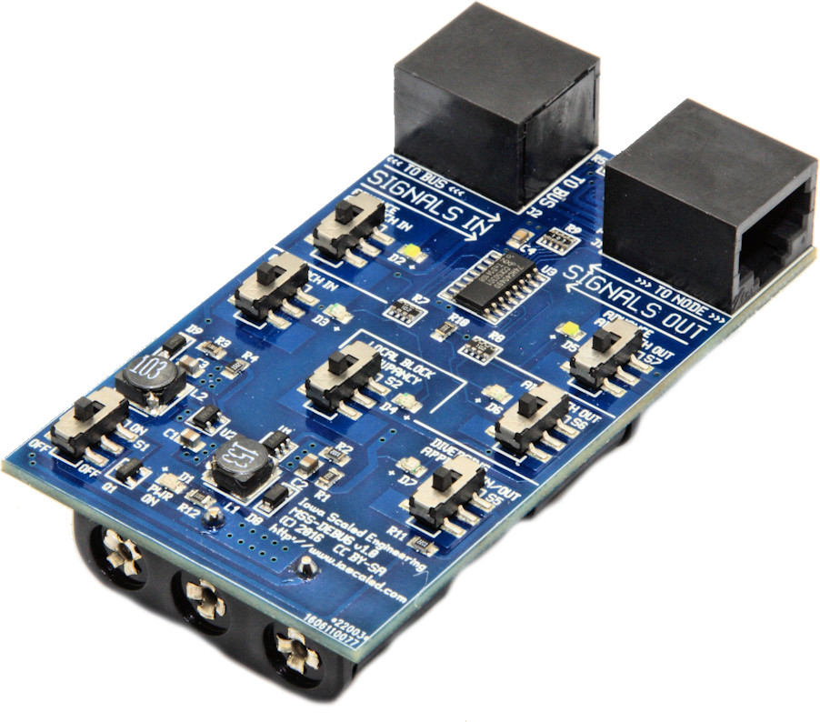
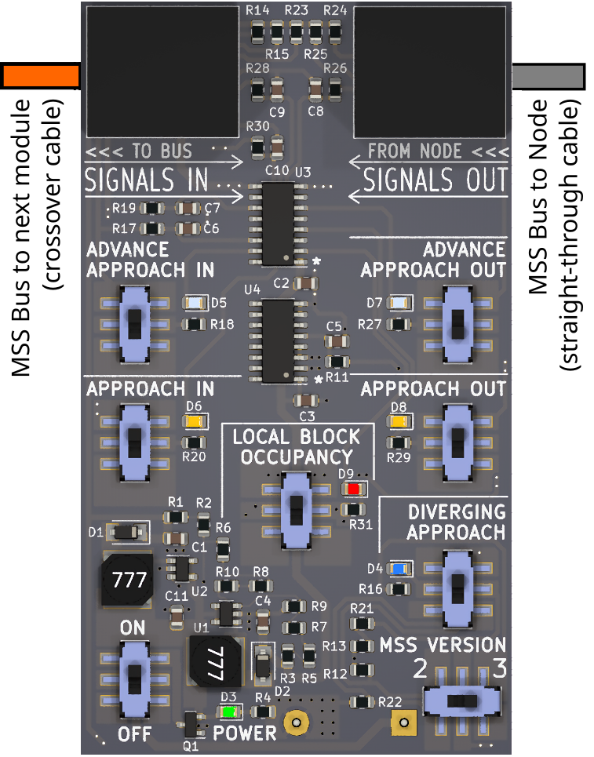

# MSS-DEBUG v1.0 User Manual

## Overview

The MSS-DEBUG is a diagnostic tool designed to help users debug [Modular Signal System (MSS)](https://modularsignalsystem.info/) setups, from testing hardware already installed on layout modules to developing new MSS hardware.  It provides a handheld, stand-alone way to see which MSS signal wires are active on the bus, or manually activate individual signal wires and test how installed MSS signaling modules react.

---

## Specifications

**Key Features:**

* Diagnostic LEDs indicate status of all six MSS signal lines
    * Local Block Occupancy
    * Approach Occupancy In (to node)
    * Advance Approach Occupancy In (to node)
    * Advance Occupancy Out (from node)
    * Advance Approach Occupancy Out (from node)
    * Diverging Approach In/Out (to/from node)
* Switches allow user to toggle each signal line to test module response
* Provides +12V bus pull-up bias voltage from 3x AAA batteries for testing bus segments without
pull-ups (such as the MSS-CROSSOVER module)
* Compliant with MSS 1.x and 2.x standards.  

**Power:**  3x AAA batteries  
**Size:** 3.25" (L) x 1.9" (W)  

---

## Usage

Install 3x AAA batteries in the back battery holder. Turn on the power switch (lower left corner, up is on). The green power LED D1 should light. If it does not, the batteries are either dead or the MSS-DEBUG's power supply is defective.

One or both of the bus connections should be connected. Which ones you connect will depend on the problem you're trying to solve.

In order to test a node without being connected to a larger MSS network, connect the right side MSS bus connector marked “To Node” to the MSS node you wish to monitor/control using a “straight through / normal” ethernet cable, such as the short 1' cable that is provided with the debugger.

In order to see the signals being received at a node, connect the left side MSS bus connector (marked “To Bus”) to the crossover cable where the node would normally plug in. (You may then optionally connect through to the node with a straight-through cable to see what the node is sending.) This is useful for debugging what signals a node is receiving, and why it may be misbehaving.

## Using the Lights and Switches

For the purposes of the descriptions below, "to the right" is defined as to the node that would be connected to the right port with a straight-through cable - the one marked *TO NODE >>>*.  "To the left" is defined as the next node down the line, connected to the *<<< TO BUS* port.

| MSS&nbsp;Bus&nbsp;Signal LED&nbsp;Name/Color | If Indicator is On | If Switch is On | 
|-------------------|--------------------|-----------------|
| *Local Block Occupancy* Red (D4) |Current track block is showing occupancy |Simulate occupancy in the current track block | 
| *Approach In* Amber (D3) |The node to the left is sending an approach signal to the node on the right. Typically this means that the next block down the line to the left is occupied. |Simulate occupancy in the adjoining block one to the left. Normally this would trigger an "approach" indication for a cascade module's signal.| 
| *Advance Approach In* White (D2) |The node to the left is sending an advance approach signal to the node on the right. Typically this means that the second block down the line to the left is occupied. |Simulate occupancy in the adjoining block two to the left. Normally this would trigger an "advance approach" indication for a cascade module's signal if it's set up for 4 indication signaling. | 
| *Diverging Approach In/Out* Blue (D7) |If connected to a complex cascade module, indicates the switch is set to the diverging route. In all spec-compliant implementations, the “Approach In” LED should also be lit. |Simulate a diverging route set at the next node to the left. The “Approach In” or “Approach Out” - as appropriate - switch should also be set except when testing invalid bus signal combinations. | 
| *Approach Out* Amber (D6) |The node to the right is sending an approach signal to the node to the left. This typically means that the next block down the line to the right is occupied. |Simulate occupancy in the next block to the right. |
| *Advance Approach Out* White (D5) |The node to the right is sending an advance approach signal to the node to the left. This typically means that the second block down the line to the right is occupied. |Simulate occupancy in the second block down the line to the right. | 

---

## Modular Signal System Draft Spec 3.0 Compatibility

There is a draft Modular Signal System specification version 3.0 that reverses the polarity of the "Approach Diverging" line and breaks backwards compatibility.  The debugger currently does not support 3.x fully because of this, though all of the other signals remain the same and will work just fine.

---

## Open Source 

Iowa Scaled Engineering is committed to creating open designs that users are free to build, modify, adapt, improve, and share with others.  

The design of the MSS-DEBUG hardware is open source hardware, and is made available under the
terms of the [Creative Commons Attribution-Share Alike v3.0 license](http://creativecommons.org/licenses/by-sa/3.0/).  

Design files can be found in the [mss-debug project](https://github.com/IowaScaledEngineering/mss-debug) on 
Github.

