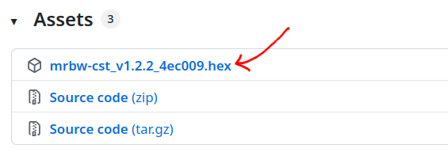
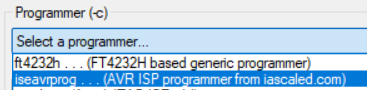
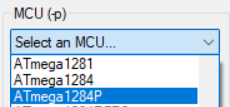
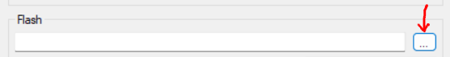
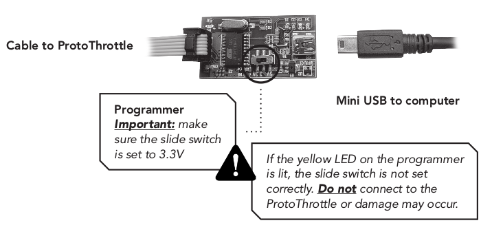
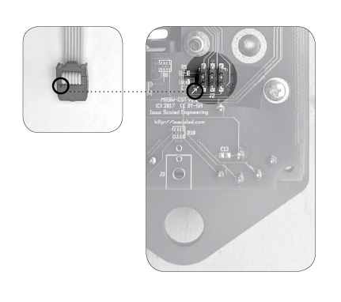

# ProtoThrottle Firmware Update

The firmware on the ProtoThrottle can be updated in one of several ways:

1. Send the throttle to us, with return shipping, and we will update the firmware to the latest version (contact us as support@iascaled.com first for return instructions).
1. Find us at a show, where we typically have a laptop and programmer, and can do the update on-the-spot. It is best to contact us in advance to let us know you plan to do this.
1. Update the throttle yourself using the instructions below.

If you choose option #1 or option #2, then stop here.  There is no need to
continue reading.  Just follow the instructions above.  However, if you're
adventurous, then keep reading.

## Step 1: Prerequisites

Follow all the instructions [here](../../Tips and Tricks/Updating Firmware/avr-programmer.md). 
Once you have the programmer and have successfully installed the necessary
software, then proceed.

## Step 2: Download the Firmware File

The latest official ProtoThrottle firmware can be found on GitHub:

<https://github.com/IowaScaledEngineering/mrbw-cst/releases>

Download, and save to your computer, the .hex file for the latest version:

## Step 3: Configure AVRDUDESS

Open the AVRDUDESS program you downloaded in the prerequisites.

Under Programmer, select iseavrprog:

For MCU, select ATmega1284P:

In the Flash section, click the "..." button and select the .hex file you
downloaded in Step 2:

## Step 4: Connect Programmer and Throttle

Attach the programmer to your computer using the USB cable.  Make sure the
slide switch on the programmer is set to 3.3V.

!!! warning
    If the yellow LED on the programmer is lit, DO NOT PROCEED.  This means
    the slide switch is not in the correct position.  Correct this before
    proceeding.

Attach the ribbon cable from the programmer to the 6-prong male pin header on
the printed circuit board.  Make sure the triangle shape on the ribbon
cable’s female connector matches with the white arrow on the circuit board.

## Step 5: Program the Throttle

Once everything has been set in Step 3 and Step 4, press the Program! 
button to begin the process of updating the firmware.  The status box at the
bottom of the AVRDUDESS window will show the progress.  When you see the
"Avrdude done.  Thank you." message in the status box, the update is complete.

At this point, you can close AVRDUDESS and disconnect the programmer from
your throttle.  Enjoy your updated throttle!
