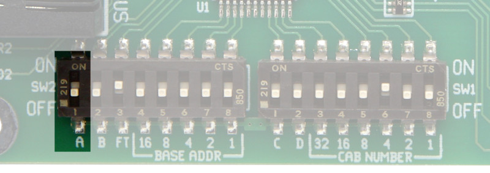
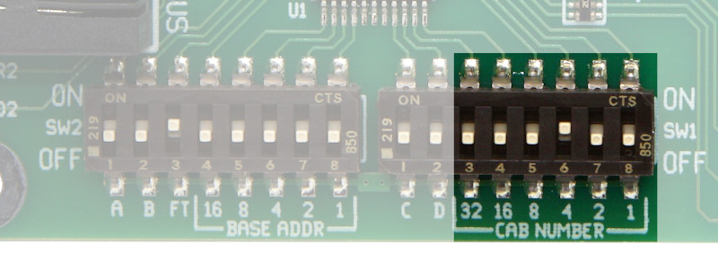
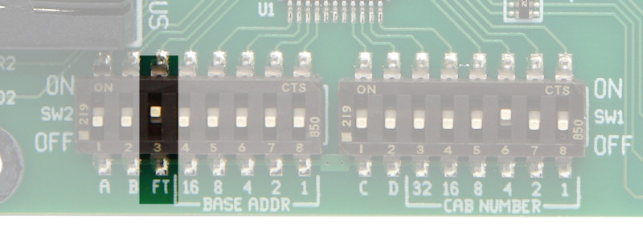
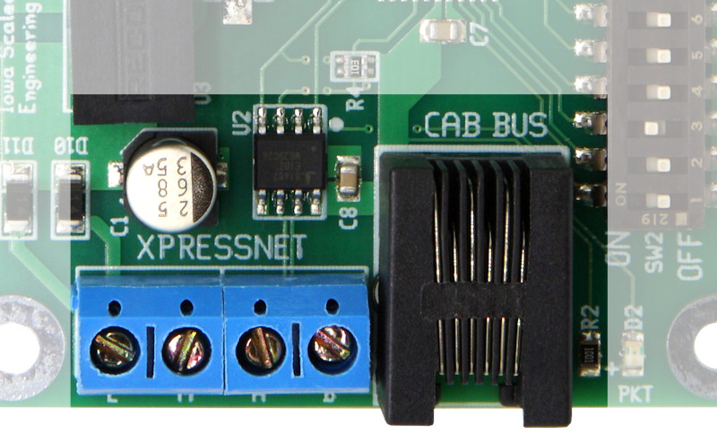
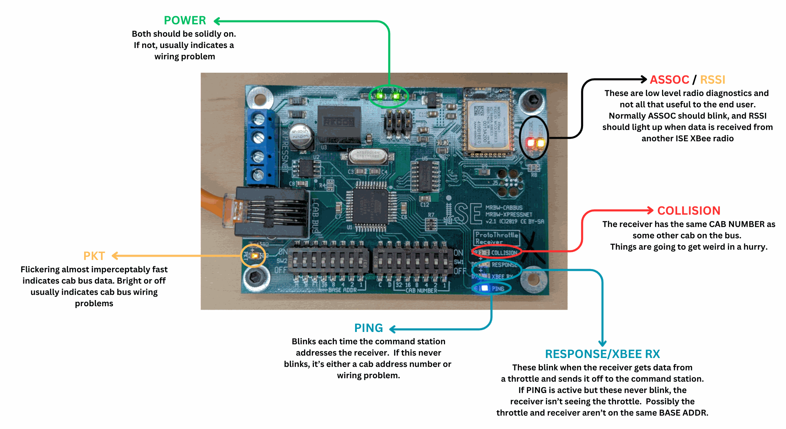

# NCE/Lenz Receiver {align=right style="height: 75px; margin-top:0px; margin-bottom: 0px"} Setup & Troubleshooting 

## NCE Cab Bus and Lenz XpressNet

The NCE/Lenz receiver is by far the easiest to set up and the most reliable, because it's a simple wired connection to the command station.  Typically these are almost plug-and-play, and rarely ever have issues.

Product Page: [MRBW-CABBUS](https://www.iascaled.com/store/MRBW-CABBUS)

---

## Quick Start

!!! info "Defaults Are Your Friends"
    The defaults are picked such that they "just work" in many cases.  For NCE systems, often the receiver can just be plugged in and it just works.  Be sure if you're changing things that there's a reason for doing so.  Many of the problems we see involve unnecessarily changing random options.

### Step 1 - Select a System

Switch A should be set to ON if the receiver will be connected to a Lenz XpressNet or compatible system.  It should be set to OFF to connect to an NCE or compatible system.

For TCS systems, it's recommended to use NCE mode on the auxilliary cab bus port, as it's better tested.  However, the receiver should work in either XpressNet (Lenz) or NCE mode with the TCS CS105 if the switch is set to match what the command station is sending.

---

### Step 2 - Selecting a Base Address

The Base Address is how the ProtoThrottles attach to a particular receiver.  Most users should just keep the default base address of 0, since that's the default for ProtoThrottles and assures everything fires up the first time.

The only time to change it would be to avoid conflicts with other ProtoThrottle systems nearby, such as in a show environment.

Base Address is set the same way as CAB NUMBER - it's the sum of the BASE ADDR switches turned on.

---

### Step 3 - Select a Cab Number 

The cab number is the receiver's number on your NCE cab bus or Lenz XpressNet.  It must be not be shared with any other cab attached to the bus, because it's how the command station addresses each individual cab.  

The receiver comes set to address 4, which works well with NCE PowerCabs, NCE PowerPros, and NCE SB5s as long as there's no other cab on that address.  If there is, you will need to change it.  (Bear in mind that some NCE systems only accept certain cab numbers.  In particular, PowerCabs will only talk to other cabs at addresses 2-5, where 2 is typically the PowerCab itself.)

The cab number is the sum of the switched turned ON.  For example, to get cab address 13 (8+4+1), you would switch ON 8, 4, and 1, while leaving 32, 16, and 2 OFF.

---

### Step 4 - Fast Time

If you are connecting to an NCE system, the receiver can send fast time from the DCC system to the ProtoThrottles and PaceSetter wireless fast clock displays.  

In order to enable this, switch "FT" needs to be turned ON.  To disable sending fast time from the NCE system, set the switch to OFF.

---

### Step 5 - Connect the Reciever

For NCE or TCS systems, you typically just need to use the included cable to plug the receiver into any available cab port.

For Lenz or other XpressNet systems, use the terminal block to connect the L/M/A/B terminals to the corresponding command station connections.

---

## Troubleshooting

The NCE/Lenz receivers (MRBW-CABBUS) are by far the most trouble-free.  The main reason?  They're wired into the system.  Wires are simple, wires are easy.  

The two most common problems with the NCE/Lenz receiver are:

* Bad Cab Bus Wiring - Sometimes this is obvious, but other times it manifests in all sorts of weird, freaky ways.  For example, if you aren't getting the green power LEDs to come on, it's usually a wiring problem.  If the orange PKT (packet) light is solid off or solid on, rather than flickering almost imperceptably fast, it's usually a wiring problem.
* Cab Bus Address Problems
    * The receiver must have a unique cab bus address on your system.  This is set by the "CAB NUMBER" on the switches and is different from the BASE ADDRESS, which is how ProtoThrottles find it.  It needs to not conflict with any other cabs you may have plugged into the bus.  Normally if you have a conflict, the red COLLISION LED will light up.
    * The receiver must have a supported cab bus address on your system.  Not all systems support all 63 valid cab addresses.  NCE PowerCabs, in particular, can only support cabs on addresses 3-5 for additional cabs.  NCE SB5s support addresses 2-7.  If the cab address isn't valid, usually the blue PING LED will remain dark.  It lights up every time the command station talks to the receiver, so if it's constantly dark, it's never getting the chance to talk.

If you've checked that your cab address is correct, then it's usually a wiring problem.  Disconnect the rest of your cab bus from the command station and plug the receiver straight into it using a known good cab cable, or try a couple of cables that you think are good.  If that works, the problem is somewhere in the wiring.  Start plugging bits of it back in until it stops working, and the last thing you changed is where the problem lies.

### Diagnostic LEDs

Contrary to popular opinion, we don't put all those blinking lights on the board because we really like blinking lights.  Each one tells us something specific about what the board is doing, and what data is is receiving/sending.  These can help you - and if you're stumped, us - figure out what's going on without any fancy equipment.

Here's a diagram showing the various diagnostic LEDs and what they generally mean.

