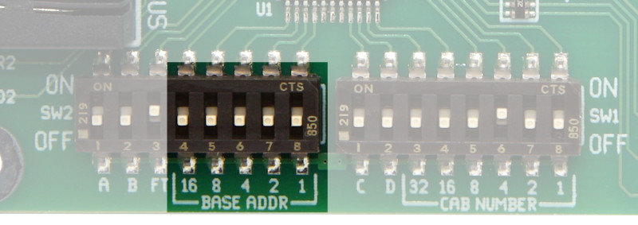
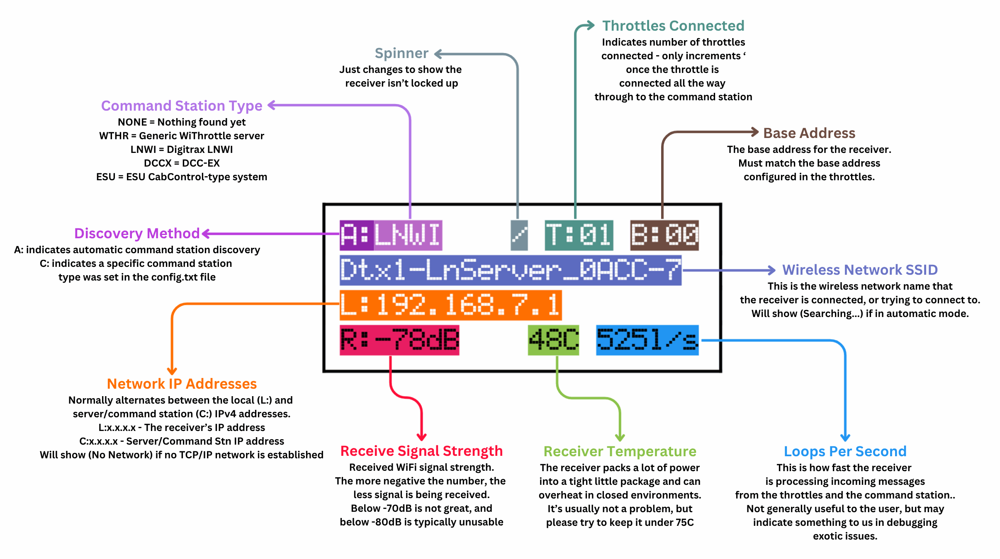

# WiFi Receiver {align=right style="height: 75px; margin-top:0px; margin-bottom: 0px"}<br>Setup & Troubleshooting 

## The WiFi Receiver

Product Page: [MRBW-WIFI](https://www.iascaled.com/store/MRBW-WIFI)

The WiFi Receiver for the ProtoThrottle is the most versatile, capable of connecting to any system that has a WiFi-accessible WiThrottle or ESU server running.  That means any command station that you can connect to JMRI is likely workable, since JMRI can provide the WiThrottle server.

However...

That flexibility comes with complexity.  The WiFi receiver is quite a bit more complicated because of the WiFi and network layer.  The connection to the command station consists of three layers, which have to connect in order - the raw WiFi network layer, the TCP/IP networking layer, and then finally the connection to the throttle server (WiThrottle or ESU).

For many default cases, the WiFi receiver has configurations pre-programmed and will automatically configure itself and connect.  However, once you move beyond those, it does take a little configuration to get it working correctly.

!!! warning "Don't Overcomplicate Things"
    Many of the problems we see with the WiFi receiver are a result of folks setting way more things in the configuration file than they need to.  For an average home user with an ESU CabControl system or a factory default LNWI, you don't need to configure anything.  Literally turn it on and it should automatically discover the network and connect.  

    Reasons you would need to edit the configuration file are if you want to connect it to your own WiFi network, or if your LNWI has a password, or if you want to make sure it only connects to one particular LNWI.

---

## Quick Start


### Step 1 - Select a Base Address

The Base Address is how the ProtoThrottles attach to a particular receiver.  Most users should just keep the default base address of 0, since that's the default for ProtoThrottles and assures everything fires up the first time.

The only time to change it would be to avoid conflicts with other ProtoThrottle systems nearby, such as in a show environment.

The base address is set using the DIP switches on the receiver itself.  It's the sum of the switches turned ON.  For example, to get base address 13 (8+4+1), you would switch ON 8, 4, and 1, while leaving 32, 16, and 2 OFF.



By default, the receiver understands how to connect to many common unsecured model railroad WiFi networks, such as a Digitrax LNWI in its default configuration, or an ESU system.  The easiest way to avoid problems is to not touch settings that you don't need to touch.  If you don't need to configure it, skip straight to step 6.

### Step 2 - Connect Receiver to Computer

If the receiver does not automatically connect to your WiFi network, then you probably need to configure it.  This could be because your LNWI is using a non-standard network name, or you have network security enabled (needs a password to connect).  In these cases, you'll need to confgiure the receiver.

To configure your receiver, you will need a computer and a text editing program.  For Windows, notepad works just fine.  For Mac users, while I have no direct experience, the internet seems to recommend "Plain Text Editor"  For Linux, I anticipate you have your own favorite.

Plug the receiver into the computer using the USB cable provided.  It should appear as a new USB drive, with a text file on it called config.txt

!!! tip "Filename Extensions"
    Windows defaults to hiding filename extensions when viewing files for some unfathomable reason.  So instead of "config.txt" you may just see a file named "config".  That's fine.  However, personally I recommend un-hiding file extensions so you can truly see what's going on.  In the file explorer window, under "View" select "Show"->"Filename Extensions".  At least for Windows 11 - instructions vary for older versions of Windows.

In Windows (with filename extensions visible), you'll see something like this:


Open up the config.txt file with your editor of choice, and you should see something like this:


Now we're ready to start actually configuring things.

All configuration is done with key/value pairs.  On the left is the thing we want to set, then an equals sign, and on the right we put the value we want to assign to it.

!!! warning "Configuration File"
    See how many of the lines in the configuration file have a pound sign (#) on the front of them?  This tells the firmware in the receiver that the text on those particular lines are for humans, and it shouldn't try to understand them.  Please make sure any lines with text other than the actual configuration values has one of these on the front end, otherwise the receiver will get confused and do strange things.

---

### Step 3 - Configure the WiFi Network

If the receiver doesn't automatically connect to your WiFi network, or you want to make sure it always connects to the same one (such as in a club environment, where you may have multiple LNWIs running at the same time), you need to configure it.

Here's the relevant part of the file:

```
# If you want to manually configure the wifi network to connect to, please
# fill in ssid, password (blank if open), and mode

ssid = 
password = 

# Mode is the command station type - can be lnwi, withrottle, dccex, or esu 
mode = 
```

**ssid** is the name (the SSID, or service set identifier) of the WiFi network you want the receiver to connect to.  This is the name you would see if you tried to connect with your phone or laptop and run trains.  

*Note that this is the network that connects to your layout, not (necessarily) your home WiFi network that connects to the internet.  For many of you, this may be your LNWI's network, and for others, you may have a dedicated wireless network connected to a JMRI computer on your layout.*

**password** is the password for your WiFi network, if it's secured.  If it's an open network (no password), just leave this blank.

The third element that must be set is **mode**.  Mode tells the receiver how to try to talk to the receiver.  You can also set mode without setting the WiFi network, and it will then only automatically connect to servers of that type.

Your options are:

* **withrottle** - General WiThrottle servers, such as JMRI or the MRC WiFi module.  
* **lnwi** - Exclusively for connecting to Digitrax LNWIs.  They don't implement the WiThrottle protocol properly, and certain workarounds are needed to handle them.
* **dccex** - Connect to DCC-EX systems.  They're basically WiThrottle, but again, minor nuances.
* **esu** - Connect to ESU CabControl systems.  Can also work with ESU ECoS systems, but has some issues.

So, let's assume that I have a WiFi network attached to my JMRI computer that has a name of "CRNW-Throttles" and a password of "TotallyNotMyPassword77".  My configuration file would look like:

```
# If you want to manually configure the wifi network to connect to, please
# fill in ssid, password (blank if open), and mode

ssid = CRNW-Throttles
password = TotallyNotMyPassword77

# Mode is the command station type - can be lnwi, withrottle, dccex, or esu 
mode = withrottle
```

### Step 4 - Less Common Configuration

Normally, you shouldn't need to touch anything else in the configuration file.  I would strongly suggest leaving it alone unless you really know you need to use it.

```
# If you want to manually configure your server address, do so here 
serverIP = 
serverPort = 

# If you want to use your JMRI or DCC-EX as your fast clock source, set this to cmdstn, otherwise leave at none 
fastClockSource = none

# Controls the verbosity of debug logging on the USB serial console - options are error, warn, info and debug 
logLevel = info
```

**serverIP** and **serverPort** can be used to set the IPv4 address and port of the server that the receiver should connect to.  Normally this is done with service discovery and will be set automatically, but sometimes this doesn't work correctly.  For this to work well, you really need to have your server on a known, fixed address.

**fastClockSource** can be used to tell the receiver to use the fast time available from JMRI or DCC-EX's withrottle server.  Leave this at *none* to ignore it, or *cmdstn* to broadcast the fast time coming in to any ProtoThrottle or PaceSetter fast clock display on the network.

**logLevel** can be used to increase the debug logging level available on the USB serial port for diagnostic purposes.  Unless the words "serial terminal emulator" and "USB virtual serial port" don't scare you at all, don't worry about this.  And if those words make sense to you, you already know what to do.

### Step 5 - Save the Configuration and Eject

Once you've got the configuration the way you want it, save it in your text editor, close the text editor, and safely eject the receiver from the computer, like you would any other USB drive.  That makes sure the changes are actually saved.

Now you can either test it by just hitting the reset button and continuing to let the computer power it, or plug it into the supplied power adapter.  Either way, the settings need a restart to take effect.

### Step 6 - Test Your Configuration

Ideally, once you've reached this step, you can plug in the receiver and the status light will go from red to yellow to green.  At that point, you've successfully connected to the WiFi network, found the throttle server, and everything is up and running.

If you're stuck with a red light, the problem is likely with setting up the WiFi connection.  If you've gotten to yellow, then it's connected to the network but it can't find your throttle server.  

---

## Debugging WiFi Receivers

Since the WiFi receiver is significantly more complicated, it has a small screen to help debug issues in addition to the status light.

*Note:  This applies to the newer MRBW-WIFI receiver with the small screen, not the original ESU-BRIDGE that used two boards on a plastic bracket*

[](img/mrbw-wifi-screen.png)

To debug issues, we have to take things in order.  First, the WiFi network must connect  Secondly, once the WiFi is up and connected, it must be find the command station server and connect.  Finally, once all of that is working, the connection to the throttle will work.

### Getting WiFi Up and Running

If the status light is red and/or the receiver says "(No Network)", the problem is almost always that the WiFi configuration is somehow wrong.  Nothing else matters yet.

Double-check that your ssid, password, and mode lines are set corrrectly.

*Note: The receiver only supports 2.4GHz WiFi networks that are either open (no password) or running WPA2 security.  That's 99% of access points these days.  It specifically does not support 5GHz-only or 6GHz-only networks.  It also does not support the ancient WEP or WPA security standards.*

### Command Station Connection

If the status LED is yellow, or the C: line just shows 0.0.0.0, then the receiver cannot find the throttle server (WiThrottle or ESU) on the network.

This either means you connected to a network with no throttle server (such as connecting to your house WiFi when you meant to connect to an LNWI's WiFi), or the mode line is wrong, or something is blocking automatic discovery.

If you've checked your WiFi network and mode setting and verified they're correct, then you probably need to fill in serverIP and serverPort because automatic discovery isn't working for some reason.

### When All Else Fails

If all else fails, email support@iascaled.com with details.

Please attach your config.txt file to your email, along with photos of your receiver showing what's on the screen, the DIP switches, and the status LED.  A brief description of your setup will help as well, so we know how you intend it to connect.

### LNWI Notes

If you're having issues with the LNWI, a factory reset (op switch 40 to closed) often solves unexplainable issues.

!!! tip "Lock Down Your LNWI"
    The Digitrax LNWI has an annoying tendency to change its wireless network name, sometimes at random.  I **strongly recommend ** clearing op switches 11, 12, and 13 on the LNWI once you get things working.  That will usually lock things in place and keep it from moving around at random.

LNWIs are a quick way to get going, but they can quickly become overwhelmed running more than a couple ProtoThrottles through them.  For more than that, I strongly recommend using JMRI as your WiThrottle server.  It's easy and relatively cheap to get going using a Raspberry Pi, a LocoBuffer USB / LocoBuffer NG or Digitrax PR4 and [M. Steve Todd's](https://mstevetodd.com/rpi) excellent RasPi JMRI image. 

### RasPi-JMRI Notes

On recent versions of M. Steve Todd's Rasberry Pi JMRI image, there's an issue with the WiFi.  Yes, it's our problem, or rather it appears to be some problem in the Espressif WiFi stack not getting along with the current Linux WiFi stack.  That said, after significant attempts to fix it, I'm stumped.  For now the workaround is to shut off old WEP and WPA1 security support on the RasPi.  This should have no effect on any device made in the last 20 years, as WPA2 has been standard for ages.

Log in to the RasPi, either via SSH or directly on the console, and run the following commands from a terminal:

```
sudo nmcli con modify "RPi-JMRI" 802-11-wireless-security.proto rsn
sudo nmcli con modify "RPi-JMRI" 802-11-wireless-security.pairwise ccmp
```

Reboot the RasPi and you should be good to go.

### ESU Notes

The default wireless gateway that ESU sells as an accessory to the ECoS system is known *NOT* to work with the receiver for unknown reasons.  

### Factory Reset

Sometimes the configuration filesystem will get corrupted.  That's often from forgetting to cleanly eject the receiver after you're done editing the file, but certain operating systems (looking at you, Windows) love to corrupt any filesystem they don't fully understand.  Fortunately, the receiver has a built-in factory reset that will wipe the configuration drive and reset it to factory.  Set the "FR" (Factory Reset) switch to ON, and press the RESET button at the top.  Wait until it fully boots again - it will take nominally longer than normal and the status light should go blue for a couple seconds - and then set the "FR" switch back to OFF.

