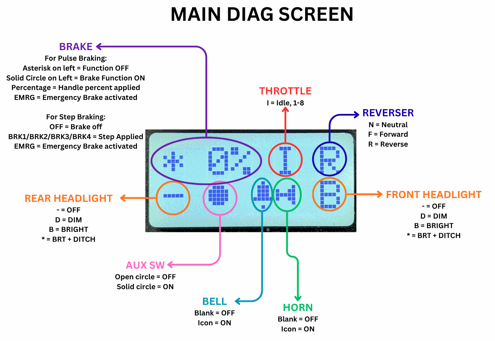
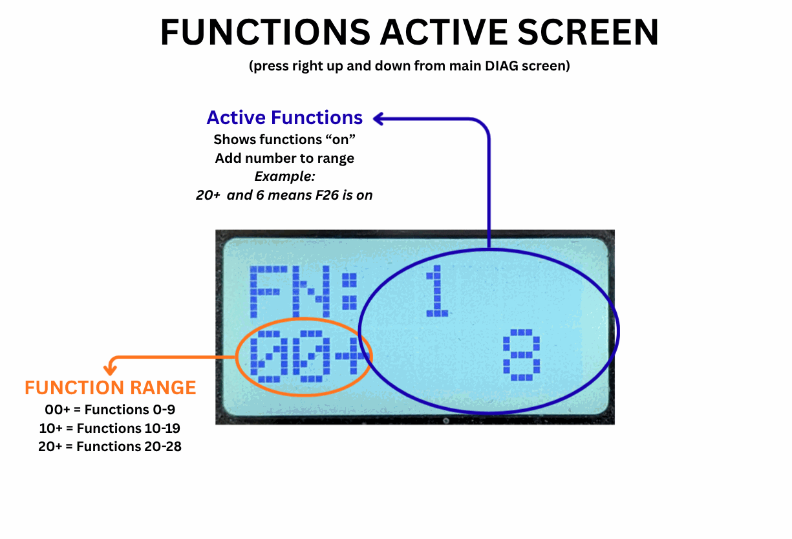
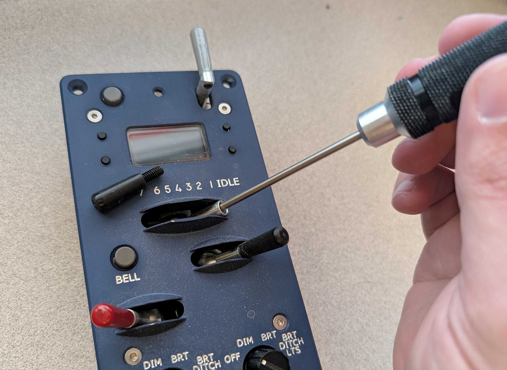
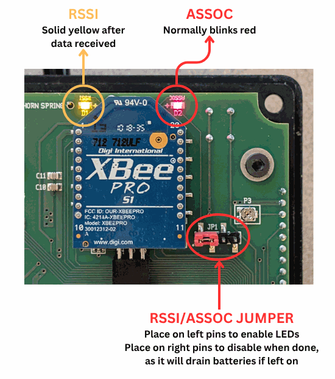

# Debugging & Diagnosing {align=right style="height: 75px; margin-top:0px; margin-bottom: 0px"}

## Overview

Sometimes things just aren't working and you can't figure out why, or can't figure out what to do about it.  That's what this page is all about - showing you some tools and techniques you can use to work through your issue.

**The Debugging Mentality**

Debugging is really just the art of making a problem repeatable, then methodically breaking a problem into pieces and carefully checking each one to determine where you need to look further.  For each step, try to only change *one thing at a time*, and set expectations: *"When I do X, I expect Y to happen."*  If Y happens, great, that's probably not where your issue lives.  If it doesn't happen, that's probably where you need to focus.

## Debugging ProtoThrottle Operations

This section assumes that your throttle, receiver, and DCC system are all happily talking to each other, and that you're having a problem getting a particular locomotive configuration to work as expected.  

Generally, the chain of events from moving a control to the locomotive responding involves the ProtoThrottle reading a physical switch on the faceplate, then converting that based on the locomotive configuration into speed, direction, and functions, sending that to a receiver, having the receiver translate to your DCC system, and then having the DCC system send that information over the rails to your locomotive.

We can check each of those steps.

* Is the ProtoThrottle reading the controls correctly?
* Is the ProtoThrottle sending the expected functions?
* Do those functions trigger the expected result?

### Step 1: Testing the Controls

The DIAG screen shows you how the ProtoThrottle thinks the controls are set.  Usually this isn't a problem, but sometimes things get out of calibration or a switch fails.  The DIAG screen shows at a glance the value being read off each control.

Each element is labeled as to what it indicates.  For example, pulling the horn lever should make the horn icon appear, and releasing it should make it go away.  If the horn icon is still on when the horn is released, then there's probably something wrong with the hardware or the horn calibration.

### Step 2: Sending the Right Functions

The settings in CONFIG FUNC and FORCE FUNC determine how those physical controls are turned into function outputs that are sent to the DCC system.  Sometimes you accidentally change something, or have two controls mapped to the same function, so it's useful to see exactly which functions the ProtoThrottle thinks it's sending.

We can get the throttle to show us which functions it's currently sending as "on".  From the main DIAG screen, push the up button on the right side of the screen.  There are three of these screens, each showing a bank of functions and what state they're in, and you can move between them and the main DIAG screen using the up and down buttons.

The three screens show FN:00+, FN:10+, and FN:20+ - these are the ranges of functions being displayed on that screen.  If a function is on, the number will appear.  If a function is off, it'll just be blank.  So, if you see a 6 on the 10+ screen, that means F16 is on, and F10-F15 and F17-F19 are off.  Likewise an 8 on the 00+ screen means F08 is on, or a 2 on the 20+ screen means 22 is on.  These update in real time, so if you move a control that you think should activate a function, the screen will update.

So, again testing our horn example, we would expect a 2 on the 00+ screen to appear if our horn was set to F2 and we pull the lever.  If it doesn't and the physical control was okay in step 1, then there's something wrong in CONFIG FUNC or FORCE FUNC that's preventing it.  Also, don't just check the one function that you're expecting - verify all of them.  With the complexity of modern decoders, setting one function may put the decoder in a state where others no long do what you expect.

### Step 3: Verifying Decoder Behaviour

So the ProtoThrottle is sending the functions you expect, but the locomotive still isn't doing what you expect?

The ProtoThrottle isn't magic.  It's just another kind of DCC throttle with different controls.  It's still just sending speed, direction, and a bunch of functions through your DCC system to your locomotive.

If the throttle seems to be sending the right functions and the locomotive isn't responding as expected, then let's just take the ProtoThrottle out entirely.  Set the ProtoThrottle to some other locomotive just to remove it from the test case.  Use one of your regular DCC throttles and see if the decoder does what you want by setting the same speed/direction/functions.  If it doesn't, then the issue lies in either how the decoder is set up, or your expectations of what certain functions should do.  If it does, then there's something different about what was sent from your regular throttle and the ProtoThrottle.

---

## Debugging ProtoThrottle Connectivity

If you're getting a green blinking light on your throttle, then the throttle is talking to the receiver.  That doesn't necessarily mean the receiver is talking the command station.  It just means the radio link from the throttle to the receiver is working.

If you get a red double blink, 99% of the time it's a case of the base address on the receiver isn't the same as the base address in the ProtoThrottle, or you have two throttles on the same throttle ID letter.   

*(Note:  The original ESU-BRIDGE wifi receiver - pre-2022 - also would not even attempt to talk to the throttle until it had found a command station.  So with that receiver only, you may also get a double red blink on the throttle if the receiver hasn't found a command station to talk to.)*

If you can't get your receiver to connect, then check out the troubleshooting section in the manual for each receiver type.
<!--
* [NCE/Lenz (MRBW-CABBUS)](Receiver Setup & Troubleshooting/cabbus.md#troubleshooting)
* [WiFi (MRBW-WIFI)](Receiver Setup & Troubleshooting/wifi.md#troubleshooting)
-->
---

## Common ProtoThrottle Hardware Issues

!!! warning "Avoid ESD Damage!"
    The board inside the ProtoThrottle can be damaged by static electricity.  Be sure to discharge any static from your body before touching the board.

### Screen Contrast

If the screen appears to have "stuck" dark pixels or is too dark or light in general, there (probably) isn't a problem with the screen.  All you likely need is a slight adjustment to the contrast adjustment potentiometer on the back of the PCB.  

Using a tiny flathead screwdriver, carefully turn the contrast adjustment a few degrees until the screen display improves.  Generally turning it clockwise will lighten the screen and counterclockwise will darken it.  Only *very slight* adjustments should be necessary.

### Horn / Brake Calibration

The handles on the ProtoThrottle come pre-calibrated and should not require any additional adjustments.  However, there have been cases where the calibration accidentally gets reset, or the lever slips on the shaft, or the faceplate gets taken off and calibration changes.  If the DIAG screen indicates that the brake or horn controls aren't triggering correctly, a recalibration may be needed.

Here’s the basic process for calibrating the throttle…

1. Go to THRSHOLD CAL menu, hit the lower left button to enter the calibration process.  Note: In firmware version 1.1 and later, you will first need to go to the SYSTEM menu and turn Advanced Functions to ON before you can see the THRSHOLD CAL menu.
2. You should see a menu that says “HORN” and has some value at the bottom. Pull the horn lever roughly a third of the way down, and while holding it there hit the upper right button. This sets the threshold at which the horn goes from off to on.
3. Hit the upper left (MENU) button again. You should now see “BRAKE” and a number.
4. Set the brake lever to center and hit the upper right button. This sets the threshold at which the on/off brake activates.  It does not affect any of the variable brake options.
5. Press the upper left (MENU) button again. You should now see “BRAKE LOW” and a number.
6. Set the brake lever all the way to the left and hit the upper right button again. This sets the lower limit for the brake lever and also the point where the emergency brake releases.
7. Press the upper left (MENU) button again. You should now see “BRAKE HIGH” and a number.
8. Set the brake lever all the way to the right and hit the upper right button again. This sets the upper limit for the brake lever.  This also sets the point where the emergency brake activates (if enabled).
9. Hit the lower left button. This will save the calibration constants.  Use the main DIAG to verify that the recalibration is successful and the controls are now being read correctly.

If you find yourself in the calibration menu by accident, just hit the lower left button and it will preserve the existing constants.  Avoid touching that upper right button and you’ll be fine.

### Throttle Lever Adjustment

If, for some reason, you need to adjust the brake, throttle, or reverser position, the set screw holding it in place is at the bottom of the shaft.  Unscrew the removable plastic knob from the top and then use a 2mm driver or allen wrench to engage with the set screw.

The throttle lever is the most common to need adjustment, as shifting between the encoder, board, lever and faceplate can lead to it not going for all 9 notches (idle + 1-8).  

To adjust it, start by putting the throttle into the main DIAG screen.  I typically notch it up to about 2 or 3, then loosen the set screw and put the lever all the way to idle.  I then gently tighten the screw and after swiping it all the way left and right to reset it, notch from idle up to 8 and back to make sure it moves smoothly with solid clicks in each notch and actually sits solidly in both idle and 8.  You may have to do this multiple times until you find a spot that works perfectly.

As a note... because the shafts aren't perfectly aligned with the faceplate, sometimes I find I have to work the encoder around a quarter or half a turn to find a spot that allows it to move smoothly without binding on the faceplate.  Normally since the throttle has been set during final assembly this sort of gross adjustment isn't needed by the end user, but it could happen if the faceplate is replaced or moves significantly.

If you find the throttle lever keeps giving you issues over time, check that the four cap screws holding the standoffs and faceplate to the PCB are tight.  (These require a 2.5mm allen key or driver.)  These being loose is the most common reason that the faceplate shifts against the controls.

### Broken Horn/Brake Lever

The first ~500 or so throttles are susceptible to cracks forming in the potentiometers for the brake and horn.  This is related to using potentiometers with a half-flat shaft and then steel set screws with a sharp point, and that leads to cracks forming.  Throttles after that switched to a full-round shaft and nylon set screws, and the only potentiometer failures seen in those have been the result of being dropped or banged around hard.

It's a known design problem, and we'll take care of it for free regardless of how old the throttle is.  Just contact support@iascaled.com for instructions.

If you really want to do it yourself - *which we really don't recommend as it's very easy to damage the PCB* - Nathan has made a [video walking through the repair process](https://youtu.be/yzNRF50o98k).  The replacement potentiometers are Bourns PTV09A-2020S-B104 and you'll need 8-32 x 1/4" nylon set screws, such as McMaster part 94564A036 or similar.

## Advanced Debugging

The stuff down here is way off in the weeds.  If you're down here, we strongly recommend talking to us before drawing any firm conclusions about what you're seeing.

### ASSOC and RSSI

Our receivers and throttles (and anything else with an XBee on it) have two LEDs associated with low level radio status - ASSOC (association, red) and RSSI (receive signal strength indicator, yellow).  For the ProtoThrottle, these are enabled by a jumper next to the radio.  If placed on the pins to the left, it will enable the two LEDs.  Normally it should be kept on the right two pins to disable them, as they'll drain the battery and are only exceedingly rarely needed.

For a normal radio, ASSOC (red) should blink.  That just means the radio is up, running, and doing the things it should be doing.  RSSI will light when a radio packet is received that the XBee understands, and stay lit for approximately a second or so.  

We've had a small number of one batch of throttle radios that lose their configuration.  It seems to be related to the batteries going dead and presumably the long, slow voltage decline ahead of that.  One of the key symptoms of these brain-dead radios is that ASSOC comes on solid and RSSI never lights.  The radio isn't damaged, but it just lost its configuration and needs to be reprogrammed.  If you have a throttle that refuses to communicate and exhibits this symptom, please contact support@iascaled.com.
