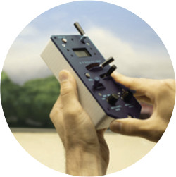
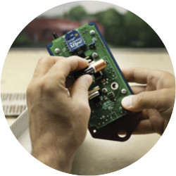
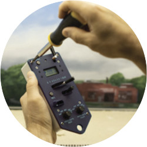
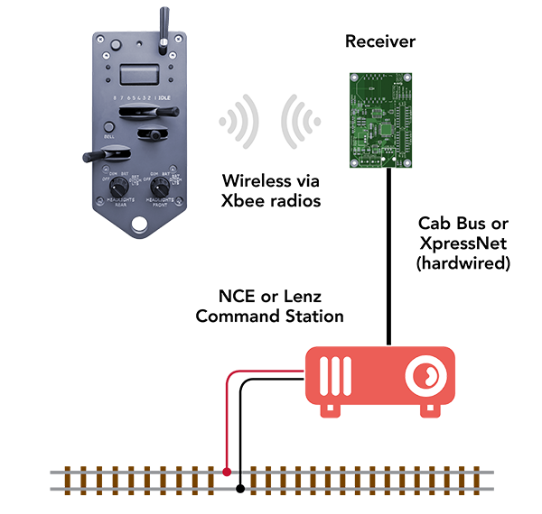
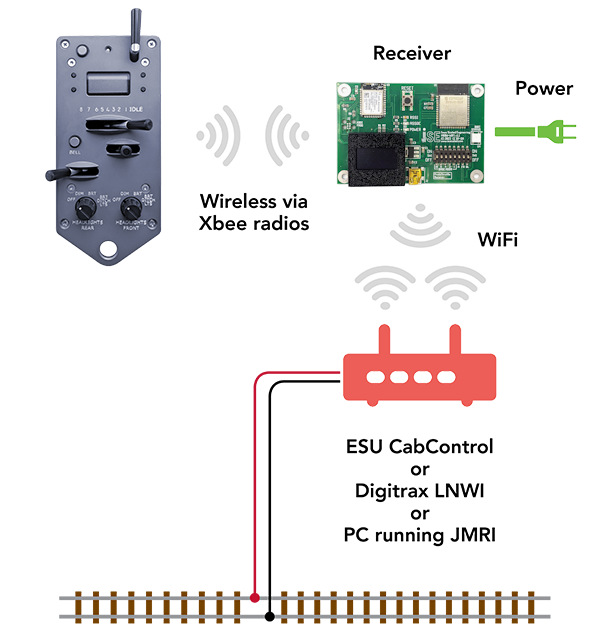
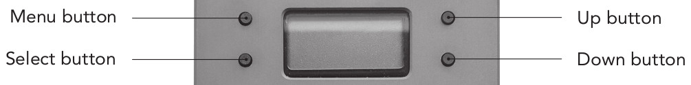

# ProtoThrottle 101: {align=right style="height: 75px; margin-top:0px; margin-bottom: 0px"} Introduction

## Overview

{align=right style="max-width:50%"} So you just bought a
ProtoThrottle and are thinking "what do I do now?" Welcome to ProtoThrottle
101.  This course is designed to answer that question, go through initial
setup, and familiarize you with the basics.  At that point, you can move on
to [ProtoThrottle 201](pt201.md) where we go through some simple steps to
get up and running with a locomotive tailored for operation with the
ProtoThrottle.  More advanced topics will then be available in later
courses.

## Background

The ProtoThrottle is a model railroad throttle designed to mimic a standard
EMD control stand.  For operation of the locomotive, it includes a throttle
with eight notches, a reverser handle with forward, centered, and reverse
positions, and a brake handle.  A spring-loaded horn handle, a
push-on/push-off bell button, and two light knobs, one for the front lights
and the other for the rear lights, round out the main controls.  In
addition, a screen and several buttons are available to navigate the various
configuration menus and toggle functions on or off during operation.

## Initial Setup

The ProtoThrottle comes shipped in its box, along with a quick-start
instruction sheet, the LoveHandle strap, and a lanyard.  The four black
knobs for the levers and the screws for the faceplate are inside the back
case, under the faceplate.

!!! warning "A Note About ESD"
    ESD (electrostatic discharge) is the sudden flow of electricity between
    two statically charged objects and can be deadly to modern electronics. 
    It is commonly known as a static shock and can occur when touching a
    door handle, getting up from a chair, rubbing two dissimilar material
    together, etc.  While most prevalent during dry, winter months, ESD can
    strike any time.  The ProtoThrottle is designed with built-in
    protections against ESD damage, but always observe good ESD practices
    especially before opening the ProtoThrottle case.  Discharge any static
    electricity in your body by touching a piece of grounded metal such as a
    door handle, faucet, or other large metal object.

### Assembly

**Step 1.**  Carefully remove the case from the faceplate.

**Step 2.**  Insert the batteries in the battery holder on the back side. 
The ProtoThrottle takes two AA batteries.  See the [Batteries](#batteries)
section below for more details.

**Step 3.**  Attach the faceplate with the provided screws and install the
four knobs on the horn, throttle, reverser, and brake levers.

**Step 4.**  (optional) Attached the provided LoveHandle strap on the back
and clip the lanyard to the attachment point on the bottom of the faceplate.

### Batteries

The ProtoThrottle takes two AA batteries.  Power efficiency was a key design
criteria for the throttle and, with typical use, can easily last many
operating sessions before needing to change the batteries.  Of course this
varies with use, battery chemistry, and battery quality.  In sleep mode, the
throttle should last up to a year on a single set of batteries.

!!! tip Alkaline Batteries
    If you use alkaline batteries, we recommend removing them before long
    term storage of the throttle.  Alkaline batteries can leak and cause
    significant damage to the circuit board inside the throttle.

Many ProtoThrottle users have opted to use rechargeable batteries such as
Nickle-Metal Hydride (NiMH).  With two pairs of batteries, one pair can be
in the throttle and the other pair on the charger.  Then, when it comes time
to change the batteries, it is a simple matter to swap them and quickly be
on your way again - i.e. no waiting for hours for batteries to recharge.

### Sleep Mode

The ProtoThrottle will automatically go into an ultra low-power sleep mode,
conserving battery life, if left alone for approximately 5 minutes with the
throttle handle in the “idle” position and the reverser handle in the
“centered” position.  To power down manually, press and hold the lower left button
next to the LCD screen for a few seconds.  Once prompted, press the lower
right button to power down.

## Receiver Setup

In order for the ProtoThrottle to work with as many DCC systems as possible,
a receiver is needed to translate the ProtoThrottle wireless language into a
language that your command station can understand.  We currently have two
receiver models, depending on your DCC system of choice.  A selection guide
is availble on the [Receiver Setup](receivers.md) page.

### NCE Cab Bus and Lenz XpressNet

DCC command stations using the NCE Cab Bus or Lenz XpressNet protocols have
the easiest [receiver](https://www.iascaled.com/store/MRBW-CABBUS) setup. 
Simply plug the receiver into the command station network.  It comes
preconfigured to work with NCE Cab Bus.  If you are using Lenz XpressNet,
be sure to change DIP switch A to ON.

The receiver comes preconfigured for Cab Bus cab 4 (or XpressNet address
4).  Depending on how many other throttles you have and their cab address
assignments, you may need to adjust the receiver's address.  Consult the
user manual that came with the receiver for details.

### ESU CabControl, JMRI WiFi Throttle, and Digitrax LNWI

The second [receiver](https://www.iascaled.com/store/MRBW-WIFI) covers
almost everything else.  This receiver communicates wirelessly with the
command station using a variety of protocols.

Many command station WiFi interfaces are detected automatically.  Digitrax
LNWIs, DCC-EX systems, MRC WiFi modules, and ESU CabControl systems in their
default configurations should connect to the receiver automatically with no
user intervention.  For custom setups, or operation with a JMRI instance
running the WiFi Throttle server, the receiver can be configured using a PC
and the provided USB cable.  Consult the user manual that came with the
receiver for details.

## Menu Navigation

While most common controls on the ProtoThrottle are designed to be physical,
tactile interfaces, some features require using the screen and menus to
access them.  The LCD screen, and the four button surrounding it, allow you
to access these menus.

In general, the **Menu** button moves between menus.  The **Select** button
enters or exits a menu and the **Up** and **Down** buttons change values. 
There are some nuances to those behaviors depending on which menu you're in
at the moment, so refer to the ProtoThrottle [User Manual](../manual.md) for
more details.

!!! note "Note"
    When on any top-level menu, a long press of the **Menu** button will
    return you to the main screen.

The following video demonstrates navigating through the menus, in this
case, to change some function settings:

### Selecting a Locomotive

One of the first things you will do with the ProtoThrottle is select the DCC
decoder address you want to use.  To do this, go to the SET LOCO menu on
the ProtoThrottle.  Dial in the address, digit-by-digit.  Short DCC
addresses will be preceded by an 's' on the screen whereas long addresses have
four numeric digits.  Consists can be called up using the same address you
would use on your conventional DCC throttle.

In the following video, we start with a short DCC address of 3 (the typical
address for most decoders and locomotives from the factory).  We change it
to a short address of 117 and save it.  Then we change it again to a long
address of 3244 and save it.

## Signs of Life

At this point the ProtoThrottle should be communicating with the DCC system
and you should be able to do some basic operation with a locomotive.  One of
the first things to try is the horn.  It's a simple test, and the horn
function is almost universally standardized among decoders to F2, at least
from the factory.  The ProtoThrottle, conveniently, also defaults to F2 as
the horn function.

If you hear the horn, then great!  Everything is working.

However, if you don't hear the horn, then stop here.  Figure out why it
isn't working.  Do you have the correct DCC address set in the
ProtoThrottle?  Is the locomotive on powered track and making contact?  Does
the ProtoThrottle have a connection to the receiver on the layout?

A good sanity check is to try activating F2 with your normal DCC throttle. 
If that works, then the problem is likely somewhere between the
ProtoThrottle and the DCC system.  But if that doesn't work, then you need
to dig deeper into why your normal DCC system's throttle can't communicate
with the locomotive.  Maybe an electrical problem?  Maybe the locomotive
horn function is, in fact, not F2?  Solve that problem first before
proceeding with any other operation or configuration.  If you don't have
this basic communication working, doing anything else will be a waste of
time.

## Conclusion

This tutorial has covered the basics of getting started with the
ProtoThrottle.  Next, we recommend first going through 
[ProtoThrottle 201: Configuration for Beginners](pt201.md) to 
learn how to set up a locomotive for use with the ProtoThrottle.  From there
you can then explore the many other features and opportunities available
with the ProtoThrottle!
