# ProtoThrottle 201: {align=right style="height: 75px; margin-top:0px; margin-bottom: 0px"} Configuration for Beginners

## Overview

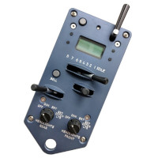{align=right style="max-width:50%"} Welcome to ProtoThrottle 201.  This course is
designed to provide some simple recipes to get up and running with the
ProtoThrottle quickly and easily.  While the ProtoThrottle may at first seem
daunting, if you take it step-by-step, as shown in the following material,
you can be operating and enjoying the experience of the ProtoThrottle in
very little time.

We start here assuming that you have a ProtoThrottle, have it set up and
talking to your DCC system via a receiver, understand basic navigation
through the ProtoThrottle menus, and are ready to set up your first
locomotive to work with the ProtoThrottle.  If that's not the case, or you
would like a refresher course, then [ProtoThrottle 101: Introduction]() is
where you should begin.

So, let's get started.

## Background

The ProtoThrottle is designed to mimic a standard EMD control stand.  For
operation of the locomotive, it includes a throttle with eight notches, a
reverser handle with forward, centered, and reverse positions, and a brake
handle.  A spring-loaded horn handle, a push-on/push-off bell button, and
two light knobs, one for the front lights and the other for the rear lights,
round out the main controls.  In addition, a screen and several buttons are
available to navigate the various configuration menus and toggle functions
on or off during operation.

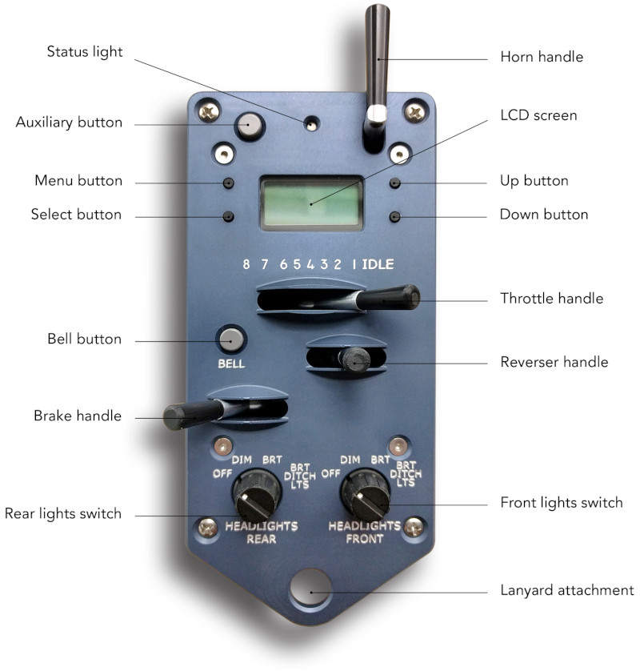

One key point to remember about the ProtoThrottle... 
there is ***No Magic***.  The ProtoThrottle sends standard DCC speed,
direction, and function commands to your decoder, via the command station. 
Sometimes there may be a little sleight-of-hand behind the scenes to fool
your brain, but fundamentally, under the hood, the ProtoThrottle is doing
nothing different than your standard DCC throttle.

It is just a throttle with a different (we like to think better!) face on it.

## Tips for Success

Before delving into the recipes themselves, we would like to remind you of
some important tips for success.  These are all hard learned lessons, but if
you remember and follow these guidelines, your experience will be that much
better.  Ignore them at your own peril.

* **Be methodical.  Take things step-by-step.**  It may seem slow at first,
  cumbersome, or too simple: "I just want to operate!".  But don't do
  everything at once.  Especially avoid jumpig to the more advanced features
  right away.  Take your time, get your feet wet, go step-by-step and follow
  the instructions outlined below.  After completing your first setup, it
  *will* go faster and you can then take some short cuts.  But please, avoid
  doing that the first time.

* **Keep it simple.  Standardize.**  Work toward a common way of setting up
  your locomotives.  This might start from a blank slate, or it might start
  from settings you got from a friend.  But try to set up your fleet in a
  common, standard way.  It may also mean that all your Tsunami2 locomotives
  are configured one way and all your Loksound locomotives another way -
  that's perfectly fine.  But within those groups, standardize.  Write down
  your settings each step of the way, and apply those same settings to
  subsequent locomotives.  Don't "reinvent the wheel" each time.

* **Test, Test... and test some more!**  This cannot be stressed enough. 
  After making a change, test that change.  Don't go making a bunch of
  changes, then try things only to be left wondering why it doesn't work. 
  Test each step of the way.  That way, if something doesn't work as you
  expected, you know the culprit exactly: the last (and only) thing you
  changed.  As you configure more locomotives, and develop your standardized
  list of settings (remember the bullet above?), you can then get away with
  making more changes at once, going faster, and testing less frequently. 
  But try not to fall into that trap initially.

When setting up your locomotives, you may very well encounter a situation
where things just don't work like you expected.  Fortunately, the
ProtoThrottle provides some convenient diagnostic tools on the throttle
itself.  A description of these tools are available [here]() and you are
advised to review that material before proceeding.

With those admonishments out of the way, let's get to what you've been
waiting for!

## The Three Step Recipe

Configuration of a locomotive and the ProtoThrottle can be broken down into
three main steps.  Why these three steps?  Experience has shown that doing
these three things gets you to "90%" of the experience of operating with the
ProtoThrottle.  Sure, that number is somewhat fuzzy and not really based on
any quantitative data, but the point is, you'll get most of the experience
and fun (i.e.  the "90%") just by doing these three simple things.  That's
the heart of the recipe.

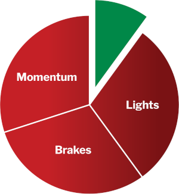{align=right style="max-width:50%"}The three steps are:

* Enable momentum
* Configure braking
* Set up lighting

After doing those three things, you will be able to enjoy operating your
locomotive with the ProtoThrottle.  Many people stop there and are perfectly
happy.  In fact, after going through the setup for those, which is
discussed below, we *encourage* you to stop and operate for a while.  Take
some mental notes about what you like, what you don't like, what you would
like to change.  What else would you like the locomotive to do?  Spend some
time enjoying the ProtoThrottle experience and most of all...  **have some fun!**

What about that final "10%"?  This is where you can personalize your
experience with the ProtoThrottle.  It will almost certainly take more time,
require more detailed configuration, and even get into the minutia of your
specific brand of decoder.  Is that your cup of tea?  Great!  If not, no
problem!  In either case, with the "90%" completed above, you will still be
able to enjoy operating.  If you do decide to pursue that last "10%", it can
be done at your leisure, as time and your comfort level permits.

## Pop Quiz

Where do we start?

!!! question ""
    A. Setting up a flattened speed curve

    B. Dialing in momentum settings

    C. Getting the step lights to work

You might think from the discussion above that the answer would be B,
dialing in the momentum settings.  You're almost correct.  The correct answer
is D (yes, it's a trick question): can you communicate with the locomotive?

Remember that tip about test, test, and test some more?  Well, here's the
first application of that, even before you've made any changes to the
locomotive.  If the ProtoThrottle can't communicate with the locomotive, it
will be futile to try and do anything else.

Fortunately this check is quick and easy.  First, go to the SET LOCO menu on
the ProtoThrottle.  Dial in the address, digit-by-digit.  Short DCC
addresses will be preceded by an 's' on the screen whereas long addresses have
four numeric digits.

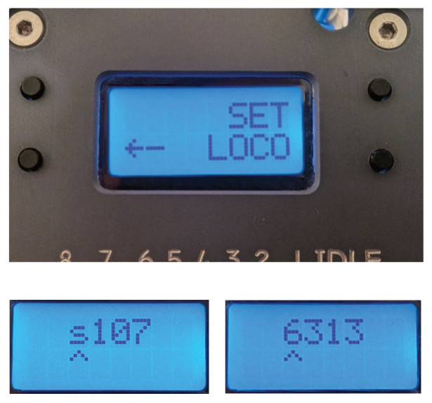

Now, test it.  Pull the horn lever.  Assuming you have a factory configured
locomotive, the horn is almost always configured for F2.  Conveniently, the
ProtoThrottle also defaults to sending the F2 function when the horn lever
is pulled.  So in 99.9% of the cases, you should hear a horn sound coming
from your locomotive.

If you do hear the horn, then great!  Please proceed on to the next section.

If not, then stop here.  Figure out why you aren't getting a horn sound.  Do
you have the correct DCC address set in the ProtoThrottle?  Is the
locomotive on powered track and making contact?  Does the ProtoThrottle have
a connection to the receiver on the layout?

A good sanity check is to try activating F2 with your normal DCC throttle. 
If that works, then the problem is likely somewhere between the
ProtoThrottle and the DCC system.  But if that doesn't work, then you need
to dig deeper into why your normal DCC system's throttle can't communicate
with the locomotive.  Maybe an electrical problem?  Maybe the locomotive
horn function is, in fact, not F2?  Solve that problem first before
proceeding.

---

## Momentum 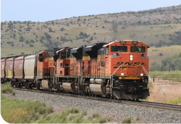{align=right style="max-width:50%"}

Why do we want high momentum?  First of all, it's prototypical.  Real trains
have LOTS of momentum.  They are big.  They take time to get going.  They
take even more time to stop.  Trains have a lot of mass and momentum is the
consequence of that mass.

Another reason we want high momentum with the ProtoThrottle is that it
smooths out the speed transitions between notches.  Fundamentally, yes, the
ProtoThrottle is an 8-speed throttle.  But with high momentum, it
successfully fools your brain into believing you have infinitely variable
control of the speed (remember that sleight-of-hand [comment](#no-magic)
above?).  As the locomotive slowly ramps up and down in speed, you can
control the speed by "playing the notches" using the throttle lever, just as
a prototype engineer would need to do over varying terrain and with other
forces acting on the train.

In the model world, we simulate momentum with settings in the DCC decoder. 
The decoder has two momentum settings, one for acceleration (going faster)
and the other for deceleration (going slower).

### Acceleration Momentum

The acceleration momentum setting is used when the speed of the locomotive
is told to increase.  It is set by **CV 3**.  Higher values in CV 3 mean it will
take longer to get up to the requested speed and simulates more mass.

### Deceleration Momentum

When decreasing speed, the deceleration momentum setting is used.  It is set
by **CV 4**.  A higher value here means it will take longer to slow down and
to stop.  This can also be thought of as a coasting effect, allowing the
locomotive to keep moving (coast) even though you have throttled down and
are no longer "applying power" to the wheels.

### Operation Without Momentum

The following video shows operation with no momentum (CV 3 = 0, CV 4 = 0). 
Note the quick acceleration and stopping, which is not prototypical.

**FIXME: insert video here**

### Momentum Recipe

**Acceleration:**  Start in the middle with CV 3 = 128.  Test it out.  Adjust
to suit your preferences or layout size.  Smaller layouts will tend to use
lower values whereas larger layouts can get away with higher values. 
Intense switching operations may want smaller values, but relaxed branch
lines may do better with larger values.

**Deceleration:**  Set it to the max with CV 4 = 255.  This will provide maximum
coasting.  We may adjust this later when setting up braking, but start here
and leave it for now.  Since we don't have braking set up just yet, be sure
to have the emergency stop handy when testing.

Test and adjust CV 3 until you're happy.  You can always come back
later and adjust again, but get something in the ballpark of what feels right
for acceleration on your layout.  Leave CV 4 alone.

### Operation With Momentum

The video below shows operation with momentum.  In the first case, we have
CV 3 = 160, which has been adjusted higher than the starting recommendation
above.  In the second case, we set CV 3 = 80.  Notice the difference in the
locomotive's response to notching up the throttle.

In both cases, the locomotive coasts nicely.  As mentioned above, since we
don't have the brake set up yet, we have to rely on the emergency stop
(brake lever all the way to the right) to abruptly stop the locomotive. 
Don't worry, we'll get a prototypical brake effect working next.

**FIXME: insert video here**

---

## Braking 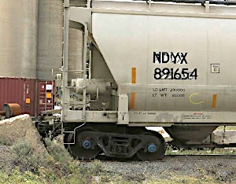{align=right style="max-width:50%"}

Why do we want braking?

Braking is a complement to the high momentum we set in the previous section,
in particular the high deceleration momentum.  This counteracts the coasting
effect from CV 4 being set to the maximum value.  With braking, we now have
a more prototypical operation of the throttle: make the locomotive go with
the throttle lever; make the locomotive stop with the brake lever.

### ProtoThrottle Brake

The brake lever on the ProtoThrottle has smooth motion across its range.  By
default, the brake function activates at approximately the center position
and is a simple on/off function.  There are variable braking effects
available, but we're going to ignore those for now.  If you don't have the
basic on/off braking working, trying to get something more advanced
configured is a fool's errand (remember that thing about taking it
step-by-step?).

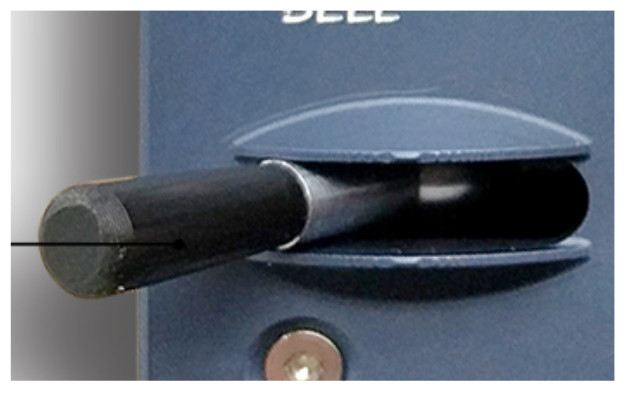

By default, the brake handle is shared with the emergency stop function. 
Moving the brake handle all the way to the right will activate the emergency
stop.  This can be changed later, but for now, keep it so you have a quick
way to stop the locomotive should that be needed.

The first thing you need to do is set up the ProtoThrottle to send the
correct brake function to the DCC decoder in the locomotive.  This is done
in the CONFIG FUNC -> BRAKE menu:

* Tsunami2 = F11
* Loksound 5 = F10

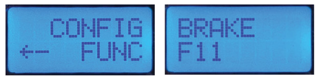

The exact configuration recipe for the decoder varies by decoder type.  Here
we will cover the Tsunami2 and Loksound 5.  Other decoder types are similar.

### Tsunami2 Brake {align=right style="max-width:33%"}

The Tsunami2 decoder uses two configuration variables to set the brake rates
in the decoder:

* CV 117: Independent brake rate
* CV 118: Train brake rate

Which one is in use at any one time is determined by the state of a function
(typically F12).  To keep things simple for now, set both CV 117 and CV 118
to the same value.  That way it doesn't matter which one the decoder is
using, you'll still get the same effect.  Later you can go back and
customize these to different values for different braking effects.  But keep
it simple for now.

On the Tsunami2 decoder, the brake rates shown above work in conjunction with
CV 4, the deceleration momentum.  We'll get to that interaction in moment
with the recipe, but this is an important point to remember and an important
distinction from other types of decoders.

One final note: make sure CV 1.403 is set to zero.  If not, the brake won't
work as expected.  Many Athearn locomotives come from the factory with CV
1.403 programmed to a non-zero value, so you need to make sure to set this to
zero before continuing.

### Tsunami2 Brake Recipe

1. Set CV 117 and CV 118 = 255 (max)

1. Check that CV 1.403 = 0

1. Test & Adjust as needed:
    * Need more braking? Decrease CV 4 (keeping CV 117 & 118 = 255)
    * Need less braking? Decrease CV 117 & 118 (keeping CV 4 = 255)

[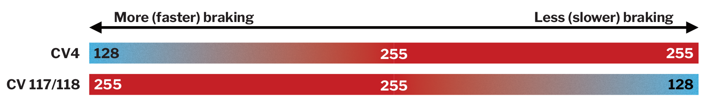](img/tsu2-brake-recipe.png)

### Braking Demo

The following video shows the operation of the brake with a Tsunami2 decoder
configured as above.  It starts with the default settings of CV 4 = 255 and
CV 117 = CV 118 = 255.  We then need to adjust CV 4 to a value of 160 to
increase the braking.  Finally, CV 4 is adjusted down again to 128 for an
even stronger braking effect.

**FIXME: insert video here**

### Loksound 5 Brake {align=right style="max-width:33%"}

The Loksound 5 decoder has three brakes: Brake 1, Brake 2, and Brake 3. 
However, to keep things simple, we're only going to use Brake 1, set by
configuration variable, CV 179.  The value of CV 179 sets the strength of
the brake effect when the brake function is activated.

### Loksound 5 Brake Recipe

1. Set CV 179 = 128

1. Test & adjust as needed:
    * Need more braking? Increase CV 179
    * Need less braking? Decrease CV 179

[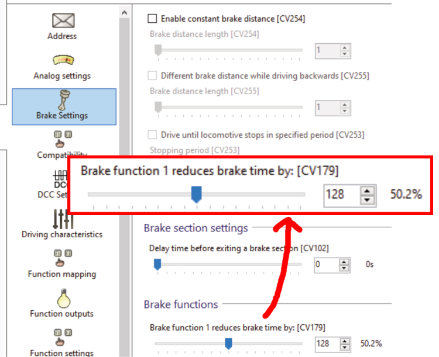](img/ls5-brake.png)

---

## Lighting Concepts

The ProtoThrottle has two light switches, one for the front and the other
for the rear.  Each switch has four positions:

-   OFF
    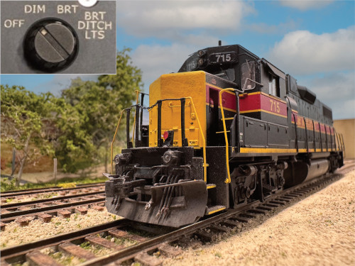
-   DIM
    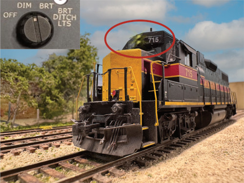
-   BRIGHT
    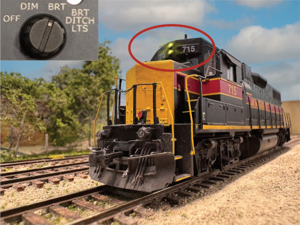
-   BRIGHT + DITCH LIGHTS
    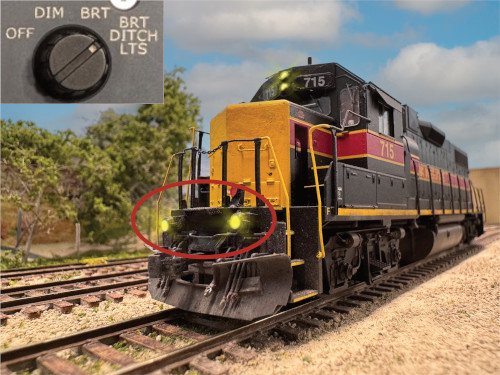

Most decoders, especially factory-installed, come with headlights that
automatically change direction when the locomotive direction changes. 
Since the ProtoThrottle has independent knobs for front and rear headlights,
this automatic behavior is not desired.  To stop this, we need to remove the
directionality associated with the headlight function outputs by making them
active in both the forward and reverse directions.

Additionally, we want independent control of each lighting output. 
Therefore, the front headlight, rear headlight, and front/rear ditch lights
(if equipped) should be assigned separate functions.

Each decoder type configures the lighting outputs in different ways, using
different CVs and has different spare/available functions.  Additionally,
everyone's preferences for which functions to use differs.  Therefore, it is
difficult to give one specific recipe for lighting configuration.  We will
present one example below, but you are encouraged to adapt this to your
specific situation and create your own standard for your fleet.

### Lighting Recipe

1. Assign front / rear headlights to different functions in the decoder
    * Front = F0
    * Rear = F28 (or something unused)

1. Assign front / rear ditch lights to different functions in the decoder
    * Front = F27 (or something unused)
    * Rear = F26 (or something unused)

1. Identify the dimmer function in the decoder
    * Tsunami2 = F7
    * Loksound 5 = F12
    * Always confirm with the locomotive or decoder manuals

4. Using the CONFIG FUNC menu on the ProtoThrottle, set the function
   numbers based on the values you chose above:

| Setting  | Description                | Fn #      |
| -------- | -------------------------- | --------- |
| F.HEAD   | Front headlight function   | F0        |
| R.HEAD   | Rear headlight function    | F28       |
| F.DIM #1 | Front headlight function   | F0        |
| F.DIM #2 | Dimmer                     | F7 or F12 |
| R.DIM #1 | Rear headlight function    | F28       |
| R.DIM #2 | Dimmer                     | F7 or F12 |
| F.DITCH  | Front ditch light function | F27       |
| R.DITCH  | Rear ditch light function  | F26       |

Any unused lighting function(s) should be set to F–– (i.e. none).

!!! note "A note about choosing functions..."
    In the example above, we chose high-numbered functions for some of the
    lights.  This highlights one of the benefits of the ProtoThrottle: it
    doesn't care what function number is chosen and handles all of that for
    you behind the scenes once configured.  However, if you plan to also use
    your locomotive with a regular DCC throttle, then you may want to choose
    lower-numbered functions so it is more convenient to select them on the
    conventional throttle.

## 90% Done!

You're there!  Now is the time to stop.  Operate your locomotive for a
while.  Feel free to go back and adjust things.  But most of all, have fun!

After spending some time operating the ProtoThrottle, now consider what
advanced topics you might (or might not) want to tackle.  These could
include:

* Align engine RPM with throttle notches
* Graduated (variable) braking
* Flattened speed curves
* Advanced lighting features
* Brake test
* Consisting

## Conclusion

Hopefully this tutorial has given you the tools to confidently approach
setting up a locomotive for the ProtoThrottle.  Many thanks to the [STL
RPM](https://stlrpm.com/) crew for allowing us to present this as a clinic
in 2025, to Scott Thornton and James McNab for help in preparing and
reviewing this material, and most importantly, all of our ProtoThrottle
customers for your support!
