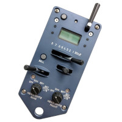
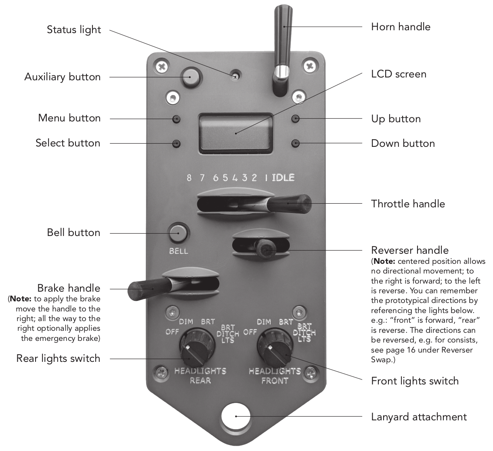
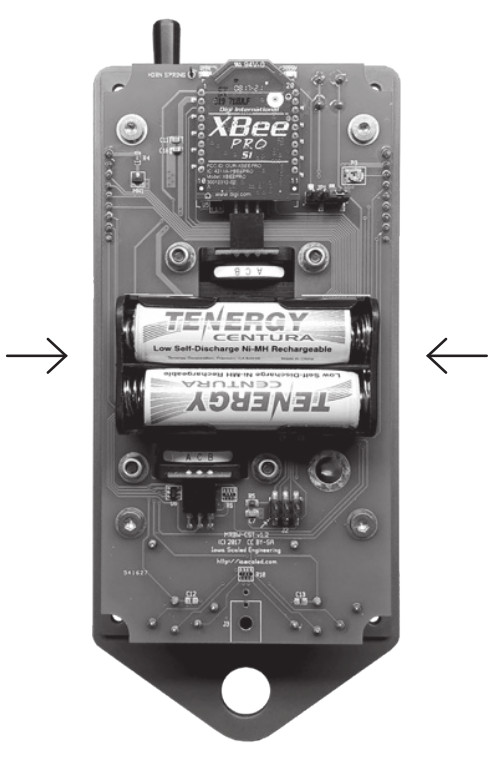
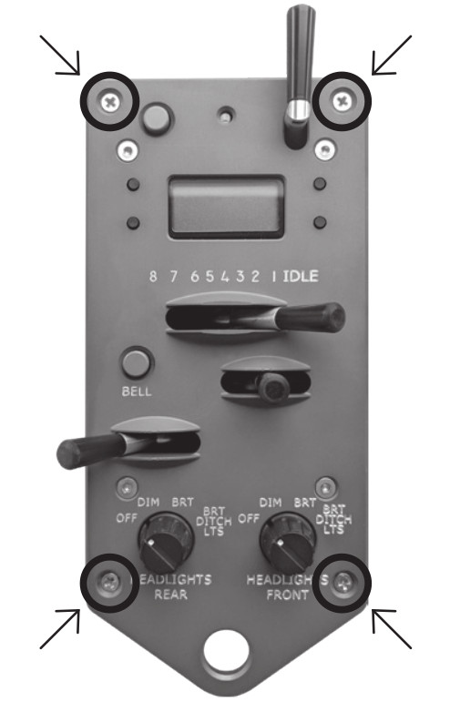
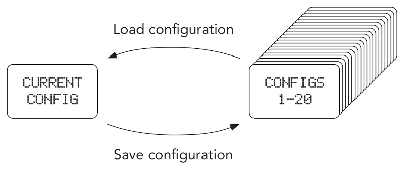
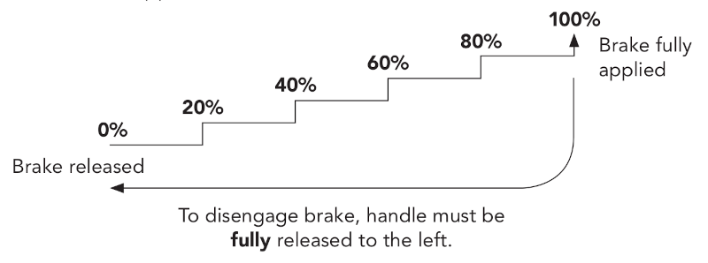

# ProtoThrottle User Manual {align=right style="height: 75px; margin-top:0px; margin-bottom: 0px"}

## Download

[PDF Manual](mrbw-cst-manual-v1.2A.pdf) - for on-screen viewing

[Printable Manual](mrbw-cst-manual-v1.2A-imposed.pdf) - must be printed double sided (flip on short edge)

[Menu Map](mrbw-cst-menu-v1.2.pdf) - legal size

!!! note warning
    This online ProtoThrottle manual below is a work in progress.  In the
    meantime, for the complete manual, please see the PDF versions above.

## Overview

{align=right}Our goal was to design and develop a wireless throttle that provides the
diesel modeler with the most realistic experience operating their model
locomotives.

The ProtoThrottle mimics a standard EMD control stand including full detent
throttle and reverser handles, a spring-loaded horn handle, a
push-on/push-off bell button, and fully programmable front and rear
headlights with a setting for ditch lights.  In addition, the ProtoThrottle
comes with a robust faceplate machined from aluminum, including prototype
bezels, and anodized to give the look and feel of a real control stand.

The ProtoThrottle comes with our commitment to your satisfaction.  We
warranty the throttle from manufacturing defects for one year, and if you
should have any questions or issues with the ProtoThrottle, please contact
us.

---

## Controls

---

## Battery Install

{align=right width=25%}{align=right width=25%}The ProtoThrottle is powered by 2 AA batteries (not included).  The
batteries can be alkaline or rechargeable NiMH.

To access the battery holder, unscrew the 4 phillips head screws on the
corners of the throttle’s faceplate; remove the box; **IMPORTANT:** when
removing the batteries from the holder, use one hand to hold both sides of
the holder to prevent it from bending away from the printed circuit board;
insert batteries and reattach the box.  **Do not over tighten the screws.**

**To conserve battery life:** make sure the throttle handle is in “idle”
position and the reverser handle is in “centered” position when not in use. 
This will cause the throttle to go to sleep after 5 minutes.  **To power down
manually, see the [Main Screen](#main-screen) instructions.**

---

## Quick Start Guide

!!! note inline end
    **If the ProtoThrottle is in ”sleep” mode the LCD screen will be dark,
    click any of the LCD buttons to wake the throttle.**

The ProtoThrottle will work with any scale and with sound- or non-sound
decoders (though using sound enhances the control stand experience signifi-
cantly).  Any DCC decoder compatible with the NMRA standards will work with
the ProtoThrottle because it uses standard DCC commands and functions via
your command station..  The ProtoThrottle is not a DCC system and will not
replace the system you use.

Check the Iowa Scaled Engineering
[website](https://www.iascaled.com/store/Receivers) for the most current list of
supported DCC command stations.

!!! success "Step 1"

    Configure your ProtoThrottle receiver using the instructions provided
    with the receiver.  Make sure the base address of the ProtoThrottle matches
    that of the receiver.  If using multiple ProtoThrottles, set
    each throttle to a unique ID.  (See [Communication Configuration Menu](#communication-configuration-menu))

!!! success "Step 2"

    Using your DCC system, **set acceleration momentum (CV3) mid-range to
    moderately high** so that the ProtoThrottle will need to “notch up” to get the
    train moving.

    **Set deceleration momentum (CV4) high or maximum.**  This will allow the train
    to “coast” when the throttle is in the idle position requiring the use of
    the brake to slow or stop the train.

!!! success "Step 3"
    **Input the locomotive number into the ProtoThrottle:**

    1.  Click the Menu button 5 times

        <pre class="lcd screen">
             SET
        &#257;-  LOCO
        </pre>

    1.  Click the Select button once

        <pre class="lcd screen">
          0003&#254;&#254;
          ^
        </pre>

    1.  Use the Up and Down buttons to change numbers

        <pre class="lcd screen">
          4003&#254;&#254;
          ^
        </pre>

    1.  Use the Menu button to move cursor right

        <pre class="lcd screen">
          4003&#254;&#254;
           ^
        </pre>

    1.  Repeat to enter the rest of the numbers

        <pre class="lcd screen">
          4795&#254;&#254;
             ^
        </pre>

    1.  After number is input, click Select button to save

        <pre class="lcd screen">
         SAVED!&#254;
        &#254;
        </pre>

    See [Set Locomotive Menu](#set-locomotive-menu) for how to set a short (primary) address. 

**NOTE: The ProtoThrottle function settings are set to standard DCC function numbers by default.
If you need to change any function number, the steps are explained below:**

!!! success "Step 4"
    **To check or set the horn, bell, and brake function numbers:**

    1.  Click the Menu button 7 times

        <pre class="lcd screen">
          CONFIG
        &#257;-  FUNC
        </pre>

    1.  Click the Select button once

        <pre class="lcd screen">
        HORN&#254;&#254;&#254;&#254;
        F02
        </pre>

    1.  Click the Up or Down button to change the function number

        <pre class="lcd screen">
        HORN&#254;&#254;&#254;&#254;
        F07
        </pre>

    1.  Click Menu button to toggle through the other function choices. Repeat to change additional functions.

        <pre class="lcd screen">
        BRAKE&#254;&#254;&#254;
        F10
        </pre>

    1.  Click the Select button to save all changes

        <pre class="lcd screen">
         SAVED!&#254;
        &#254;
        </pre>

!!! success "Step 5"
    **Enjoy operating your locomotive!**

    **Please read the entire manual to familiarize yourself with all the
    features of the ProtoThrottle.** See our website for more specific
    instructions on programming.

    In addition, our website has detailed operational scenarios developed by
    professional locomotive engineer, Tim Garland.  If you are not familiar
    with prototype operation from a engineer’s perspective, Tim’s scenarios
    will give you insight on how to operate more realistically using the
    ProtoThrottle.

---

## Main Screen

!!! info ""
    <pre class="lcd screen">
    &#265; 0250 &#268;
    &#274;12:00&#270;&#268;
    </pre>

    Locomotive Address.  Long (extended) addresses are displayed directly (e.g. 0250 0000 9999). Short (primary) addresses are displayed with an ‘s’ prefix (e.g. s003 s000 s127).

    In certain situations the locomotive address may be replaced by an alert message:

    EMRG  Emergency stop is active!
    Note: move the brake handle all the way left to deactivate.

    REV!  Reverser was moved with the throttle not in idle|

!!! info ""
    <pre class="lcd screen">
    &#265; 0250 &#268;
    &#274;12:00&#270;&#268;
    </pre>

    The ProtoThrottle acts as a secondary display for Iowa Scaled
    Engineering’s wireless fast clocks www.iascaled.com/store/MRBW-FCM
    or the fast time provided by the NCE Cab Bus.

    &#270; 12-hour mode AM indicator &#271; 12-hour mode PM indicator

    No AM or PM indicator when in 24-hour mode.

!!! info ""
    <pre class="lcd screen">
    &#265; 0250 &#268;
    &#274;12:00&#270;&#268;
    </pre>

    Battery Status:
    
    &#265; Batteries good

    &#266; Batteries low

    &#267; Replace batteries
    
    Display will show LOW BATTERY when the batteries are critically low. Operation will not be possible
    until the batteries are replaced.

!!! info ""
    <pre class="lcd screen">
    &#265; 0250 &#268;
    &#274;12:00&#270;&#268;
    </pre>
    When &#274; is on screen the auxiliary button is active

!!! info ""
    <pre class="lcd screen">
    &#265; 0250 &#268;
    &#274;12:00&#270;&#268;
    </pre>

    Up/Down Button Status.  On the main screen, the Up and Down buttons can
    be assigned to functions.  The on/off status of those assigned functions
    are displayed on the LCD screen.

    &#268; Function off

    &#269; Function on

**Note:** pressing and holding the Menu button (upper left LCD button)
momentarily will return you to the main screen from any of the main
menus.

The Up and Down buttons can be assigned a function using the [Configure Function](#configure-function-menu) menu.

Pressing and holding the Select button for a few seconds will prompt to power down the throttle:

<pre class="lcd screen">
POWER
DOWN  -&#256
</pre>

Click the Down button to confirm and turn off the throttle.

|     | Navigation |     |
|----:|:----------:|:----|
|[Advance to Engine Menu](#engine-menu) :material-arrow-right-drop-circle:  Toggle backlight on/off :material-checkbox-marked-circle: **hold** to power down throttle|<pre class="screen">LCD  SCREEN  </pre> |:material-arrow-up-circle: Up  :material-arrow-down-circle: Down|

---

<pre class="lcd screen">
 ENGINE 
  OFF
</pre>

## Engine Menu

The behavior of the Engine menu depends on the configuration of the
ENG ON and ENG STOP settings in the Configure Function menu. 

For DCC decoders that take a single function on/off to turn the prime
mover on/off (such as ESU Loksound or TCS WOWSound decoders), configure ENG
ON to that function number and set ENG STOP to off (F--).  The Engine menu
will then change between OFF and ON when pressing the Up and Down buttons.
<pre class="lcd screen">
 ENGINE 
   OFF
</pre>
<pre class="lcd screen">
 ENGINE 
   ON
</pre>

If a decoder is edge triggered instead (requires a function on/off transition)
to turn the prime mover on and off (such as Soundtraxx Tsunami2), set
both ENG ON and ENG STOP to the appropriate function numbers.
In this case, the Engine menu will display STARTING and STOPPING be-
tween the ON and OFF settings as the assigned functions are sent to the
locomotive decoder.
<pre class="lcd screen">
 ENGINE 
   OFF
</pre>
<pre class="lcd screen">
 ENGINE 
STARTING
</pre>
<pre class="lcd screen">
 ENGINE 
   ON
</pre>
<pre class="lcd screen">
 ENGINE 
STOPPING
</pre>
<pre class="lcd screen">
 ENGINE 
   OFF
</pre>

If the throttle is not in idle when attempting to turn off the prime mover,
a warning will be displayed and the ENG STOP function will not be sent.
Move the throttle back to idle to continue.
<pre class="lcd screen">
 ENGINE 
NOT IDLE 
</pre>

**Example #1, F8 for ESU Loksound or F12 for TCS WOWSound:**
<pre class="lcd">
ENG ON = F08      ENG ON = F12
ENG STOP = F--    ENG STOP = F--
</pre>

**Example #2, F5 (on, RPM+) and F6 (off, RPM-) for Soundtraxx Tsunami 2:**
<pre class="lcd">
ENG ON = F05
ENG STOP = F06
</pre>

|     | Navigation |     |
|----:|:----------:|:----|
|[Advance to Special Functions Menu](#special-functions-menu) :material-arrow-right-drop-circle:  Return to Main Screen :material-checkbox-marked-circle:|<pre class="screen">LCD  SCREEN  </pre> |:material-arrow-up-circle: Start or turn on prime mover  :material-arrow-down-circle: Stop or turn off prime mover|

---

<pre class="lcd screen">
 SPECIAL
&#257- FUNCS
</pre>

## Special Functions Menu

This screen provides access to the special functions of the ProtoThrottle. 
Currently, one special function is available: a brake test simulator.

|     | Navigation |     |
|----:|:----------:|:----|
|[Advance to Load Configuration Menu](#load-configuration-menu) :material-arrow-right-drop-circle:  [Enter Special Functions](special-functions.md) :material-checkbox-marked-circle:|<pre class="screen">LCD  SCREEN  </pre> |:material-arrow-up-circle: None  :material-arrow-down-circle: None|

---

<pre class="lcd screen">
LOAD CNF
01: 0250
</pre>

## Load Configuration Menu

The Load Configuration screen loads a set of existing configuration settings
that were previously saved using the Save Configuration screen.

!!! info ""
    <pre class="lcd screen">
    LOAD CNF
    01: 0250
    </pre>

    01:  Configuration Number. Up to 20 distinct configurations (locomotive
    address, function mappings, throttle notch settings, options) can be
    stored in the ProtoThrottle and loaded quickly using this menu.

    0250  Locomotive Address. This is the locomotive address associated
    with the selected configuration number.

    Press the Select button to load the configuration.

!!! info ""
    <pre class="lcd screen">
    CONFIRM
    LOAD  -&#256
    </pre>

    Before loading the selected configuratoin, you will be asked to confirm
    by pressing the Down button.  To cancel, click the Menu button.

|     | Navigation |     |
|----:|:----------:|:----|
|[Advance to Save Configuration Menu](#save-configuration-menu) :material-arrow-right-drop-circle:  Load Selected Configuration :material-checkbox-marked-circle: and return to Main Screen|<pre class="screen">LCD  SCREEN  </pre> |:material-arrow-up-circle: Increase Configuration Number  :material-arrow-down-circle: Decrease Configuration Number|

---

<pre class="lcd screen">
SAVE CNF
01: 0250
</pre>

## Save Configuration Menu

The Save Configuration screen saves the current loaded configuration
(with any changes you’ve made) into whatever configuration slot is on
the screen. In order to copy an established configuration, you must load
it into the throttle first before “saving” it to another slot.

!!! info ""
    <pre class="lcd screen">
    SAVE CNF
    01: 0250
    </pre>

    01:  Configuration Number. Up to 20 distinct configurations (locomotive
    address, function mappings, throttle notch settings, options) can be
    stored in the ProtoThrottle and saved using this menu.

    0250  Locomotive Address. This is the locomotive address associated
    with the selected configuration number.

    Press the Select button to save the configuration.

!!! info ""
    <pre class="lcd screen">
    CONFIRM
    SAVE  -&#256
    </pre>

    Before saving the selected configuratoin, you will be asked to confirm
    by pressing the Down button.  To cancel, click the Menu button.

|     | Navigation |     |
|----:|:----------:|:----|
|[Advance to Set Locomotive Menu](#set-locomotive-menu) :material-arrow-right-drop-circle:  Save Selected Configuration :material-checkbox-marked-circle: and return to Main Screen|<pre class="screen">LCD  SCREEN  </pre> |:material-arrow-up-circle: Increase Configuration Number  :material-arrow-down-circle: Decrease Configuration Number|

---

<pre class="lcd screen">
     SET
&#257-  LOCO
</pre>

## Set Locomotive Menu

This screen lets you change the currently selected locomotive address.

**NOTE:** To set a short (primary) address, the first digit will need to display
an “s”.  To do so, make sure the other three digits are first set to a valid
short address value (<128).  Then, cycle through the first digit until the
“s” appears.

|     | Navigation |     |
|----:|:----------:|:----|
|[Advance to Force Function Menu](#force-function-menu) :material-arrow-right-drop-circle:  Enter Set Locomotive Sub-Menu :material-checkbox-marked-circle:|<pre class="screen">LCD  SCREEN  </pre> |:material-arrow-up-circle: None  :material-arrow-down-circle: None|

**Set Locomotive Sub-Menu**

!!! info ""
    <pre class="lcd screen">
      0250&#32;&#32;
      ^
    </pre>

    0250 Locomotive Address.

    ^ Digit Selector.

|     | Set Locomotive |     |
|----:|:----------:|:----|
|Move Digit Selector to the next digit :material-arrow-right-drop-circle:  Save locomotive address and return :material-checkbox-marked-circle: to Set Locomotive Menu|<pre class="screen">LCD  SCREEN  </pre> |:material-arrow-up-circle: Increase selected digit  :material-arrow-down-circle: Decrease selected digit|

---

<pre class="lcd screen">
   FORCE
&#257-  FUNC
</pre>

## Force Function Menu

The Force Function menu allows any of the 29 standard DCC functions to be turned
ON or OFF, regardless of any other ProtoThrottle lever or button. These can be used to test
functions or control additional features of the decoder such as auxiliary, class, or lesser used
lights.

|     | Navigation |     |
|----:|:----------:|:----|
|[Advance to Configure Function Menu](#configure-function-menu) :material-arrow-right-drop-circle:  Enter Force Function Sub-Menu :material-checkbox-marked-circle:|<pre class="screen">LCD  SCREEN  </pre> |:material-arrow-up-circle: None  :material-arrow-down-circle: None|

**Force Function Sub-Menu**

!!! info ""
    <pre class="lcd screen">
    F00  ---
    &#32;
    </pre>

    Function Number. Available range from function 0 to function 28.

!!! info ""
    <pre class="lcd screen">
    F00  ---
    &#32;
    </pre>

    Function Setting.

    --- Function can be controlled by a ProtoThrottle button or lever

    ON&#32; Function forced on, regardless of any other button or control

    OFF Function forced off, regardless of any other button or control

In the Force Function menu, the horn lever does not activate the horn function.
Instead, it will activate the currently selected function number if the function setting is ---.

!!! warning "Please Note"
    Normally, all Force Function settings should be set to ---.  Unless you have a very specific reason for setting
    it to something else, leave it at the default value.  Otherwise, functions
    may no longer be automatically controlled by the throttle.

|     | Force Function |     |
|----:|:----------:|:----|
|Cycle through Function Numbers :material-arrow-right-drop-circle:  Save settings and return :material-checkbox-marked-circle: to Force Function menu|<pre class="screen">LCD  SCREEN  </pre> |:material-arrow-up-circle: Cycle through Function Settings  :material-arrow-down-circle: Cycle through Function Settings|

---

<pre class="lcd screen">
  CONFIG
&#257-  FUNC
</pre>

## Configure Function Menu

The Configure Function menu sets the DCC function to be sent for each control on the throttle and action performed by the throttle.  This is where most of the customization takes place.

|     | Navigation |     |
|----:|:----------:|:----|
|[Advance to Notch Configuration Menu](#configure-function-menu) :material-arrow-right-drop-circle:  Enter Configure Function Sub-Menu :material-checkbox-marked-circle:|<pre class="screen">LCD  SCREEN  </pre> |:material-arrow-up-circle: None  :material-arrow-down-circle: None|

**Configure Function Sub-Menu**

!!! info ""
    <pre class="lcd screen">
    HORN&#32;&#32;&#32;&#32;
    F02
    </pre>

    Control Name. The name of the ProtoThrottle button or handle to which a function can be assigned.

    HORN Horn lever  
    BELL Bell lbutton  
    BRAKE Brake lever, when brake is activated  
    BRK OFF Brake lever, when in the full left position  
    AUX Auxiliary button  

    ==Fix Me!  Add rest of settings==

!!! info ""
    <pre class="lcd screen">
    HORN&#32;&#32;&#32;&#32;
    F02
    </pre>

    Function Number. The function to be activated when the associated
    ProtoThrottle button is pressed or control is moved. Available settings
    are none (F--) and functions 0 (F00) to 28 (F28).

    Additional settings are also available for select controls:

    MOM Momentary Function. The function is only active while the button is pressed.  Available on the Up and Down button assignments.  
    LAT Latching Function. The function toggles on and off with each press of the button.  Available on the Up and Down button assignments.  
    EMRG BRK Activate the emergency brake.  Available on the Up, Down, and Auxiliary button assignments.  
    BRK TEST Active the brake test special function.  Available on the Up and Down button assignments.  

|     | Config Function |     |
|----:|:----------:|:----|
|Cycle through Control Names :material-arrow-right-drop-circle:  Save settings and return :material-checkbox-marked-circle: to Configure Function menu|<pre class="screen">LCD  SCREEN  </pre> |:material-arrow-up-circle: Increase Function Number  :material-arrow-down-circle: Decrease Function Number|

---

<pre class="lcd screen">
   NOTCH
&#257-   CFG
</pre>

## Notch Configuration Menu

The Notch Configuration menu allows you to set the DCC speed step sent for each notch setting on the throttle.  This, in conjunction with the decoder's speed table, can be used to fine-tune the speed of the locomotive and its response to the throttle.

|     | Navigation |     |
|----:|:----------:|:----|
|[Advance to Options Menu](#options-menu) :material-arrow-right-drop-circle:  Enter Notch Configuration Sub-Menu :material-checkbox-marked-circle:|<pre class="screen">LCD  SCREEN  </pre> |:material-arrow-up-circle: None  :material-arrow-down-circle: None|

**Notch Configuration Sub-Menu**

!!! info ""
    <pre class="lcd screen">
    NOTCH #&#32;
     102
    </pre>

    Throttle Notch Number.

!!! info ""
    <pre class="lcd screen">
    NOTCH #&#32;
     102
    </pre>

    Speed Step. The speed step to send when the throttle is in the selected
    Notch Number. Range from 1 to 126 (128 speed step mode only). Idle is
    always speed step zero.

|     | Notch Config |     |
|----:|:----------:|:----|
|Cycle through Notch Numbers :material-arrow-right-drop-circle:  Save settings and :material-checkbox-marked-circle: return to Notch Configuration menu|<pre class="screen">LCD  SCREEN  </pre> |:material-arrow-up-circle: Increase Speed Step  :material-arrow-down-circle: Decrease Speed Step|

---

<pre class="lcd screen">
 OPTIONS
&#257-
</pre>

## Options Menu

The Options menu configures various settings specific to each configuration.  These options include brake handle and reverser lever behavior, and emergency stop.

|     | Navigation |     |
|----:|:----------:|:----|
|[Advance to System Menu](#system-menu) :material-arrow-right-drop-circle:  Enter Options Sub-Menu :material-checkbox-marked-circle:|<pre class="screen">LCD  SCREEN  </pre> |:material-arrow-up-circle: None  :material-arrow-down-circle: None|

**Options Sub-Menu**

!!! info ""
    <pre class="lcd screen">
    VAR BRK&#32;
         OFF
    </pre>

    Variable Brake.  When set to ON, the brake effect will be proportional
    to the brake handle position.  It is recommended to disable the emergency
    brake when variable braking is enabled.  When set to OFF, the brake will be
    a simple on/off function.

!!! info ""
    <pre class="lcd screen">
    BRK TYPE
       PULSE
    </pre>

    Brake Type.  Only shown if variable brake is ON.

    PULSE Pulse Braking.  The brake function will
    be pulsed at a duty cycle corresponding to the brake handle position,
    simulating varying amounts of braking force.
    
    STEP Step braking.  This feature is for use
    with TCS WOWSound decoders only.  As the brake handle is moved to the
    right, a greater percentage of the brake is applied.  To disengage the
    brake, fully release the brake handle completely to the left.  Also, the
    emergency brake feature must be disabled for step braking to work
    correctly.

    

!!! info ""
    <pre class="lcd screen">
    BRK RATE
        0.5s
    </pre>

    Brake Pulse Rate.  Only shown if variable brake is ON and brake type is PULSE.

    This sets the rate (0.2 -1.0 second) at which brake commands are sent
    during pulse braking.  A smaller value results in smoother braking but
    can result in a less responsive DCC system due to more commands being
    sent on the throttle bus.

!!! info ""
    <pre class="lcd screen">
    BRK ESTP
         ON
    </pre>

    E-Stop on Brake Handle.

    When set to ON, the brake handle can set emergency stop for the selected
    locomotive when moved completely to the right.  When set to OFF, the
    brake handle will not cause an emergency stop to be set.

!!! info ""
    <pre class="lcd screen">
    REV SWAP
         OFF
    </pre>

    Reverser Swap.

    When set to ON, the reverser directions are swapped.  This can be used
    to correct for a locomotive whose direction is set incorrectly or when
    changing the leading end of a back-to-back consist.  When set to OFF,
    the reverser directions are normal.

|     | Options |     |
|----:|:----------:|:----|
|Cycle through Options :material-arrow-right-drop-circle:  Save settings and return :material-checkbox-marked-circle: to Options menu|<pre class="screen">LCD  SCREEN  </pre> |:material-arrow-up-circle: Increase or set option value  :material-arrow-down-circle: Decrease or set option value|

---

<pre class="lcd screen">
  SYSTEM
&#257-
</pre>

## System Menu

The System menu configures various throttle behaviors.  These include the ability to lock out certain menus, turn on advanced features, and set the battery warning levels.

|     | Navigation |     |
|----:|:----------:|:----|
|[Advance to Communication Configuration Menu](#communication-configuration-menu) :material-arrow-right-drop-circle:  Enter System Sub-Menu :material-checkbox-marked-circle:|<pre class="screen">LCD  SCREEN  </pre> |:material-arrow-up-circle: None  :material-arrow-down-circle: None|

**System Sub-Menu**

!!! info ""
    <pre class="lcd screen">
    MENU LCK
         OFF
    </pre>

    Menu Lock.  When set to ON, only the following menus are available:
    ENGINE, SPECIAL FUNCS, LOAD CNF, SET LOCO, FORCE FUNC, and
    SYSTEM.

!!! info ""
    <pre class="lcd screen">
    ADV FUNC
         OFF
    </pre>

    Advanaced Functions.  When set to ON, advanced functions in the throttle are enabled. These
    include the Threshold Calibration menu and the Transmit Interval and
    Transmit Holdoff settings in the Preferences menu.

!!! info ""
    <pre class="lcd screen">
    BAT OKAY
        2.2V
    </pre>

    Battery OK Voltage. The voltage above which the batteries are considered good.  &#265;

!!! info ""
    <pre class="lcd screen">
    BAT WARN
        2.0V
    </pre>

    Battery Warning Voltage. The batteries are low when the voltage is between the OK and Warning levels.  &#266;

!!! info ""
    <pre class="lcd screen">
    BAT CRIT
        1.8V
    </pre>

    The batteries need to be replaced when the voltage is between the Warning and Critical levels.  &#267;

    When the voltage falls below the Critical level, LOW BATTERY will be displayed and operation of the throttle will not be possible.

|     | System |     |
|----:|:----------:|:----|
|Cycle through System settings :material-arrow-right-drop-circle:  Save settings and return :material-checkbox-marked-circle: to System menu|<pre class="screen">LCD  SCREEN  </pre> |:material-arrow-up-circle: Increase or set option value  :material-arrow-down-circle: Decrease or set option value|

---

<pre class="lcd screen">
    COMM
&#257-   CFG
</pre>

## Communication Configuration Menu

The Communication Configuration menu adjusts various settings related to the wireless communication between the throttle and the receiver.  This is where the throttle ID, base address, fast clock time source, and transmit timing can be adjusted.

|     | Navigation |     |
|----:|:----------:|:----|
|[Advance to Preferences Menu](#preferences-menu) :material-arrow-right-drop-circle:  Enter Communication Configuration Sub-Menu :material-checkbox-marked-circle:|<pre class="screen">LCD  SCREEN  </pre> |:material-arrow-up-circle: None  :material-arrow-down-circle: None|

**Communication Configuration Sub-Menu**

