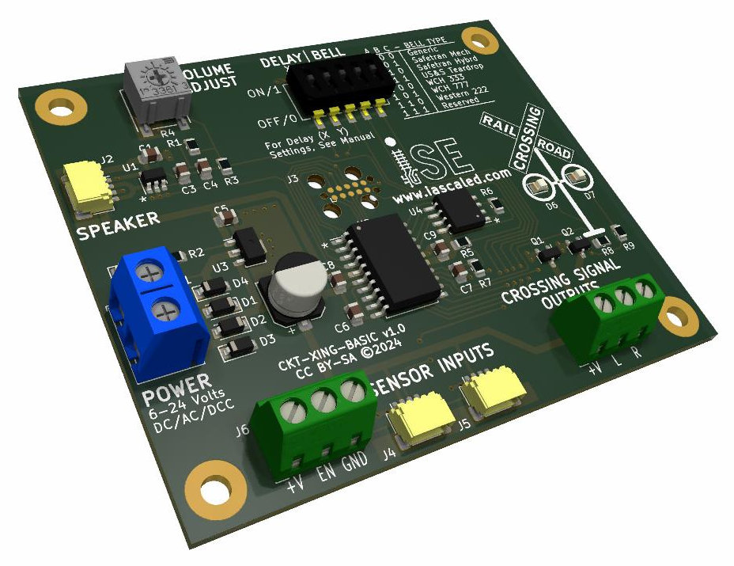
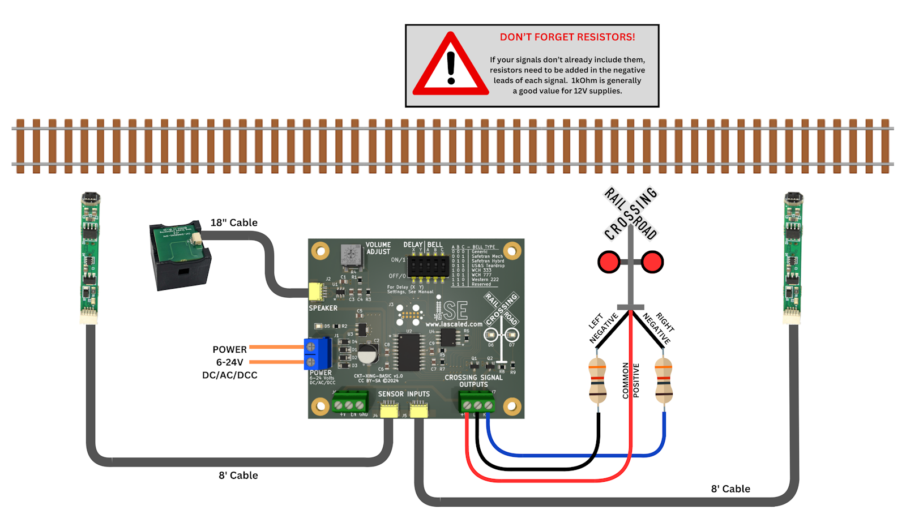

# RoadRead Basic Crossing Controller Manual (CKT-XING-BASIC v1.0)

## Overview

The RoadRead Basic Crossing Controller (CKT-XING-BASIC) is designed as a simple way to control model railroad grade crossing lights and provide a bell.  It includes two TrainSpotter optical detectors, and has a built-in SoundBytes crossing bell that includes all seven of our standard North American crossing bell sounds.  It will drive any number of common anode (common positive) LED crossing signals, the most common type found on the market today.  The crossing will start when one of the detectors senses something in front of it, and will continue for a selectable time after all sensors are again clear.

Additional TrainSpotter sensors can be connected for additional tracks, or for additional detection distance from the crossing.

Note:  This basic controller does not include any control for crossing gates, and does not implement approach sensors.

---

## Key Features
* Universal Power - works from 6V to 24V DC, AC, or DCC
* Works with common anode (common positive) LED grade crossing signals
* Seven different built-in crossing bell sounds
* Plug-and-play sensors and speaker connections - no fiddly terminal blocks!
* Configurable turn-off delay after sensors clear
* Easy expansion with additional sensors for more tracks
* Robust, protected signal output drivers will handle 1 amp of current

---

## Installation Guide

Step 1: Mount the module to the layout and connect power to the power terminal block.  6 to 24 volts of power is needed, but this can be DC, AC, or DCC.  The module itself will use up to 150 milliamps while playing sound, plus whatever power the LEDs in the signals draw.

Step 2: Using the 18 inch cable, connect the speaker cube and mount it somewhere near the crossing, as high frequency sounds like bells are easy for humans to locate.  If the speaker is mounted too far from the crossing itself, the bell sound will appear to be coming from the wrong place.  Double-sided tape works great for mounting.  

Step 3: Mount one TrainSpotter sensor on each side of the crossing.  The sensors should be located at the point where you want the crossing to start activating, based on your train speed and local layout conditions.  Use one eight foot cable with each sensor, plugging one end into the sensor itself, and the other into one of the "SENSOR INPUTS" connectors on the board.  It does not matter which sensor plugs into which jack.  

If you're not sure exactly when you want your crossing to trigger, you can leave the sensors unmounted initially and try them in different spots above the layout.  Just be very careful that none of the electronics touch anything metal or anything energized, like the track or other wiring, as this will damage the product.

Step 4: Crossing signals are available from a variety of vendors to match your prototype and budget.  Most signals available today are compatible with the board - they just need to be LEDs and wired as common anode (common positive).   All signals need current limiting resistors installed, if they're not already installed from the factory.  For typical ~12V power, a 1k resistor is recommended on each negative lead from each signal.  (Generally that means 2 - one on the left lights, one on the right lights.)  It can be done with a single 1k resistor on the common positive lead as well, but this will lead to some unevenness in the lights while they fade back and forth.

!!! note warning
    **The lack of current-limiting resistors will cause permanent damage to the LEDs in your crossing signals.  Make sure you have them installed!**

Connect the common anode (common positive) lead of your signals into the +V terminal of the "CROSSING SIGNAL OUTPUTS" terminal block.

Connect the left and right negative leads - *making sure you have resistors on your signals* - to the L and R terminals.  The exact orientation (left or right) is not important - they're just marked that way to help the user be consistent if so desired.  Some crossings are wired so that all lights blink in the same direction at once, whereas others are wired so that signals on opposite sides of the road blink opposite.  It's entirely up to you.

Step 5: Set switches A, B, and C to the bell sound you want for your crossing.  See [Configuration Options](#configuration-options).

Step 6: Set switches X and Y for the turn-off delay you want.  This is the time between when the sensors clear and when the crossing shuts down.  See [Configuration Options](#configuration-options).

Step 7: Place your hand in front of one of the sensors.  You should see the red light on the sensor stalk turn on, and the crossing should begin ringing and flashing lights back and forth.  Congratulations on a successful install!

---

## Wiring Diagram

---

## Configuration Options

The basic crossing controller has two configuration options:  how long the crossing will stay active after all the detectors are clear, and which bell should be used.  Switches X/Y configure the turn-off delay, and switches A/B/C configure which bell sound will be played.

| X | Y | Turn-off Delay |
|---|---|----------------|
| 0 | 0 | 0.5 seconds | 
| 0 | 1 | 2 seconds | 
| 1 | 0 | 5 seconds | 
| 1 | 1 | 10 seconds | 

| A | B | C | Bell Sound |
|---|---|---|----------------|
| 0 | 0 | 0 | Generic crossing bell | 
| 0 | 0 | 1 | Safetran Mechanical | 
| 0 | 1 | 0 | Safetran Hybrid | 
| 0 | 1 | 1 | US&S Teardrop | 
| 1 | 0 | 0 | Western Cullen Hayes 333 | 
| 1 | 0 | 1 | Western Cullen Hayes 777 | 
| 1 | 1 | 0 | Western Railroad Supply 222 | 
| 1 | 1 | 1 | Reserved / Do Not Use | 

---

## Open Source 

Iowa Scaled Engineering is committed to creating open designs that users are free to build, modify,
adapt, improve, and share with others.  

The design of the CKT-XING-BASIC hardware is open source hardware, and is made available under the
terms of the [Creative Commons Attribution-Share Alike v3.0 license](http://creativecommons.org/licenses/by-sa/3.0/).

The firmware for the CKT-XING-BASIC is free software: you can redistribute it and/or modify it under the terms of the GNU General Public License as published by the Free Software Foundation, either [version 3 of the  License](https://www.gnu.org/licenses/gpl.html), or any later version.

Design files can be found in the [ckt-xing](https://github.com/IowaScaledEngineering/ckt-xing) project on GitHub.
