# RoadReady Pro Crossing Controller {align=right style="height: 75px; margin-top:0px; margin-bottom: 0px"} User Manual

## Overview

The [RoadReady Pro Crossing Controller](https://www.iascaled.com/store/CKT-XING-ADV) (CKT-XING-ADV) is a more advanced and prototypical version of our [RoadReady Basic Crossing Controller](../Basic Crossing/manual.md). 

The Pro version of the controller keeps all the features of the Basic model, and adds the ability to have [approach circuit logic](../../Tips and Tricks/Articles/xing-basics.md#adding-approach-circuits) for up to two tracks and operate two or four quadrant gates.

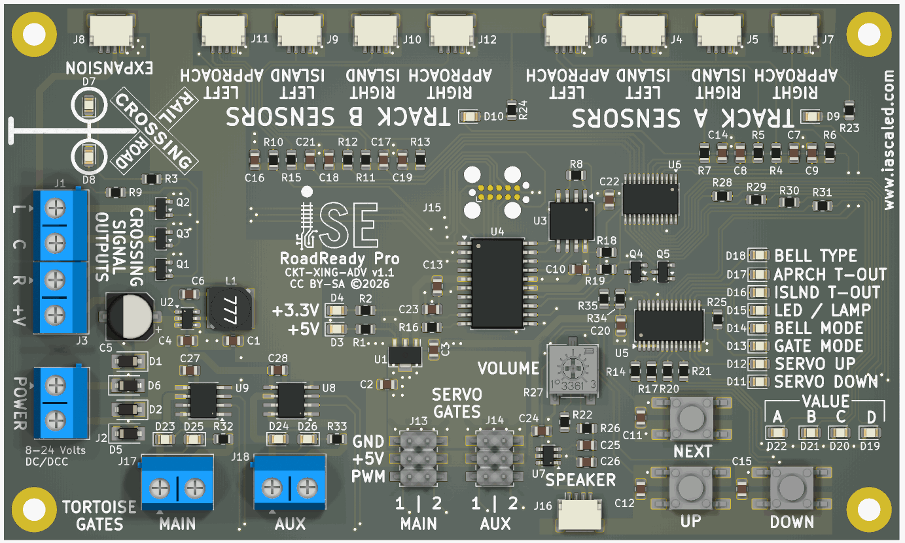

### Features

* Plug-and-play detectors and speaker connections - no fiddly terminal blocks!
* Rock solid TrainSpotter optical detection - works in any ambient lighting conditions
* Seven different built-in prototypical crossing bell sounds
* [Approach circuit logic](../../Tips and Tricks/Articles/xing-basics.md#adding-approach-circuits) for up to two tracks
* Crossing gate control using servos or motors for two-quadrant or four-quadrant gates
* Configurable approach and island timeouts
* Lamp or LED emulation for the crossing signals
* A constant output in addition to left/right flashers, active when the lights are on
* Easy expansion with additional detectors for an additional track
* Works with common anode (common positive) LED grade crossing signals
* Robust, protected signal output drivers will handle 1 amp of current
* Includes control board, four TrainSpotter optical detectors, cables, and speaker
* Expandable with four more TrainSpotters for a second track, or with a [Track Expansion Module](../Track Expansion Module/manual.md) for even more tracks.
* Universal Power - works from 8V to 24V DC or DCC

---

## Quick Start Guide

### Step 1 - Power

Mount the module to the layout and connect power to the power terminal block.  6 to 24 volts of power is needed, but this can be DC or DCC.  The module itself will use up to 150 milliamps while playing sound, plus whatever power the LEDs in the signals and motors/servos draw.

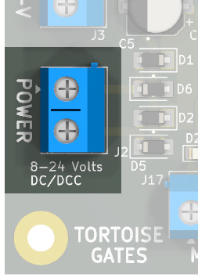

---

### Step 2 - Install Detectors

Each mainline track should have four detectors - left approach, left island, right island, and right approach.  Use one eight foot cable with each detector, plugging one end into the detector itself and the other into the RoadReady control board.

The sensors for the first track should be plugged into the "TRACK A SENSORS" connectors RoadReady Pro board.  If a second track is present, it will need four additional sensors and cables, sold separately, and should be plugged into the "TRACK B SENSORS" connectors.

Figuring out where to install the approach detectors will require some thought and probably experimentation.  Please see the [section on Approach Detector Placement](#approach-detector-placement) below.

This diagram shows how to attach the sensors for a single track.  Additional sensors for a second track are connected to "TRACK B SENSORS" connectors instead.

[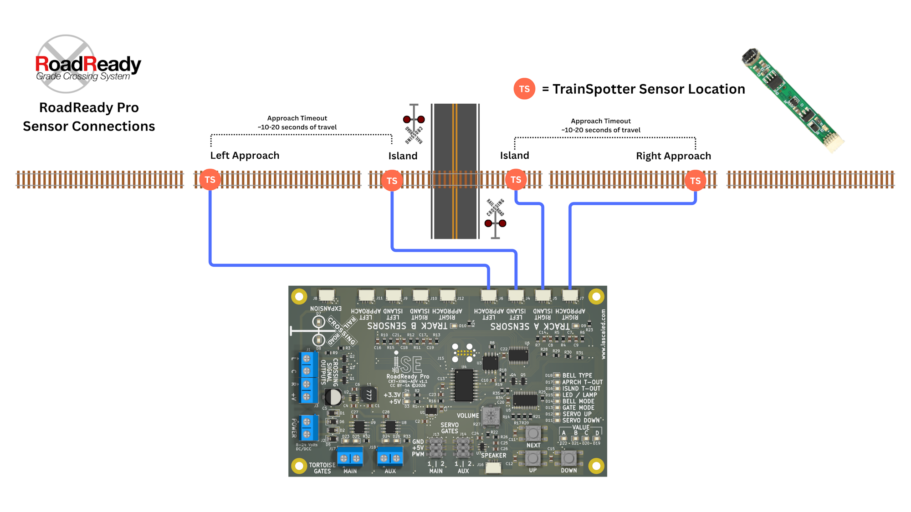](img/ckt-xing-adv-sensors-1t.png)

#### Step 2A - Island Detectors

The "island" is a section of track around the crossing where, if a train is present, the crossing should never deactivate.  Normally on the prototype this extends 50-100 feet from the edge of the road on each side.  

We recommend mounting the island sensors within a a couple inches of each side of the crossing, one on each side.  These get plugged in to the "LEFT ISLAND" and "RIGHT ISLAND" connectors for the appropriate track.

#### Step 2B - Approach Detectors

Mount one TrainSpotter detector on each side of the crossing.  The detectors should be located at the point where you want the crossing to start activating, based on your train speed and local layout conditions.

The approach sensors require some planning based on your layout and operating style.  See [Approach Detector Placement](#approach-detector-placement) for a more in-depth discussion about figuring out where to place them.

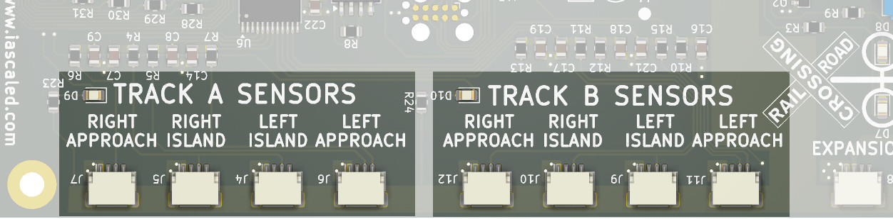

---

### Step 3 - Speaker

Using the 18-inch, four wire cable, connect the speaker cube to the SPEAKER output on the main board.  Mount it somewhere near the crossing, as high frequency sounds like bells are easy for humans to locate.  If the speaker is mounted too far from the crossing itself, the bell sound will appear to be coming from the wrong place.  Double-sided tape works great for mounting.  

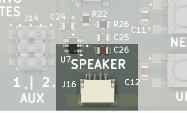

---

### Step 4 - Crossing Signals

Crossing signals are available from a variety of vendors to match your prototype and budget.  Most signals available today are compatible with the board - they just need to be LEDs and wired as common anode (common positive).  All signals need current limiting resistors installed, if they're not already installed from the factory.  

For typical ~12V power, a 1k resistor is the minimum recommended on each negative lead from each signal.  (Generally that means 2 - one on the left lights, one on the right lights.) It can be done with a single 1k resistor on the common positive lead as well, but this will lead to some unevenness in the lights while they fade back and forth.

Each signal needs its own resistors.  LEDs do not always share current evenly, and sharing a resistor between multiple signals may lead to very uneven lighting or failure to light.

!!! warning "Remember to Install Resistors"
    **The lack of current-limiting resistors will cause permanent damage to the LEDs in your crossing signals.  Make sure you have them installed!**

Connect the common anode (common positive) lead of your signals into the +V terminal of the "CROSSING SIGNAL OUTPUTS" terminal block.

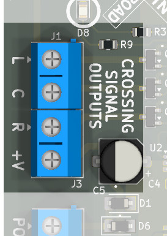

Connect the left and right negative leads - *making sure you have resistors on your signals* - to the L and R terminals.  The exact orientation (left or right) is not important - they're just marked that way to help the user be consistent if so desired.  Some crossings are wired so that all lights blink in the same direction at once, whereas others are wired so that signals on opposite sides of the road blink opposite.  It's entirely up to you.

[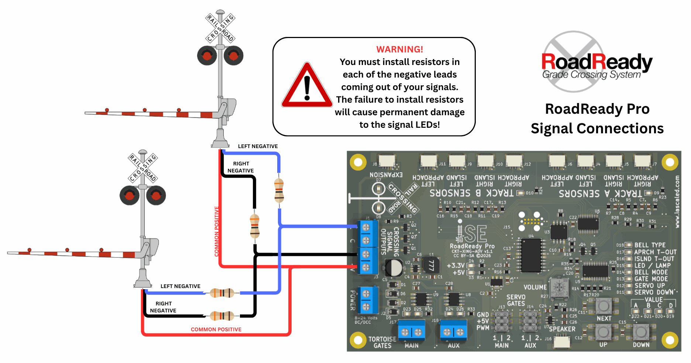](img/ckt-xing-adv-wiring.png)

---

### Step 5 - Crossing Gates

If your crossing doesn't have gates, you're already done with this step!  You can move right along to configuration.

Gates are a whole sub-topic of their own.  In an effort not to clutter up the Quick Start section, all the details about them are in the [Gate Setup](#gate-setup) section below.

Unfortunately there's almost nothing standard about making gates work in the model world.  Generally, approaches fall into two categories - Circuitron Tortoise or similar DC slow motion motors and RC car/aircraft (9G or SG90) hobby servos.  The RoadReady Pro supports both, or mix and match.

The MAIN GATES connections are used for two quadrant setups, and the main (entrance) gates on four quadrant setups.  The AUX GATES connections are used for the exit gates in four quadrant setups.

#### Step 5A - Tortoise-Type Motors

If you are using Tortoise or similar DC motors to drive the gates up and down, you will be connecting them to the MAIN GATES and AUX GATES 2-position terminal blocks.  Both drivers are good for 0.5 amps and are self-protecting in case of shorts.  

[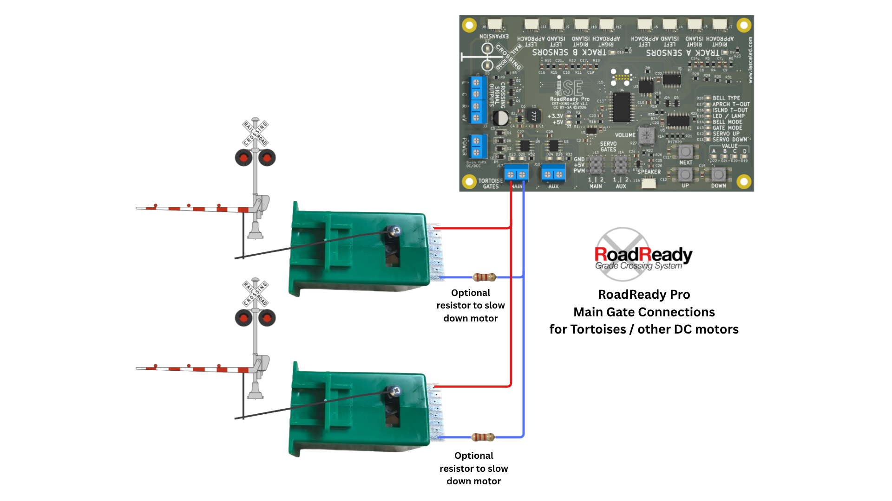](img/ckt-xing-adv-gate-motors.png)

The drivers use rectified DC voltage from the input.  That means it's only regulated by whatever power supply you're using.  If the Tortoises are moving too fast, you may need to add an optional series resistor in one leg of each gate motor, as shown in the diagram.  The value of this will vary based on power supply voltage and desired speed.

If the gates are reversed (they go up when they should come down, down when they should go up), reverse the wires connected to the motor.

#### Step 5B - Servo-Type Motors

If you are using 9G-type servos, one servo will attach to each set of header pins, with the negative/ground lead towards the top of the header (marked GND) and the signal wire towards the bottom (marked PWM).  Again, the two servos driving two quadrant gates or the main four quadrant gates connect to the MAIN GATES pins.  If installing four quadrant gates, the exit gate servos attach to the AUX GATES pins.

The servo drivers are set to take 3 seconds from the up to down position (or vice versa).

Servo cables are polarized, and you need to attach them correctly.  Usually they have a black or brown wire to indicate the negative power supply lead.  This should be on the pin towards the middle of the board, next to the **GND** label.

[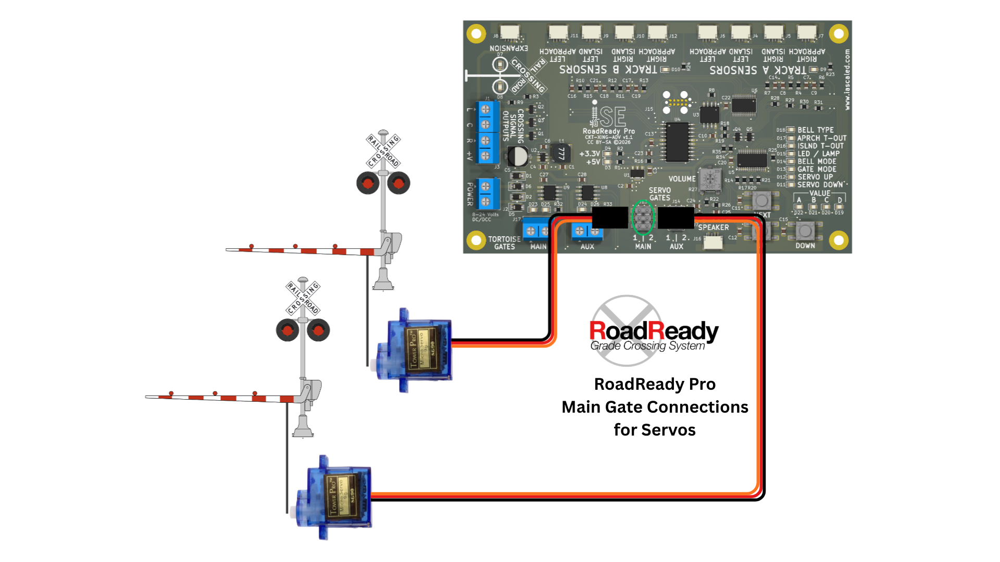](img/ckt-xing-adv-gate-servos.png)

!!! note warning Adjusting Servos
    By default, the servos start out with both the up and down positions set to the same value.  It is generally recommended that you leave one of them as set and then secure the gate mechanism after the board has had the chance to power up.   Then adjust the opposite end slowly, as servos can generate a lot of force and rip delicate signal mechanisms apart.

---

### Step 6 - Configuration

Because the RoadReady Pro has so many options, there's a whole [Configuration](#configuration) section devoted to them.

The defaults are generally reasonable to power up with the first time.  After you get the hardware working, you'll almost certainly want to set up your [bell type](#bell-type), [gate configuration](#gate-mode), and [approach](#approach-timeout) and [island](#island-timeout) timeouts based on your specific configuration.

---

### Step 7 - Testing

Place your hand in front of one of the detectors.  You should see the red light on the
detector stalk turn on, and the crossing should begin ringing and flashing lights back and forth.  Congratulations on a successful install!

---

## General Operation

When a train triggers an approach detector, the track is marked "active".  At that point, the train must reach one of the island detectors within the Approach Timeout.  If it does, the track remains active until the island detectors are all clear and the island timeout expires.  If it does not, the track times out and becomes inactive once again.  If any island detector triggers, regardless of approach detectors, the track will be considered active.

If any track becomes active, the crossing starts.  Lights and the bell will start immediately.  Gates will begin to drop 2 seconds after the crossing activates, unless "Gate Mode" is set to one of the "no activation delay" modes.

The crossing will remain activated until all tracks are inactive.  Once all tracks are inactive, the gates will start to rise, and 2 seconds later, the lights and bells will turn off.

---

## Configuration 

All configuration of the RailReady Pro is done using the three buttons and array of LEDs on the right side of the board.

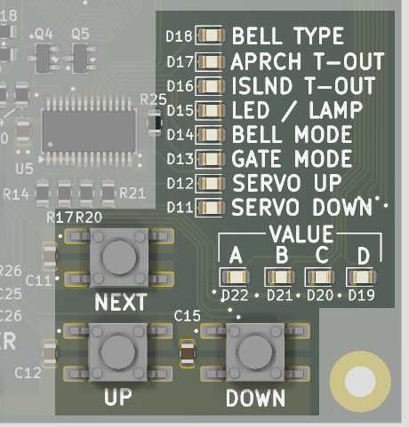

To enter configuration mode, hold down the **NEXT** key.  After approximately 2 seconds, the blue **BELL TYPE** light will illuminate.

Within configuration mode, you will use the **NEXT** button to select the item you are configuring - as indicated by the blue lights - and the **UP** and **DOWN** buttons to change the value, as indicated by the amber lights.

To exit configuration mode, again hold down the **NEXT** key until all of the blue/amber configuration LEDs go out.

Note:  While the RoadReady Pro is in configuration mode, it will disable the lights, bell, and gates, and not respond to sensor inputs.

### Bell Type

The RoadReady Pro includes seven common railroad crossing bell recordings.  This allows you to choose which one plays when the crossing activates.

If your crossing uses gates, it's possible to set if the bell plays continuously or if only while the gates are lowering.  To set this, see the [Bell Mode](#bell-mode) configuration setting.

| Value | Bell Type |
|-------|----------------|
| 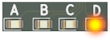 | Generic crossing bell *(default)* | 
| 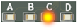 | Safetran Mechanical | 
| 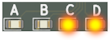 | Safetran Hybrid | 
| 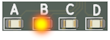 | US&S Teardrop | 
|  | Western Cullen Hayes 333 | 
| 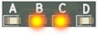 | Western Cullen Hayes 777 | 
| 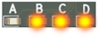 | Western Railroad Supply 222 | 

### Approach Timeout

| Value | Approach Timeout |
|-------|----------------|
|  | 5 seconds | 
|  | 7.5 seconds | 
|  | 10 seconds | 
|  | 12.5 seconds | 
|  | 15 seconds *(default)*| 
|  | 17.5 seconds | 
|  | 20 seconds | 
| 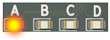 | 22.5 seconds | 
| 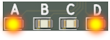 | 25 seconds | 
| 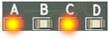 | 27.5 seconds | 
| 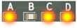 | 30 seconds | 
| 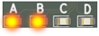 | 32.5 seconds | 
| 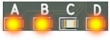 | 35 seconds | 
| 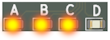 | 37.5 seconds | 
| 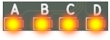 | 40 seconds | 

### Island Timeout

| Value | Island Timeout |
|-------|----------------|
|  | 0.5 seconds | 
|  | 1 seconds | 
|  | 1.5 seconds | 
|  | 2 seconds *(default)* | 
|  | 2.5 seconds | 
|  | 3 seconds | 
|  | 3.5 seconds | 
|  | 4 seconds | 
|  | 4.5 seconds | 
|  | 5 seconds | 
|  | 6 seconds | 
|  | 7 seconds | 
|  | 8 seconds | 
|  | 10 seconds | 
|  | 15 seconds | 

### LED or Lamp

| Value | Light |
|-------|----------------|
|  | Lamp Emulation (fading) *(default)* | 
|  | LED Emulation (quick on-off) | 

### Bell Mode

| Value | Bell Mode |
|-------|----------------|
|  | Bell always on when crossing active *(default)* | 
|  | Bell only active until gates drop | 

### Gate Mode

| Value | Bell Mode |
|-------|----------------|
|  | No Gates - Lights & Bell Only | 
|  | 2 Quadrant Gates, 2s activation delay *(default)* | 
|  | 2 Quadrant Gates, no activation delay | 
|  | 4 Quadrant Gates, 2s activation delay, simultaneous rise | 
|  | 4 Quadrant Gates, 2s activation delay, delayed aux rise | 

### Servo Up & Down Position

Once you reach the **SERVO UP** and **SERVO DOWN** configuration settings, there are four positions to adjust.  Because there are four servos, pushing the **NEXT** button increments through each servo.  The **VALUE** lights show you which servo is currently being adjusted.

If you are not using servos, there is no need to adjust anything in **SERVO UP** or **SERVO DOWN**.

**SERVO UP** represents the servo position when the crossing is deactivated.  

**SERVO DOWN** represents the servo position when the crossing is deactivated.  

For each one, use the UP and DOWN buttons to adjust the servo position until you're happy with where it is sitting.  

| Value | Servo Adjusted | Value | Servo Adjusted |
|-------|----------------|-------|----------------|
|  | Main 1 |  | Main 2 | 
|  | Aux 1 |  | Aux 2 | 

### Factory Reset

If you get things completely messed up and want to start over, the board can be reset to factory defaults.  Hold down the NEXT and DOWN buttons at the same time for approximately 2 seconds.  Instead of normal configuration mode, which lights the BELL TYPE light, factory reset mode will like the blue SERVO DOWN light.  Once that lights, release the two buttons.  Then press and hold the UP button and the amber A/B/C/D value LEDs will begin to light.  When all four are lit in approximately 2 seconds, the board will reset to defaults and restart.  If you release the UP button before it resets, nothing will happen.

If you get into factory reset mode and DO NOT want to reset it, just hold the NEXT button for a couple seconds until all the blue configuration LEDs go out and you're back to normal operation.

---

## Diagnostics

### Track Status 

Each track has an amber "Track Status" LED next to the text.

This light gives you a clue what the track and sensor logic is doing.

Normally, if the track is idle and waiting for a train, the LED will be off.

Once a train triggers an approach sensor, the LED will begin blinking rapidly - about 2 times a second.  That means the crossing is waiting for the Approach Timeout for the train to reach one of the island detectors.

Once the train enters the island, the LED will go solid on.  It will remain on until the island detectors are both not detecting and the Island Timeout has expired.

The LED will go to a slow blink once the train leaves the island, indicating that the opposing approach is locked out and will not retrigger as an approach.

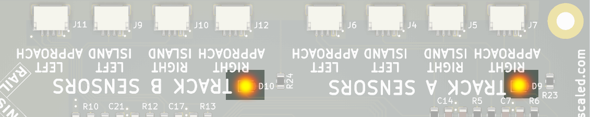

---

## Approach Detector Placement

As their name suggests, approach detectors sense when a train is approaching the crossing.  This causes the crossing to start the crossing lights, bell, and (if installed) gates.  However, if the train never reaches the island detectors or takes too long, the crossing will "time out" and allow road traffic to move again.

On the prototype here in the US, the lights must be on for at least 20 seconds before the train reaches the crossing.  Gates must be horizontal no later than 5 seconds before the crossing is occupied, and must take between 10-15 seconds to lower.  In addition, time will be added to allow for areas with high traffic needing a chance to clear, or high road speeds approaching the crossing that may need more time to stop.  

Because of distance compression on our layouts, 25-30 seconds from the time the train trips an approach sensor to when it reaches the crossing is often far too long.  As a suggestion, I would try for 10-15 seconds, but individual preference may vary.  

Here's a speed chart of how far a train in all the common scales moves in one second.  Based on your railroad's scale and how fast you typically run, you can use this to get a rough idea of how far the approach detectors should be from your crossing.

[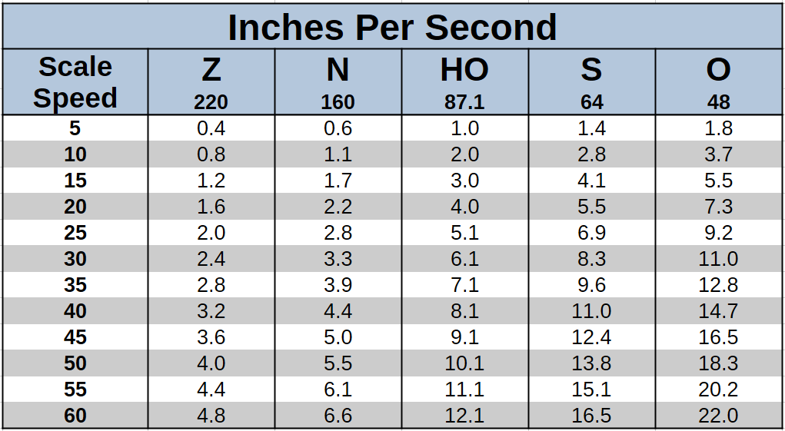](img/scale-speed-chart.png)

As an example, on my N scale layout, road trains typically move at 30mph.  So if I was going to go for 12 second approach timings, I would multiply 3.3 inches per second (30 scale mph) by 12 seconds and get 39.6 inches.  That distance isn't a hard and fast rule.   On one side I have a switch in the siding at that distance, so I moved it in by a couple inches and it's only 37 inches out.  Close enough for a model.

If you're not sure exactly when you want your crossing to trigger, you can leave the detectors unmounted initially and try them in different spots above the layout.  Taping them to a small block of wood is often a good way to do this.  Just be very careful that none of the electronics touch anything metal or anything energized, such as the track or other wiring, as this will damage the product.

---

## Gate Setup

The RoadReady Pro supports both two quadrant and four quadrant style gates.  

Two quadrant are far more common, and are the type that nearly everybody is familiar with.  These have a single gate on each side that comes down across the lane entering the crossing.  

[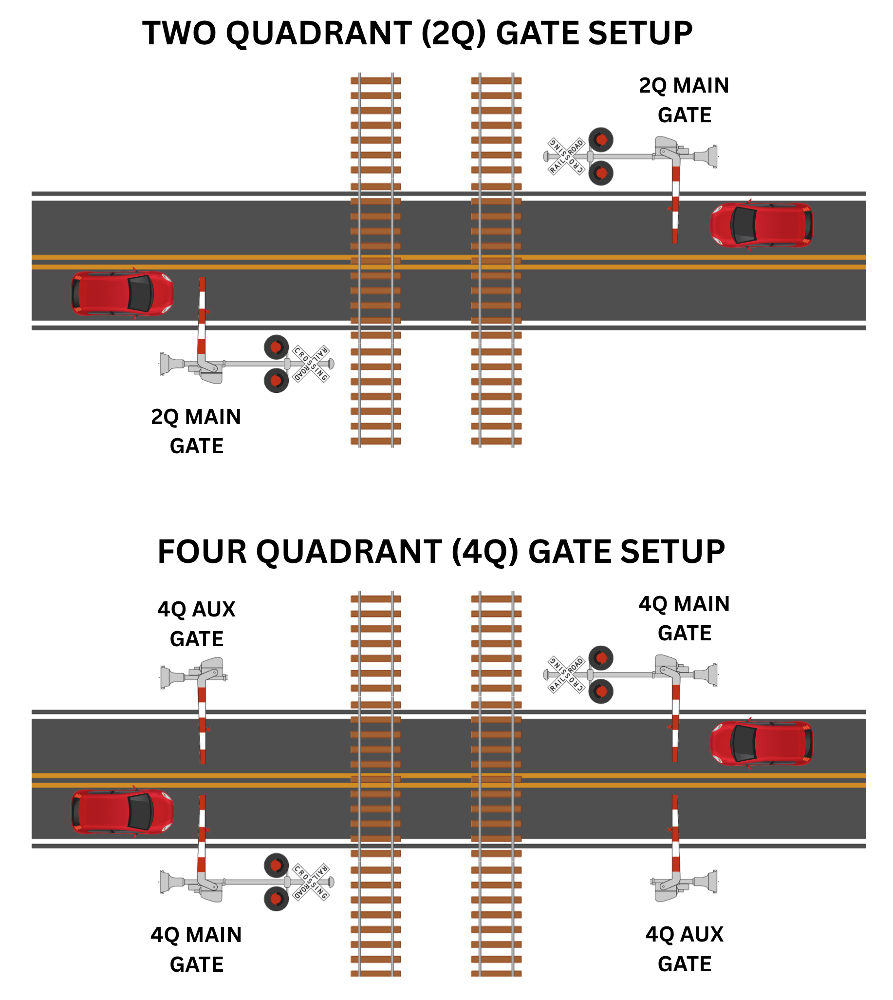](img/ckt-xing-adv-gate-2Q4Q.png)

Four-quadrant gates are newer, and are used in quiet zones and on high speed lines.  These have a main set of gates that close off the lanes entering the crossing, which are followed by a second auxilliary set of gates that close off the lanes exiting the crossing.  The main gates drop first, and after allowing traffic to clear the track area, the second set of gates drop to prevent traffic driving around the gates and on to the track.

---

## Additional Tracks

A second track can be added to the RoadReady Pro by adding four more sensors, available as the RoadReady Sensor Kit.

If you need more than two tracks, multiple [Track Expansion Modules](../Track%20Expansion%20Module/manual.md) can be attached to the Expansion port on the RoadReady Pro.

These can be full tracks with full approach logic and using four sensors, or just island-only tracks (such as an industry track/tracks running alongside mainlines through a crossing) using two sensors.

[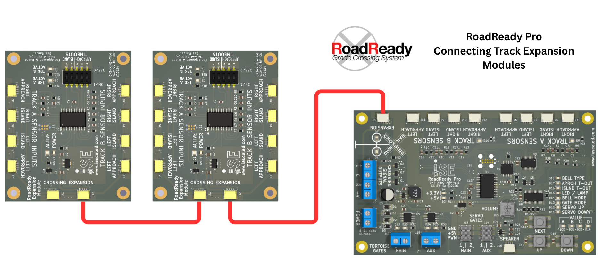](img/ckt-xing-adv-extrainputs.jpg)

---

## Open Source 

Iowa Scaled Engineering is committed to creating open designs that users are free to build, modify,
adapt, improve, and share with others.  

The design of the CKT-XING-BASIC hardware is open source hardware, and is made available under the
terms of the [Creative Commons Attribution-Share Alike v3.0 license](http://creativecommons.org/licenses/by-sa/3.0/).

The firmware for the CKT-XING-BASIC is free software: you can redistribute it and/or modify it under the terms of the GNU General Public License as published by the Free Software Foundation, either [version 3 of the  License](https://www.gnu.org/licenses/gpl.html), or any later version.

Design files can be found in the [ckt-xing](https://github.com/IowaScaledEngineering/ckt-xing) project on GitHub.
