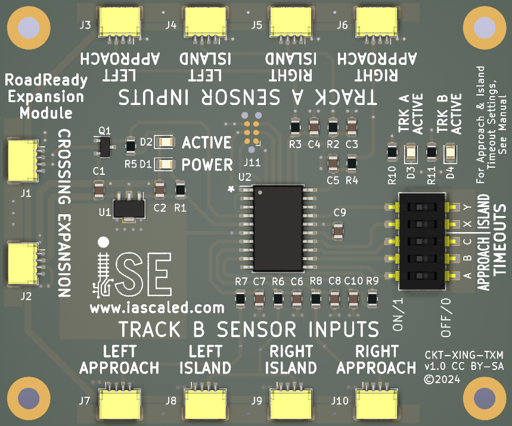
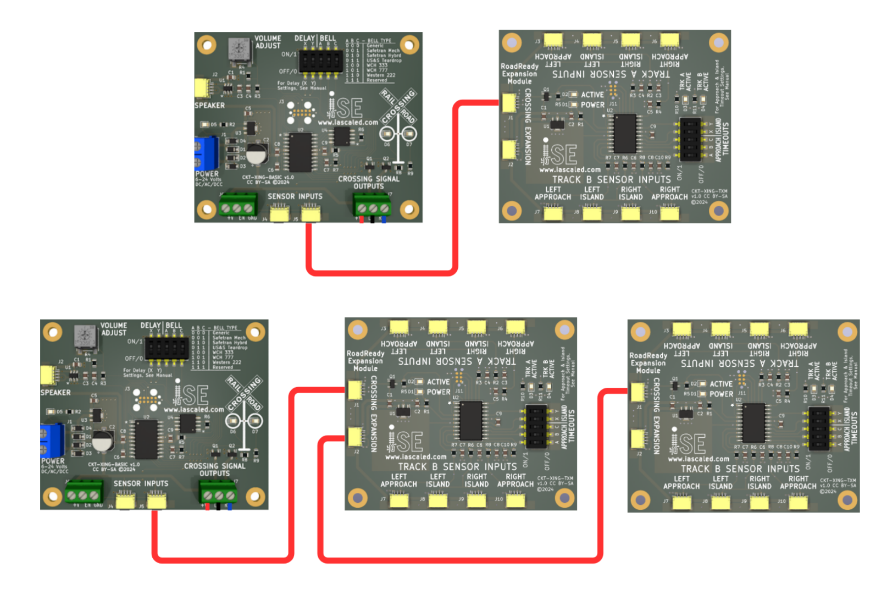
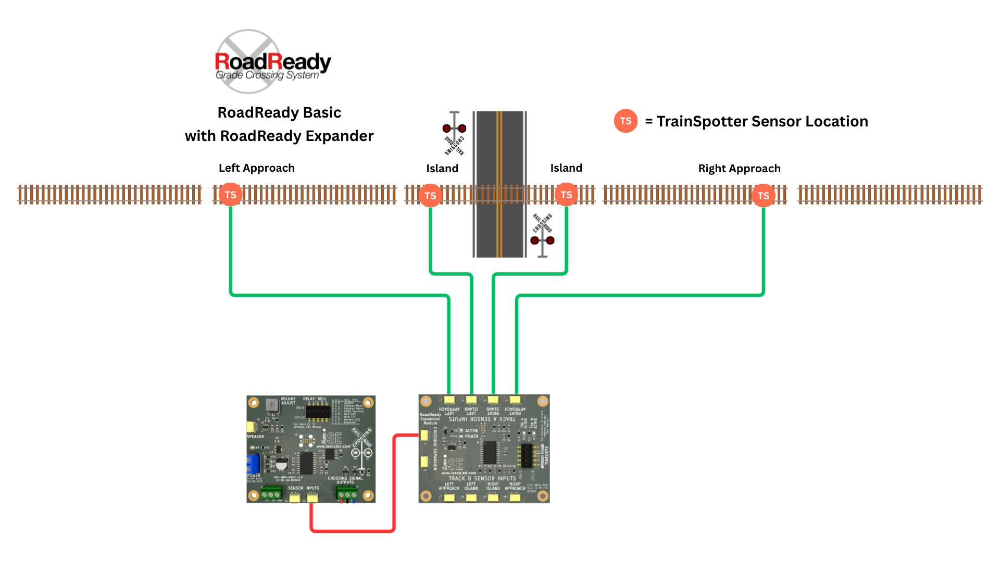
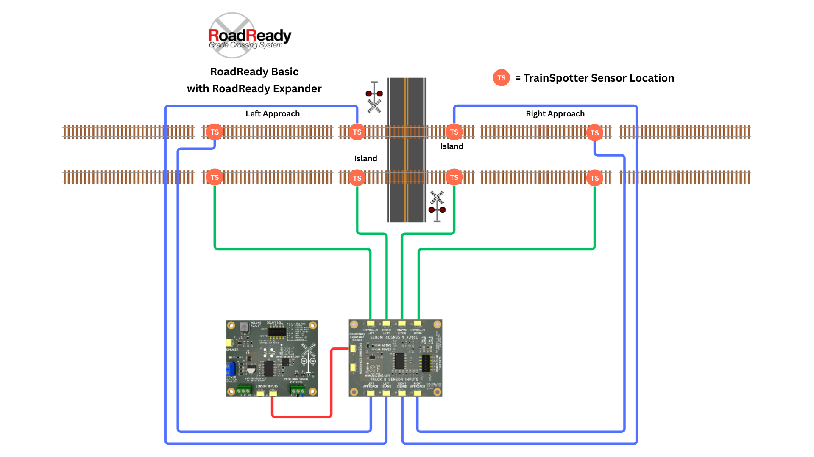
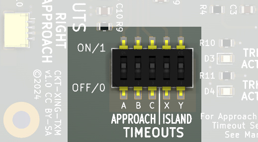
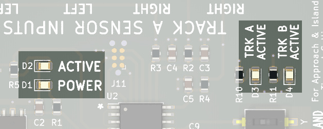

# RoadReady Track Expansion Module {align=right style="height: 75px; margin-top:0px; margin-bottom: 0px"} User Manual

## Overview

The [RoadReady Expansion Module](https://www.iascaled.com/store/CKT-XING-TXM) (CKT-XING-TXM) adds support for one or two additional tracks with full approach logic. It is compatible 
with both the RoadReady Basic and the RoadReady Pro.  For supporting even more tracks, RoadReady Expansion Modules can be chained together for an unlimited number of tracks.

!!! note info
    If you just want to add more "island" detectors to a RoadReady Basic, you do not need an Expansion Module.  All you need to do is add additional TrainSpotters as described in the [section of the manual](../../Basic Crossing/manual/#additional-detectors).

### Features

* Indepedent approach logic for one or two tracks
* Plug-and-play detector connections - no fiddly terminal blocks!
* Rock solid TrainSpotter optical detection - works in any ambient lighting conditions
* Configurable approach timeout
* Configurable turn-off delay after detectors clear
* Can be chained together for unlimited additional tracks
* Includes control board, four (4) TrainSpotter optical detectors, and wires
* Compatible with RoadReady Basic and Pro

---

## Quick Start Guide

### Step 1 - Uplink

Mount the module to the layout and connect the 4-wire cable from either of the "Crossing Expansion" ports to the RoadReady crossing module.  The two ports are the same and connected together - either will do.

Connect the cable to:

* For the RoadReady Basic, either of the "Sensor Input" ports
* For the RoadReady Advanced, the "Crossing Expansion" port
* For another Expansion module, it can be daisy-chained through the "Crossing Expansion" port

### Step 2 - Detectors

Each track will need four TrainSpotters - two for the approach circuits, and two for the island circuit.  If only installing sensors on a single track, please use the "Track A" inputs.  If installing sensors on two tracks, just make sure that all sensors from the first track go into A and all from the second go into B.

For the approach sensors, mount one TrainSpotter detector on each side of the crossing at the point where you want the crossing to start activating, based on your train speed and local layout conditions.  The prototype would be at a point 20-25 seconds from the crossing.  However, many modelers find that something a bit shorter, such as 8-12 seconds, is better given the compression of distances on our layouts.  Use one eight foot cable with each detector, plugging one end into the detector itself, and the other into one of the LEFT or RIGHT APPROACH connectors on the board as appropriate.

For the island sensors, mount one TrainSpotter detector on each side very near crossing, where if a train were present, the crossing should always be active.]Use one eight foot cable with each detector, plugging one end into the detector itself, and the other into one of the LEFT or RIGHT ISLAND connectors on the board as appropriate.

The sensor wires can be cut and lengthened if necessary.  There is no practical maximum length, however, please avoid routing them together with DCC or AC wires, as that may couple excessive noise into the sensor leads.

**Single Track Connections**

**Double Track Connections**

If you're not sure exactly when you want your crossing to trigger, you can leave the detectors unmounted initially and try them in different spots above the layout.  Just be very careful that none of the electronics touch anything metal or anything energized, like the track or other wiring, as this will damage the product.  I also find that a stopwatch is helpful in finding how far your trains travel at the speeds you prefer to operate.

### Step 3 - Configuration

You'll next need to configure the two timeouts.  The first - set by switches X/Y - sets how long the island stays "active" even after all island sensors have cleared.  The second - set by switches A/B/C - determines how long a train has to reach the island sensor from the approach sensor before the crossing will time out.  More information can be found in the [Configuration Options](#configuration-options) section.

### Step 4 - Testing

Verify that when the power comes on that the green "POWER" LED illuminates.

Place your hand in front of one of the island sensors.  Verify that the crossing activates and then stops after your hand is removed and the island timeout selected above runs out.  Repeat this for each of the island sensors.

If that works, wait for the crossing to go off.  Then wave your hand in front of one of the approach sensors.  Verify that the crossing activates and then times out after the approach timeout selected above.  Repeat this for each of the approach sensors.

If those all work, then all of your sensors are connected and functioning.  Congratulations, enjoy your upgraded crossing!

---

## Configuration Options

**Island Timeout**

The "Island Timeout" is the time that the crossing will remain active after all island sensors are clear.

| X | Y | Island Delay |
|---|---|----------------|
| 0 | 0 | 0.5 seconds | 
| 0 | 1 | 2 seconds | 
| 1 | 0 | 5 seconds | 
| 1 | 1 | 10 seconds | 

**Approach Timeout**

The "Approach Timeout" is the time that a train has from tripping an approach sensor to reaching the island.  If the train does not reach an island sensor within the configured time, the crossing will time out and turn off.

| A | B | C | Approach Timeout |
|---|---|---|----------------|
| 0 | 0 | 0 | 20 seconds | 
| 0 | 0 | 1 | 25 seconds | 
| 0 | 1 | 0 | 30 seconds | 
| 0 | 1 | 1 | 35 seconds | 
| 1 | 0 | 0 | 40 seconds | 
| 1 | 0 | 1 | 50 seconds | 
| 1 | 1 | 0 | 60 seconds | 
| 1 | 1 | 1 | Reserved (do not use)  | 

!!! note info
    The opposite approach sensor is locked out for 5 seconds more than the approach timeout.  For example, if a train approaches from the left and triggers the approach sensor and the approach timeout is set to 25 seconds, the train has 25 seconds to reach the island or the crossing will time out.  If it makes the crossing, it then has 30 seconds to reach the right approach sensor and not retrigger the crossing.

---

## Diagnostic LEDs

The board includes several LEDs to help figure out what's going on when something confusing happens.

The green "POWER" LED indicates that the board is receiving power from its upstream link.  If this isn't on, then either your crossing board isn't receiving power or the connection to the expansion board isn't plugged in correctly.

The red "ACTIVE" LED indicates that this board is sending the signal to activate the crossing.  This can be helpful if you can't figure out why your crossing is on.

Addditionally, there are two yellow LEDs on the board that show how the Track Expansion Module sees the state of each track, marked "TRK A ACTIVE" and "TRK B ACTIVE".

* OFF = Track is idle and waiting for a train
* SOLID = Island occupied, crossing active
* FAST BLINK = Train triggered approach sensor but has not yet reached island.  Still within the approach timeout, so the crossing remains active.
* SLOW SINGLE BLINK = Train has cleared the island and opposing approach sensor is locked out
* SLOW DOUBLE BLINK = Train has cleared the island and tripped the opposing (exit) approach sensor, but that sensor is locked out so it won't activate the crossing.

---

## Open Source 

Iowa Scaled Engineering is committed to creating open designs that users are free to build, modify,
adapt, improve, and share with others.  

The design of the CKT-XING-BASIC hardware is open source hardware, and is made available under the
terms of the [Creative Commons Attribution-Share Alike v3.0 license](http://creativecommons.org/licenses/by-sa/3.0/).

The firmware for the CKT-XING-BASIC is free software: you can redistribute it and/or modify it under the terms of the GNU General Public License as published by the Free Software Foundation, either [version 3 of the  License](https://www.gnu.org/licenses/gpl.html), or any later version.

Design files can be found in the [ckt-xing](https://github.com/IowaScaledEngineering/ckt-xing) project on GitHub.
