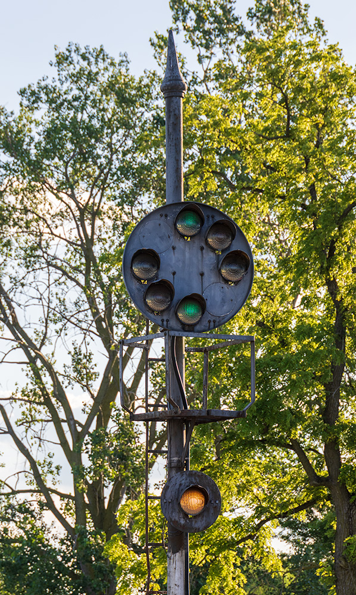
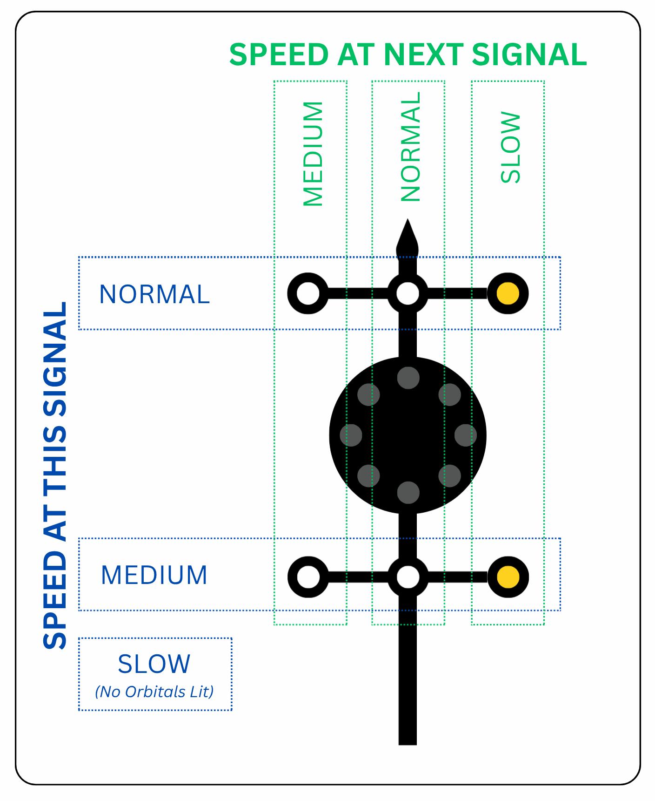
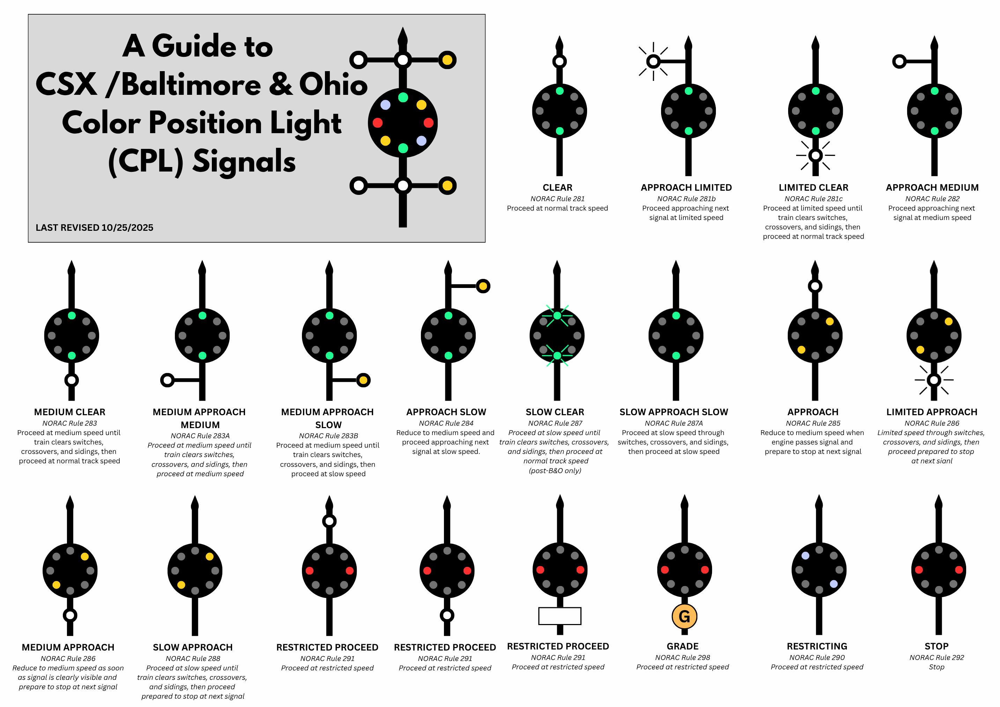
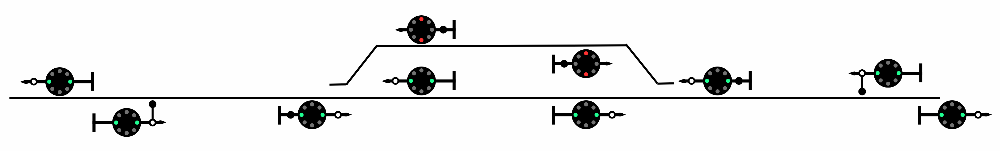
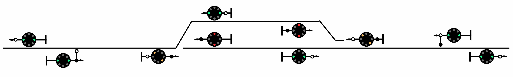
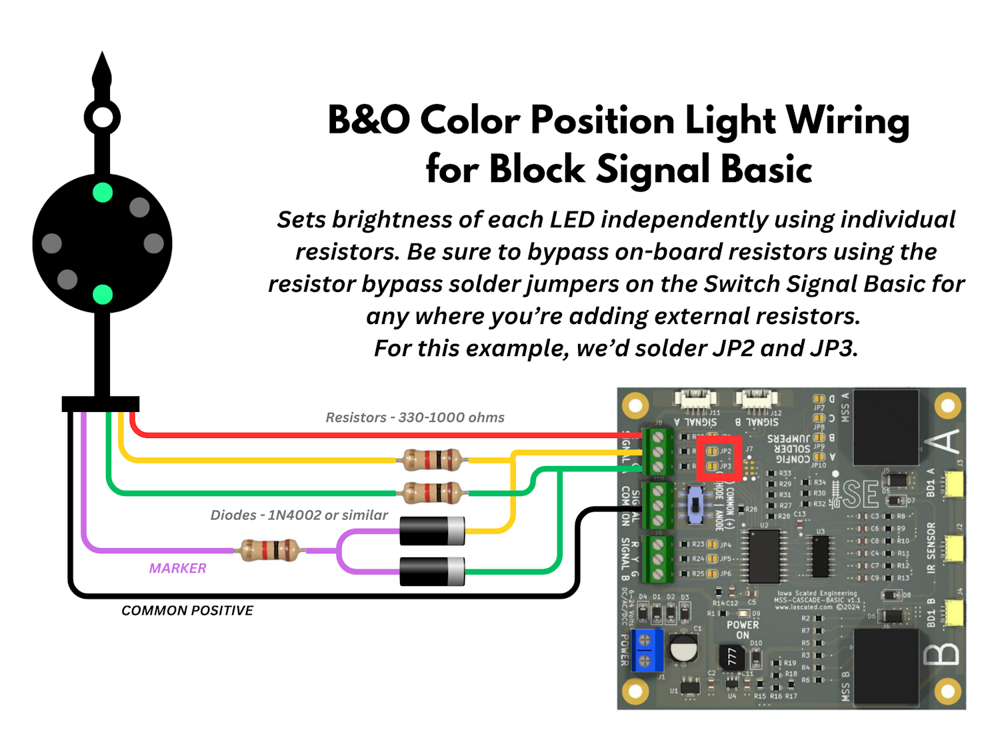
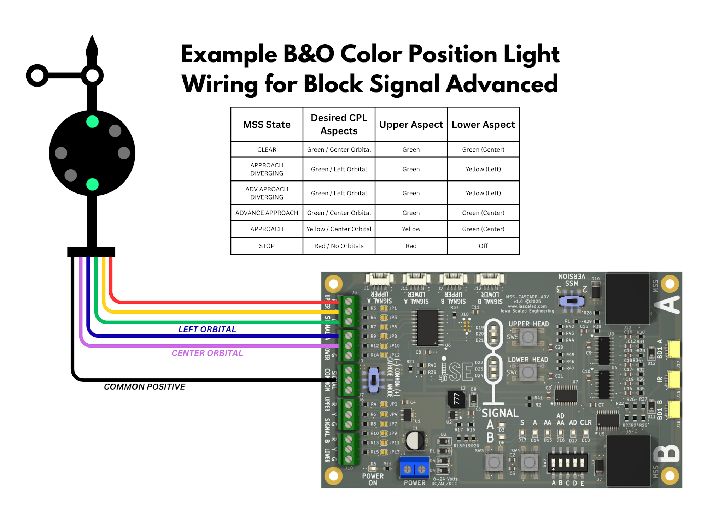
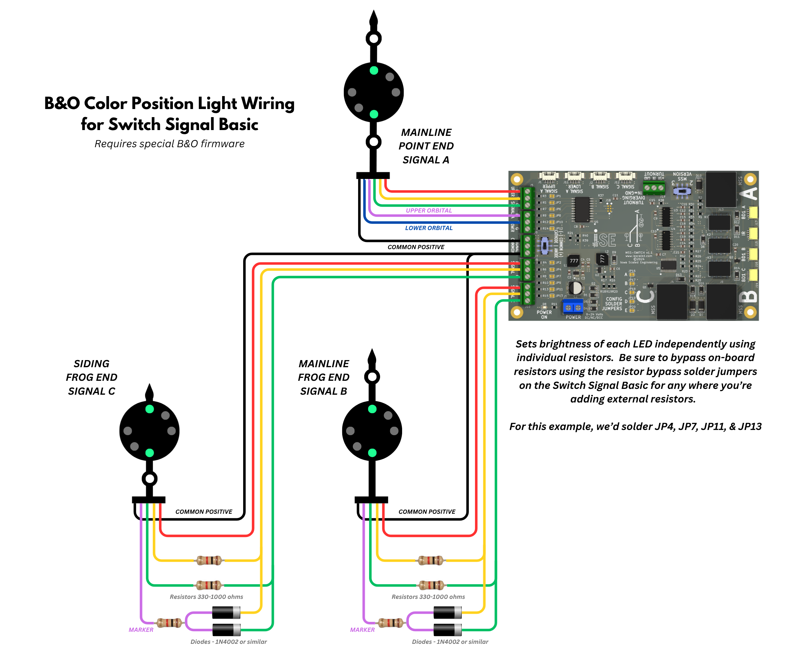
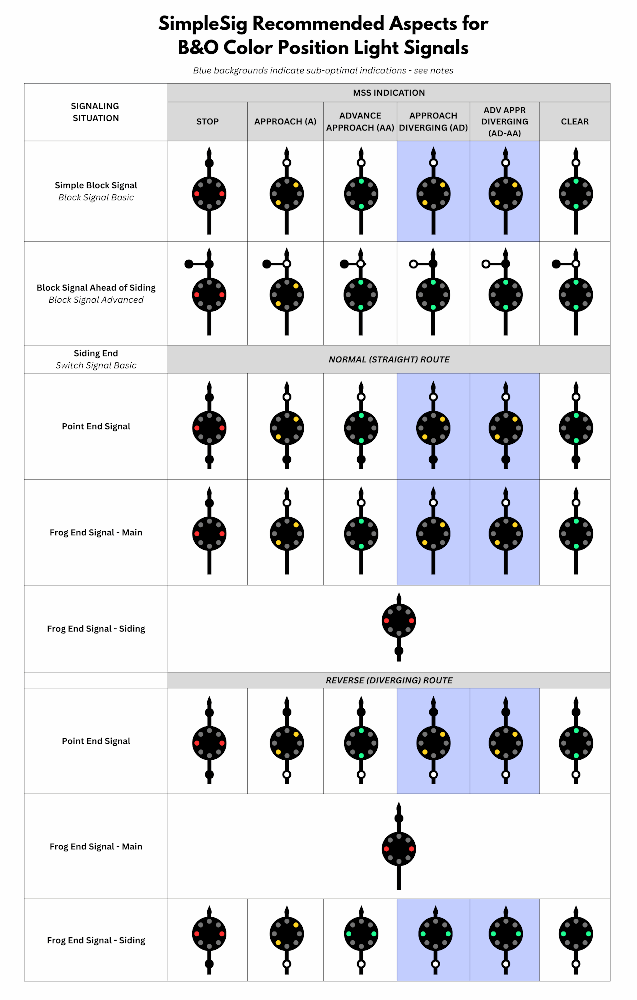

# SimpleSig and B&O Color Position Lights

## Overview

[{ align="right" width="300"}](img-bocpl/bo-cpl.jpg)

Western US and Canadian railroads tended to use fairly consistent signaling.  The individual indications for a road might be a little different from the next, but the actual signal technology was relatively common among them - one to three signal heads on a mast, each displaying a color, and the stack-up of colors translated into a rule the crew needed to follow.  

However, the eastern US brought forth three unusual systems, each of which used heads with multiple lights on and around a target, known as a "position light signal" for obvious reasons.  Multiple lights were arranged vertically, horizontally, or on diagonals to emulate the physical orientation of semaphore blades they were intended to replace.  Multiple lamps forming up a single aspect also provided redundancy in an era where bulbs were relatively dim and had short operational lives.

The first of these position light signals came from the Pennsylvania in 1915, who was searching for an improvement from the semaphores that were state-of-the-art in that era.  By the time the Baltimore & Ohio developed their own in 1924, mutliple competing systems were already in use - the Pennsy's position lights, the "searchlight" style signals from GRS and US&S that used a single bulb and a mechanism, and the three color light signals like the GRS Type D where each aspect had its own bulb.  The B&O meshed the idea of colored lights and their position on the head into something that would be known as a "Color Position Light" or CPL.

Being the last major system developed, the CPL system was the best considered and easiest to understand (at least in the author's opinion).  It felt engineered to the task and stood the test of decades of use with little change, as opposed to other signal systems which kept sprouting more heads and had new combinations of aspects tacked on to tackle unanticipated problems.  The CPL system communicated both the clear blocks ahead and speed expectations to the crew in a single signal head, and could handle everything from simple single track to complex interlockings with all manner of crossovers and diverging routes.

B&O color position lights stretched across the B&O system, from New York to Chicago and St. Louis.  Some even found their way on to other railroads.  The B&O controlled the Chicago & Alton from 1931 to 1947, and as such applied their own engineering standards.  CPLs were installed along the route from Chicago to St. Louis, and as the line changed hands over the years, the signals worked their way on to subsequent owners - GM&O, Illinois Central, Southern Pacific, and finally Union Pacific.  

Today, only a very small number of these amazing signals remain.  Those that survive in service are largely scattered around Ohio, with a few more survivors across southern Indiana.  Nearly all of them have been upgraded to modern color light signals, with one or more of the familiar 3-light vertical heads stacked on a mast.  The few that remain are certainly on borrowed time, so if you see one, appreciate it while you can!

## The Prototype

The B&O CPL consists of a single head, and that head may be surrounded by up to six marker lights, sometimes called orbitals.  Once you understand the pattern of the markers, their meaning becomes clear and easy-to-read.

### The Main Target

The main target shows how many blocks ahead are safe to occupy.  The B&O system is purely a three indication system, meaning you have one block of warning before a stop indication.  It didn't use any sort of equivalent for "advance approach" for a second block of warning.  There is a medium clear - an aspect commonly used as a second block of warning on eastern US roads - but the best I can tell, the B&O didn't use it that way.  

Two red lights arranged horizontally means stop, the next block is not clear.  Two yellow lights on a diagonal from lower left to upper right means one block ahead is clear to occupy.  Two green lights vertically means that two or more blocks ahead are clear.  

Some signals include a second diagonal aspect using lunar lights from upper left to lower right to indicate restricting - pass signal prepared to stop in half your sight distance, because an unknown amount of track ahead is clear.  This would be used when exiting signaled track, such as entering a yard or unsignaled branch.

### The Marker Lights

[{ align="right" width="300"}](img-bocpl/bo-cpl-orbitals.png)

The six marker lights around the outside - sometimes called orbitals - communicate speed information.  They form sort of a grid, and what light on that grid is illuminated indicates what your speed should be passing this signal, and what speed you should be at when passing then next signal. The two markers aligned with the mast and the two to the left are all clear lenses (not lunar), meaning they show up with the warm white glow of an incandescent bulb.  The two to the right of the mast, if present, have yellow lenses.  Signals will generally only have the markers they need, and omit any that aren't used.  Finding a signal with all six installed was rare, and only occurred at large, complex junctions.

The speed you should be at passing the current signal is indicated by the vertical position.  Anything lit in the top row above the main signal head means pass this signal at normal speed, whatever that might be for the track and train.  Anything lit in the bottom row below the signal head means this signal should be passed at medium speed (less than 30 mph).  If no markers are lit at all, the train needs to pass the signal at slow speed (usually 15 mph) and stay at slow speed until a signal down the line upgrades that.

The speed you should be at by the time you pass the next signal is indicated by which column you're in vertically.  If the marker is aligned with the mast, then you may be at normal speed passing the next signal.  If the marker is to the left of the mast, you need to be at medium speed passing the next signal.  If the marker is to the right of the mast and yellow (instead of a clear lens), the train needs to be at slow speed by the next signal.

Later on, the system was augmented to add a few flashing markers to upgrade medium speed to limited speed (generally 45 mph).  These are either in the upper left (normal speed now, limited speed next) or lower center (medium speed now, limited speed next) positions.  Likewise, a yellow triangular square plate could be added to upgrade a solid marker to indicate the same thing.

The markers are generally related to track configuration and what sort of route has been selected.  They generally don't concern themselves with occupancy.  The only exception to that is that they get extinguished for stop indications, as otherwise they become a (permissive) restricting signal.  

For example, a normal block signal away from any turnouts, siding ends, etc. will likely only have a center high marker, indicating that a train may pass any permissive aspect at prescribed speed.  

The approach signal to the end of a siding (one block out from the signal at the points) is likely to have both high left and center markers, with the left one lit if the turnout is thrown diverging, and the center one lit otherwise.  Correspondingly, the signal at the points will often have high and low center markers.  The upper one will be lit if things are lined down the main, indicating full authorized speed.  The lower one will be lit if the train is to take the siding, since the turnout's diverging route is likely not good for full track speed.

Coming out of a siding, often there's only a low center marker, indicating medium speed until clear of the turnout, then returning to normal track speed.

### An Example

Let's take a look at a very simple single track example to see what that looks like in practice.  First, here's just a normal section of single track with a siding.  

Now let's look at how this changes when things are set up for a meet.  Note that the approach signal on the left now has the normal-to-medium  (upper left) orbital set, displaying  "Approach Medium".  This informs the approaching crew that they need to slow to medium speed by the next signal.  Once they reach the switch on the left side, they see a "Medium Approach", meaning they need to continue at medium speed and be prepared to stop by the next signal - aka, the end of the siding.

## Modeling and SimpleSig

Can you model B&O CPLs using the SimpleSig line?  Absolutely.  It just takes a little more work.

### The Markers

The B&O system can be a little challenging to model, just because of all the markers.  With no markers lit, remember that the highest speed allowed is slow.  If you're modeling mainline track, you need that marker running correctly for plausibility.  Fortunately most cases don't really need that many options.  

For most block boundaries, generally all you need is a single high marker to indicate that a train may pass this signal at normal speed, and it should remain at normal speed past the next signal as well.  That's the most common configuration.  In most cases, it should be on when the main head is showing green or yellow, and off when it's showing red.  

Could we just apply constant power to the upper marker and call it good?  Maybe.  It's not wrong for the high marker to be on with a red on the main target, but that changes a stop indication to a restricting.  The difference is that a restricting allows the crew to pass the signal without stopping at restricted speed, ready to stop in half the sight distance.  In my limited experience, that was only common on double track with directional running, but not on bidirectionally-signaled track.  Also, in my experience, the B&O loved approach lighting, and you don't want the marker glowing with nothing else on the head lit up.

There's two options to do it better.

* **Option 1 - Block Signal Basic with Diodes**  This is the cheap way.  You can use a good old Block Signal Basic for block boundaries without issue.  Using two diodes and three resistors, you can make the upper marker come on any time the green or yellow aspects are activated.  Any old power diodes will do - a common 1N400x (where x is 1-7) or 1N914 will work fine.  For the resistors, I would start with 330 ohms, since that's what's on the board, but you may have to go up get the brightness right.   If you want to light the marker when the signal is red as well, add a third diode and resistor to the red line.  ***Be sure to only solder jumper the red/yellow/green lines where you're adding external resistors, so that you bypass the on-board resistors!***

* **Option 2 - Block Signal Advanced** This is the more flexible way.  Use the upper head red/yellow/green wires to drive the three aspects of the main target.  Then use the extra outputs - normally there for the lower head - to drive one or more markers.  Make a note of which lower head "color" drives which marker and use the module's programmability to turn on those "colors" as needed.  For example, if the lower head yellow output is connected to the high center marker, make the lower head yellow for every MSS indication except stop.  Or, if you have a signal on approach to a siding like the examples above, maybe the lower head red output is connected to the upper left marker.  In that case, turn the lower head to "red" for cases where you get an approach diverging indication.

### Siding Ends and other Mainline Junctions

In general, bigger signaled interlockings, such as would be covered by the various Block Signal Pro configurations, should be fine.  Much like option 2 above, the lower head outputs can be used to drive markers and reconfigured by the user to meet their needs.  

The Switch Signal Basic, which is designed to be our (relatively) low cost siding end module, needs a little more work.  Steering diodes and resistors, like we used above, can work fine for the two signals at the frog end of the switch.  There's no clean way to handle the high and lower marker lights on the point end mast, however.  One needs to be activated when the switch is thrown diverging and not showing stop, and one needs to be activated when the switch is lined normal and not showing stop.  Like on the Block Signal Advanced, we can repurpose the lower head lines to do so, but there's no way for the user to reconfigure the aspects.  For right now, this requires a special version of firmware, but we're happy to program that for you.  Just contact us.

### Recommended Aspects

Here's a chart of the recommended aspects when using SimpleSig boards to control B&O CPL signals.  Most of these are perfectly fine, and a reasonable starting point.

However, you'll notice there are some boxes shaded blue, and noted as "sub-optimal" indications.  These are things that - if you were designing a custom signal system - you probably would change.  

In all the cases, they all involve the approach diverging indications.  Typically for these cases, if we know the track is going to send us down a diverging route at the next signal, we want to set the orbitals to indicate trains should be down to medium or slow speed by the next signal.  However, the SimpleSig boards - and sometimes the underlying Modular Signal System specification - have limitations on how this can be used.

The first limitation is on the Block Signal Basic.  Because it isn't capable of showing anything different for the two approach divergings different from the usual approach, you are stuck with a single high orbital regardless.  If this is an issue, we recommend you upgrade to the Block Signal Advanced instead, since it has fully programmable aspects and is capable of interpreting the diverging input from both directions.

The other limitation is on the Switch Signal Basic.  The board is designed as a transmitter for diverging approach out of the point end (port A).  Boards can either be a transmitter or receiver, but not both.  So the frog end signals have no way of receiving that they should display anything different.  For the point end signal, the diverging inputs from ports B and C aren't connected.  Thus, the board has no way of receiving the diverging indicator.  The only way around this is to use a Block Signal Pro instead, and again wire the orbitals to the second signal head port and configure it for the orbitals as you want.

In my opinion, it's a minor limitation, but these little nuances may annoy some purists wanting a more accurate B&O signal system.  I just wanted to make everyone aware.

!!! info A Caveat
    I am not a professional signal engineer, nor a B&O history expert.  Nor did I grow up remotely close to any color position lights - or any form of position lights, for that matter.  I'm solidly a western railfan and modeler.  But I am a pretty serious amateur signal nerd, and I believe what's above is accurate to the best of my research ability.  If you do have additional expertise in B&O CPL systems, by all means, please send additional information to support@iascaled.com.
