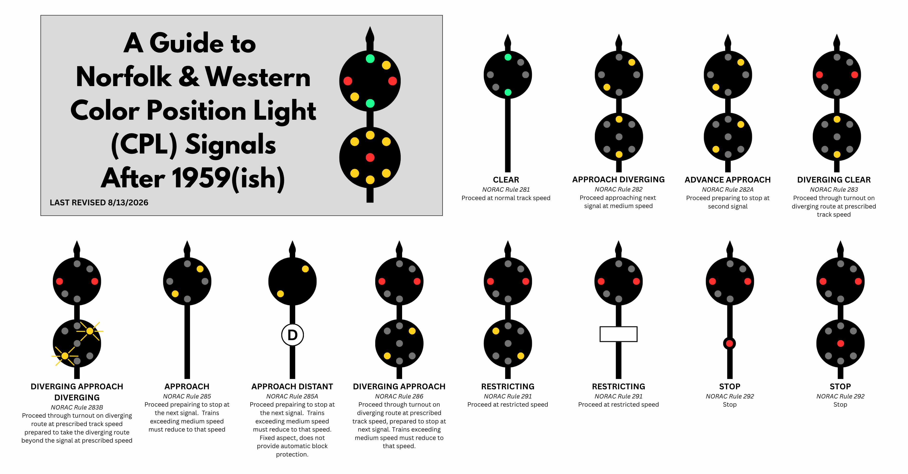

# SimpleSig and N&W Color Position Lights

## Overview

## The Prototype

The Norfolk & Western began using Pennsy-style position light heads in the mid-1920s, using three amber lights in a horizontal, diagonal, or vertical alignment.  This made a lot of sense when you considered that the Pennsylvania was a major shareholder from 1900-1965, and exerted influence on design and engineering decisions.

Starting around 1959, with the lessening of Pennsylvania control, the N&W began modernizing their position light standards and they became something uniquely N&W.  On the upper or only head, the center light was removed, and the remaining lenses were changed to standard colors with green in the vertical position, yellow in both diagonal directions, and red in the horizontal.  This made them similar to the B&O center head, but the lens sizes remained smaller, consistent with the PRR-style lamps.

For signals with two heads, the lower head could display a vertical aspect, or both diagonals.  All used yellow lights, except the single center lamp, which was red.  A vertical aspect is equivalent to a medium speed clear, or a low green.  Slanting from lower left to upper right would be equivalent to a medium speed yellow, or red over yellow.  Slanting from upper left to lower right would be a slow speed - essentially the equivalent of a flashing red or lunar aspect.

Similar to the Pennsylvania, the lower head was often not a full head.  Often it would just include the lamps needed to display required aspects.  

N&W was somewhat unusual in that if the lower head wasn't needed to communicate a given aspect, it would often just turn off.  Most railroads would always have something displayed on each head, so that crews would see a consistent number of heads and know they read the signal indication correctly.  Usually this was some equivalent of a red or stop aspect. So on a two-headed signal, a clear (green) signal would become green over red.  Not so for the N&W.  Clear would be a vertical green over dark, whereas if advance approach needed to be displayed, the lower head would light up diagonally. 

## Modeling and SimpleSig

The good news is that the N&W signal aspects are roughly direct equivalents of color light signals.  Horizontals are equivalent to red, diagonals from lower left to upper right are yellow, and verticals are green.  That makes wiring a whole lot easier, as you can wire it mostly like any other three-light color signal.  Just connect the two horizontal LEDs to the red light output, the lower left-upper right diagonals to the yellow output, and the verticals to the green output.  For the lower head, since it has no horizontal, just wire the red center LED to the lower head red output.

You'll also want to make sure that any Block Signal Basics or Switch Signal Basics are set to not use 4-indication signaling, so that no flashing aspects show up.  

To get advance approach and approach diverging to work the way you want, you'll need to program the Block Signal Advanced or Block Signal Pro to display yellow over green for approach diverging, so that you get diagonal over vertical.  Likewise, you'll want to reprogram advance approach to yellow over yellow to get diagonal indications on both heads.

You'll also want to turn off the lower head for any indication not needing it - such as for clear.  

For the Switch Signal Basic, where the relationship between signal aspects and indication is not adjustable, you'll need custom firmware to suppress the lower red when the mainline is showing any indication other than stop.  We'd be happy to make the change for you - just contact us before you order the board.

and you'd just get vertical greens over off for clear, whereas the same signal might show two diagonal indications for advance approach.  

The Block Signal Advanced and Block Signal Pro both make this easy with their full configurability, but it's not so simple for the points end of something like a Switch Signal Basic.  Contact us if you need this and we'll work with you.

## Custom Firmware

