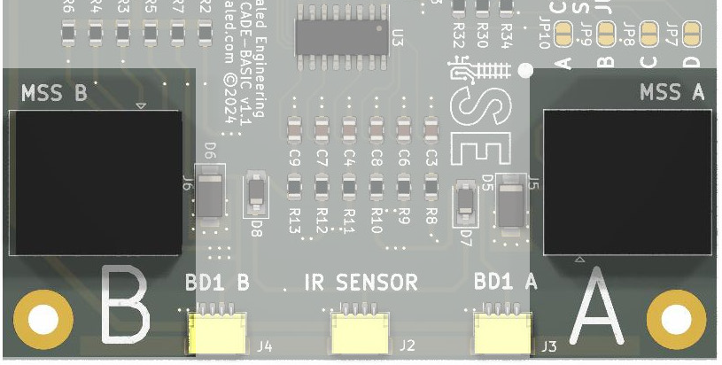

# Block Signal Basic User Manual {align=right style="height: 75px; margin-top:0px; margin-bottom: 0px"}

## Overview

The Iowa Scaled Engineering [Block Signal Basic](https://www.iascaled.com/store/MSS-CASCADE-BASIC) is a complete solution for adding basic ABS block signals at a track block boundary.  It is fully compatible with the [Modular Signal System (MSS)](../introduction.md) standards, and provides what the MSS standard calls a "cascade."

### Features

* Complete ABS-style signaling solution for a block boundary
* Compatible with Modular Signal System standards 1.x, 2.x, and (proposed) 3.x
* Controls one LED block signal head in each direction
* Powered from 8V to 24V DC, AC, or DCC power.
* Compatible with both common anode (positive) and common cathode (negative) signals
* Realistic signal fading during changes for both tri-light and searchlight style signals
* Supports both always-on signals and approach lighting
* Configurable for three or four indication signaling
* Simple plug-and-play compatibility with most Atlas HO and N scale signals
* Includes control board, ATOM DCC block detectors and one TrainSpotter optical detector

### Typical Applications

* Add operating ABS-style block signals at a block boundary on a single track
* Great for easily signaling home layouts as well as Free-Mo and Free-MoN modules

---

## Quick Start Guide

!!! warning "Turn The Power Off!"
    All wiring and setup of the board should be done with the power off.  This significantly reduces the chances of accidentally slipping and causing a short circuit that damages the board, the block detectors, or the signals.

[Simplified Wiring Diagram for Block Signal Basic](img/mss-cascade-basic-wiring-diagram.jpg)

### Step 1 - Signals

!!! info "Common Anode vs Common Cathode"
    The Block Signal Basic supports both common anode (positive) and common cathode (negative) signals, but all of the signals connected must be of one type or the other.  Mixing common anode and common cathode signals on the same Block Signal Basic is not supported.

Most applications will want to use two signals - a single-headed LED signal in each direction.

LED signals with the usual red/yellow/green leads can be wired into the terminal blocks.  The common wire should be connected to the terminal block labeled **SIGNAL COMMON**, and the individual color leads should be attached to the respective **R** (red), **Y** (yellow), and **G** (green) positions on the **SIGNAL A** and **SIGNAL B** terminal blocks.

If you are using signals from Atlas, they will plug directly into the off-white connectors marked **SIGNAL A** and **SIGNAL B**.  If the signal leads aren't long enough to reach the main board, Iowa Scaled Engineering offers [extension cables](https://www.iascaled.com/store/ACC-ATLASEXT).

Set the **COMMON** switch to **ANODE / +** if your signals are common anode / common positive (this is most common).  Likewise, set the switch to **CATHODE / -** if your signals are common cathode / common negative.

The Block Signal Basic powers the signals from 5 volts and has 330 ohm resistors on each of the signal outputs to protect the signal LEDs, so no additional resistors are needed externally.  If your signals are too bright with the built-in resistors, additional resistors can be added to each of the signal output lines.  If your signals already have resistors built in, you will likely need to remove them or disable the onboard resistors.  See [Bypassing the LED Resistors](#bypassing-the-led-resistors) in the Advanced Use Cases section below.  

---

### Step 2 - ATOM Detectors

Based on your installation, you will need one or two ATOM DCC current-based block detectors.

For modular setups, one ATOM detector is required on each block of track - A and B.  The rail connected through the detector must be isolated at the track block boundary, which should be located right at the signals.

For home layout use, only one ATOM current-based block detector is needed per track block if the block rails are electrically continuous between signals.  It can be connected to the signal module at either end of the block depending on what is convenient, but each block should have one and only one ATOM detector.

All of the feeders for the detected rail in a block must pass through the current transformer in the ATOM block detector as shown below.  Only make one pass through the transformer, and only pass the feeders to one rail through it.  Making multiple turns around the transformer or passing both sets of feeders through will cause the detector to not work properly.

Install ATOM detectors as needed and use the included 8 foot cables to connect them into the **BD1 A** and **BD1 B** inputs on the main board as appropriate.

---

### Step 3 - TrainSpotter Detector {align=right style="width:20%; margin-left:20px; margin-bottom:10px"}

!!! info "Omitting Optical Detection"
    For home layout use, the TrainSpotter may be omitted if all of your cars have resistor-equipped axles and you want to depend entirely upon current detection.  For Free-Mo layouts, the optical detector must be installed for compliance with the standard.

The TrainSpotter provides optical detection.  It should be installed as close to the block boundary at the signals as possible.  Use one of the included 8 foot cables to connect the TrainSpotter to the **IR SENSOR** connector.

---

### Step 4 - Connect Power

The Block Signal Basic requires 8V to 24V of DC, AC, or DCC power to operate.  Connect power to the board using the terminal block labeled **POWER**.  It can be powered directly from the FreeMo accessory bus on modular setups.

For home setups, it is recommended to power it from an accessory power bus, but it can be powered from the track bus directly (but before any block detectors, otherwise the current draw of the board will activate the block detector).  Note: all signal modules need to get their power from the same power source.

---

### Step 5 - Initial Testing

Do not connect any MSS cables yet!  First we're going to make sure that the Block Signal Basic is connected correctly.

Apply power and check that the green power LED glows on the Block Signal Basic and any attached ATOM current-based block detectors.  Assuming nothing on the track, the signals should both display green.

Place your hand over the TrainSpotter sensor.  Verify the red light on the sensor comes on and both signals drop to red.  Remove your hand and verify both return to green.  (If this is a home setup with no TrainSpotter sensor installed, skip this step.)

Turn on track power and make sure nothing is in either of the track blocks and that the red detection LED is OFF on all detectors (ATOMs and the TrainSpotter).  If any ATOMs show detection, very carefully check that the track blocks are correctly isolated and there is nothing on the track.  If you are absolutely sure of this, you may need to [run a self-calibration on that ATOM](../../ATOM%20Block%20Detector/manual.md/#operation) to cancel out leakage current.  If a calibration is run and the red detection light does not go off, you almost certainly have a wiring error in your DCC track wiring with that detector.

With track power still on, place a locomotive on the block in front of the A end signal.  Verify that the ATOM detector shows detection (red light) and that the B end signal drops to red.  Remove the locomotive and verify that approximately ~3 seconds later, the red light on the ATOM detector goes out and the B signal returns to green.  Repeat the process by placing the locomotive in front of the B signal and verify the B block detector triggers and that the A signal drops to red.  This will verify that your detectors are properly tuned and connected.

Congratulations!  You've now successfully installed and verified your Switch Signal Basic!

---

### Step 6 - Connect MSS

Now in order for the signals to interoperate with other SimpleSig or Modular Signal System-compatible products, you need to connect each signal module to the next via crossover cables.  **The golden rule of the Modular Signal System is that there must be an odd number of "crossovers" between signal boards.**

For home layouts, this typically means you should connect one signal board to the next using a single "crossover" cable of appropriate length.  Those can be purchased from a number of sources, including ISE, or you can make your own if you're comfortable with crimping ends on networking cable.

For modular layouts, it's generally recommended that except for very short modules, "straight through" (normal) ethernet cables should be used from the signal board to the ends of the module, where the signal bus terminates at a coupler or jack.  The modules then get joined together using crossover cables. 

For more information about crossover cables, be sure to see the [Tips and Tricks page](../tips.md).

If you do not have any more signal boards in a given direction down the track, just leave the connector open.

---

## Options

{align=right} The Block Signal Basic has four configuration option solder jumpers.  In order to enable each option, use a soldering iron and a small amount of solder (or a conductive ink pen) to bridge the corresponding jumper.

### Jumper A - Approach Lighting

By default, the Block Signal Basic keeps both signals lit at all times.  Some prototype signals are only lit when a train is approaching the signal, a feature appropriately enough called "approach lighting."  The Block Signal Basic can emulate this behaviour if Jumper A is soldered.  Any train in the adjacent block will cause the signal to illuminate, otherwise it will remain dark.

### Jumper B - Four Indication Signaling

US and Canadian ABS signal prototypes can roughly be divided into two categories - three indication signaling and four indication signaling.  Three aspect signaling means that there are only three indications - clear, approach, and stop.  Four indication signaling introduces advance approach (flashing yellow), meaning the next block will be approach (constant yellow).  Generally four indication signaling on ABS and APB came later, as train speeds increased and more warning was needed to slow before reaching a stop (ie. red) signal.

The Block Signal Basic defaults to only three indication signaling, as getting three blocks between trains on our often small layouts can be difficult.  However, on larger layouts and modular setups, four indication signaling is often desired and can be enabled by soldering Jumper B.

### Jumper C - Searchlight Emulation

By default, the Block Signal Basic is set up to emulate the operation of typical signal heads with three independent sets of lights, arranged either vertically or in a triangle configuration on most railroads.  (Or, in the case of Pennsylvania position lights or B&O/N&W color position lights, drive two lights around the outside of a disk.)  Regardless, the logic will fade one in as the other fades out.

Searchlight-type signals, such as the Union Switch & Signal types H, H2 and H5 as well as the General Railway Signaling SA type, used a signal lamp with a set of mechanically-changed color filters inside known as roundels.  Three roundels were mounted on an armature that could be moved by two electromagnetic coils.  When unenergized, the arm sat in the middle and placed the red filter in front of the single lamp.  Green would be on one side, and yellow on the other side.  By energizing the coils, it would pull the arm either left or right and place either yellow or green in front of the lamp.

This leads to interesting effects when changing aspects.  When going between yellow and green, you'll get a couple quick red flashes as the armature moves from one side through the red glass in the center to the other side, and then usually bounces once or twice.  Going from red to either yellow or green will result in a bit of flickering as well as the armature bounces around before settling.  The Block Signal Basic emulates this rather precisely.  If Jumper C is enabled, this bouncing and flashing will be reflected in the signal output giving a very prototypical appearance to model searchlight signals.

### Jumper D - Reserved

Currently, jumper D is reserved for new features and future enhancements to the firmware.

---

## Advanced Use Cases

### Bypassing the LED Resistors

The Block Signal Basic includes resistors to protect your signals against excessive current that will destroy them.  There may be use cases where your signals already have resistors installed, or you want to change the resistor values used, and you need to bypass the resistors on the board.  There are solder jumpers provided to let you do that, but be **very sure** that you know what you're doing before using them.

!!! warning "Don't Destroy Your Signals!"
    Be sure you really need to do this before even considering bypassing the onboard current limiting resistors for the signals.  You must install external resistors before bypassing the onboard resistors, or the current will blow up your signal LEDs!

JP1-JP3 bypass the resistors for Signal A red, yellow, and green respectively.  JP4-JP6 bypass the resistors for Signal B red, yellow, and green, respectively.

If you just wish to dim your signals further, we recommend adding additional resistance between the terminal block and the signal, and leaving the onboard resistance alone.  Then, if for some reason your external resistor gets shorted or you forget to put one in, your signal is still protected against overcurrent that will destroy the LEDs.

---

## Specifications

**Input Power:**  5 to 24 volts DC, AC, or DCC  
**Input Supply Current:**  50 milliamps (typical)  
**MSS Standard Compatibility:** 1.x, 2.x, and (proposed) 3.x  
**Size:**  3.25"(L) x 3.0"(W) x 0.5"(H) (main board)

---

## Open Source 

Iowa Scaled Engineering is committed to creating open designs that users are free to build, modify,
adapt, improve, and share with others.

The design of the MSS-CASCADE-BASIC hardware is open source hardware, and is made available under the
terms of the [Creative Commons Attribution-Share Alike v3.0 license](http://creativecommons.org/licenses/by-sa/3.0/). 
Design files can be found in the [mss-cascade](https://github.com/IowaScaledEngineering/mss-cascade) project on 
GitHub.  Because the MSS-CASCADE project contains multiple types of block signal modules, look in the mss-cascade-basic directories when available.

The firmware for the MSS-CASCADE-BASIC is free software: you can redistribute it and/or modify it under the 
terms of the GNU General Public License as published by the Free Software Foundation, either [version 3 of the 
License](https://www.gnu.org/licenses/gpl.html), or any later version.
