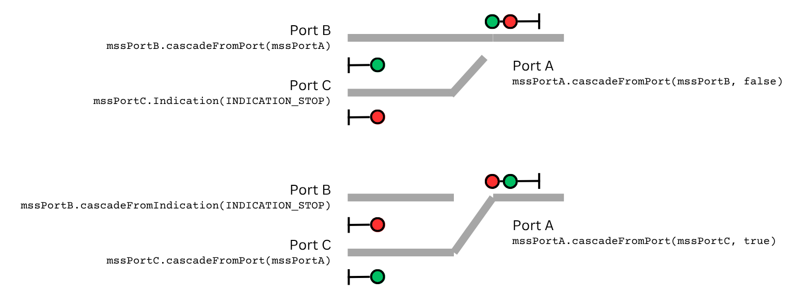

# Block Signal Custom Developer's Guide {align=right style="height: 75px; margin-top:0px; margin-bottom: 0px"}

## Overview

The Iowa Scaled Engineering [Block Signal Custom](https://www.iascaled.com/store/MSS-XCADE) is an insane overpriced fever dream that nobody will ever buy and will almost certainly become some sort of customer support nightmare that haunts me for the rest of my life.  I did it anyway because somebody had to. 

The Block Signal Custom - otherwise known as the MSS-XCADE - is just hardware.  By default, it will just sit there doing nothing because it has no software.  It is not "plug and play" and will completely frustrate and befuddle the average modeler.  It is intended for advanced users comfortable with programming and debugging C++ code in the Arduino environment who want to signal complex trackwork.

This is the developer's guide, intended to help those writing that software.  

## Developer's Guide

The Block Signal Custom is designed to solve all manner of complicated signaling problems with MSS that could never be a dedicated product.  It provides a generic set of building blocks - MSS ports, signal drivers, sensor inputs, and general purpose input/output (GPIO) - that can be developed into a signal solution for even the strangest trackwork.

While we intend to ship a version of it with factory firmware that solves a variety of common situations (diamonds, double track crossovers of various types, etc.), this will be far from everything that folks want to signal.  This guide is meant to help someone with some amount of programming skills develop their own custom solutions for the board.

In order to make programming the board as (relatively) friendly and painless as possible, the system is programmed through the Arduino environment, and a library is provided to abstract off a lot of the detail and allow the user to focus on the signal logic itself.

## Updates

!!! warning
    This is very much a work in progress and not a final version of the library and the documentation around it.  Things will change as users test and find what I've screwed up massively.

This is a living document, and a living library.  There will be new releases and new versions because I'm sure I've missed the mark on a few things.  

Please see the [change log](#change-log) at the bottom for more details.

## Hardware Considerations

The MSS ports on the Block Signal Custom only implement MSS 3.x approach diverging signaling (active low), which breaks compatibility with MSS 1.x and 2.x if using the approach diverging stuff.  It was simply cost and complexity prohibitive to allow each port to be switched between MSS 2.x and 3.x compatibility, and since 3.x is likely the way forward, I went with that. 

!!! warning "GPIO Pin Limitations"
    The GPIO lines are 5V logic lines with little protection.  Use them with care.

GPIO lines are limited to 0 to 5V.  If used as outputs, they can source 10 milliamps from 5V or sink 25 milliamps to ground.  If used as inputs, they all have an internal ~10k pull-up resistor that cannot be disabled.  Do not exceed these limits or permanent damamge may result.  These lines have limited ESD production.

The expansion ports are similar to the Qwiic standard (same pinout), but are not directly compatible as rather than 3.3V, they supply 5V instead.  This was needed to get power to any MSS-XCADE-EXPANDER boards from the main switching power supply on the master board.  The I2C I/O lines also do not have pull-ups on them because they're level-shifted at the master board's PCA9846 I2C switch.  This would allow someone to connect a peripherals at either 3.3V or 5V by using appropriate power regulation and pull-up resistors.

When in doubt, the schematics are available here:

* Hardware v1.0 - [Schematic](https://github.com/IowaScaledEngineering/mss-xcade/blob/master/pg/mss-xcade-v1.0-9f95510/mss-xcade.pdf)

## Getting Started 

### Set Up the Arduino Environment

For this, you'll want to install the latest release of version 2 of the Arduino IDE.  You can download the correct version for your computer's OS from [the official Arduino.cc site](https://docs.arduino.cc/software/ide/).

Once installed, open up the board manager (Shift+Ctrl+B or Tools->Board->Board Manager) and search for "esp32".  Install "esp32 by Espressif Systems"

Once you get the esp32 board support installed, you'll want to select the correct settings in the Tools menu.

1. In Tools->Board, select "esp32" and then "ESP32S2 Dev Module".

2. Plug in the MSS-XCADE and select the right serial port for it under Tools->Port.

3. Once you've done that, a bunch of new options for the ESP32s should appear below.  Set those as follows:
    * Tools->USB CDC on Boot should be Enabled
    * Tools->PSRAM should be Enabled
    * Tools->Erase All Flash Before Sketch Upload - I often set this to enable because it can clear out some weird bugs, but not strictly needed

4. Open up Preferences (File->Preferences)  and change "Compiler Warnings" to at least "Default" if not higher.   Trust me, warnings are a good thing, particularly with ESP32s.  Because the serial console is done through the USB stack, if the processor goes off into la-la-land, you will spend hours chasing around why.  Compiler warnings, such as forgetting to return a value from a function that needs a return value, will tell you about these ahead of time and save you much time.

5. *(Optional Suggestion)* Personally, as someone used to at least passable syntax highlighting in my code editors, I also can't stand the Arduino default theme. If you like it, or you're used to it, more power to you, but I find having good syntax highlighting really helps me see stupid mistakes.  To fix that, I download the default VSCode syntax highlighting and install it as a customized theme.  [This thread](https://forum.arduino.cc/t/personal-themes/1024606) gives the instructions for that, and I've placed the VSCode default C/C++ theme v2.0.0 [here](./vscode-ext/ms-vscode.cpptools-themes-2.0.0.zip). It's a shame that Arduino doesn't include a more robust highlighting theme by default.

### Install the Library

The key to controlling the MSS-XCADE board is the library written around it.  This makes it easy to control without having to know exactly where each wire goes on the board.  You can write software thinking about signal concepts, not about hardware schematics.  It also has some examples with it to show you how various things are done.

I haven't made the MSS-CADE control library accessible through the general Arduino library manager, because it's a very specialized application.  You can easily download the latest 
Download the latest MSS-XCADE library zip file from the IowaScaledEngineering/mss-xcade-lib project. You can get the most recent zip file [from here](https://github.com/IowaScaledEngineering/mss-xcade-lib/archive/refs/heads/master.zip). Use Sketch->Include Library->Add .ZIP Library and select the zip file you just downloaded.


### Sketch Fundamentals

Within your program - which Arduino users will know as a sketch - you'll need to include the library's header:

```
#include "mss-xcade.h"
```

The root of everything is the XCade object.  It represents the features that are available on all MSS-XCADE boards, both the masters with the host ESP32-S2, and any expansion boards.  Through it, you will interace with the board's basic four resources - eight signal head drivers, four MSS ports, ten sensor inputs, and six 5V-capable general purpose I/O (GPIO) lines.

The XCade object is largely just a container, much like the Block Signal Custom board itself.  Within it, you will find a couple public methods, such as initialization and common input / output update routines, but most of what you'll interact with are a handful of objects representing the physical hardware.

See the [XCade object documentation](#xcade-object) for more details, but first we'll just walk you through a very simple example sketch to show you how it all works.

### Basic Sketch Structure

[{align=right style="height: 200px; margin-top:0px; margin-bottom: 0px"}](img/basic-abs-example-connections.png)

In order to understand all of this, I recommend opening up the "basic-abs" example.  It does little more than provide a simple ABS block boundary, and while that's a massive waste of the xcade's resources,  it's an ultra-simplified example of how to use the various pieces of hardware on the board and the software library around them.  

If you've installed the library correctly, you should see File->Examples->MSS-XCADE Control Library->basic-abs as an example you can pick in your Arduino environment.  It'll be way down at the bottom of the library list under "Examples from Custom Libraries."  Open it up, because we're going to walk through it.

For this example - based on the basic-abs example sketch - [this diagram](img/basic-abs-example-connections.png) shown to the right will be the hardware configuration.

The basic sketch will wind up something like this.  This is borrowed from the basic-abs example, and a lot of the unnecessary detail is stripped out to make the example clearer.  It's a bit pseudo-code in places to make it clearer.  We'll walk through every "STEP" below.

```
WireMux wireMux;
XCade xcade;
SignalMast signalMastA, signalMastB;

void setup() 
{
  // STEP 0: Initialization

  // Start I2C interface
  Wire.setPins(XCADE_I2C_SDA, XCADE_I2C_SCL);
  Wire.setClock(100000);
  Wire.begin();

  // Start the WireMux to allow the board to talk to both onboard hardware and expansion boards
  wireMux.begin(&Wire);

  // Start the onboard xcade hardware (mux address 0)
  xcade.begin(&wireMux);

  // Create SignalMast objects to translate indications to aspects
  signalMastA.addSignalHeads(&xcade.signals.A1, &xcade.signals.A2);
  signalMastB.addSignalHeads(&xcade.signals.B1);

}

void loop()
{
  // Is it even time to run signal logic yet?  
  //   Run SLOW, only working through steps 1-6 ever 50 milliseconds.  Signal logic
  //   should not be any faster than at a minimum ~10 milliseconds or so to allow debouncers to work.
  if (notTimeForSignals)
    return;

  // STEP 1: Read the input state from the hardware
  xcade.updateInputs();

  // STEP 2: Get sensors and GPIO inputs
  blockAOccupancy = xcade.gpio.digitalRead(SENSOR_1_PIN) || xcade.gpio.digitalRead(SENSOR_2_PIN);
  blockBOccupancy = xcade.gpio.digitalRead(SENSOR_3_PIN) || xcade.gpio.digitalRead(SENSOR_2_PIN);

  // STEP 3: Set Occupancy on the MSS Ports based on step 2
  xcade.mssPortA.setLocalOccupancy(blockAOccupancy);
  xcade.mssPortB.setLocalOccupancy(blockBOccupancy);

  // STEP 4: Cascade MSS bus between ports
  xcade.mssPortA.cascadeFromPort(xcade.mssPortB);
  xcade.mssPortB.cascadeFromPort(xcade.mssPortA);

  // STEP 5: Generate signal indications
  signalMastA.setIndication(xcade.mssPortB);
  signalMastB.setIndication(xcade.mssPortA);

  // STEP 6: Write outputs
  xcade.updateOutputs();
}
```

### STEP 0: Initialization

The first step is to start the Wire (I2C) interface for the board.  The key parameters here are configuring which GPIOs are the SDA and SCL lines (provided as XCADE_I2C_SDA and XCADE_I2C_SCL) using Wire.setPins() and then configuring how fast the I2C bus should run using Wire.setClock().  As you can see, we've set it to 100kHz here, which is a reasonable compromise between getting data moved in and out in a timely manner, and a low enough speed that it works reliably when you have an octopus of expansion cables connected.  Plus, the signal head coprocessor on the board can miss writes above about 125kHz, so 100kHz is a good number.

Next we start up a WireMux object.  The master MSS-XCADE board has a PCA9846 on board between the processor and all of the various peripherals.  This is an I2C switch that allows the microcontroller to select which I2C bus it wants to talk to at a given time, which allows us to have expansion ports and not have to worry about conflicts between I2C addresses. The microcontroller, using the WireMux interface, just sets the PCA9846 switch to the set of peripherals that it wants to talk to, and the rest are oblivious to the conversation.  See the diagram and how the 9846 switches between talking to the various I2C buses (shown in light blue).

[](img/mss-xcade-block-diagram.png)

This has the advantage of allowing us to reuse the hardware for MSS-XCADE-EXPANDER boards by just leaving off a bunch of the hardware (microcontroller, power supplies, configuration switches, LED, etc) and plugging in directly to the I2C bus going to the onboard peripherals.

The WireMux object wraps around the Wire interface - the I2C bus coming out of the ESP32 - and allows the various XCade objects to select the correct port on their own.  This is done using the WireMux.begin() method and a pointer to the initialized Wire object.

Once the WireMux is set up, we can start setting up the XCade objects using their begin().  In our example, we only have the XCade hardware attached to the main board, so we initialize it without specifying a mux address (it defaults to 0, the onboard stuff).  In this basic example, we don't have any expanders plugged in.  If we did, we'd initilalize them with a mux address corresponding to the port they're plugged into (1, 2, or 3).

### STEP 1: Read Inputs

The inputs from the various components (MSS ports, GPIO/sensors, etc.) are read as a group at the start of the signal logic rather than every time one of them is accessed as part of that logic.  This serves two purposes:  making sure the state of the inputs is consistent throughout the logic, and allowing everything to be debounced under the covers where the user need not worry about it.

The first case is obvious.  You want your inputs to be stable as you run your logic.  Otherwise you may get a state transition halfway through, as in some of your first tests a block wasn't occupied and then suddenly it was...

The second case - debouncing - should be familiar to anybody who has worked on embedded hardware, but may not be familiar to newcomers.  If a mechanical switch closes and pulls an input low (or high, for that matter), it doesn't form a nice clean transition.  It will often "bounce" a few times over the course of milliseconds, jumping between conducting and not conducting.  This is both caused by the mehcanical contacts physically bouncing from the forces of movement and from the electrical current needing to break through surface oxidation on the contacts.

You don't want your signal logic rapidly bouncing around trying to keep up with an input that's bouncing around as well.  It's not just GPIOs that are the problem.  Even the MSS lines themselves can bounce, if they're being switched through mechanical contacts like relays at a junction or being shunted by points on a switch machine.  Under the covers, between the the actual hardware inputs and the logic states that you see, the mss-xcade library is debouncing all of these signals.

!!! note
    *Railroad signals are slow.  Railroad signals are deliberate.*   It's recommended that your loop function not run steps 1-6 more than every 50 milliseconds or so.  That gives the debouncer time to work and prevents signals from going wonky.  The easiest way to achive that is something like this at the top of your loop() function.

    ```
    void loop() 
    {
      uint32_t currentTime = millis();
      static uint32_t lastReadTime = 0;
      
      // Do fast stuff here that needs to happen
      
      if (!(((uint32_t)currentTime - lastReadTime) > LOOP_UPDATE_TIME_MS))
        return;

      // Update the last time we ran through the loop to the current time
      lastReadTime = currentTime;

      // Do slow stuff here, like steps 1-6
    ```

### STEP 2: Get Sensors/Input

Technically this doesn't really have to come first.  You can get the sensor inputs at any time and they should be consistent because of step 1.  However, I find it highly convenient to create booleans (true/false logical values) with helpful names from all the sensors.  

For example, in a typical MSS block boundary with block A on one side and B on the other, A would be considered occupied if either A's current detector or the infrared detector at the boundary was triggered.  Likewise, B would be considered occupied if either B's current detector or the same infrared detector at the boundary was triggered.

To make this easy, you can simply turn it into two booleans, one representing each block's occupancy as a combination of the sensors (where S1 is A's current detector, S3 is B's current detector, and S2 is the infrared detector).  Here's how that would work:

```
bool blockAOccupancy = xcade.gpio.digitalRead(SENSOR_1_PIN) || xcade.gpio.digitalRead(SENSOR_2_PIN);
bool blockBOccupancy = xcade.gpio.digitalRead(SENSOR_3_PIN) || xcade.gpio.digitalRead(SENSOR_2_PIN);
```

!!! note
    The "sensor" inputs are all inverted under the covers, because that's how almost all block detectors (such as ISE's ATOM) and IR detectors (such as ISE's TrainSpotter) work.  These sensors operate with an "open collector" style output, where they ground the pin in the event that they're activated.  Thus, digitalRead() will return true if the pin on the sensor input is grounded, and false otherwise.  The general GPIO pins 1-6 on the terminal block are not inverted and reflect their true state (true is +5V, false is grounded).

### STEP 3: Set Occupancy

Since occupancy not only goes out on the MSS lines but is also used for calculating signal aspects, the next thing we need to do is use the occupancies from step 2 to set the occupancies for the various MSS ports.  This is the *local block occupancy* or *S* wire on the MSS port.

Using our above example, we can set the occupancy for ports A and B based on the sensor inputs from step 2.

```
xcade.mssPortA.setLocalOccupancy(blockAOccupancy);
xcade.mssPortB.setLocalOccupancy(blockBOccupancy);
```

### STEP 4: Cascade MSS

Signal boundaries in MSS are called "cascades" because they cascade the wires from the previous block down.  So if you get a block showing occupancy to the left, that becomes occupancy one block away to the next signal to the right and two blocks away to the signal beyond that.  

Cascading is a combination of taking the inputs from one port and combining them with any local detectors - as well as any diverging indication - and sending them out another port.

Normally this is just done in hardware, because the progression is well defined in the MSS Specification.  However, this gets complicated at junctions, because how the signals map through a junction will change as turnouts change.  At the end of a siding, you would cascade the straight route if the points are normal, but you would cascade the siding if the points were reversed.

In our example, it's only a single track, so the first line takes the inputs from port B and cascading them to port A's outputs.  That'll be combined with the occupancy from step 3 to produce the actual output signals.  Because cascading is directional - it takes the inputs from one port and sends them out another port - the second line takes A's inputs and send them to B.

```
xcade.mssPortA.cascadeFromPort(xcade.mssPortB);
xcade.mssPortB.cascadeFromPort(xcade.mssPortA);
```

### STEP 5: Set Signal Indications

The final step - after we have all the occupancy and route information set - is to calculate the signal aspects.

MSS ports - and signal logic in general - produces indications.  Those indications then need to get translated to the aspects displayed on the signal heads.  Aspects are usually colors (red / yellow / green / lunar), but can be other things like position with semaphore blades.

Remember, indication is what to do, and aspect how the signal heads that represent that instruction.  The aspect might be red over yellow, and the indication would be "Diverging Approach - Proceed on diverging route not exceeding prescribed speed through turnout and approach next signal prepared to stop."

MSS only allows us to communicate a limited number of indications, expressed in the library as an enum MSSPortIndication_t.

* INDICATION_STOP
* INDICATION_APPROACH
* INDICATION_ADVANCE_APPROACH
* INDICATION_APPROACH_DIVERGING_AA
* INDICATION_APPROACH_DIVERGING
* INDICATION_CLEAR

Generally then you need a translation between the indication from the MSS port (or explicitly set by the user) and the signal aspects to display.  As a few examples, a clear signal on a single-headed signal would just be green, but on a double headed signal would be green over red or maybe green over dark depending on your prototype's signal rules.  An indication of advance approach on the other hand might be a flashing yellow on a single head, or yellow over yellow on an eastern US railroad, or flashing yellow over red on a western US railroad.

Obviously the most brute-force approach would just be a switch statement that takes each of those indications from the MSS port and turns them into aspects for any applicable signal heads.  It works.  It just leads to a lot of cut/paste code once you get up to two and three-headed signals.  If you want to do it the brute force way, you can code something like the following:

```
switch(xcade.mssPortA.getIndication())
{
    case INDICATION_STOP:
        xcade.signals.A1.setAspect(ASPECT_RED);
        xcade.signals.A2.setAspect(ASPECT_RED);
        break;
    case INDICATION_APPROACH:
        xcade.signals.A1.setAspect(ASPECT_YELLOW);
        xcade.signals.A2.setAspect(ASPECT_RED);
        break;
    
    // and yada yada yada...
```

However, in an effort to make this a lot simpler and less user code, the library provides SignalMast objects.  SignalMast objects provide an intermediate translation step between indication and aspect(s).

Each SignalMast is associated with one to three signal heads.  You can then give a SignalMast an MSSPort or an indication and it uses its internal rules - based on typical modern indications - to figure out what aspects to display.  If you don't like the rules, you can write your own set and attach it to the SignalMasts.  

You set up SignalMasts in your setup() function by associating them with signal heads, as shown below.  For this example, mast A will be a two-headed signal with head A1 on the top and A2 on the bottom.  Mast B will be a single headed signal with only head B1 on it.

It can also handle approach lightning as an optional input.

```
signalMastA.addSignalHeads(&xcade.signals.A1, &xcade.signals.A2);
signalMastB.addSignalHeads(&xcade.signals.B1);
```

Then, as part of your signal logic, you just pass the MSS port you want to get the indication from into the mast, and it figures out everything for you.

```
signalMastA.setIndication(xcade.mssPortB);
signalMastB.setIndication(xcade.mssPortA);
```

### STEP 6: Write Outputs

Much like step 1 in reverse, step 6 takes the state from the XCade object and actually writes it to the hardware.  Again, the reason for doing this all at once is such that a consistent state is written out and it doesn't glitch other MSS modules by sending a bunch of rapid-fire updates, such as one when you set local occupancy, one when you cascade down the indications from an upstream block, etc.

### More Advanced Examples

Once you're comfortable with these concepts, I would dive in to the "doubletrack-single-xover" example.  It shows how to use turnout position, setting cascade by indication, and how to use the diverging indications.

As time goes on, I'll add more examples in.

---

## Library Reference

## WireMux Object


Because the master MSS-XCADE board contains an I2C switch, to allow it to talk to the peripherals on its own board plus expansion boards plugged into the ports marked 

There should only be ONE WireMux object per sketch.


## XCade Object

One XCade object should be created in your application for each physical MSS-XCADE board.  It needs to be initialized with the Wire interface, as the ESP32-S2 uses I2C to talk to all of its peripherals.  If a particular XCade object is an expansion board, it also needs a multiplexer port so that the CPU knows where to find it.

These should be global, or at least declared static within the main loop.  Basically, they need to be created once and persist through the life of the program.

**bool XCade::begin(WireMux* wireMux, uint8_t muxID=0)  
bool XCade::begin(TwoWire* wire = &Wire)**

One of these two begin() methods should be called to start up the XCade object within the sketch's setup() function.

The first takes an initialized WireMux object and an optional multiplexer address.  muxID defaults to zero, which is the hardware built into the master MSS-XCADE board, but can be set to 1, 2, or 3 for additional MSS-XCADE-EXPANDER boards plugged into the master's expansion ports.

An optional interface that just takes an initialized Wire interface can be used if an MSS-XCADE-EXPANDER is plugged into some other master hardware that doesn't have the PCA9846 multiplexer in the way.

[](){ #XCade_updateInputs }
[](){ #XCade_updateOutputs }
**void XCade::updateInputs()  
void XCade::updateOutputs()**

updateInputs() and updateOutputs() should be called as bookends to your signal logic.  updateInputs() should happen before any logic, and updateOutputs() should be the last thing that happens after all signal logic is complete.  These read and write to and from the hardware respectively.

Because these implement internal debouncing, they (and the rest of the logic) should only get called at most every 50 milliseconds or so.

**Public Member Objects in the XCade**

While the true object-oriented purists are no doubt throwing tomatoes at their screen by this point and cursing my name for not having a pile of accessors and not just exposing a bunch of member objects, the XCade object is mainly a container and I'm mainly a pragmatist.  So go ahead, chuck your rotten fruit, because so far there's no RFC for *Pillory Over IP*.  Or hey, it's open source, fork it and do it more to your liking.  

Most of your interaction with the XCade will be via objects contained within it that represent blocks of hardware.  

The MSS ports are accessed as [MSSPort objects](#mssport-object) named:

* xcade.mssPortA
* xcade.mssPortB
* xcade.mssPortC
* xcade.mssPortD

Signal heads are accessed through [SignalHead objects](#signalhead-object) named: 

* xcade.signals.A1
* xcade.signals.A2
* xcade.signals.B1
* xcade.signals.B2
* xcade.signals.C1
* xcade.signals.C2
* xcade.signals.D1
* xcade.signals.D2

Sensors and GPIO lines work much like the Arduino digital pins - pinMode, digitalRead, and digitalWrite - are both accessed through the gpio interface.  The sensor inputs are naturally inverted, since all ISE sensors that plug into them are open collector, and thus active low.  So went a sensor is triggered, digitalRead() will return true, and when it's not triggered it will return false. The GPIOs are not inverted and reflect the true state of the GPIO line.  All of them are accessed through the [GPIO object](#gpio-object):

* xcade.gpio

Finally, on master MSS-XCADE boards, there are configuration switches that can be accesssed through the [MSSConfigSwitches object](#mssconfigswitches-object) named:

* xcade.configSwitches

---

## MSSPort Object

The MSSPort object models the inputs and outputs from an MSS bus.  There's no need to interact with the port at an individual wire level.  These things are handled behind the scenes.  What you will (usually) deal with are "indications", which are what the wires on the port are indicating you should do, represented by [MSSPortIndication_t](#MSSPortIndication_t) types.

**void MSSPort::setLocalOccupancy(bool localOccupancy)**

Sets whether the local block represented by this port should be considered occupied based on any sensors connected to this MSS node.  

Note that since the indication received is a combination of the signals coming in and any local occupancy, it's best practice that local occupancy be set before reading back the indication.  If not, it will still work, but it may take four read cycles for occupancy to propagate out to the bus and then back through the input routines due to debouncing.

**MSSPortIndication_t indicationReceivedGet()**

Returns the indication currently being received by the port, represented as an MSSPortIndication_t. 

Note that since the indication received is a combination of the signals coming in and any local occupancy, it's best practice that local occupancy be set before reading back the indication.  If not, it will still work, but it may take four read cycles for occupancy to propagate out to the bus and then back through the input routines due to debouncing.

[](){ #MSSPortIndication_t }
**MSSPortIndication_t** is the type used to specify the indication provided by an MSS port.

* INDICATION_STOP - Track occupied or not lined for travel
* INDICATION_APPROACH - Track clear for one block, expect stop indication next
* INDICATION_APPROACH_DIVERGING - Track clear for two blocks, expect to take diverging route at next signal.  If the switch signal was red, this would be just an approach indication.
* INDICATION_ADVANCE_APPROACH - Track clear for two blocks, expect non-clear signal next
* INDICATION_APPROACH_DIVERGING_AA - (Not officially supported in MSS) - Track clear for three blocks, prepare to take diverging route in two blocks.
* INDICATION_CLEAR - Track is clear and lined for at least three blocks.

The indication is determined from the MSS input lines as shown below, where green T squares represent lines active (logical true or grounded), red F squares represent lines inactive (high/floating), and grey squares are "don't care."


**void MSSPort::cascadeFromPort(MSSPort& port, bool diverging=false)  
void MSSPort::cascadeFromIndication(MSSPortIndication_t indication, bool diverging=false)**

These two methods set the outputs of an MSS port based on cascading it from something else.  

The first - cascadeFromPort() - essentially performs in software what a normal cascade would do by rearranging the wries.  It reads the input from the port passed as an argument, and cascades them to the outputs of its port.

The second - cascadeFromIndication() - allows a port's output to be set based on the indication.  Almost always, this indication should be INDICATION_STOP, as the intent of this function is to be used with ports that are blocked within a control point - for example, the port at the end of a siding track when the turnout is lined to the main.  

An optional diverging argument is provided to indicate that the route being cascaded is a diverging route through a control point.  This will default to false, but can be set to true by the application.

As an example of how to use the two cascade functions, I've prepared a simple diagram below, showing a siding end in both normal and reverse configurations, along with the cascade functions that would be used on each port.

[](img/cascadeFromExample.png)

**bool MSSPort::getSingleBlockApproach()  
bool MSSPort::getDoubleBlockApproach()**

For applications wanting to approach-light signals, these functions allow access to determine that (sort of).  

Single block approach will return true if there is detection in the block immediately adjacent to the port (a logical or of whether we're sending occupancy or the S wire on the bus is otherwise asserted). 

Double block approach will return true if occupancy is detected in either the immediately adjacent block or the next block beyond that.  This isn't always reliable, because if the immediately adjacent block is tied to something that may display stop due to turnout position or otherwise, it may get an approach indication not based on occupancy but based on signals.

Both of these are a little "best possible effort using the facilities available in MSS."  Single approach is more likely to be correct than double.


**void MSSPort::setRawInputs(bool S_in, bool A_in, bool AA_in, bool DA_in)  
void MSSPort::getRawOutputs(bool* S_out, bool* A_out, bool* AA_out, bool* DA_out)**

Allows the user to set the state of the input wires or get the state of the output wires directly.  Read the warning below and stay away.

!!! warning
    These methods - setRawInputs() and getRawOutputs() - are intended to make the MSSPort object reusable with other non-xcade hardware and allow the user to set/get the state of the raw MSS bus wires directly.  If you're just using the MSS-XCADE hardware, stay away from these except for diagnostics and debugging.
---

## SignalHead Object

Generally speaking, you'll probably want to use SignalMast objects to handle the conversion from indication to aspects.  However, you certainly can directly manipulate each head's aspect if you so choose.

**void SignalHead::setAspect(SignalAspect_t aspect)  
SignalAspect_t SignalHead::getAspect()**

setAspect() allows you to set the currently displayed aspect on a signal head.  Likewise, getAspect allows you to get back the aspect currently displayed.  Both use a SignalAspect_t type.

**SignalAspect_t** values are:
* ASPECT_OFF - Head remains off / unlit
* ASPECT_GREEN - Solid green (or clear aspect for semaphores)
* ASPECT_FL_GREEN - Flashing green aspect
* ASPECT_YELLOW - Solid yellow (or approach aspect for semaphores)
* ASPECT_FL_YELLOW - Flashing yellow aspect
* ASPECT_RED - Solid red (or stop aspect for semaphores)
* ASPECT_FL_RED - Flashing red
* ASPECT_LUNAR - Unused (as of yet) lunar aspect, for four aspect signals


**void SignalHead::setSignalHeadType(SignalHeadType_t headType)**

setSignalHeadType allows you to configure a given head as either a standard three-light or a searchlight.  This will affect whether lights fade one to the other, or if you get the distinctive "red flash" and "bounce" of a searchlight mechanism.  The default is a standard three-light head.

[](){ #SignalHeadType_t }
**SignalHeadType_t**  options are:

* SIGNAL_HEAD_THREE_LIGHT - (Default) Standard 3 light head
* SIGNAL_HEAD_SEARCHLIGHT - Searchlight-style signal that emulates the red flash


**void SignalHead::setSignalHeadPolarity(SignalPolarity_t headPolarity)**

setSignalHeadPolarity allows you to individually configure signal heads.  Normally the polarity is configured by the switch on the board.  However, individual heads can be configured differently.  Note:  This does not change the polarity of the common wire on each signal connector.  That's determined by the Common Anode/Cathode switch on the board.  It just impacts the polarity of the three (red / yellow / green) output wires.  

In all seriousness, the use cases for this are probably vanishingly small.

[](){ #SignalPolarity_t }
**SignalPolarity_t** options are:

* SIGNAL_POL_BOARD_SENSING - (Default) Use the polarity sensed from the board.
* SIGNAL_POL_COMMON_ANODE - R/Y/G signals are active LOW, inactive HIGH (common anode)
* SIGNAL_POL_COMMON_CATHODE - R/Y/G signals are active HIGH, inactive LOW (common cathode)

---

## SignalMast Object

SignalMast objects aren't part of the XCade object.  They're for you to use within your application, if desired.  They serve to translate indications coming off the MSS bus (or internal logic) to an array of aspects as displayed on a signal mast - hence the name.

You can obviously do this with big switch or if/else blocks, but this provides a concise way to do it using rules - either the default set or your own.

**void SignalMast::addSignalHeads(SignalHead* h1, SignalHead* h2 = NULL, SignalHead* h3 = NULL)**

The first step is to associate signal heads (expressed as [SignalHead objects](#signalhead-object) within the [XCade object](#xcade-object)) with their mast and position on that mast.  Between one and three heads can be added to any given signal mast.  h1 will be the top-most head, h2 will be the next head down (if passed in), and h3 will be next (and bottom, in a three head signal, again only if passed in).

For example, mast.addSignalHeads(&xcade.signals.A1) would create a mast with only a single signal head.  mast.addSignalHeads(&xcade.signals.A1, &xcade.signals.A2) would create a mast with two heads, and A1 on the top.

**void setIndication(MSSPort& port, DivergingRoute_t diverging = NOT_SPECIFIED, bool mastLit = true)**

To get the indication from a given [MSSPort object](#mssport-object)'s inputs and display it on the heads attached to this mast, this is the typical method that would be used.  Most use cases will only provide a port and leave the last two arguments as default.

Normally, whether a signal should display diverging or normal aspects is driven off the state of the diverging approach bit within the port.  If the value of diverging is set to NOT_SPECIFIED, this is how it will be determined.

However, there may be cases where the user explicitly wants to specify that a signal should display a diverging aspect, and specify the speed of that diverging aspect.  SignalMasts allow for multiple diverging aspects to be displayed, as a multi-headed signal may actually cover a multitude of routes through an interlocking plant.  You can pass in a [DivergingRoute_t value](#DivergingRoute_t) to explicitly set if the route is normal or diverging, and if it is diverging what sort of authorized speed signal should be displayed.

The final option, mastLit, allows for approach lighting.  If set to true (the default), the heads will be lit.  If set to false, the heads will be extinguished (ASPECT_OFF).

**void setIndication(MSSPortIndication_t indication, DivergingRoute_t diverging = NOT_DIVERGING, bool mastLit = true)**

There may be cases where you want to set a signal indication directly, and not base it off an MSSPort.  This alternate method allows for that.  It takes an [MSSPortIndication_t type](#MSSPortIndication_t) directly.

Since there's no MSSPort to derive the diverging approach indication from, this defaults the signal indication to not diverging instead.  You can pass in a [DivergingRoute_t value](#DivergingRoute_t) to explicitly set if the route is normal or diverging, and if it is diverging what sort of authorized speed signal should be displayed.

The final option, mastLit, allows for approach lighting.  If set to true (the default), the heads will be lit.  If set to false, the heads will be extinguished (ASPECT_OFF).

[](){ #DivergingRoute_t }
**DivergingRoute_t** is the type used to specify if a route is diverging and if so, the speed of that route.  Options are:

* NOT_SPECIFIED - Use the diverging approach output on a given MSSPort to determine if a diverging aspect should be displayed.  If it should, the diverging full speed rule is used.
* NOT_DIVERGING - The track is lined to a full speed through route, and is not considered "diverging".  Use the not diverging rule
* DIVERGING_FULL_SPEED - The track is lined to a diverging route, but that route is authorized for full speed.  Use the diverging full speed rules.
* DIVERGING_LIMITED_SPEED - The track is lined to a diverging route good for limited speed (40-45 mph), use the diverging limited speed rules.
* DIVERGING_MEDIUM_SPEED - The track is lined to a diverging route good for medium speed (30 mph), use the diverging medium speed rules.
* DIVERGING_SLOW_SPEED - The track is lined to a diverging route good for slow speed (15 mph), use the diverging slow speed rules.

Unless you're doing funky speed signal stuff, I recommend just going with DIVERGING_FULL_SPEED if setting by indication, and NOT_SPECIFIED if setting based on an MSS port.  Honestly this is about the fourth attempt

**Writing Your Own Rules**

So you don't like my default aspects?  Great!  Build your own...  and here's how.  *(If you're using three-headed signals, I don't blame you for not liking mine.  They're probably junk and you should send me a better set of defaults.)*

You can set your own sets of rules using following functions:

**void SignalMast::setSingleHeadRules(const IndicationRule_t* indicationRules, uint16_t indicationRulesLen)  
void SignalMast::setDoubleHeadRules(const IndicationRule_t* indicationRules, uint16_t indicationRulesLen)  
void SignalMast::setTripleHeadRules(const IndicationRule_t* indicationRules, uint16_t indicationRulesLen)**

indicationRules is a const pointer to an array of IndicationRule_t structures, and indicationRulesLen is the number of elements in that array.

So how do you create rules?  Rules are defined as an array of IndicationRule_t structures, with each entry being a rule.  

Each IndicationRule_t structure consists of:
* [MSSPortIndication_t](#MSSPortIndication_t) indication
* uint8_t divergingMask
* [SignalAspect_t](#SignalAspect_t) head1Aspect
* [SignalAspect_t](#SignalAspect_t) head2Aspect
* [SignalAspect_t](#SignalAspect_t) head3Aspect

The indication and divergingMask are used to match against the current inputs, and then head1Aspect, head2Aspect, and head3Aspect are used to set heads 1, 2, and 3 as applicable (a single-head with only use head 1, a double-head will use 1 & 2, a triple-head will use all three).  They're executed in order, and the first match for indication and diverging status wins.

Here's an example of the default 2-headed rules, based on general western US route signaling:

```
const IndicationRule_t doubleHead4IndicationWesternUS[] = 
{
	{ INDICATION_STOP,                  SignalMast::DIVMASK_NOT_DIVERGING, ASPECT_RED,       ASPECT_RED,       ASPECT_OFF       },
	{ INDICATION_APPROACH,              SignalMast::DIVMASK_NOT_DIVERGING, ASPECT_YELLOW,    ASPECT_RED,       ASPECT_OFF       },
	{ INDICATION_APPROACH_DIVERGING,    SignalMast::DIVMASK_NOT_DIVERGING, ASPECT_YELLOW,    ASPECT_YELLOW,    ASPECT_OFF       },
	{ INDICATION_ADVANCE_APPROACH,      SignalMast::DIVMASK_NOT_DIVERGING, ASPECT_FL_YELLOW, ASPECT_RED,       ASPECT_OFF       },
	{ INDICATION_APPROACH_DIVERGING_AA, SignalMast::DIVMASK_NOT_DIVERGING, ASPECT_FL_YELLOW, ASPECT_RED,       ASPECT_OFF       },
	{ INDICATION_CLEAR,                 SignalMast::DIVMASK_NOT_DIVERGING, ASPECT_GREEN,     ASPECT_RED,       ASPECT_OFF       },

	{ INDICATION_STOP,                  SignalMast::DIVMASK_ALL_DIVERGING, ASPECT_RED,       ASPECT_RED,       ASPECT_OFF       },
	{ INDICATION_APPROACH,              SignalMast::DIVMASK_ALL_DIVERGING, ASPECT_RED,       ASPECT_YELLOW,    ASPECT_OFF,      },
	{ INDICATION_APPROACH_DIVERGING,    SignalMast::DIVMASK_ALL_DIVERGING, ASPECT_RED,       ASPECT_YELLOW,    ASPECT_OFF,      },

	{ INDICATION_ADVANCE_APPROACH,      SignalMast::DIVMASK_DIV_FULL_SPD,  ASPECT_RED,       ASPECT_FL_YELLOW, ASPECT_OFF,      },
	{ INDICATION_ADVANCE_APPROACH,      SignalMast::DIVMASK_DIV_NO_FULL ,  ASPECT_RED,       ASPECT_YELLOW,    ASPECT_OFF,      },
	{ INDICATION_APPROACH_DIVERGING_AA, SignalMast::DIVMASK_DIV_FULL_SPD,  ASPECT_RED,       ASPECT_FL_YELLOW, ASPECT_OFF,      },
	{ INDICATION_APPROACH_DIVERGING_AA, SignalMast::DIVMASK_DIV_NO_FULL ,  ASPECT_RED,       ASPECT_YELLOW,    ASPECT_OFF,      },
	{ INDICATION_CLEAR,                 SignalMast::DIVMASK_DIV_FULL_SPD,  ASPECT_RED,       ASPECT_GREEN,     ASPECT_OFF,      },
	{ INDICATION_CLEAR,                 SignalMast::DIVMASK_DIV_NO_FULL ,  ASPECT_RED,       ASPECT_YELLOW,    ASPECT_OFF,      }
};
```

Let's say we'd rather use eastern US signal rules, where INDICATION_APPROACH_DIVERGING should be yellow over green, and INDICATION_ADVANCE_APPROACH would be yellow over yellow.

At the top of our sketch, we'd put in something like this as a global variable.  It's constant data, so we shouldn't be able to change it, and that allows the processor to (hopefully) put it in a constant data section of the program and not burn up RAM with it.  It's also why it's done as a simple struct and not objects, so that it doesn't have any sort of runtype behaviour and hopefully won't use up RAM.

```
const IndicationRule_t myNewEasternDoubleHeadSignalRules[] = 
{
	{ INDICATION_STOP,                  SignalMast::DIVMASK_NOT_DIVERGING, ASPECT_RED,       ASPECT_RED,       ASPECT_OFF       },
	{ INDICATION_APPROACH,              SignalMast::DIVMASK_NOT_DIVERGING, ASPECT_YELLOW,    ASPECT_RED,       ASPECT_OFF       },
	{ INDICATION_APPROACH_DIVERGING,    SignalMast::DIVMASK_NOT_DIVERGING, ASPECT_YELLOW,    ASPECT_GREEN,     ASPECT_OFF       },
	{ INDICATION_ADVANCE_APPROACH,      SignalMast::DIVMASK_NOT_DIVERGING, ASPECT_YELLOW,    ASPECT_YELLOW,    ASPECT_OFF       },
	{ INDICATION_APPROACH_DIVERGING_AA, SignalMast::DIVMASK_NOT_DIVERGING, ASPECT_YELLOW,    ASPECT_YELLOW,    ASPECT_OFF       },
	{ INDICATION_CLEAR,                 SignalMast::DIVMASK_NOT_DIVERGING, ASPECT_GREEN,     ASPECT_RED,       ASPECT_OFF       },

	{ INDICATION_STOP,                  SignalMast::DIVMASK_ALL_DIVERGING, ASPECT_RED,       ASPECT_RED,       ASPECT_OFF       },
	{ INDICATION_APPROACH,              SignalMast::DIVMASK_ALL_DIVERGING, ASPECT_RED,       ASPECT_YELLOW,    ASPECT_OFF       },
	{ INDICATION_APPROACH_DIVERGING,    SignalMast::DIVMASK_ALL_DIVERGING, ASPECT_RED,       ASPECT_YELLOW,    ASPECT_OFF       },
	{ INDICATION_ADVANCE_APPROACH,      SignalMast::DIVMASK_ALL_DIVERGING, ASPECT_RED,       ASPECT_FL_YELLOW, ASPECT_OFF       },
	{ INDICATION_APPROACH_DIVERGING_AA, SignalMast::DIVMASK_ALL_DIVERGING, ASPECT_RED,       ASPECT_FL_YELLOW, ASPECT_OFF       },
	{ INDICATION_CLEAR,                 SignalMast::DIVMASK_ALL_DIVERGING, ASPECT_RED,       ASPECT_GREEN,     ASPECT_OFF       },
};
```

Note how I've changed the aspects on heads 1 and 2 for INDICATION_APPROACH_DIVERGING and INDICATION_ADVANCE_APPROACH in the not diverging case, and I've made all the diverging aspects the same because apparently I don't care about diverging being a lower speed class.

Within the setup() function, we'd assign those as the the rules for our signal masts by doing:

```
signalMastA.addSignalHeads(&xcade.signals.A1, &xcade.signals.A2);
signalMastA.setDoubleHeadRules(doubleHeadNewRules, sizeof(doubleHeadNewRules)/sizeof(doubleHeadNewRules[0]));
```

Note the sizeof() trick at the end.  That's a convenient way of saying "number of items in this list" - dividing the size of the whole list structure by the size of one list element.  Note that this only works if the compiler knows how big things are, so you can't do it on naked pointers.

Any rules not overridden remain the defaults.  And yes, every SignalMast can have different rules if you want.

---

## GPIO Object

The GPIO object allows you to interact with the sensor and GPIO pins on the MSS-XCADE.  It's designed to look very much like standard Arduino-style pin I/O for general friendliness.

For all of the following, gpioNum is 1-6 for the six numbered GPIO pins on the terminal block, or SENSOR_x_PIN where x is the sensor number (so SENSOR_1_PIN through SENSOR_10_PIN).  These get translated internally into the correct I/O lines on the hardware.

**void GPIO::pinMode(uint8_t gpioNum, uint8_t gpioMode)**

Sets whether a given pin is an input with a pull-up or an output.  gpioNum is as specified above - 1 through 6 for the terminal block GPIO pins, or SENSOR_x_PIN for the sensor inputs.  gpioMode is the usual Arduino conventions of OUTPUT, INPUT, or INPUT_PULLUP, though in this case the pullup is always active if the pin is an input (hardware limitation).

By default, all GPIO pins are inputs upon startup.

**bool GPIO::digitalRead(uint8_t gpioNum, bool immediate = false)**

digitalRead() reads the digital state of any I/O pin. It will return true if a pin is high (above ~3 volts or so) or low (below 2 volts or so), unless that pin is inverted, in which case it will read the opposite.

gpioNum is as specified above - 1 through 6 for the terminal block GPIO pins, or SENSOR_x_PIN for the sensor inputs.  

By default, all of the sensor inputs are inverted because they're active low.  The terminal block GPIO pins, however, are not inverted by default.  If you want to invert (or un-invert) any pin, that can be done with invertInput().

Normally, all GPIOs are read and debounced through the xcade's master [updateInputs()](#XCade_updateInputs) routine.  An optional immediate argument forces the hardware to go read the current state of the pin, with no debouncing in the way.  This incurs a performance penalty, since it requires an I2C transaction, and you may get a bouncing signal if you catch it right in the middle of a transition, and is not recommended but is provided for cases that I can't envision.

**void GPIO::digitalWrite(uint8_t gpioNum, uint8_t value, bool immediate = false)**

If a pin has been set to an output, digitalWrite will set it high (+5 volts) or low (~0 volts).  

gpioNum is as specified above - 1 through 6 for the terminal block GPIO pins, or SENSOR_x_PIN for the sensor inputs.  

Normally, all GPIOs identified as outputs are set through the xcade's master [updateOutputs()](#XCade_updateOutputs) routine.  An optional immediate argument forces the hardware to go write the pin immediately.  This incurs a performance penalty, since it requires an I2C transaction.  It's not recommended but provided as an option.

---

## MSSConfigSwitches Object

For MSS-XCADE boards (not expanders), there is an eight position configuration DIP switch provided.  This allows for configuration changes without software modifications.  One of these switches (marked BL) is used to put the microcontroller into recovery bootloader mode, and is not available to the user.  The other seven - appropriately numbered 1-7 - are available through the MSSConfigSwitches object.

These are read and debounced through the xcade's master [updateInputs()](#XCade_updateInputs) routine.

**bool MSSConfigSwitches::getSwitch(uint8_t switchNum)**

switchNum is 1 through 7.  All other values will return false.

The function will return true if a switch is in the ON position, and false if the switch is in the OFF position.  

**uint8_t MSSConfigSwitches::readDebounced()**

This function will return a bitmap (with switch 1 being in bit 0, and switch 7 being in bit 6) of the current debounced state of the switches.  Can be useful if you're using multiple switches together to produce a number of options.

---

## The RGB LED

The main MSS-XCADE has an RGB LED (WS2812B) attached and marked "STATUS".  Developers can use this to give users a visual indication of what the board is doing.  It's attached to GPIO 45 of the ESP32-S2.

There's no object for it within the XCade object, or anywhere else.  It can be exercised using the built-in function in the ESP Arduino wrapper library:

**rgbLedWrite(XCADE_RGB_LED, red, green, blue);**

XCADE_RGB_LED is defined as 45 in the mss-xcade.h header, and red, green, and blue are values between 0-255.

---

## Interface Expansion Board

The six-pin header just under the ISE logo can be used to connect with various communications networks, such as RS485 or CAN.  In theory, this means that the board should be able to support interfacing with things like CMRI or LCC given the correct adapter board.

Other than testing for basic functionality, no development has been done yet on this possibility.

The pinout is as follows:

* 1 - AUX1, connected to GPIO41 on the ESP32-S2.  Intended to be used for TXEN on RS485 networks or similar
* 2 - Ground
* 3 - TX - Transmit from the ESP32 to the network, connected to GPIO 39 of the ESP32-S2
* 4 - RX - Receive from the network to the ESP32, connected to GPIO 40 of the ESP32-S2
* 5 - Positive power input - Protected by a diode, this is intended to allow buses like LCC that carry power to supply it to the MSS-XCADE's onboard switching regulator
* 6 - +5V supplied by the MSS-XCADE board to the adapter board

---

## Troubleshooting / FAQ

### Board is Unresponsive

Does the board suddenly stop taking uploads?  Yeah, that happens if the ESP32 goes off into la-la-land.  

Set the "BL" switch to "ON" on the configuration switches, hit the reset button, and then turn BL off again.  This puts the ESP32 back in the hardware bootloader that's stored in ROM.  That's actually one of the great things about the ESP32-S2 is that it's almost impossible to truly brick the thing because of the hardware bootloader.

That said, I've found the absolute fastest way to get in this miserable state is have function that's supposed to return something that didn't, or something that wasn't supposed to return a value do so.  It screws up the stack and the proc doesn't recover.  That's why I had you turn the warnings on for the compiler, because it will catch that sort of thing now whereas under the default Arduino options, it won't.

---

## Change Log

* 0.0.1 (21 May 2025) - Initial draft

---

## Open Source 

Iowa Scaled Engineering is committed to creating open designs that users are free to build, modify,
adapt, improve, and share with others.

The design of the MSS-XCADE hardware is open source hardware, and is made available under the
terms of the [Creative Commons Attribution-Share Alike v3.0 license](http://creativecommons.org/licenses/by-sa/3.0/). 
Design files can be found in the [mss-xcade](https://github.com/IowaScaledEngineering/mss-xcade) project on 
GitHub.  

The firmware for the MSS-XCADE is free software: you can redistribute it and/or modify it under the 
terms of the GNU General Public License as published by the Free Software Foundation, either [version 3 of the 
License](https://www.gnu.org/licenses/gpl.html), or any later version.  The library above is kept in the [mss-xcade-lib](https://github.com/IowaScaledEngineering/mss-xcade-lib) project.  The firmware for the signal coprocessor is kept in the main [mss-xcade](https://github.com/IowaScaledEngineering/mss-xcade) project.
