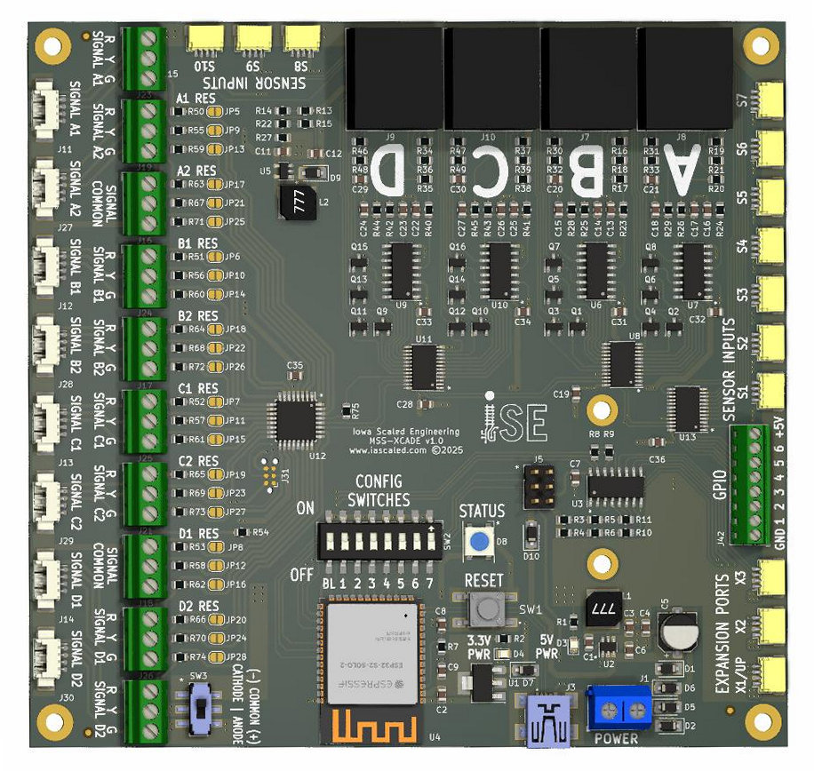

# Block Signal Custom User Manual {align=right style="height: 75px; margin-top:0px; margin-bottom: 0px"}

!!! warning
    This is an advanced product designed as a hardware platform for users comfortable with programming and debugging C++ code in the Arduino environment who want to signal complex trackwork.  It is not "plug and play" and will completely frustrate and befuddle the average modeler.   By default, it will just sit there doing nothing.  It will only do something once you write software to make it work.

## Overview

The Iowa Scaled Engineering [Block Signal Custom](https://www.iascaled.com/store/MSS-XCADE) is designed to allow advanced users to create their own MSS-compatible signal logic for complex interlocking scenarios.  It's based around an ESP32-S2 and programmable through the Arduino environment using the onboard USB port, balancing computing power with user-friendliness.

It is fully compatible with the [Modular Signal System (MSS)](../index.md) standards, and provides what the MSS standard calls a "complex cascade."

### Features
* Fully user-programmable signal logic to accomodate nearly any sort of complex trackwork
* Powered from 8V to 24V DC, AC, or DCC power.
* Designed to be programmed in the Arduino environment for user friendliness
* Four software controlled MSS ports (approach diverging is MSS 3.x only)
* Controls up to eight signal heads
* Up to ten sensor inputs from TrainSpotter or ATOM block detectors
* Six 5 volt GPIO lines
* Expandable to up to one master and 3 expansion units, for a total of 16 MSS ports, 32 signal heads, 40 sensors, and 24 GPIO lines
* WiFi-capable, as it's based on an ESP32-S2
* Expansion header for CAN (such as LCC) or RS485 (such as NCE Cab Bus or C/MRI) networks
* Onboard signal coprocessor offloads signal head driving tasks, such as doing realistic fading and handling common anode vs. common cathode signals.

---

## User Guide

For now, there really isn't one.  This isn't a "plug and play" sort of product, but a foundation to build your own stuff intended for advanced users with some experience in embedded programming and MSS signals.  Best I've got for you for now is the [Developer's Guide](developer_guide.md).

---

## Specifications

**Input Power:**  8 to 24 volts DC, AC, or DCC  
**Input Supply Current:** Lots of milliamps (typical)  
**MSS Standard Compatibility:** 1.x, 2.x, and (proposed) 3.x  (see note 1)  
**Size:**  5.25"(L) x 5.0"(W) x 0.5"(H) (main board)

Note 1:  The diverging approach line on the MSS-XCADE hardware is active low and pulled high.  This means it's only compatible with the draft MSS 3 specification, and not compatible with MSS 2.x implementations of diverging approach.

---

## Open Source 

Iowa Scaled Engineering is committed to creating open designs that users are free to build, modify,
adapt, improve, and share with others.

The design of the MSS-CASCADE-BASIC hardware is open source hardware, and is made available under the
terms of the [Creative Commons Attribution-Share Alike v3.0 license](http://creativecommons.org/licenses/by-sa/3.0/). 
Design files can be found in the [mss-cascade](https://github.com/IowaScaledEngineering/mss-cascade) project on 
GitHub.  Because the MSS-CASCADE project contains multiple types of block signal modules, look in the mss-cascade-basic directories when available.

The firmware for the MSS-CASCADE-BASIC is free software: you can redistribute it and/or modify it under the 
terms of the GNU General Public License as published by the Free Software Foundation, either [version 3 of the 
License](https://www.gnu.org/licenses/gpl.html), or any later version.
