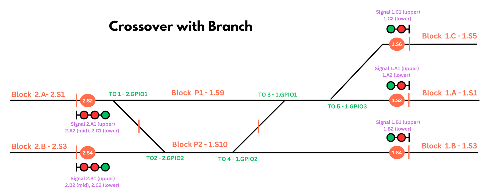

# Block Signal Pro - Crossover w/Branch Kit {align=right style="height: 75px; margin-top:0px; margin-bottom: 0px"}

## Overview

The SimpleSig Block Signal Pro Crossover Kit contains all the needed parts to signal a single or double crossover between two main tracks, with a branch or third main line coming off after the crossover.

The kit includes:

* Block Signal Custom board with Block Signal Pro firmware
* Block Signal Custom expansion board with connector cable
* 5x TrainSpotter infrared detectors
* 7x ATOM DCC block detectors
* 12x 8-ft. 3-wire sensor cables

---

## Supported Track Configurations

The Crossover w/Branch Kit supports a single or double crossover between two main tracks, along with a branch line diverging after the crossover.   Please refer to the [Reading the Diagrams](common.md#reading-the-diagrams) section of the common documentation for details on what all of the elements of the diagram mean.

### Notes

Note that all of these supports direction inputs from each individual turnout.  This is most prototypical, since a real signal system would verify that each turnout is aligned properly before displaying clear signals, and prevents the case where an operator throws one and forgets to throw the other.  If your turnouts are tied such that they only throw as pairs, you can wire both inputs to one turnout's contacts or the other.

For configurations only using a single crossover leg, the turnout inputs for the unused crossover can just be left disconnected.  The board will always interpret them as lined normal, and thus it works as if that crossover leg doesn't exist.

Your crossover may look different than pictured - it might be flipped or rotated.  However, just rotate the diagram until it lines up with how your track looks, and connect appropriately.

---

## Quick Start Guide

To get started, follow the common [Quick Start Guide](common.md#quick-start-guide).  

### Configuration

To get started on initial configuration, again please refer to the common instructions for [Initial Configuration](common.md#initial-configuration).  When you reach the section about configuration, select either "Single Crossover" or "Double Crossover" from the Predefined Configurations as appropriate.  Otherwise, all of the rest of the common configuration instructions apply.

!!! info "Start with Defaults!"
    Defaults are there for a reason.  I highly recommend just starting with the defaults first, since then you have a known baseline configuration.  You can then go in and change settings one at a time and then hitting save,  allowing you to make sure each change is exactly what you want.

### Signals 2.A and 2.B

By default, these signals are configured as triple-headed signals, giving a high speed (normal, straight through) route, a medium speed route through the crossover, and a low speed route down the branch.  

If you are only using 2-headed signals for one or both of these, connect the heads to the upper and middle (for the lower head) ports indicated.  Then go into the configuration's [Aspect Customization](common.md#aspect-customization) section for those signals and change those signals to put the non-red aspect on the middle head rather than the lower.

### Specific Configuration Options

#### Approach Lighting

If enabled, Approach Lighting will cause signals to be dark until a train is within one block of the interlocking plant.  By default, all signals are constant-lit.

#### 2 Block Approach Lt

Similar to Approach Lighting, this will cause signals to be dark until a train is within *two* blocks of the interlocking plant.  By default, all signals are constant-lit.  If both Approach Lighting and 2 Block Approach Lt are enabled, the two block behaviour takes precedence.

#### Invert Turnout X Input

Normally, the board expects a given turnout position GPIO input to be grounded if the turnout is set diverging/reverse.  Using these controls, you can invert this behaviour for any or all turnouts, so that the GPIO is grounded if the turnout is set normal/straight.  This accomodates cases where your switch machine contacts may be set up backwards of what the board expects and it's hard to change them.

#### IR Sensor Off Delay

Many applications benefit from some additional delay between when the IR sensor last detects something to when it reports as "off".  This can often fix cases where you get brief invalid signal indications because it's lost track of the cars.  

This slider allows you to add a variable turn-off delay to the IR sensors.  5 seconds is usually a good starting value.
