# Block Signal Pro - Common Instructions {align=right style="height: 75px; margin-top:0px; margin-bottom: 0px"}

While the Block Signal Pro kits are designed to solve many different common complex track configurations, they all share a lot of commonality.  The basic setup and configuration is largely the same for all of them.  This document holds all of the common elements, so we don't have to keep them up to date in each individual configuration.  

Please refer to your specific kit's documentation first, and it will call out the parts that are different.  For the parts that are common, it will lead you back here.

---

## Quick Start Guide

### Step 1 - Plan Your Installation

Pick the diagram above that matches your track configuration, and then refer to the [Reading the Diagrams](#reading-the-diagrams) section of the Getting Started document.  Then you can start planning block gap locations and block detector wiring, where the IR sensors will be mounted, where the signals and various boards will be located, etc.

### Step 2 - Install Main Board

As part of your planning, figure out where to best mount the main Block Signal Pro board and any expansion boards.  This should be somewhere that allows relatively easy access for wiring and maintenance, and allows the 8ft sensor cables to reach all of the necessary TrainSpotter and ATOM sensors.  

!!! warning "Turn The Power Off!"
    All wiring should be done with the power off.  The power should only be turned on while testing your work, and then immediately shut off again.  This significantly reduces the chances of accidentally slipping and causing a short circuit that damages the board, the block detectors, or the signals.

The board requires 8 to 20 volts of DC, AC, or DCC power.  Connect the power wires to the **POWER** terminal block on the master board, and it will regulate and feed all of the other attached boards.

*Please do not use anything that could be described as a "model railroad power pack" - these are terrible power supplies and will often damage electronics.  They were designed to run motors and light bulbs, and are terrible for everything else.*

Once the power leads are connected, test that the board powers up correctly - the two green power LEDs should turn on, and the status LED should begin blinking blue.  Once that's verified, shut the power off again.

### Step 3 - Install Expansion Boards

Most configurations will only have the single master board.  This allows for up to 4 MSS ports, 8 signal heads, 10 sensors, and 6 general purpose input/output lines.  

Expansion boards, which provide more MSS ports, signals, sensors, and GPIO, can be plugged into the X1, X2, and X3 ports on the mater.  Expanders look a lot like the master board, but can be identified in that they lack the main microprocessor, USB connector, and configuration switches.  They also only have a single connector in the expansion connector section, in the X1/UP position.  

If your kit doesn't include any expansion boards, then you can skip this and move to the next step.  If your kit includes expansion boards, this is the time to mount and wire them.

The cables between the Block Signal Pro master board and any expanders should not be lengthened beyond the 18 inch length provided.  They're succeptable to interference, so it's best to keep them short and away from any power wiring.

The expander plugged into X1 becomes board number 2, X2 becomes board number 3, and X3 becomes board number 4 for [board number](#board-number) purposes.

Here's how a master would be plugged in to up to three expansion boards.  As mentioned, depending on your kit, it may not include any, or it only may include one or two.

[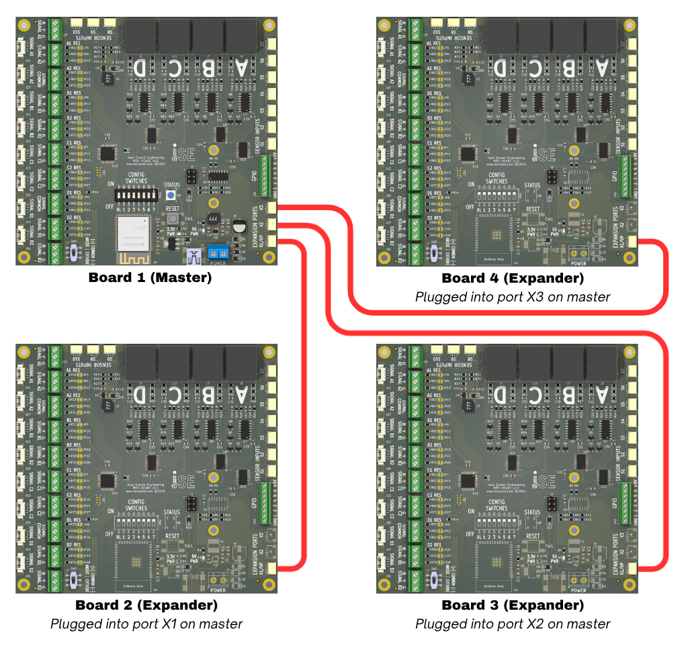](img/multi-board.png)

### Step 4 - Install ATOM Detectors

For each block, isolate one rail and install the appropriate block detector.  

All of the feeders for the detected rail in a block must pass through the current transformer in the ATOM block detector as shown below.  Only make one pass through the current transformer (the black tombstone-looking item), and only pass the feeders to one rail through it.  Making multiple turns around the transformer or passing both sets of feeders through will cause the detector to not work properly.

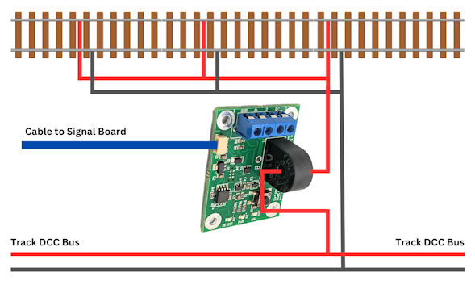

Install ATOM detectors as needed and use the included 8 foot cables to connect them into appropriate sensor connector as indicated in the diagram.

### Step 5 - Install TrainSpotter Detectors 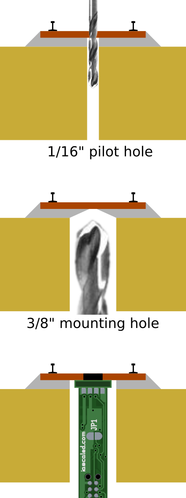{align=right style="width:20%; margin-left:20px; margin-bottom:10px"}

The TrainSpotters provides optical detection, and when used with the ATOM current detectors, provide reliable signaling without requiring resistor-equipped axles on all rolling stock.

They should be placed as shown on the track diagram for the configuration you'll be using.  Once mounted, use one of the included 8 foot sensor cables to connect the TrainSpotter to the appropriate sensor connector, as shown on the track diagram.

For home layout use, the TrainSpotter may be omitted if all of your cars have resistor-equipped axles and you want to depend entirely upon current detection.  

### Step 6 - Turnout Position GPIO Lines

Most configurations of the Block Signal Pro kits will involve turnouts.  For each turnout, the controller needs to know the whether the turnout is normal (lined for the main, usually straight) or diverging/reversed.

To detect this this, contacts on either a power switch machine or manual ground throw are needed.  The contacts are a switch.  One side should be connected to the **GND** terminal on the GPIO terminal block.  The other side should be connected to the appropriate **GPIO** terminal based on the track diagram for your configuration.   These switch contacts should be closed (aka connected) when the turnout is set to the reverse/diverging direction, and open when the switch is set to the normal position.  

Here's an example showing how you might wire a Circuitron Tortoise switch machine.  Other switch machines will vary.

[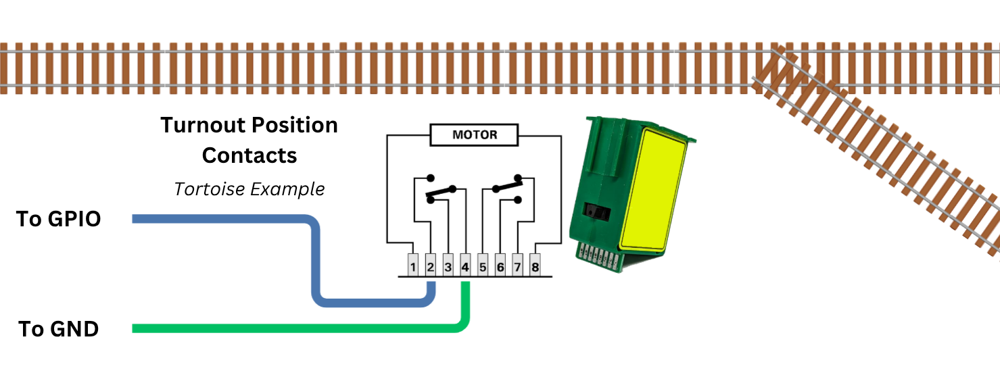](img/tortoise-contacts.png)

!!! warning "GPIO Voltage Limits"
    Never, ever expose any of the GPIO lines to a voltage below ground or of more than 5 volts DC.  It will instantly damage the board, likely in a way that cannot be economically repaired.  Also, for any GPIO used as an output, they can only source or sink a maximum of 10 milliamps.

### Step 7 - Signals

The placement of signals is going to be quite different based on what track configuration is being used.  Please refer to the track diagram for exact placement.  

!!! info "Common Anode vs Common Cathode"
    The Block Signal Advanced supports both common anode (positive) and common cathode (negative) signals, but all of the signals connected must be of one type or the other.  Mixing common anode and common cathode signals on the same board is not supported.

Each signal head on the diagram should be labeled with which signal port it plugs into, such as A1, B1, C2, D2, etc.  For Atlas signals and those using compatible Molex Picoblade connectors, connect those directly to the corresponding connector on the board.  For wire-in signals, use the terminal blocks for the red/yellow/green leads, and the "SIGNAL COMMON" terminal block for the common anode (positive) or common cathode (negative) lead.  

Congratulations!  You've now got the hard stuff done!  Now it's time to do a little configuration and you're ready to start railroading!

----

## Configuration

### Power

The device doesn't need to be powered from the layout to configure it, but it does need power.  You can obviously do this by providing 8 to 20 volts DC/AC/DCC to the power input terminal block.  You can also plug the mini USB connector on main board into your computer or a USB power supply using an appropriate cable.  This makes it easier to get everything configured before it's under the layout and all wired up.

### Connecting to WiFi

Configuring the Block Signal Pro is done via WiFi and a web browser.

First, turn on Config Switch 1.  The status LED next to it should start blinking yellow.  This will indicate your Block Signal Pro is now creating a WiFi network you can attach to with a phone or laptop.  

[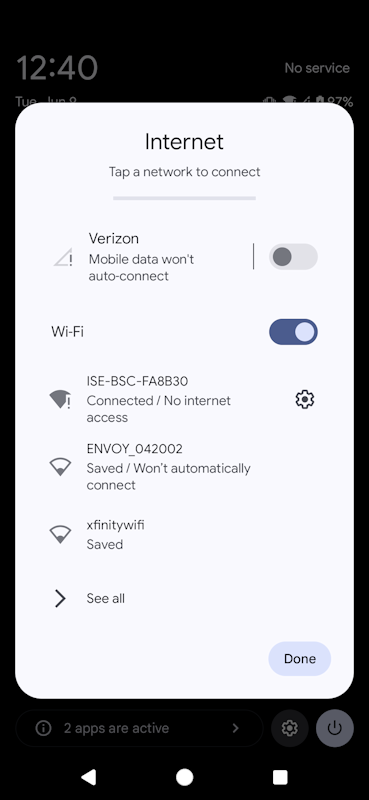{align=right style="height: 200px;"}](img/phone-wifi-connect.png)

By default, this network will be named "ISE-BSC-XXXXXX" where XXXXXX is the last six hex characters of the module's unique identifier.  If you rename your module using the "Module Name/SSID" setting in the Basic Info tab, it will change the WiFi network name.

Connect to this network.  Your device may give you some warning about the WiFi network not having internet access.  Just ignore it and continue.

Open a browser and connect to 192.168.1.1 and you should get a screen similar to the ones shown below.

[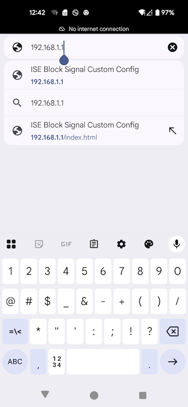{style="height: 200px;"}](img/phone-connect-ip.png) [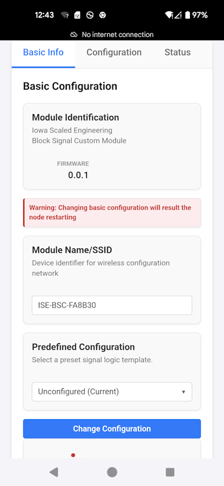{style="height: 200px;"}](img/phone-basic-info.png)

### Basic Configuration

Once you've connected, the most important thing to set is the "Predefined Configuration".  This is the built-in logic for however your track is configured.  Once you set this and hit the "Change Configuration" button at the bottom, the device will reboot into the selected configuration.  It will briefly drop the WiFi network in the process.  Depending on your device, you may have to reconnect.

### Detailed Configuration

Once you've picked the predefined configuration that you want to use, you'll get a Configuration tab that has all of the various options for that track configuration.  This is where you can select options such as approach lighting, searchlight emulation, or set specific nuances of the track configuration.  You can also customize the signal aspects shown on each mast for each SimpleSig/MSS indication.

### Disable WiFi

Once you're done, turn Config Switch 1 back to off.  This disables the WiFi network and prevents anybody from messing with your configuration.  The status LED should stop blinking yellow and start blinking blue again.

!!! warning "Secure Your Block Signal Pro!"
    The module itself does not have any sort of security, such as a password or anything else.  The anticipated use case is that you will turn on the WiFi, configure the module, and then shut it off again to prevent any further configuration changes.  Please don't forget to shut it off when you're done to keep your module secure!

---

## Signal Configuration

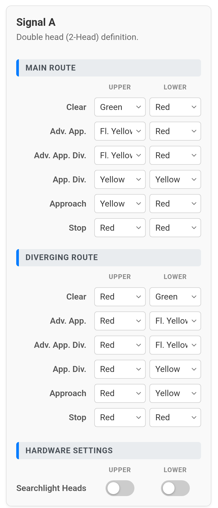{align=right style="width: 300px;"}

The Signal Configuration boxes allow you to change the behaviour of the signal heads on any given mast, allowing for customization of the aspects displayed for various conditions, and allowing you to turn on searchlight emulation (with red flashes and bounce, modeling a prototype searchlight head relay) or leaving it to the default 3-light configuration.

### Aspect Customization

The Modular Signal System standard is capable of sending six indications through the wire:  Clear, Advance Approach, Approach, Advance Approach Diverging, Approach Diverging, and Stop.  In addition, in complex interlocking plants like the Block Signal Pro kits are designed to handle, more information is mixed in based on how the turnouts are set to route through the plant.  

Most configurations will allow you to modify the aspects displayed on the signal heads for each configuration.  For example, if one path through a crossover leads to an unsignalled yard track, most prototypes would not display a clear signal.  You may want to display a restricting aspect, such as flashing red over red.  The signal configuration screen allows you to do this.

For signals that sit ahead of multiple routes, there may be multiple sections, one for each potential route.  In the example shown on the right for a double-headed signal, it has independent configurations for the main and diverging routes.

### Searchlight Heads

At the bottom of any signal configuration box is a toggle to set any or all of the heads as searchlights.  By default, this is off.  This sets it up emulate the operation of typical signal heads with three independent sets of lights, arranged either vertically or in a triangle configuration on most railroads.  (Or, in the case of Pennsylvania position lights or B&O/N&W color position lights, drive two lights around the outside of a disk.)  Regardless, the logic will fade one in as the other fades out.

Searchlight-type signals, such as the Union Switch & Signal types H, H2 and H5 as well as the General Railway Signaling SA type, used a signal lamp with a set of mechanically-changed color filters inside known as roundels.  Three roundels were mounted on an armature that could be moved by two electromagnetic coils.  When unenergized, the arm sat in the middle and placed the red filter in front of the single lamp.  Green would be on one side, and yellow on the other side.  By energizing the coils, it would pull the arm either left or right and place either yellow or green in front of the lamp.

This leads to interesting effects when changing aspects.  When going between yellow and green, you'll get a couple quick red flashes as the armature moves from one side through the red glass in the center to the other side, and then usually bounces once or twice.  Going from red to either yellow or green will result in a bit of flickering as well as the armature bounces around before settling.  The Block Signal Pro emulates this rather precisely.  If the "Searchlight Heads" toggle is on, this bouncing and flashing will be reflected in the signal output giving a very prototypical appearance to model searchlight signals.

---

## Status / Diagnostics

Most configurations have a "Status" tab on the screen.  Selecting this will allow you to see the current status of all of the board's sensors, MSS connections, and GPIO states.  This can be helpful when debugging problems.

### MSS Ports 

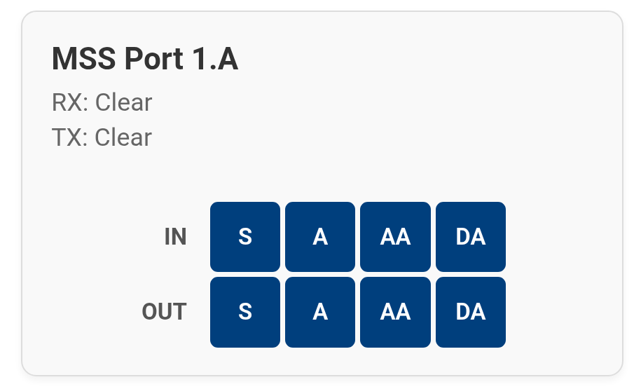{align=right style="height: 200px;"}  MSS Ports will have a block that looks like the one to the right.  It shows the indications being both received (RX:) and transmitted (TX:) on that port, in addition to the individual wire states.  

For the RX and TX indications, the potential options are:

* Clear
* Advance Approach
* Approach
* Advance Approach Diverging
* Approach Diverging
* Stop

For each of the individual signals being sent and received over the Modular Signal System bus, they will show blue if inactive/false or orange if active/true.

### Sensor Inputs

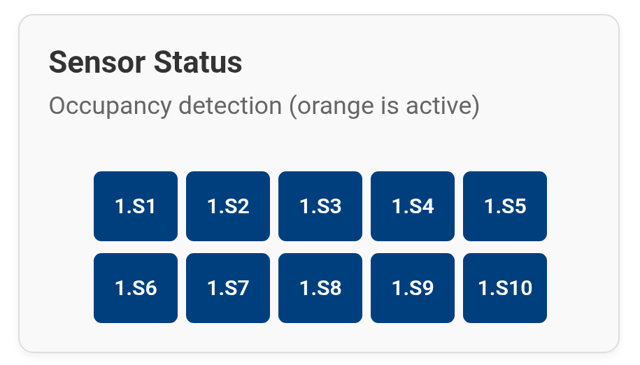{align=right style="height: 200px;"} For the sensor inputs important to a given track configuration, the Status screen will show an array of sensor input blocks.

For an sensor that is not detecting anything, the box will remain blue.  If a sensor is activated, the box will show orange.

If you are getting false detection from an ATOM or TrainSpotter, this is an easy way to monitor the status of the various inputs while you poke around trying to diagnose the issue.

### General Purpose I/O

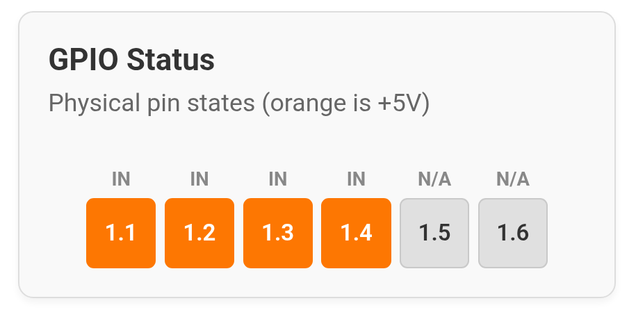{align=right style="height: 170px;"} The GPIO lines are used differently for every configuration, and thus the status block requires a little more interpretation by the user.

Above each block, there will be how that GPIO line is used by the track configuration.  It will be either IN for inputs, OUT for outputs, or "N/A" if the line just isn't used.  The blocks will be colored orange if high (+5V), and blue if low / near ground (0V).  

Inputs are internally pulled-up to 5V.  That's why if they're not connected, they show active.  These are often used to monitor turnout positions, and thus normally should show high if the switch is set straight/norm.  

---

## Factory Reset

Got yourself in a bind, or want to start over?  Just set Config Switch 7 to "ON" and hit the RESET button.  The Block Signal Pro will reset and rewrite its configuration back to factory default.

When the board is reset to factory defaults, the signals will slowly cycle from green to yellow to red and back to green again, over and over.

**Just remember to turn the switch back off, or it will factory reset every time it reboots!**

---

## Reading the Diagrams

### Board Number

If a solution involves a master Block Signal Custom board and one or more expander boards, then everything gets prefixed with a number and a dot.  

If it's not noted, then it assumes the master board (board 1).  This is just to help make things a bit quicker to refer to by removing information that's not needed in many configurations.

Board 2 would be the one plugged into expansion port X1 on the master, board 3 into port X2, and board 4 plugged into X3.

So, sensor port S1 on the master board can be noted S1 or 1.S1.  Sensor port 1 on the first expander would be 2.S1, and so on.  Likewise, MSS port A would be A or 1.A on the master, 2.A on the first expander, and 3.A on the second expander.

### Blocks

Blocks are physical pieces of track that need to be isolated and given current detection.  Block names on the diagram are labeled "Block N - S" in orange.  N corresponds the block name, and S is the corresponding sensor input.  The block boundaries are shown as orange bars across the track (black), showing roughly where gaps and electrical isolation needs to be placed.

If the name is a letter A-D, they are a block connecting to track beyond the interlocking plant.  That letter corresponds to their MSS port that connects on down the line.  These block names may also be preceded by a [board number](#board-number), such as "Block 2.B", meaning it's port B on the first expansion board, or "Block 1.A" meaning it corresponds to port A on the master board.

If they're labeled P and a number, they're a "plant block" - they're an isolated section of track within the interlocking plant that needs its own detection, but does not have a corresponding MSS port because they're completely contained within the interlocking.

S indicates where the ATOM DCC block detector for that track block should be plugged in.  Again, it may be preceded by a [board number](#board-number).  S3 or 1.S3 would be port S3 on the master board.  2.S6 would be port S6 on the first expansion board.  

Here's an example showing a simple single crossover.  Block P1 is highlighed in light blue, and block P2 is highlighed in light green.  The ATOM detector on Block P1 would plug into sensor port S9 on the master board, and Block P2's ATOM would plug into port S10.

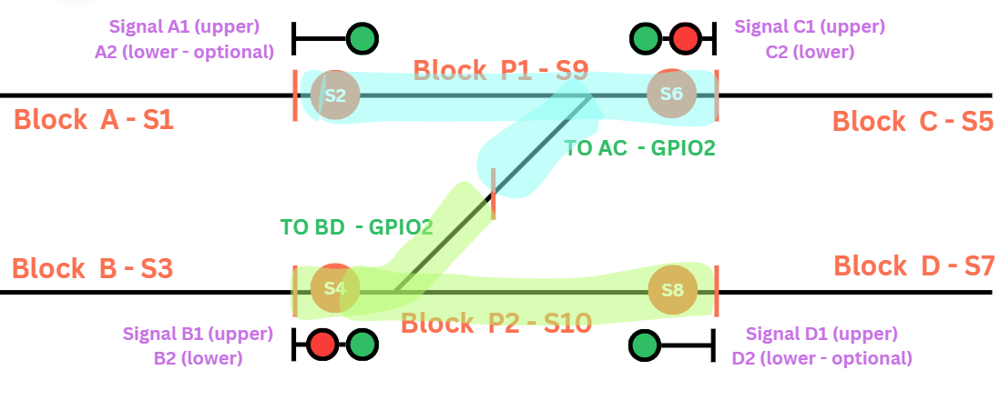

### Optical Sensors

There will be orange circles on the diagram over the black track lines.  These correspond to where the TrainSpotter infrared sensors should be located on the track.  Usually they're very near (or at) the block gap locations where the mainlines come into the interlocking plant.  If they're drawn right next to a gap (indicated by an orange line across the track), they can be located at the same spot.  They're just spaced on the diagram so you can clearly see both.  

Again, they'll have a sensor port number, showing where to plug them in.  In the above example, you see that S4 should be located near the gap between block B and P2, which should be roughly even with where the home signal is located on the lower track.  There's also S8, which is co-located with the gap on the other end, between P2 and D, and S2 and S6 on the upper mainline.

### Signals

Signals will be shown on the diagram with one or more heads (colored round circles on a black line representing a signal mast) and a base (a vertical black line) indicating which direction the signal faces and where it should be located.

Each signal head will have a purple note indicating which signal port it should be connected to on the board.  These are named A1, A2, B1, B2, etc. coresponding to terminal blocks or a connector (for Atlas and compatible signals) on the board.  Again, it may be preceded by a [board number](#board-number) if the signal solution involves one or more expander boards. 

Here's an example.  As you can see, there are four double-headed signals in this compact double crossover.  Let's look at the one up top on the left.  It's facing left, given which way the base is shown, so that right-bound trains will see it.  It should be roughly even with the track gaps and optical sensor located to the left of the upper left turnout.  The upper head should be connected to port A1, and the lower head to port A2.

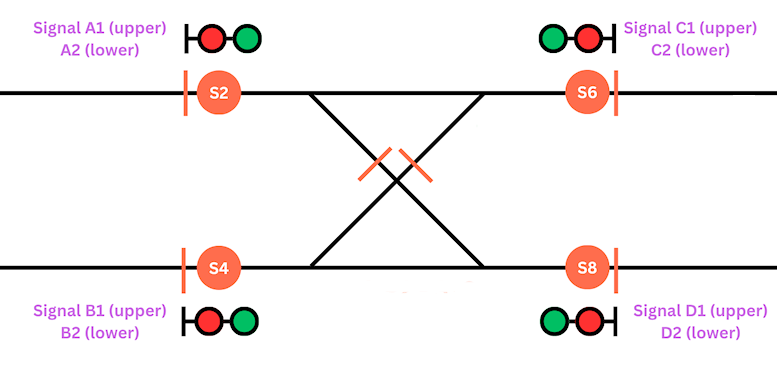

### General Purpose I/O

Nearly every solution will require use of the general purpose I/O lines.

The most frequent use you will see is to use them as inputs to read the position of turnouts.  Normally this is done by using a set of contacts on the switch machine to ground the GPIO line when the switch is reversed and leave it floating (disconnected) when the switch is normal.  However, usually this can be inverted in the web configuration interface if the switch machine contacts only work the other way.

GPIO pins are named very similarly to sensor ports- GPIOn, where n is between 1-6, as marked on the terminal block on the board.  Like everything else, they can be preceded by a [board number](#board-number) if a solution involves expansion boards.

!!! warning "GPIO Voltage Limits"
    Never, ever expose any of the GPIO lines to a voltage below ground or of more than 5 volts DC.  It will instantly damage the board, likely in a way that cannot be economically repaired.  Also, for any GPIO used as an output, they can only source or sink a maximum of 10 milliamps.

----

## Specifications

**Input Power:**  8 to 24 volts DC, AC, or DCC  
**Input Supply Current:** Lots of milliamps (typical)  
**MSS Standard Compatibility:** 1.x, 2.x, and (proposed) 3.x  (see note 1)  
**Size:**  5.25"(L) x 5.0"(W) x 0.5"(H) (main board)

Note 1:  The diverging approach line on the MSS-XCADE hardware is active low and pulled high.  This means it's only compatible with the draft MSS 3 specification, and not compatible with MSS 2.x implementations of diverging approach.

---

## Open Source 

Iowa Scaled Engineering is committed to creating open designs that users are free to build, modify,
adapt, improve, and share with others.

The design of the MSS-ATLASADAPTER hardware is open source hardware, and is made available under the
terms of the [Creative Commons Attribution-Share Alike v3.0 license](http://creativecommons.org/licenses/by-sa/3.0/). 
Design files can be found in the [mss-atlasadapter](https://github.com/IowaScaledEngineering/mss-atlasadapter) project on 
GitHub.