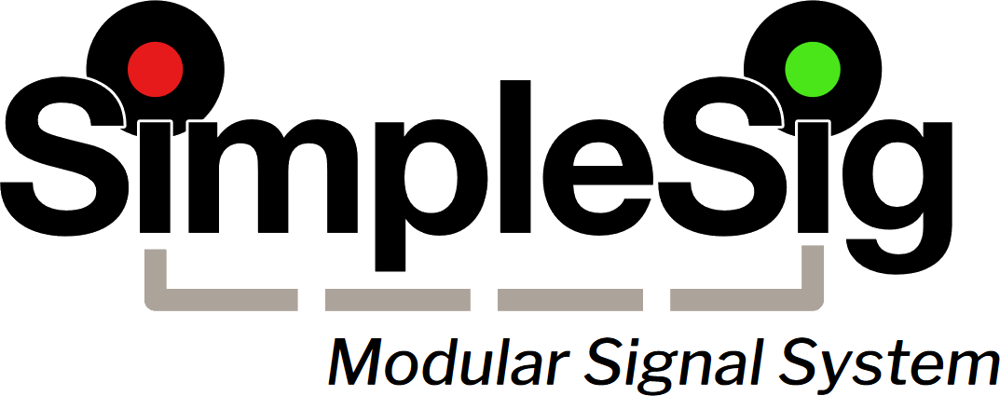
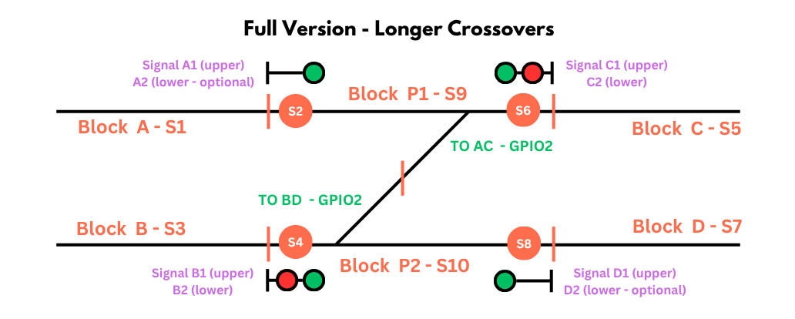
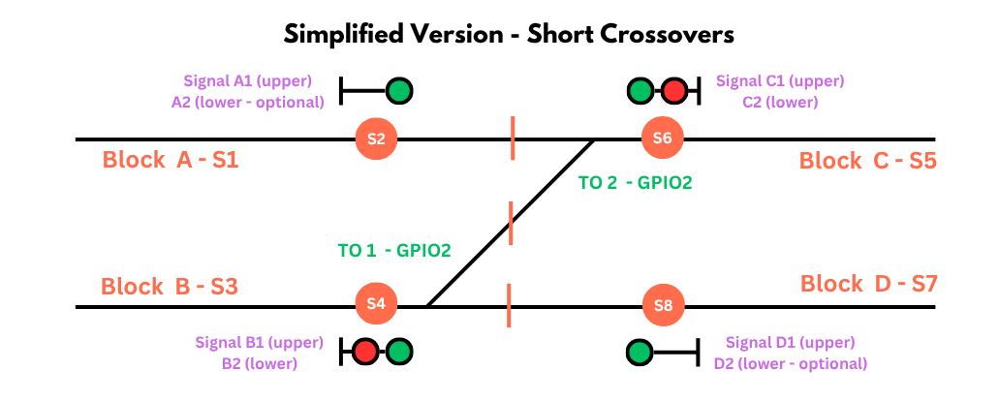
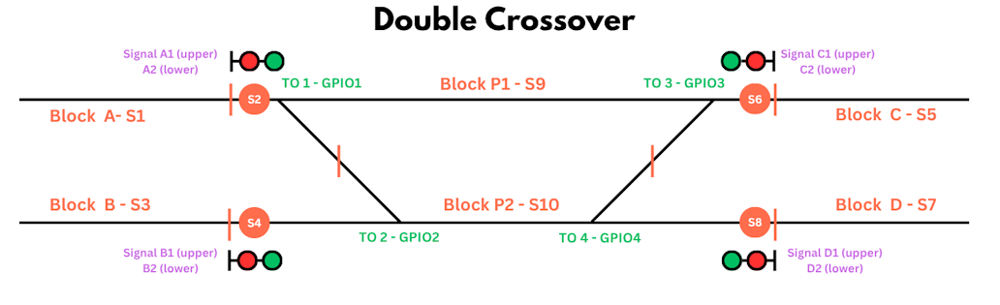
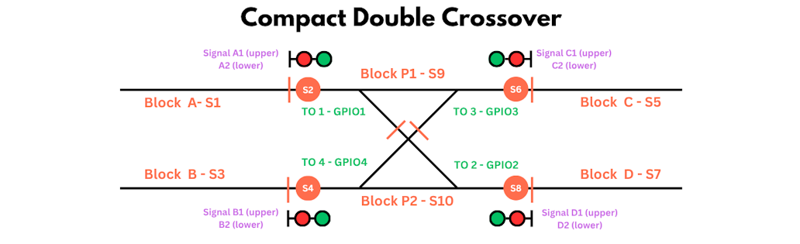
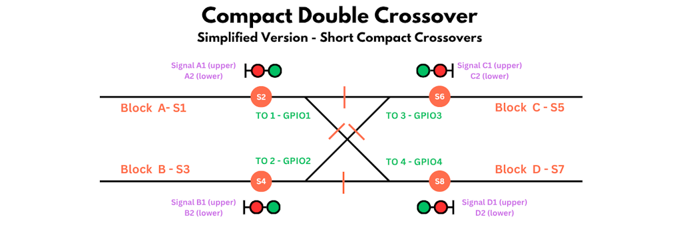

# Block Signal Pro - Single/Double Crossover Kit {align=right style="height: 75px; margin-top:0px; margin-bottom: 0px"}

## Overview

The SimpleSig Block Signal Pro Single/Double Crossover Kit contains all the needed parts to signal a single or double crossover between two main tracks with SimpleSig / MSS-compatible signals.

The kit includes:

* Block Signal Custom board with Block Signal Pro firmware
* 6x TrainSpotter infrared detectors
* 4x ATOM DCC block detectors
* 10x 8-ft. 3-wire sensor cables

---

## Supported Track Configurations

The Single/Double Crossover Kit supports the following different track configurations.  Please refer to the [Reading the Diagrams](common.md#reading-the-diagrams) section of the common documentation for details on what all of the elements of the diagram mean.

### Standard Single Crossover

For most single crossovers, this is the recommended configuration.  It requires two plant blocks, one for each mainline between the signals.  This assures optimal detection throughout the plant.  

Select "Single Crossover" from the Predefined Configuration list.

### Simplified Single Crossover

For very short single crossovers, or for cases where cutting in two plant blocks (one for each main) is not feasible for whatever reason, an alternate configuration can be used as shown below.  This has the disadvantage that it can "lose" short trains - those shorter than the distance from the optical sensors to the gaps in the center of the crossover - and may return a false clear signal.  That's why it's only recommended for very short crossovers.

Select "Single Crossover" from the Predefined Configuration list.

### Standard Double Crossover

For most North American-style double crossovers, this is the recommended configuration.  It requires two plant blocks, one for each mainline between the signals.  This assures optimal detection throughout the plant.

Select "Double Crossover" from the Predefined Configuration list.

### Compact Double Crossover

In extremely tight spaces, a "compact double crossover" may be used that has a diamond at the center.  These are far more common in passenter terminal yard throats or on interurban / light rail systems than they are on mainlines, due to the maintenace headaches and cost of the diamond in the middle.  Europe also uses them significantly more often due to space constraints.  

They show up on model railroads with some frequency, and the support for them is only a minor modification to the standard double crossover.  To use these, select "Double Crossover" from the Predefined Configuration list, and then be sure to enable the "Compact Double Crossover" in the configuration.

### Simplified Compact Double Crossover

Track-wise, this is the same as the Compact Double Crossover.  It eliminates the two plant blocks, however, for cases where isolating those pieces of track is not feasible, or where the double crossover is extremely compact.  This has the disadvantage that it can "lose" short trains - those shorter than the distance from the optical sensors to the gaps in the center of the crossover - and may return a false clear signal.  That's why it's only recommended for very short crossovers.

To use these, select "Double Crossover" from the Predefined Configuration list, and then be sure to enable the "Compact Double Crossover" in the configuration.

### Notes

Note that all of these supports direction inputs from each individual turnout.  This is most prototypical, since a real signal system would verify that each turnout is aligned properly before displaying clear signals, and prevents the case where an operator throws one and forgets to throw the other.  If your turnouts are tied such that they only throw as pairs, you can wire both inputs to one turnout's contacts or the other.

Your crossover may look different than pictured - it might be flipped or rotated.  However, just rotate the diagram until it lines up with how your track looks, and connect appropriately.

---

## Quick Start Guide

To get started, follow the common [Quick Start Guide](common.md#quick-start-guide).  

### Configuration

When you reach the section about configuration, select either "Single Crossover" or "Double Crossover" from the Predefined Configurations as appropriate.  Otherwise, all of the rest of the common configuration instructions apply.

### Specific Configuration Options

#### Approach Lighting

If enabled, Approach Lighting will cause signals to be dark until a train is within one block of the interlocking plant.  By default, all signals are constant-lit.

#### 2 Block Approach Lt

Similar to Approach Lighting, this will cause signals to be dark until a train is within *two* blocks of the interlocking plant.  By default, all signals are constant-lit.  If both Approach Lighting and 2 Block Approach Lt are enabled, the two block behaviour takes precedence.

#### Compact Double Crossover

(Double Crossover Only)  If using a Compact Double Crossover, enable this option.  This will cause signals to display stop if both crossover routes are lined at the same time.

#### Invert Turnout X Input

Normally, the board expects a given turnout position GPIO input to be grounded if the turnout is set diverging/reverse.  Using these controls, you can invert this behaviour for any or all turnouts, so that the GPIO is grounded if the turnout is set normal/straight.

