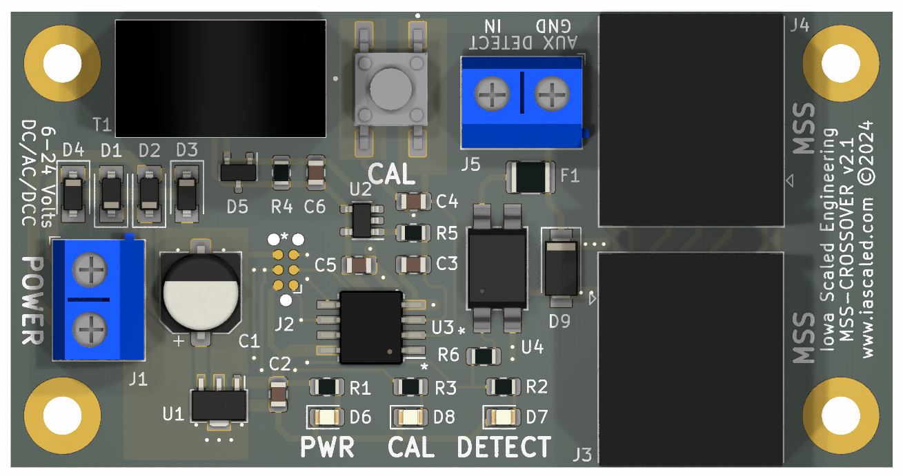
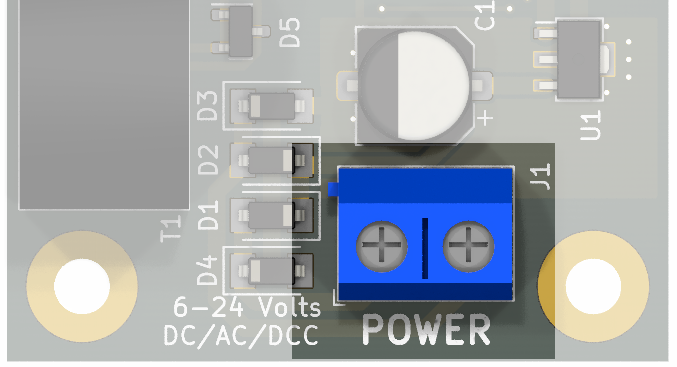
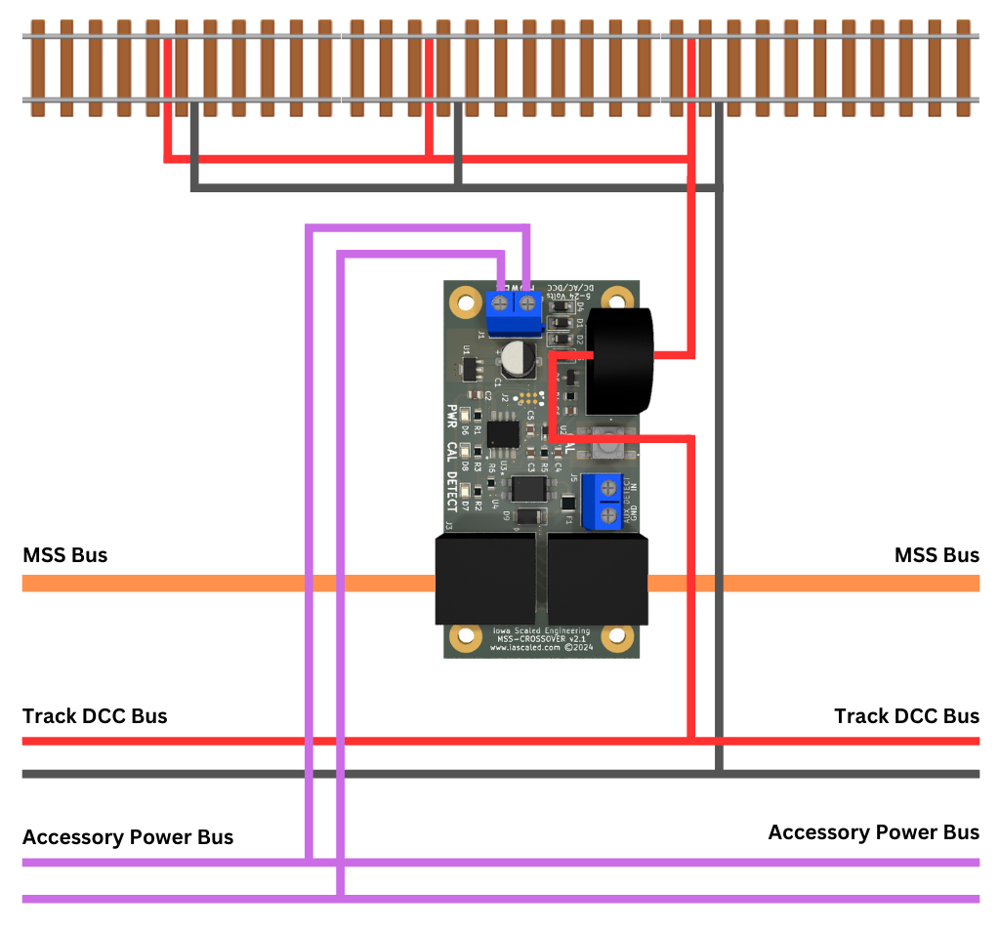
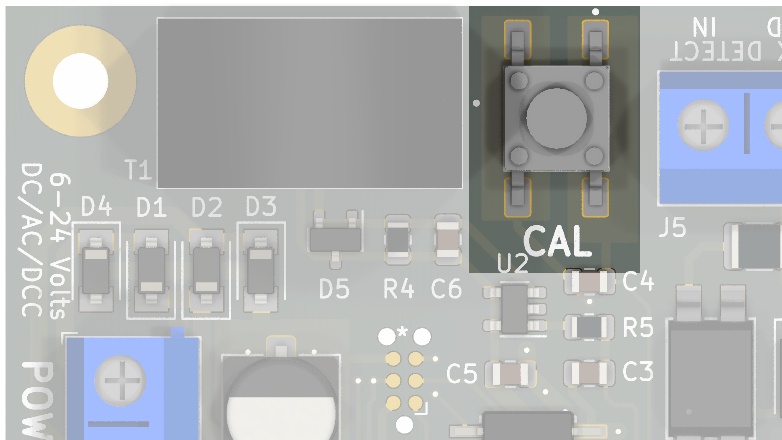
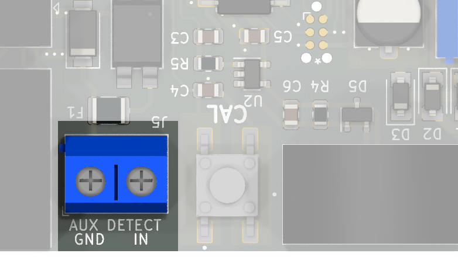

# Crossover Detector User Manual {align=right style="height: 75px; margin-top:0px; margin-bottom: 0px"}

## Overview

The Iowa Scaled Engineering [SimpleSig Crossover Detector](https://www.iascaled.com/store/MSS-CROSSOVER) is a Modular Signaling System (MSS)-compliant current-based block detector for model railroad layout modules.  It is a complete “crossover” unit described in the [Modular Signal System (MSS)](../index.md) standard.

It is intended for use on modules that require block detection to participate in layouts where MSS signaling is in use, but the module itself does not have signals.

### Features

* Rock solid DCC current detection based on our [ATOM detectors](../../ATOM Block Detector/manual.md)
* Single button sensitivity adjustment (no fiddling with tiny potentiometers!)
* Isolated using a current transformer
* Highly sensitive (1mA, or ~10k ohms) yet resistant to false detection
* Powered from 5V to 24V of AC, DC, or DCC, compatible with Free-Mo accessory power bus
* Onboard detection indicator LED
* 0.4s turn on and 2.5s turn off delay to eliminate glitching
* Robust, isolated MSS bus interface to protect against static discharge, overcurrent, ground loop, and reverse polarity issues

### Typical Applications

* Providing MSS block detection on FreeMo and FreeMoN modules for modules without signals, but wanting to participate in signaled setups

---

## Quick Start Guide

!!! warning "Turn The Power Off!"
    All wiring and setup of the board should be done with the power off.  This significantly reduces the chances of accidentally slipping and causing a short circuit that damages the board, the block detectors, or the signals.

### Step 1 - Power
The Crossover Detector needs 5V to 24V of DC, AC, or DCC power.  In a typical modular setup, this will come from the accessory power bus.  Connect power to the terminal block labeled **POWER**. Polarity is not important.

---

### Step 2 - Track Wiring

Both rails must be gapped at the ends of modules to assure that adjoining connected modules do not interfere with detection.

All of the feeders from one side of the track should be combined into a single wire and passed through the hole in the current transformer (the large black tombstone-shaped item) between the track and the connection to the track bus.  Only one pass through the hole is needed.  Multiple turns will lead to excessive sensitivity and false detection.  The feeders for the opposite rail should be directly connected to the Track (DCC) Bus.  See the simplified wiring diagram below for details.

---

### Step 3 - MSS

Connect MSS cables to the two MSS ports.  It doesn't matter which connects to which end of your module - they're reversable.

---

### Step 4 - Testing

Turn on both accessory and DCC track power.  If accessory power is correctly connected, the green **PWR** LED should light when power is applied

With nothing on the track, verify that the red **DETECT LED** does not illuminate.  If it does illuminate with nothing
on the track, either there's a flaw in the wiring, or you may have leakage current and need to do a recalibration.  (See [Leakage Current Calibration](#leakage-current-calibration) later on for details.)

If the red **DETECT** light is off as expected, then place a locomotive or resistor-equipped piece of rolling stock on the track.  The **DETECT** light should come on.  Remove the equipment and verify that the red **DETECT** light goes off after approximately 2.5 seconds.  

Congratulations!  You've now successfully installed the Crossover Detector!

---

## Leakage Current Calibration

The Crossover comes factory calibrated to detect a 1 milliamp load across the track.  However, depending on your module's construction, you may have leakage current.  This often results from slightly conductive ballast or ballast glue and higher humidity.  Fortunately, the Crossover Detector can calibrate out up to 10 milliamps of leakage current.  

If your block is empty and the red **DETECT** light is on, first make sure that your block is truly isolated from others and that no equipment is sitting on the block. Wiring mistakes or a piece of equipment sitting on the rails can often be mistaken for detection issues.

If you do need to adjust for sensitivity, press and hold the **CAL** pushbutton. You should see the orange **CAL** LED start to blink slowly. Once the **CAL** light stays on solid, release the switch. Within a few seconds, the CAL light should blink rapidly three times and the red **DETECT** light should go out, indicating that the calibration was a success. If the **DETECT** light does not go off, it is likely that you have either an error in your DCC wiring or excessively high leakage current in the block (rare).

---

## AUX DETECT Inputs

In cases were you may need to trigger detection in a block manually, such as using the auxilliary contacts of a switch machine to detect an open industry siding turnout off the mainline, you can wire directly into the **AUX DETECT** terminal block.  If these terminals are shorted together, they will trigger detection in the immediate block.  (This is done by connecting MSS pin 4 - the local block detection line - and MSS pin 5, ground.  These two MSS wires are brought out on the IN and GND terminals respectively.)   *NOTE:  The red **DETECT** light only illuminates if the DCC detector triggers.  It will not illuminate if the **AUX DETECT** pins are shorted together.*

!!! note warning
    Never apply power of any kind to the **AUX DETECT** inputs, or you may damage other connected MSS nodes.  The **AUX DETECT** terminals should only ever be connected to
    unpowered switch contacts or similar semiconductor devices (optocoupler transistor outputs, etc.)

---

## Robust Design

Unlike many MSS detection solutions, the Iowa Scaled Engineering Crossover Detector is specifically designed to withstand the rigors of modular layout use.  Modules are constantly being hauled around, subjected to static electricity, plugged into unknown MSS busses, and powered from long, noisy leads off unknown power supplies.  Our design is intended to protect the users against these dangers with ESD supression, overcurrent and reverse polarity protection, and isolation between the detector itself and the MSS bus to prevent ground loops from forming.

---

## Specifications

**Input Power:**  5 to 24 volts DC, AC, or DCC  
**Input Supply Current:**  20 milliamps (max)  
**Turn On Delay:**  0.4 seconds  
**Turn Off Delay:**  2.5 seconds  
**Sensitivity:**  1mA at DCC frequencies  
**MSS Standard Compatibility:** 1.x, 2.x, and (proposed) 3.x

---

## Open Source 

Iowa Scaled Engineering is committed to creating open designs that users are free to build, modify, adapt, improve, and share with others.

The design of the MSS-CROSSOVER hardware is open source hardware, and is made available under the terms of the [Creative Commons Attribution-Share Alike v3.0 license](http://creativecommons.org/licenses/by-sa/3.0/).  Design files can be found in the [mss-crossover](https://github.com/IowaScaledEngineering/mss-crossover) project on  GitHub.

The firmware for the MSS-CROSSOVER is free software: you can redistribute it and/or modify it under the terms of the GNU General Public License as published by the Free Software Foundation, either [version 3 of the  License](https://www.gnu.org/licenses/gpl.html), or any later version. Firmware for the MSS-CROSSOVER is shared with the CKT-BD1, and can be found in the [ckt-bd1](https://github.com/IowaScaledEngineering/ckt-bd1) project on GitHub.
