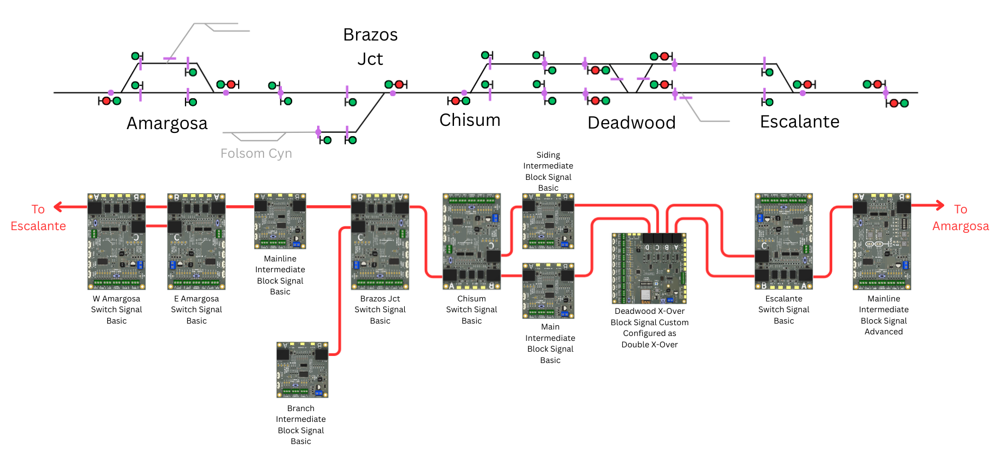
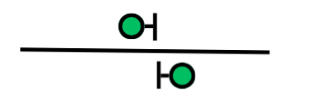
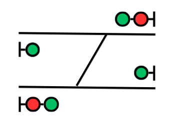
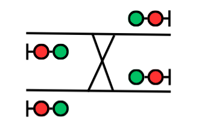

# Getting Started with Signals

We frequently get asked, "I want to put signals on my layout, what do I need?"  

**There is no simple answer to that question.**  

Within those simple twelve words are a nearly endless number of assumptions about those signals and an equally abundant number of questions about the details.  It's far too long of a discussion to have at a show, trying to shout across the table and over the ambient noise.  

This is meant to be a guide for those wanting to figure out how to add signals to their layout, and figuring out if our SimpleSig line is appropriate for your needs.

## The Three Big Questions

So you want to install signals on your layout, but don’t know where to start.  Great!  There's three "Big Questions" that you should be able to clearly answer before you proceed to any signal solution.  They're sort of a trinity, with the answer to each of them potentially affecting the others.  It's the whole joke about you can have any project good, fast, and cheap - pick any two, and they exclude the third.

It's about trade-offs - givens & druthers in model railroader-ese.  We'll explore each of these questions in depth, but I've included a few sentences to get you thinking about what I mean by each of these.

**Big Question 1: What do I want my signals to do?**

This is, by far, the most important question and the one you should start with.  You need to decide what purpose the signals on your layout serve and how you want them to operate.

Are they just a scenery element, and never change?  Do you just want to see a signals change, maybe in response to a train going by or a turnout changing?  Do you want to see your signals operate based on the movement of trains across the layout?  Do you want a system that models every prototype detail, up to and including tower operators and/or a dispatcher that can control movements using the signal system?

**Big Question 2: How much time and money do I want to spend on signals?**

All signals are going to require you to spend some amount of your modeling time and dollars, from the simplest animation up to the most complex, prototypical system.  The more complicated, the more expensive in both aspects.

Almost anything beyond making one signal change is going to require changes to your track wiring to divide the layout up into track blocks, each with detectors.  You're going to need to mount and wire signal logic to both the detectors and the signals themselves.  Some more complicated systems will require configuration, sometimes through switches but often with a computer.  

Note: Doing this all while you're designing or building the layout initially is going to be *massively easier* than trying to retrofit it on to an existing layout.  If you're building a layout now and thinking, "I'll put off signals until later" - just don't.  At least think and plan for them up front, even if you don't install anything until later on.

**Big Question 3: How comfortable am I with electronics?**

Signal systems - even those like ours where we have tried to make them simple - still require basic electrical skills like being able to follow a wiring diagram and likely take simple measurement with a meter.

Be honest with yourself here.  Nothing is more frustrating than getting in way over your head.  If you're not confident, start small, or ask a friend who is comfortable to help you through the parts that are confusing.

## What Do My Signals Do?

Above all, this is the reason that answering our initial question - "I want to put signals on my layout, what do I need?" - is really, really hard.  What you need depends on what you want your signals to do, so you need to figure that out first.

### Simple Use Cases

The "simple" use cases are those where you don't need a system.  Instead, the signals are all controlled by things that are local, and they don't talk to the next signal down the line.  These tend to be non-prototypical, but meet the needs of some modelers and are easy and relatively inexpensive.

#### Constant Lit

Some modelers just want a signal as a scenic element and want to see it shining away.  Find some power, hook up the right LED through a resistor to a power source, and you're good to go!

Except for distant signals - constant yellows that warn trains they're approaching a home signal (or stop sign) at a junction - these are exceedingly rare in the prototype world.  On the other hand, if you just want to see your trackside signals lit, you can't get easier than this!

#### Time-Based Animation

At one end of the scale are those who want to simply have a signal that changes color in response to a train going by.  I call these "time-based animation" because they're a timer - once a train passes, the signal eventually goes from red to yellow to green again.  That's what someone standing trackside would see on a block signal, but it's not driven by time - it's driven by the fact the train has exited the blocks ahead and the track is once again clear.

As such, these don’t really have any equivalent on the prototype at all, but are an easy way to make your scene a little more animated.  This is largely for folks who don’t want to build out an entire signal system, but want to see their signals change as if they were a trackside railfan. 

ISE currently doesn’t offer anything in this realm, though we are considering it.  For now, we’d recommend [Logic Rail’s Signal Animator/2](https://www.logicrailtech.com/sigani2.htm).

#### Switch Position Indicators

Another common thing I see on model railroads is the use of signals to indicate turnout positions.  Perhaps the signals at the frog-end of a switch would show green on the main and red on the siding if it were lined to the main, and would show the opposite if it were lined to the siding.  Or maybe it's just a dwarf signal in a yard that shows green if the switch is normal and yellow if it's reversed.

There are limited prototype examples of this.  Most of these are in yards with radio-controlled switches, and the lights help confirm to crews that they’ve lined the switches they want appropriately.  There’s a few mainline examples of this in the US and Canada, but they are almost always confined to otherwise dark (unsignalled) territory and are rare.  Iowa Interstate uses them on some mainline switches at major junctions, such as at South Amana and Bureau.  The Rio Grande had one at the east end of the Alamosa yard to tell crews if they were lined west into Alamosa or north up the Valley Line.  The White Pass & Yukon has recently installed signal point indicators (and radio-controlled switches) between Skagway and White Pass.  Apparently in Mexico there are some normal mainline searchlight-style signals that are essentially position indicators.

This use case can be both helpful while operating your layout and can typically be accomplished with some resistors and a spare set of contacts on your switch machine.

#### Train Order Signals

Railroad operations started from times in a published timetable, showing when trains would arrive at specific stations, and which trains needed to be clear of the mainline and by when.  These times gave scheduled trains authority to travel over the main line.  When things didn't go according to plan, train orders would be telegraphed out from the dispatcher to station agents, who would then set a train order signal at the station to tell an oncoming train to stop and receive new instructions.  

Train order signals are signals located at stations along the line where trains need to receive orders.  Usually they were a double-headed mechanical semaphore located right outside the station operator's bay window, but in later years they were often color light signals, particularly on western US roads.  Some only had two indications - good to go or stop and receive orders - and some had three.

These signals weren't part of a system, and did not have any knowledge of track occupancy or the next signal down the line, but this use case is absolutely prototypical for some eras.  With in the US, timetable and train order authority largely died in the 1970s.  In Canada, it lasted a bit longer - at least until the mid-1980s.  

On a model railroad, these can be controlled with simple rotary or toggle switches.  If a layout operates with a dispatcher, those can be wired back to the dispatcher's office, or if they're merely a scenic element they can be controlled right at the fascia.  Again, no complicated electronics needed.

### Signals As A System

Aside from train order signals, very few prototype signals exist by themselves.  Almost all exist within a system, designed to provide the safe and efficient movement of trains over hundreds of miles of track.  

That signal standing beside the track needs to know if there's a train in the next block and what the indication is on the next signal down the line.  If there's a train or an open switch in the next block, it needs to display stop.  If the next signal is at stop, it might need to display approach.  If it's a home signal at a junction and the dispatcher or tower operator hasn't cleared it, it might need to remain at stop.  If everything is safe, then it can display clear.  

The same is true for the next signal, and the signal beyond that, and so on.  

That means to model them, we also need a system.  Each signal needs to talk to the next one, and know about track conditions 2-3 blocks away.  We also need to think about signaling as a system.  Where would signals make sense on your layout, given how trains move?  Where would the prototype put them and how would they work?  

First, let's explore the three big classes of North American block signals.  

#### Automatic Block Signaling

Automatic Block Signaling (ABS) is how many people think of signals.  If a block is occupied, the signals protecting it show stop (red).  If the next signal down the line is stop, then a signal will show approach (yellow).  If the tracks are clear for at least two blocks, a signal will show clear (green).  (Sometimes add in a fourth indication of advance approach, warning crews that the next signal will be approach.)

The first variant of ABS appeared in 1872, with a simple system that would warn a train if the block ahead was occupied.  This allowed for multiple trains to safely occupy stretches of track spaced more tightly than timetable operations alone would allow, increasing the number of trains that could operate.  This was most commonly applied to double track with directional running, but could also be applied to single track as well.

ABS does not convey authority to occupy track.  Trains still needed authority to enter and travel over a section of track.  This could be done by timetable & train orders, or in later years by track warrants.  ABS is about if the track ahead is safe to enter.  It's designed to be an extra layer to prevent accidents if something goes wrong, such as a train being in the wrong place at the wrong time, or a broken rail ahead.  That's why you'll see a lot of clear (green) indications in ABS territory - clear track is safe to enter.

#### Absolute Permissive Block Signaling

Absolute Permissive Block Signaling (APB) is really an improvement on ABS, but a big one in terms of safety and what we’d see trackside.  

In ABS territory, two trains heading at each other on single track each other wouldn't be aware of it until they were a block or two apart and started seeing approach or stop indications.  This shouldn't happen because no two trains should have authority to enter a single section of track at each other, but humans make mistakes. Signals should make sure those mistakes aren't expensive or deadly.  There are a number of clever ways to configure ABS to make this safer, such as offsetting block signals for each direction, but none of them were perfect and could still wind up with accidents.  At the very least, it was going to wind up with long backup move for one of them to clear the main line.

Absolute Permissive Block signals were meant to solve this problem.  When a train left a station and entered a region of single track, all of the block signals in the opposite direction to the next siding would "tumble down".  Any opposing train trying to leave that station would see a stop signal before entering the single track, thus eliminating the problem.  

Again, like its older sibling ABS, APB does not grant crews authority to enter a section of track.  Only authorization from a dispatcher can do that.

#### Centralized Traffic Control

The above two systems start with a timetable, and then have a dispatcher monitoring reports from train crews and station operators to make adjustments to the schedule.  Those adjustments get telegraphed back to the station operators, who type them up and set train order signals to hand those orders up to the crews, who must interpret them and run their trains accordingly.  Sounds complicated, because it is.

The signal system knows where the trains are.  The train crews already observe signals to figure out how to operate their train.  Now let's just take all that stuff out of the middle - timetables, train orders, telegraphers, station operators, train order signals - and let the dispatcher directly communicate his wishes to the train crew.  Congratulations, you've invented Centralized Traffic Control (CTC).  

CTC first appeared on the New York Central in Ohio back in 1927.  It adds another layer on top of ABS/APB to convey movement authority directly from the dispatcher to a train crew.  It does this by adding the concept of control points – places along the line where the dispatcher specifically can set signals and turnouts to authorize movement over a route.  Usually these are at places like the end of a siding or a crossover between tracks.  

That sits on top of ABS or APB, however, where just because the dispatcher selected a route doesn’t mean you’ll get a clear signal unless the track is also clear.  If the dispatcher tries to line one train into the path of another, the ABS/APB parts of the system will still ensure safety.

#### Picking Your Signal System

Every prototype had their own nuances to the big three categories (ABS, APB, and CTC), and there were always weird exceptions.  Many tens of thousands of signal engineers and maintainers have made lifelong careers thinking about this stuff and making absolutely sure it performs safely and reliably, and tuning it to their employer's particular needs.  We’ve barely scratched the surface.  But, at the end of the day, these are model railroads.  If something doesn’t go quite right, usually the worst outcome is a bit of cursing.

Here’s the part where tradeoffs are made between Big Question 1, 2, and 3.  You have to ask yourself, “How much time and money am I willing to invest in signals, and what do I want to get out of them?”

All require a commitment to creating track blocks and installing detectors, logic, wiring, and signals, as well as doing some planning first.

ABS and ABS-like systems are by far the easiest and the most common.  There's quite a few ways to do this, but it can be accomplished without any computers, done in phases, and the results are easily understood by nearly anybody operating on your layout.  It's by far the easiest of the three.

APB is harder.  It's actually probably the least modeled of the three, at least as a standaline system.  We as modelers tend to compress our spaces between towns and even our towns themselves, resulting in a huge number of backup moves.  We also tend to create trackwork that the prototype would move heaven and earth - in many cases, a lot of earth - to avoid.  The combination of those elements means that the tumble-down logic can get screwed up in a hurry.

CTC requires a true commitment.  Setting up the logic can be complicated and will almost inevitably require a computer.  You'll need to either build a dispatcher's CTC panel, or use something like JMRI's PanelPro or CATS to do it virtually.  If you run operating sessions, it requires someone attentive to be a dedicated dispatcher.  Behind the scenes, you'll almost certainly have JMRI or some completely custom software running the show on a computer.

(I think there’s probably a joke here about if you’re doing CTC, you’ve moved from “you’ve made a commitment” to “you really should just be committed… in an institution.”   And as someone with a completely built-from-scratch CTC system on his own layout, I’m writing this article from my lovely white 8x8 foot padded room...)

#### SimpleSig for Home Layouts

Our SimpleSig line is “ABS-like” in that that provides ABS-style signal indications of how much track is clear ahead – 3 or more blocks gives you a clear signal, 2 gives you a clear or advance approach (your choice), 1 gives you approach, and something immediately ahead gives you a stop.  

The part where it’s “ABS-like” is that in places where normally you would have a control point, such as at junctions or the ends of sidings, the standard usually just routes ABS signals through the route selected.  So at the end of a siding, you’d only get a red signal if the switch was set against you or there was a train in the way.  Otherwise, you'd see greens for a clear route, etc.

We think it's a pretty good balance of operation and simplicity for what most modelers are looking for.  It combines useful, prototypical signal indications that your visitors and operators will understand with simple, plug-and-play installation.  

It's also based on the Modular Signal System standard, so you can mix-and-match products from other MSS-compatible vendors, or build your own.  There's no danger of vendor lock-in because everything is open.  You can download the specification, the schematics, design files, and source code from our website.  

#### The Future of SimpleSig

In the future, it may be possible to do APB signaling.  One of the other vendors is working on an optional extension to the standard that would allow this.   

Much like CTC is an overlay on top of ABS/APB, in the future, it should be possible to add LCC support on top of a SimpleSig setup.  This would allow for junction tower or CTC-type control, where a dispatcher (through JMRI) would be responsible for routing and controlling trains at junctions.   The hardware is present on our largest junction control board, but the software to make it work is very much a future project with no timeline.  Ideally, the system could be toggled between basic ABS-like operation when folks just want to run trains and watch signals change, and full CTC when a dispatcher was available for a real operating session.

## Planning Signals For Your Layout

So after pondering the Big Questions, you've decided that you want a signal system on your layout.  Excellent!  

A successful signal system comes down to good planning.  As I hinted above, it's massively easier to do if you plan for it before you start laying track, and definitely before you do scenery.  It's possible to retrofit in to an existing layout, and I've done it a couple times on other layouts, but it adds a whole other pile of headaches.

While the following is designed as a guide to planning for the SimpleSig system, much of it is applicable to any signal system.  

*I’m going to be honest - the closer your track plan is to something a prototype railroad would do, the easier this is going to be.  The closer you are to having more spaghetti than an Italian restaurant, the harder.  Modelers do lots of things that would never – or very rarely – happen on a signaled, prototype mainline.  There’s going to be some cases where I have no advice to give, because the track scenario is something that a prototype railroad would simply not do, or that linear reality would not allow.*

### Step 1 - Create a Line Diagram

Real railroads run from A to B, and (at least for those with signals) have a very clear distinction between mainline, signaled track and non-signaled yards, spurs, industry tracks, etc.  So the first step in planning signals is to turn your layout track plan into a line diagram.

Creating a line diagram is about understanding your mainlines and how they connect to other tracks.  Your goal is to turn your track plan (where things are physically) into a logical diagram showing how things connect in a linear way, as if you were an engineer traveling along the line.  Think of the London Underground or New York Subway maps. They don't show the exact curves and twists of the tunnels; they show straight lines between stations. They’re meant to show you how things connect, and that’s our goal here – understanding how your tracks connect.

In general, what we care about - at least for signaling – is the tracks that are considered mainlines.  The easiest way to do this is to pick one point on your layout track plan and put that at the left edge of your diagram.  Follow the mainline(s) around the layout and every time something branches off, draw a diverging track in the correct direction.  Then go back and decide what each of those connections is.  If it connects to another mainline (including passing sidings, or other main tracks), then it needs to be connected.  If it just goes off to an industry or is a yard track used to store cars, it’s probably not going to get signals and can just be represented by a stub.

Here's an example showing the Terrible & Southwestern Railroad.  It's so named because I created it in about five minutes and it's... terrible.  Its purpose is to serve as an example of how to work through the process of figuring out signals.

Fortunately the stations are named alphabetically (funny how that worked out), so let's just start between Escalante and Amargosa and work counter-clockwise around the layout.   The mainline is represented by the line down the middle.  If you have multiple main tracks, that's okay too.  Then we draw all of the diverging tracks in the correct direction.  I've also added little factory icons to remind us where the industry sidings are.

Now that we have the track plan, we can remove all the tracks that aren't going to be signaled.  That pretty much removes the industry sidings.  The one exception might be the branch up to the Folsom Canyon Mine.  Since this appaears to be the major source of traffic on the line, Brazos Junction is probably signaled to allow ore trains to enter and exit the main line easily.

Here's the result - see how much clutter this removes?

### Step 2 – Identify Junctions

Once you have a relatively good line diagram of your track plan, it should start to immediately become apparent where the junctions / control points should be.  Generally these are going to be spots where main tracks join in some way.  A very simple example might be the end of a siding.  A more complex example would be a crossover between two main tracks, or a wye leading to a branch (signaled or not).  Basically, anywhere main tracks split or join should be identified.  This is a little bit of “you’ll know it when you see it.”

Within the boundary of these spaces – usually called “interlocking plants” or just “plants” – switches can be moved and routes set to allow trains to move between tracks.  Typically this would be done by a dispatcher (CTC) or tower operator for large junctions, or sometimes with crews manually throwing switches (siding ends and simple junctions in ABS/APB territory).  

Signals are placed where each track enters the “plant”.  These are known as home signals, and are almost always absolutes (meaning they cannot be passed if showing stop without specific permission given by the dispatcher or operator).  Absolute signals for almost all US and Canadian railroads are denoted by not having a mile marker plate on the signal.

Here's our linear diagram again, with the control points marked out in red.

### Step 3 - Place Intermediates

Generally speaking, prototype railroads will have at least a few miles between control points.  On a single track mainline, this might be 7-15 miles between sidings/stations.  Each of these long sections would then  get divided up into blocks a couple miles long, with “intermediate” signals placed at each block boundary.

Intermediate signals allow greater train speed and density.  If they weren’t present, the signal at the previous siding might indicate approach because the next siding signal is red.  And any train seeing that would be plodding along at approach speeds for the whole distance between sidings.  By adding several blocks between, the train can operate at track speed on clear signals up until the last couple miles.  Or you can get several trains running together between sidings, with the second not needing to wait until the first train clears the whole stretch to get a favorable signal.

We modelers don’t tend to put huge distances between our towns and sidings.  We compress out the huge distances and model the places where the action happens, because no matter how big our space, very few of us can model our prototypes to full scale.  Especially prototypes that would bother with signals. 

Still, it’s often beneficial to drop in an intermediate signal or two.  My general recommendation is that each block should be – at absolute minimum – about 1-1.5 of your your average train lengths.  They certainly can be shorter – technically it works just fine - but I think that’s my lower cutoff on where the intermediates start to get excessive.

When placing signals for the previous step, you didn’t have a lot of choices.  Signal placement was very much dictated by where the physical track elements were located.  Intermediates offer you a bit more flexibility, though.  I strongly suggest considering where your operators will be standing and how well they can see the signals for determining exact placement.  Sometimes moving an intermediate a foot or two one way or the other can greatly improve how easily you and your crews can see them while operating.

Generally speaking, the goal should be to get enough intermediates in that you actually see signals change as trains travel between the interlocking plants, but not so many that it looks like you're staring at endless streetlights down a Manhattan street.  I generally try to place them so that when you're viewing the scene, only one intermediate signals is visible.  I also try to keep at least a train length between them.

Intermediate signals are generally what’s known as “permissive.”  When showing a stop indication, trains merely need to stop and then may proceed at restricted speed to the next signal.   Most North American railroads denoted this by placing a mile marker or other marker plate on the signal.    Some mountain railroads also employed a “grade plate” or grade indication where particularly heavy trains, such as loaded coal or ore trains, merely needed to get down to restricted speed, but did not need to actually stop first.

For the T&SW, I've added a few here, shown by the green boxes.

### Step 4 - Signals & Signal Nodes

Once you've figured out where the signals should go, it's time to actually start figuring out what type of signals and signal control node goes in each place.

The signal configuration you want to use and what signal node you'll use to control them are very much inter-related.  Each SimpleSig node drives a set number of signal heads in a given configuration.  The documentation will show you where to place them.  If you want to go outside the standard configurations, the Block Signal Custom will allow you to do that, but you're going to be doing your own programming.

Using the [*What Module Do I Need?*](/SimpleSig/Planning%20For%20Signals/index.md#what-module-do-i-need) chart, we can start turning our control points into signal configurations.

Let's do the easy interlocking plants first.  For the diverging signaled routes at east and west Amargosa, Brazos Jct, Chisum, and Escalante, we'll just use a [Switch Signal Basic](/SimpleSig/Switch%20Signal%20Basic/manual.md) to split one route into two.  That'll put a double-headed signal on the point end, and two single-headed signals on the frog end.

At the Deadwood Crossover, you'll see a [Block Signal Custom](/SimpleSig/Block%20Signal%20Custom/manual.md).  This would use the built-in double crossover configuration, and since each track coming in can have a main and a diverging route, it needs a double-headed signal.  So we'll drop a double-headed signal at each of the four tracks entering the plant.  *(Note:  As of late 2025, the Block Signal Custom is still very much in development.  We anticipate its release in early 2026.)*

What's left are the intermediates.  The easy answer is that they're all [Block Signal Basics](/SimpleSig/Block%20Signal%20Basic/manual.md) and they have one head each direction.  That certainly will work.

However, in modern US signaling, the intermediate signal before the home signal at an interlocking plant can often have multiple heads as well.  That allows it to communicate aspects such as approach diverging (broadly yellow/yellow in the west, yellow/green in the east), alerting the crew that they'll be taking the diverging route at the next home signal and need to get their speed in order to do so. 

For our terrible layout, we'll say we want to use double-headed intermediates between Escalante and Amargosa.  It's a long straightaway and train speeds might be high, so crews might need an extra heads up that they'll need to slow down.  For that, you'd need a [Block Signal Advanced](/SimpleSig/Block%20Signal%20Advanced/manual.md) so that you could drive two heads in each direction and and correctly interpret the approach diverging signals coming in.

Next, let's connect up our nodes to have a plan on how we're going to wire this.  I've drawn thick red lines showing how the ports connect.  *The key takeaway from wiring for SimpleSig / MSS is that the wires follow the tracks.  You'll notice there's pretty much a one-to-one correspondence between the wires between the nodes and the tracks in the diagram.  That's how the nodes know what the next signal down the line in each direction is - because the wire follows the track!*

### Step 5 - Planning Blocks

Okay, you’ve got your signals located and picked the signal node to control each.  Now it’s time to step back from thinking like a scaled-down railroader and switch to thinking like a guy with a layout who needs to put in sensors for detection.  This is where that “commitment of time and money” thing starts to get real.

One question you need to answer is are you going to put resistor-equipped axles on all your cars?”  It’s a trade-off.  If you do, then current detection will pick up a car, no matter where it is on your mainline, and you don’t need to install optical detectors.  The trade off, of course, is that every car has to have at least one axle with a resistor on it.  Personally I recommend two axles per car for reliable detection, at 7.5k ohms each.  If you don’t add resistor axles on all of your cars, then you’ll need a combination of optical and current detection to make signals work reasonably well.  The current detectors track the locomotives, and the optical detectors make sure the signal remains red until the cars have cleared the block.

For this, grab a pen or pencil in a different color from your track plan.  I use a red pen, personally.  We’re going to use that red (or other) pen to indicate where our block boundaries will be, and where our sensors will be located (if we’re using them).  I'm going to use purple in our diagram since we haven't used that as a color yet.

Block boundaries will be represented with a line across the track, and optical by a circle over the track.  

Let’s first get all the non-signaled track out of the way.  Everywhere an industry spur or yard track comes into the signaled main, draw a line across the track right by where they join the mainline.  Those non-signaled tracks need to be fed straight off the track bus so that they’re not detected.  You'll see I've added all of our industry trackage back in and greyed it out.  You'll also note there's a block boundary where each one meets signaled track.

Intermediate signals are easy.  Take your colored pen and draw a line right where your intermediate signals are.  There’s your block boundary.  Also put a circle on the boundary indicating an optical sensor.

Anywhere you're using a Switch Signal Basic, they're also pretty easy.  Put two track gaps at the frog end of the switch, and put the optical detector near the point end where a train using either route will trip it.  The turnout becomes part of the point end electrical block, which eliminates a fair amount of complexity.

Interlocking plant block boundaries are a bit tougher.  You'll need to consult the documentation for each to see where things go.  Generally speaking, most plants will have block boundaries and infrared sensors where every track enters the plant.  Plus, there may be more track gaps within the plant, dividing it into small blocks internally.

Here's our diagram with a bunch of purple lines and dots added to show our boundaries:

Personally, I like to label all of the track blocks with some sort of descriptive code.  That way I can use that same code on wire markers and terminal blocks under the layout, which helps me keep things straight.

Remember that on any non-modular layout, each block only needs a single current detector, and all power feeders for one rail of that block must pass through that detector.  For a more detailed explanation and diagrams, see the [How Many ATOM Block Detectors Do I Need](/SimpleSig/tips/#how-many-atom-block-detectors-do-i-need) and the [wiring diagram for the Crossover Detector](http://localhost:8000/SimpleSig/Crossover%20Detector/manual/#step-2-track-wiring).  While that shows a Crossover Detector, the principle is the same - combine all the track feeders for a block into a sub-bus, and then pass one leg of that sub-bus through the detector on the way to the main track power bus.

### Step 6 - Build It!

The secret to a successful build is to work in stages and check your work at every step.  

For example, as you get each track block wired through its detector, power things up and check that the detector picks up things in the track block where it should, and doesn't pick up when nothing is in the block.  If you have one mis-behaving, there's a 99.9% chance you've forgotten a gap, or you have a feeder mis-wired, or something along those lines.  Stop and track it down.

Likewise for signals.  Once you get a signal module installed, check that it functions correctly.  Put a locomotive on one side and verify the detector picks it up and the signal drops to red.  If you have more signal modules wired up to it, run that locomotive down to the next block and verify the signal drops to yellow, and so on.  

The trick is to test at every little step, so that bugs have fewer places to hide.  It's a lot easier to find a bug when you've got a limited number of things to check than if you build the whole system, then power it up and nothing works, or worse...

## What Module Do I Need?

| Track / Signal Configuration | Signal Node |
| ---------------------------- | ----------- |
| {align=center style="width: 200px; margin-top:0px; margin-bottom: 0px"} | [**Crossover Detector**](/SimpleSig/Crossover%20Detector/manual.md) *(modules without signals only, not useful for home layouts)* For modules that want to participate in signaled FreeMo or FreeMoN layouts, but don't have signals themselves.  This provides simple current detection to make modules compliant. |
| {align=center style="width: 200px; margin-top:0px; margin-bottom: 0px"} | [**Block Signal Basic**](/SimpleSig/Block%20Signal%20Basic/manual.md) Simple intermediate signals with a single head and using the conventional clear / approach / advance approach / stop indications. |
| {align=center style="width: 200px; margin-top:0px; margin-bottom: 0px"} | [**Block Signal Advanced**](/SimpleSig/Block%20Signal%20Advanced/manual.md)  Intermediate signals with one or two heads that need to display more advanced indications, such as approach diverging ahead of a home signal, or which need customized aspects. |
| {align=center style="width: 200px; margin-top:0px; margin-bottom: 0px"} | [**Switch Signal Basic**](/SimpleSig/Switch%20Signal%20Basic/manual.md) Diverging signaled routes, such as at the end of a siding or at one point of a wye. |
| {align=center style="width: 200px; margin-top:0px; margin-bottom: 0px"} | [**Block Signal Custom**](/SimpleSig/Block%20Signal%20Custom/manual.md) *(Single Crossover Configuration)* The Block Signal Custom comes with a number of factory-programmed configurations, including a single crossover between double tracks. |
| {align=center style="width: 200px; margin-top:0px; margin-bottom: 0px"} | [**Block Signal Custom**](/SimpleSig/Block%20Signal%20Custom/manual.md) *(Double Crossover Configuration)* The Block Signal Custom comes with a number of factory-programmed configurations, including a double crossover between double tracks where the crossover tracks can be used simultaneously. |
| {align=center style="width: 200px; margin-top:0px; margin-bottom: 0px"} | [**Block Signal Custom**](/SimpleSig/Block%20Signal%20Custom/manual.md) *(Compact Double Crossover Configuration)* The Block Signal Custom comes with a number of factory-programmed configurations, including a compact double crossover between double tracks where the crossover tracks pass over each other on a diamond.  These are used where track space is at a premium. |
| {align=center style="width: 200px; margin-top:0px; margin-bottom: 0px"} | [**Block Signal Custom**](/SimpleSig/Block%20Signal%20Custom/manual.md) *(Single Track Diamond Configuration)* The Block Signal Custom comes with a number of factory-programmed configurations, including an automatic interlocking between two single-track main lines. |
| {align=center style="width: 200px; margin-top:0px; margin-bottom: 0px"} | [**Block Signal Custom**](/SimpleSig/Block%20Signal%20Custom/manual.md) *(Custom firmware)* The Block Signal Custom can be programmed in Arduino for any sort of track spaghetti you can dream up.  By using expansion modules, it can handle up to 32 signal heads, 16 tracks entering the plant, 40 current or IR detectors, and 24 turnout position inputs.  |