# Switch Signal Basic User Manual {align=right style="height: 75px; margin-top:0px; margin-bottom: 0px"}

## Overview

The Iowa Scaled Engineering [SimpleSig Switch Signal Basic](https://www.iascaled.com/store/MSS-SWITCH) is complete solution for adding basic ABS-style block signals at the end of a siding or other junction between signaled tracks.  It provides what's known as a "complex cascade" in [Modular Signal System (MSS)](../index.md) terms.

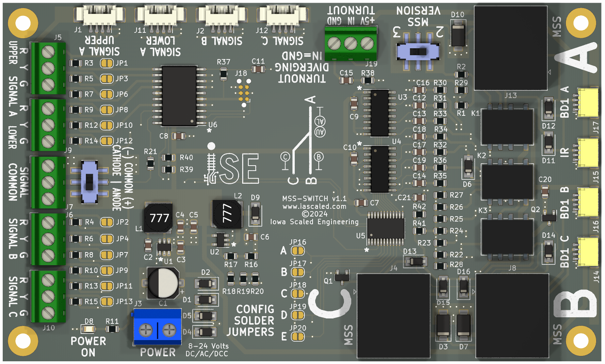

### Features

* Complete ABS-style signaling solution for siding ends
* Compatible with Modular Signal System standards 1.x, 2.x, and (proposed) 3.x
* Controls three LED signals for the end of a siding - a dual head at the points end and two single head signals for main and siding
* Powered from 8V to 24V DC, AC, or DCC power.
* Compatible with both common anode (positive) and common cathode (negative) signals
* Realistic signal fading during changes for both tri-light and searchlight style signals
* Supports both always-on signals and approach lighting
* Configurable for three or four indication signaling
* Option to restrict diverging aspect to a maximum of diverging approach
* Simple plug-and-play compatibility with most Atlas HO and N scale signals
* Includes control board, three ATOM DCC block detectors and one TrainSpotter optical detector

### Typical Applications

* Add signals to the end of a siding or other junction between three signaled tracks
* Great for easily signaling home layouts and Free-Mo modules

---

## Quick Start Guide

!!! warning "Turn The Power Off!"
    All wiring and setup of the board should be done with the power off.  This significantly reduces the chances of accidentally slipping and causing a short circuit that damages the board, the block detectors, or the signals.

[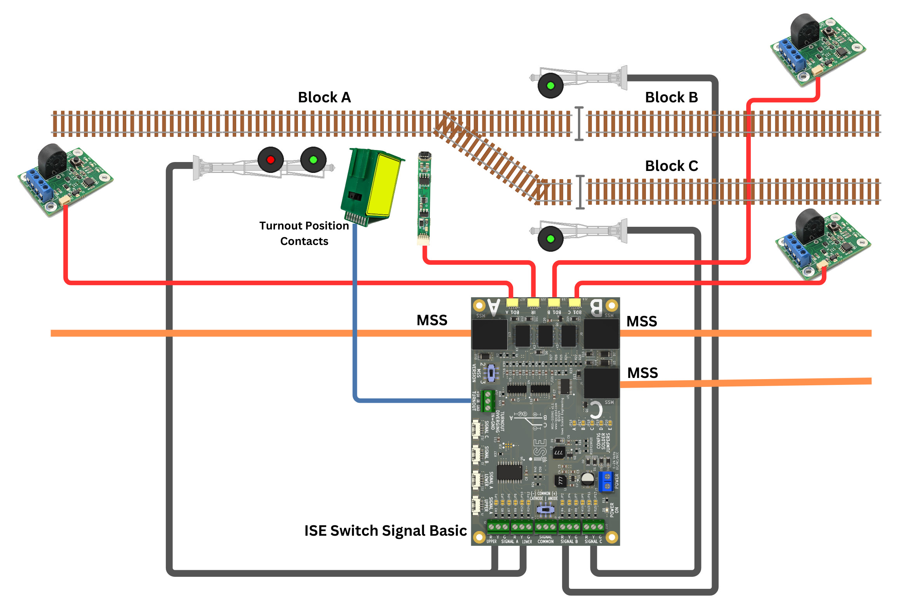](img/mss-switch-wiring-diagram.jpg)
[Simplified Wiring Diagram for Switch Signal Basic](img/mss-switch-wiring-diagram.jpg)

The board has three ports, marked **A**, **B**, and **C**.  These correspond to the three tracks connecting into the junction.  There's a small picture on the board to remind you which is which if needed.  The **A**, **B**, and **C** naming convention is common across the MSS ports, the block detector inputs, and the signal outputs.

* **A** is the points end (single track) of the turnout.  Signal A (upper and lower) is the double-headed signal located in front of the points.  
* **B** is the track attached to the normal / straight direction of the turnout, otherwise known as the main track if this is controlling the end of a siding.  
* **C** is the track attached to the reverse / diverging direction of the turnout, otherwise known as the siding track if this is controlling the end of a siding.  

---

### Step 1 - Signals

!!! info "Common Anode vs Common Cathode"
    The Switch Signal Basic supports both common anode (positive) and common cathode (negative) signals, but all of the signals connected must be of one type or the other.  Mixing common anode and common cathode signals on the same Switch Signal Basic is not supported.

Most applications will want to use three signals - a double-headed signal on the A (points) end, and a single-headed signal on both the B (normal/straight) and C (reverse/divergin) ends.

LED signals with the usual red/yellow/green leads can be wired into the terminal blocks.  The common wire should be connected to the **SIGNAL COMMON** terminal block, and the individual color leads should be attached to the respective **R** (red), **Y** (yellow), and **G** (green) positions on the **SIGNAL A UPPER**, **SIGNAL A LOWER**, **SIGNAL B**, or **SIGNAL C** terminal blocks as appropriate.

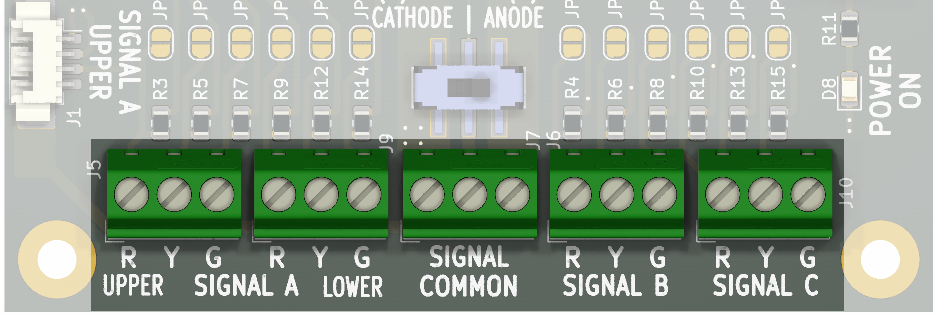

If you are using signals from Atlas, they will plug directly into the off-white connectors marked **SIGNAL AU**, **SIGNAL AL**, **SIGNAL B**, and **SIGNAL C**.  If the signal leads aren't long enough to reach the main board, Iowa Scaled Engineering offers [extension cables](https://www.iascaled.com/store/ACC-ATLASEXT).

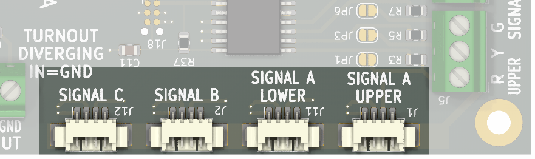

Set the **COMMON** switch to **ANODE / +** if your signals are common anode / common positive (this is most common).  Likewise, set the switch to **CATHODE / -** if your signals are common cathode / common negative.

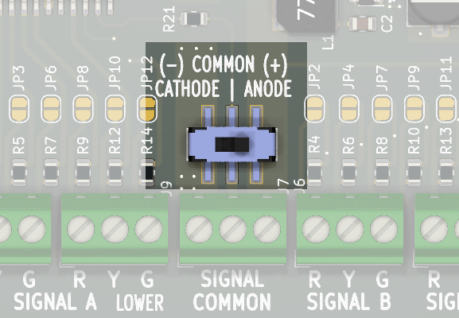

The Switch Signal Basic powers the signals using 5 volts through 330 ohm resistors on each of the signal outputs.  These resistors protect the signal LEDs from excess current, so no additional resistors are needed.  If your signals already have resistors built in, you will likely need to remove them or disable the onboard resistors.  See [Bypassing the LED Resistors](#bypassing-the-led-resistors) in the Advanced Use Cases section below.  

---

### Step 2 - ATOM Detectors

Based on your installation, you will need one to three ATOM DCC current-based block detectors.

For modular setups, one ATOM detector is required on each of the tracks - A, B, and C.  The turnout itself should be part of the A track power block.  Gaps to separate the B and C blocks should be at the frog end of the turnout.  At least one rail must be isolated at the track block boundary.

For home layout use, only one ATOM current-based block detector is needed per track block if the block rails are electrically continuous between signals.  It can be connected to the signal module at either end of the block depending on what is convenient, but each block should have one and only one ATOM detector.  This means for the Switch Signal Basic, you may have one detector connected to the A port, or two detectors connected to the B and C ports if the detectors for those blocks are already fed into an adjacent node.

All of the feeders for the detected rail in a block must pass through the current transformer in the ATOM block detector as shown below.  Only make one pass through the transformer, and only pass the feeders to one rail through it.  Making multiple turns around the transformer or passing both sets of feeders through will cause the detector to not work properly.

Install ATOM detectors as needed and use the included 8 foot cables to connect them into the **BD1 A**, **BD1 B**, and **BD1 C** inputs on the main board as appropriate.

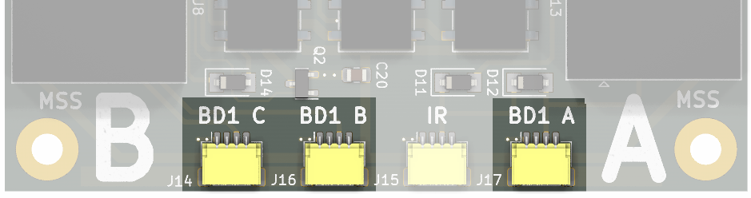

---

### Step 3 - TrainSpotter Detector 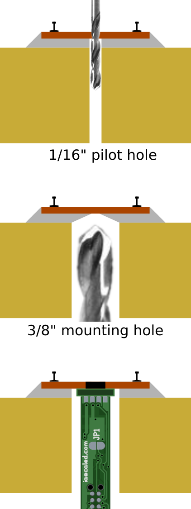{align=right style="width:20%; margin-left:20px; margin-bottom:10px"}

The TrainSpotter provides optical detection.  It should be installed somewhere between the A signal and the turnout frog in order to assure that it will detect trains using either route.  

Use one of the included 8 foot cables to connect the TrainSpotter to the **IR** connector on the main board.

For modular installations, the optical detector must be installed for compliance with the standard in order to detect non-resistored cars.

For home layout use, the TrainSpotter may be omitted if all of your cars have resistor-equipped axles and you want to depend entirely upon current detection.  However, if you choose to omit the TrainSpotter, trains entering from the A end will not drop the signal to red until they reach block B or C.  This can be fixed by making the turnout its own block with its own ATOM detector and wiring that into the **IR** connector on the board.

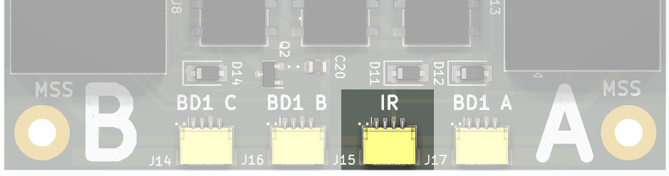

---

### Step 4 - Turnout Position Switch

The Switch Signal Basic needs to know whether the track turnout is set to normal/straight, so that trains can travel between blocks A and B, or reverse/diverging, so trains can travel between blocks A and C.  To do this, contacts on either a power switch machine or manual ground throw are needed.  These switch contacts should be closed (aka connected) when the turnout is set to the reverse/diverging direction, and open when the switch is set to the normal position.

When the turnout is in the reverse/diverging position, the contacts on the switch machine should close and connect the **IN** and **GND** terminal on the **TURNOUT** terminal block.  When the turnout is in the normal/straight position, the contacts should be open, leaving the **IN** terminal disconnected.

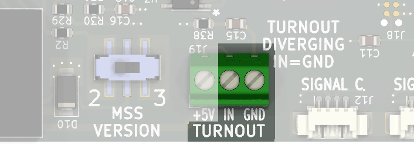

---

### Step 5 - Connect Power

Connect power to the board - it requires 8V to 24V of DC, AC, or DCC power.  Polarity does not matter.

It can be powered directly from the FreeMo accessory bus on modular setups.

For home setups, it is recommended to power it from an accessory power bus, but it can be powered from the track bus directly (before any block detectors).  Note: all signal modules need to get their power from the same source.

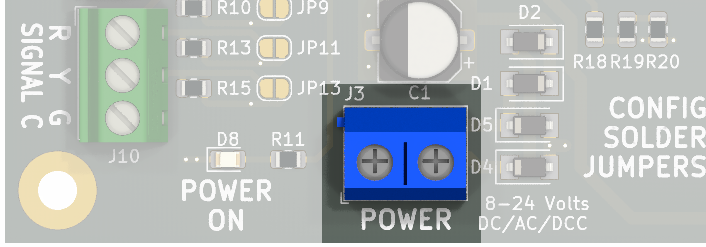

---

### Step 6 - Initial Testing

Do not connect any MSS cables yet!  First we're going to make sure that the Switch Signal Basic is connected correctly.

Apply power and check that the green **POWER ON** LED glows on the main board and on any attached ATOM current-based block detectors.  This verifies that the Switch Signal Basic and associated detectors are getting good power.

Turn on track power and make sure nothing is in any of the track blocks and that the red detection LED is OFF on all detectors (ATOMs and the TrainSpotter).  If any ATOMs show detection, very carefully check that the track blocks are correctly isolated and there is nothing on the track.  If you are absolutely sure of this, you may need to [run a self-calibration on that ATOM](../..//ATOM%20Block%20Detector/manual.md/#operation) to cancel out leakage current.  If a calibration is run and the red detection light does not go off, you almost certainly have a wiring error in your DCC track wiring with that detector.

Set the turnout to the main and verify that Signal A (the points end) displays green over red, Signal B displays green, and Signal C displays red.  Set the turnout to the siding and verify that Signal A displays red over green, Signal B displays red, and Signal C displays green.  This confirms that the turnout position wiring is correct and that the signals are installed correctly.

Place your hand over the TrainSpotter sensor.  Verify the red light on the sensor comes on and all signals drop to red.  Remove your hand and verify signals that were green before triggering the sensor return to green.

Place a locomotive in Block A.  With the turnout set to normal, verify that Signal B turns from green to red.

Move the locomotive to Block B with the turnout still set to normal.  Verify that Signal B returns to green, and that signal A now displays red over red.

Move the locomotive to Block C and change the turnout to its reverse/diverging position.  Verify that Signal A once again displays red over red.  Remove the locomotive and verify the signal returns to red over green.

Congratulations!  You've now successfully installed and verified your Switch Signal Basic!

---

### Step 7 - Connect MSS

Now in order for the signals to interoperate with other SimpleSig or Modular Signal System-compatible products, you need to connect each signal module to the next via crossover cables.  **The golden rule of the Modular Signal System is that there must be an odd number of "crossovers" between signal boards.**

For home layouts, this typically means you should connect one signal board to the next using a single "crossover" cable of appropriate length.  Those can be purchased from a number of sources, including ISE, or you can make your own if you're comfortable with crimping ends on networking cable.

For modular layouts, it's generally recommended that except for very short modules, "straight through" (normal) ethernet cables should be used from the signal board to the ends of the module, where the signal bus terminates at a coupler or jack.  The modules then get joined together using crossover cables. 

For more information about crossover cables, be sure to see the [Tips and Tricks page]()

If you do not have any more signal boards in a given direction down the track, just leave the connector open.

---

## Options

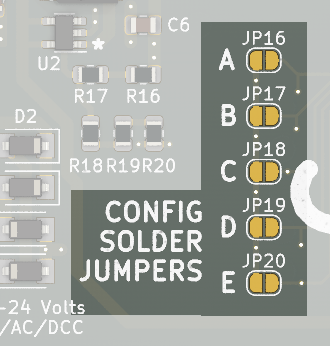{align=right}
The Switch Signal Basic has five configuration option solder jumpers located to the left of MSS port C in the lower center of the board.  In order to enable each option, use a soldering iron and a small amount of solder (or a conductive ink pen) to bridge the corresponding jumper.

### Jumper A - Approach Lighting

By default, the Switch Signal Basic keeps signals lit at all times.  Some prototype signals are only lit when a train is approaching the signal, a feature appropriately enough called "approach lighting."  The Switch Signal Basic can emulate this behaviour if Jumper A is soldered.  Any train in the adjacent block will cause the signal to illuminate, otherwise it will remain dark.

### Jumper B - Four Indication Signaling

US and Canadian ABS signal prototypes can roughly be divided into two categories - three indication signaling and four indication signaling.  Three indication signaling means that there are only three indications shown to trains - clear, approach, and stop.  Four indication signaling introduces a fourth indication - advance approach (flashing yellow), meaning the next block will be approach (yellow).  Generally four indication signaling on ABS and APB came later, as train speeds increased and more warning was needed to slow before reaching a stop (red) signal.

By default, the Switch Signal Basic defaults to only three indication signaling, as getting three blocks between trains on our often small layouts can be difficult.  However, on larger layouts and modular setups, four indication signaling is often desired and can be enabled by soldering Jumper B.

### Jumper C - Searchlight Emulation

The Switch Signal Basic is set up to emulate the operation of typical signal heads with three independent sets of lights, arranged either vertically or in a triangle on most railroads.  (Or, in the case of Pennsylvania position lights or B&O/N&W color position lights, drive two lights around the outside of a disk.)  Regardless, the logic will fade one in as the other fades out.

Searchlight-type signals, such as the Union Switch & Signal types H, H2 and H5 as well as the General Railway Signaling SA type, used a signal lamp with a set of mechanically-changed color filters inside known as roundels.  Three roundels were mounted on an armature that could be moved by two electromagnetic coils.  When unenergized, the arm sat in the middle and placed the red filter in front of the single lamp.  Green would be on one side, and yellow on the other side.  By energizing the coils, it would pull the arm either left or right and place either yellow or green in front of the lamp.

This leads to interesting effects when changing aspects.  When going between yellow and green, you'll get a couple quick red flashes as the armature moves from one side through the red glass in the center to the other side, and then usually bounces once or twice.  Going from red to either yellow or green will result in a bit of flickering as well as the armature bounces around before settling.  The Switch Signal Basic emulates this rather precisely.  If Jumper C is enabled, this bouncing and flashing will be reflected in the signal output giving a very prototypical appearance to model searchlight signals.

### Jumper D - Limit Diverging Indication

By default, when the turnout is reversed, the Switch Signal Basic will display red on the upper head of signal A and on the lower head, an aspect appropriate for signals ahead on track C.  (For example, green if the block ahead is clear and the next signal is flashing yellow or better, flashing yellow if the next signal is yellow, yellow if the next signal is red, red if the track C block is occupied.)  Signals sent back to previous boards in the A direction will tumble down appropriately.

However, many prototype railroads never displayed anything more permissive than diverging approach (red over yellow) if the switch was set into the siding, regardless of signals or occupancy ahead.  If option jumper D is soldered, the board will emulate this behavior by never displaying anything more permissive than red over yellow when lined to the siding, and it will send an appropriate "advance approach" signal back to the intermediate signal ahead of the points.

### Jumper E - Reserved

Currently, jumper E is reserved for new features and future enhancements to the firmware.

### MSS 2 vs 3

Near MSS Port A is a switch labeled **MSS VERSION** with 2 and 3 as options.

This controls how the "diverging approach" signal is sent out of MSS Port A.  MSS version 2 introduced a "diverging approach" line that allowed complex cascades, such as the Switch Signal Basic, to indicate to the previous signal that it was displaying a diverging indication.  Some railroads would display a different indication at that approach signal to warn crews to slow in preparation to take the diverging route, even if the track ahead was clear.  The way MSS 2 did it is backwards compatible with version 1.  The proposed MSS version 3 standard reverses how this signal is sent, and is incompatible with MSS 1.x and 2.x for this one particular case.

In the interest of the broadest compatibility, the Switch Signal Basic allows you to connect an approach signal compliant with either standard.

This only affects installations where the previous block signal can display approach diverging indications.  MSS 1.x, 2.x, and 3.x are compatible in every other way.

If you don't know how you want to set this, we recommend just leaving it on MSS 2 for broadest compatibility.

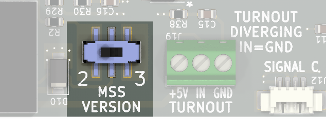

---

## Advanced Use Cases

### Bypassing the LED Resistors

The Switch Signal Basic includes resistors to protect your signals against excessive current that will destroy them.  There may be use cases where your signals already have resistors installed, or you want to change the resistor values used, and you need to bypass the resistors on the board.  There are solder jumpers provided to let you do that, but be **very sure** that you know what you're doing before using them.

!!! warning "Don't Destroy Your Signals!"
    Be sure you really need to do this before even considering bypassing the onboard current limiting resistors for the signals.  You must install external resistors before bypassing the onboard resistors, or the current will blow up your signal LEDs!

**JP1**, **JP3**, and **JP6** bypass the resistors for Signal A Upper red, yellow, and green respectively.  **JP8**, **JP10**, and **JP12** bypass the resistors for Signal A Lower red, yellow, and green respectively.

**JP2**, **JP4**, and **JP7** bypass the resistors for Signal B red, yellow, and green respectively, and **JP9**, **JP11**, and **JP13** bypass the resistors for Signal C red, yellow, and green respectively.

---

### Dimming Signal LEDs

If you just wish to dim your signals further, we recommend adding additional resistance between the terminal block and the signal, and leaving the onboard resistance alone.  Then, if for some reason your external resistor gets shorted or you forget to put one in, your signal is still protected against overcurrent that will destroy the LEDs.

---

### Pin 7 Alternate Functions

**Advanced Users Only!**  The Modular Signal System standard states that pin 7 of the MSS bus can be used either as a second ground wire, or used for alternate functions.  By default, the Switch Signal Basic connects pin 7 to ground, because robust grounding is essential to reliable operation.  However, if you need to use it for an alternate function on one or all ports, you can disconnect it from ground by cutting the thin trace on the back of the PCB using a sharp hobby knife.  **JP15** will open up pin 7 for Port A, **JP14** for Port B, and **JP5** for Port C.

---

### Turnout Input Pull-up

**Advanced Users Only!**  By default, the turnout position input is "pulled up" to 12V through a 10k resistor.  In some cases, users may want to drive this from circuitry that may not survive 12V, such as directly from a 5V logic output.  In this case, carefully cut the thin trace between the large halves of **JP21** on the back of the PCB using a sharp hobby knife.  Note that without the pull-up the input is just floating, and thus must be actively driven high.  A 5 volt terminal is provided adjacent to the input if a pull-up to 5V is needed.

Additionally, the **5V** and **GND** (ground) outputs on the TURNOUT terminal block can provide up to 400mA of power to other devices if needed.

---

## Specifications

**Input Power:**  8 to 24 volts DC, AC, or DCC  
**Input Supply Current:**  100 milliamps @ 12V (typical)  
**MSS Standard Compatibility:** 1.x, 2.x, and (proposed) 3.x  
**Size:**  5"(L) x 3.0"(W) x 0.5"(H) (main board)

---

## Open Source 

Iowa Scaled Engineering is committed to creating open designs that users are free to build, modify,
adapt, improve, and share with others.

The design of the MSS-SWITCH hardware is open source hardware, and is made available under the
terms of the [Creative Commons Attribution-Share Alike v3.0 license](http://creativecommons.org/licenses/by-sa/3.0/). 
Design files can be found in the [mss-switch](https://github.com/IowaScaledEngineering/mss-switch) project on 
GitHub.

The firmware for the MSS-SWITCH is free software: you can redistribute it and/or modify it under the 
terms of the GNU General Public License as published by the Free Software Foundation, either [version 3 of the 
License](https://www.gnu.org/licenses/gpl.html), or any later version.
