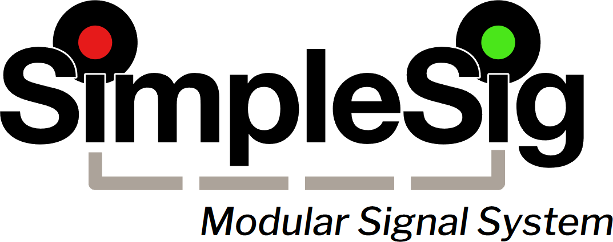

# Introduction to MSS {align=right style="height: 75px; margin-top:0px; margin-bottom: 0px"}

SimpleSig is Iowa Scaled Engineering's line of signaling products for model railroads based on the Modular Signal System (MSS) standard.  SimpleSig products are intended to be robust, easy to use, MSS-compatible components, though we do have a few accessories and stand-alone signal products that will be added to the line as well.

## What is the Modular Signal System?

The Modular Signal System (MSS) is a way to bring an approximation of a basic North American Automatic Block Signal system to a model railroad that is both easy to understand and easy to implement.  There are no computers involved whatsoever in the basic setup.  The simplest version is just a matter of installing signal and signal modules, detectors, and then linking the whole thing together with standard "crossover" type ethernet cables.

MSS was designed to be incredibly simple to set up and robust because of its roots in the Free-Mo modular community  The initial standard was put forth by Gregg Fuhriman back around 2004, and it first got widespread exposure in the Feburary 2005 issue of Railmodel Journal.  What Gregg and team have developed is nothing short of brilliant in its elegant simplicity.  Being able to just plug one signaled module into the next and have them "just work" was key to success.

The standard itself is open and [available for download](http://www.modularsignalsystem.info/ModularSignalSystemStandardV2.0.2.pdf).  Because of the elegant simplicity of the system, it's easy to design your own MSS-compatible components if you're so inclined.  However, the open standard also means that there's a number of manufacturers all supporting it, and a number of other open source designs available online if you'd rather build your own.

MSS is not going to model your prototype’s strangest interlockings and aspect rules straight out of the box, though realistically with a bit of custom work you can likely get very close.  Because our SimpleSig products are all open source, they're easy to customize yourself if you have any programming experience, or we're always happy to consider customization projects for a nominal charge.

## Where Can I Learn More About MSS?

I highly recommend folks take a look at the [Modular Signal System](https://modularsignalsystem.info/) website.  It's actually really good.  In particular, I recommend starting with the User Guide [Part 1](http://www.modularsignalsystem.info/MSSUserGuide1.pdf) and [Part 2](http://www.modularsignalsystem.info/MSSUserGuide2.pdf).

---

## The Components of An MSS System

Honestly, the worst part of explaining MSS to newcomers is getting the terminology down.  It makes sense if you're either building it or really thinking about how it works electrically, but from a newcomer's standpoint, it's somewhat confusing. Once you get the general terms down it starts to make sense.

### Cascades

When you hear **cascade**, think **signal**.  All of our modules that provide cascade functionality will have "signal" in the name.

A basic cascade, such as our [Block Signal Basic](/SimpleSig/Block Signal Basic/manual) is just going to provide a pair of automatic block signals at a block boundary.

### Complex Cascades

Complex cascades build on basic cascades.  Again, when you hear **cascade**, think **signal**.  Complex cascades are complex arrangements of signals, such as around the ends of sidings, at diamonds, or at crossovers between double track mainlines.  Whereas basic cascades just provide two signals at a block boundary, complex cascades model complex trackwork and route the MSS bus to follow whatever route is selected.

The end of a siding is an excellent example of a complex cascade.  Our [Switch Signal Basic](/SimpleSig/Switch Signal Basic/manual) provides just such a module.

When the turnout is lined for the main, you want the MSS bus from the point end of the turnout connected to the MSS bus following the main track.  You also want to make sure the signal at the end of the siding is displaying stop since the turnout is set against it, and then send the appropriate signals down the siding MSS bus to indicate to display approach, advance approach, etc.

If the turnout is lined to the siding, you want the opposite behavior.  You want the MSS bus from the points connected to the MSS bus from the siding, and you want the main signal to display stop and trickle that back up the maine line MSS bus.

### Crossovers

MSS depends upon **crossovers** so that the outputs of one signal module get wired to the correct pins on the next.  Crossovers are so named because they "cross over" pins 1 & 2 as well as 3 & 6.

The simplest form of a crossover is a single "crossover" network cable.  These are different from regular network cables where rather than going straight through, and instead they swap pins 1 & 2 and pins 3 & 6.  These were used in the not-so-good old days of networking to make sure that the receive and transmit ethernet pairs were connected correctly.  They're a bit more uncommon now, but still readily available from many sources including Monoprice and Amazon.

A slightly more complex form of "crossover" is what we at ISE refer to as a [Crossover Detector](/SimpleSig/Crossover Detector/manual/).  These are devices which do cross over the signal wires, but also provide a DCC block detector.  Crossover Detectors are very important on modules in FreeMo and FreeMoN setups that do not have signals themselves, but need to have block detection to participate in MSS-enabled setups.  They are not particularly useful for home layouts where the user can install a single block detector to cover the entire block, rather than needing one for each layout module.

### Putting It Together

The thing to remember about wiring MSS is that the wires follow the tracks.  Each cascade will chain to the next right down the line.  For situations where you have multiple tracks coming into a switch or a crossover, there will be MSS ports corresponding to each track that comes into the junction.

Here's a diagram of two basic cascades separated by three crossovers - two cables and one Crossover Detector.  This would be pretty typical of a modular setup with three modules.  The area within the dotted boxes would represent the pieces on each module.  Modules with signals are going to have a cascade board, whereas modules without signals are just going to have a crossover detector.  The modules would then be joined together with crossover cables to assure odd numbers of crossovers.

A typical home layout, on the other hand, would not use the Crossover Detectors.  It would simply connect one cascade to the next using a crossover cable.

### The Golden Rule of MSS

The **Golden Rule of MSS** is that you absolutely must have an odd number of crossovers between signal modules (cascades), but you can have as many as you want as long as it's an odd number.  Each type - simple crossover cables or Crossover Detectors - counts as a crossover in MSS-speak.  One, three, or even 253 crossovers between your cascades is perfectly fine.  Zero or 2 or any other even number?  You will get very odd signaling behaviour.

---

## Block Detection

One of the very clever and unique features of MSS is the way it does block detection.  It uses a combination of current detectors between signal modules (cascades) and and optical detectors located at block boundaries.  Using this dual-detection system, there is no need to equip all of your cars with resistor axles to ensure detection.  This was particularly important in a modular setup, where there's no requirement that everyone have resistor-equipped axles installed on all of their cars just for block detection.

I've borrowed the image below from the [MSS User Guide - Part 1](http://www.modularsignalsystem.info/MSSUserGuide1.pdf).  It shows a train passing through a block and how the combination of optical and current detectors trigger the occupancy wire without equipping all your cars with resistored axles.   If a train is completely between signals, the locomotive(s) draw enough current to trigger the current detector.  However, even after the locomotive has left the block, the optical detector at the boundary keeps that block occupied until the last car has cleared.  If any detectors sense that there is still equipment within the block, it remains "occupied" and the signals protecting it remain red.

For home users, if you want to install resistor-equipped axles on all of your rolling stock, then you can skip installing the optical detectors and just use current detection.  Free-Mo and Free-MoN modular users will need to install both to comply with the specification and work reliably.

Even if you're not using our SimpleSig MSS components, you can still take advantage of our optical detectors from our [TrainSpotter](https://www.iascaled.com/store/IRSensors) line and our [ATOM](https://www.iascaled.com/store/CKT-BD1) DCC current-based block detectors.

---

