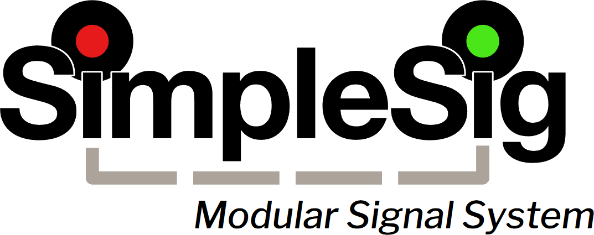
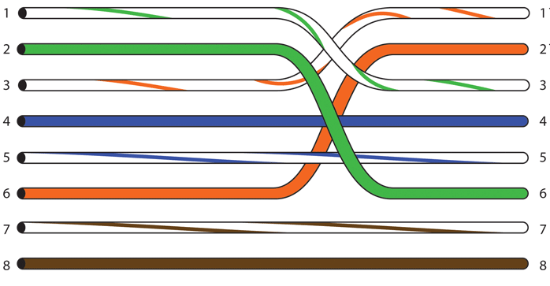
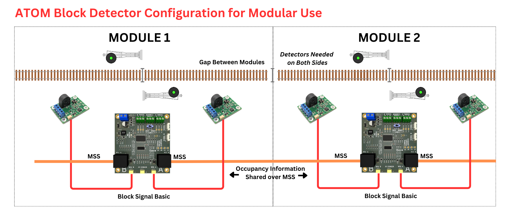
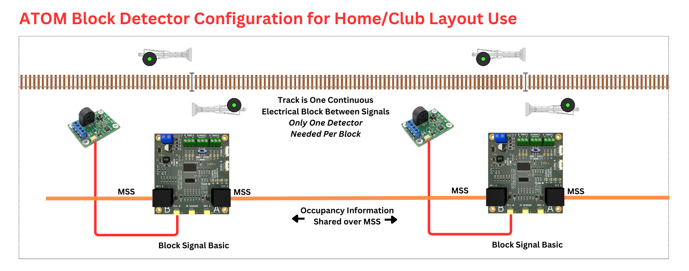

# MSS FAQ & Tips {align=right style="height: 75px; margin-top:0px; margin-bottom: 0px"}

## System Planning and Setup

### Power

MSS requires that either all signals share a power supply, or if running on different power supplies, those power supplies are either isolated or share a common ground connection.

For modular setups like FreeMo and FreeMoN, power is drawn from the accessory power bus.

For home layouts, we highly recommend a dedicated DC accessory power supply rather than trying to power accessories off old power packs (which can damage modern electronics with their horrific power).  This could be something as simple as our [12V / 3A Power Supply](https://www.iascaled.com/store/PSU-12V3A) or something larger for bigger layouts with more demands.  Industrial switch power supplies, such as the Mean Well LRS-150-12 (12 volts at up to 12.5 amps), are both affordable and efficient ways to power model railroad accessories.  Be aware, however, that properly sized wires and fuses are a necessity with these.  They can put out enough power to cause actual damage or fire in the case of a short circuit.

### Cables

Personally, my recommendation is to buy a good set of modular jack crimpers and make your own cables.  Cat5e cable and modular ends are cheap, and since MSS neither passes high speed signals nor large currents, the extra cheap CCA (copper-clad aluminum) cable is more than adequate.  (Note - for actual network applications I strongly recommend against CCA cable.)  By making your own cables, you can make them exactly to the lengths you need and run them through smaller holes if needed, since you can thread the cable through before attaching the connector.

If you would prefer to buy pre-made cables, Iowa Scaled Engineering plans to stock a number of high quality cables for purchase alongside our SimpleSig products.  If you'd prefer to source them yourself and save a few bucks, we recommend cables from Monoprice.  They're inexpensive and of good quality.

* [Monoprice Cat5e Normal Cables](https://www.monoprice.com/product?p_id=11353)  
* [Monoprice Cat5e Crossover Cables](https://www.monoprice.com/product?p_id=287)

!!! warning "Crossover Cables"
    Some crossover cables cross over all four pairs, not just the pairs expected for MSS.  These are often called "Cat6" or "gigabit" crossover cables, and will not work.

For those who would prefer to build their own, crossover cables should be wired as shown on the following diagram:

---

## Frequently Asked Questions

### How Many ATOM Block Detectors Do I Need?

Modular users need one ATOM DCC block detector for each track block on the module.  So, for example, a Block Signal Basic installed on a module would require two - one for the A side, one for the B side.  This is because blocks are isolated at the ends of modules, and current detection is needed for each piece of track.

Because home and club layouts usually have continuous track blocks between signals, only one ATOM DCC block detector is needed.  It can be attached to the SimpleSig module at either end of a track block.  In the diagram below, note that only one ATOM is attached to each Block Signal Basic because the block between the two is continuous.  The module not connected to the detector receives then the occupancy information over the MSS bus.

For our SimpleSig product kits that include ATOM DCC block detectors, there are often two versions:  Kits labeled **For Modules** includes block detectors for each adjacent block.  Kits labeled **For Layouts** include one less block detector to save you a bit of money on a part you are unlikely to use.

### Is MSS Related to LCC?

No.  The Modular Signal System (MSS) is designed to be plug-and-play between signal modules and not require any sort of complex configuration nor a computer to control the system.

Layout Command Control (LCC) can be used to implement signaling as well, but requires significantly more effort to configure and usually will require a computer to actually run the signaling logic.  However, it is capable of significantly more complex signal arrangements, and duplicating prototype signaling almost exactly.

That's not to say that the two cannot play together.  At the Railroad Hobby Show (Springfield, MA) in 2024 and 2025, Ken Cameron demonstrated a complex junction module that used LCC and JMRI for the interlocking plant itself, but had MSS connections in each direction to send signal information to adjoining modules.

### What Prototype Does MSS Model?

The basic signal setup created by MSS is close to "flat pair" automatic block signaling.  It's a stand-alone system designed to provide realistic signal indications that most modelers will be familiar with, while discarding all the complexity of exactly modeling any prototype or the need for a computer or dispatcher.

ABS did not typically have multiple-headed signals at the ends of sidings (or sidings with detection, for that matter), so most MSS implementations bring it concepts from later systems such as APB and CTC to provide signal indications that would be more familiar to a modern modeler.  There's absolutely no requirement to use these, however, and more prototypical "straight ABS" systems can be achieved.

There's no reason that MSS cannot be extended to more accurately represent more complicated signal regimes as well.  Some can be done within the standard as it exists today, whereas some may require some additional extensions that build upon the basic standard.

### What's The Difference Between Aspect, Name, and Indication?

Signals have three fundamental properties:  aspect, name, and indication.  These are frequently confused and often used rather loosely in conversation, but they have formal and distinct meanings.

**Aspect** is what you physically see.  For a single-headed signal, that might be green, yellow, flashing red.  For a double-headed signal, that might be red over flashing yellow.  Signals may have other attributes beyond just the lights or semaphore position, such as number or milepost plates, lettered plates with A or G or D on them, whether it's a signal on a pole or a dwarf mounted near the ground, etc.  These additional elements can change how the aspects translate to the indication.

**Name** is the formal rulebook name of a set of aspects.  Typically this will correspond to a operating rule that describes exactly what the crew is expected to do when faced with this indication.  Multiple different combinations of aspects can all fall under the same name and indication.  For example, on BNSF a single flashing yellow and a yellow-over-yellow are both "Approach Medium" and have the same indication.

**Indication** is what the aspects tell the train crew to do.  As an example, at a single-headed ABS permissive signal, red might mean come to a full stop and proceed at restricted speed if clear.  A single head displaying a green aspect almost universally means proceed at maximum authorized speed.  A single red aspect on a mast with a numberboard is usually a permissive signal, and means "stop, then proceed at restricted speed." However, that same single red aspect on a mast without a numberboard is an absolute signal, and means "stop" with no option to proceed without either dispatcher permission or a change in aspect.

While the meaning of single-headed signals is relatively uniform, combinations of aspects on multiple heads will vary from prototype to prototype.  Some railroads in some eras even had different rules for the same aspects displayed on a high signal vs. a dwarf signal.

As an example, let's take the indication of "Advance Approach," which means to proceed prepared to pass the next signal not exceeding some set speed and, if approaching a switch, be prepared to enter the diverging route not exceeding the prescribed speed for the turnout.  Western US roads typically used aspects of yellow over yellow for this, whereas eastern US roads tended to use yellow over green.  BNSF actually splits this into three different names - Approach Limited (yellow over flashing green), meaning the "set speed" above is 60 MPH; Advance Approach (yellow over green), meaning the "set speed" is 50 MPH; and Approach Medium (yellow over yellow) which sets the speed to 40 MPH.

