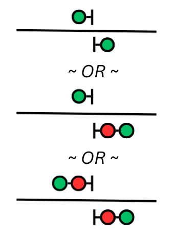
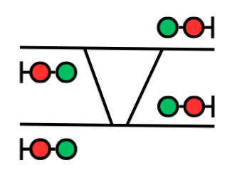
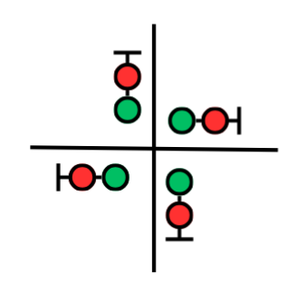
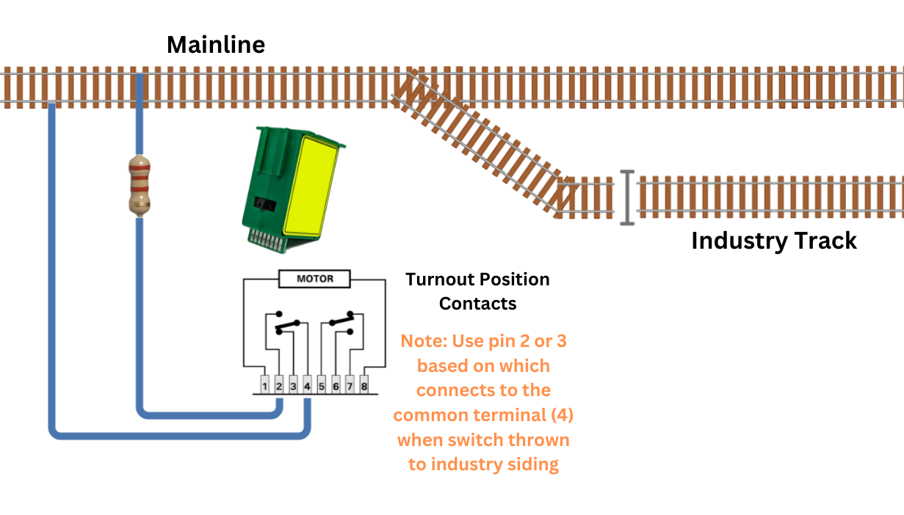

# SimpleSig Frequently Asked Questions {align=right style="height: 75px; margin-top:0px; margin-bottom: 0px"}

## SimpleSig Questions

### What is SimpleSig?

SimpleSig is our line of Modular Signal System-compatible products.  It’s a standardized way to add realistic, functioning ABS-like signals to model railroad modules and layouts without requiring a computer or complex programming. 

It's based on the Modular Signal System standard, which was created by Gregg Fuhriman nearly 20 years ago to bring realistic signal animation to Free-Mo and Free-MoN layouts.  It needed to be simple, robust, and plug-and-play when modules were hooked up.  Our stuff works on modules, but those features also make it great for home and club layouts as well.

### What is the Modular Signal System?

The Modular Signal System (MSS) is a way to bring signal operation to model railroads without all the complexity of computers, programming, etc.  It provides an approximation of a basic North American Automatic Block Signal system that is both easy to understand and easy to implement.  The simplest version is just a matter of installing signal and signal modules, detectors, and then linking the whole thing together with standard "crossover" type ethernet cables.

MSS was designed to be robust and incredibly simple to set up because of its roots in the Free-Mo modular community  The initial standard was put forth by Gregg Fuhriman back around 2004, and it first got widespread exposure in the Feburary 2005 issue of Railmodel Journal.  What Gregg and team have developed is nothing short of brilliant in its elegant simplicity.  Being able to just plug one signaled module into the next and have them "just work" was the key to success.

The standard itself is open and [available for download](http://www.modularsignalsystem.info/ModularSignalSystemStandardV2.0.2.pdf).  Because of the elegant simplicity of the system, it's easy to design your own MSS-compatible components if you're so inclined.  However, the open standard also means that there's a number of manufacturers all supporting it, and a number of other open source designs available online if you'd rather build your own.

MSS is not going to model your prototype’s strangest interlockings and aspect rules straight out of the box, though realistically with a bit of custom work you can likely get close.  Because our SimpleSig products are all open source, they're easy to customize yourself if you have any programming experience, or we're always happy to consider customization projects for a nominal charge.

### Is SimpleSig Proprietary?

Absolutely not!  That’s one of the key reasons we chose to embrace it.  The Modular Signal System standard is open to all, and anyone can build compatible hardware.  There’s at least four vendors making compatible products right now.

### Is SimpleSig Related to LCC?

No.  The Modular Signal System (MSS) is designed to be plug-and-play between signal modules and not require any sort of complex configuration nor a computer to control the system.

Layout Command Control (LCC) can be used to implement signaling as well, but requires significantly more effort to configure and usually will require a computer to actually run the signaling logic.  However, it is capable of significantly more complex signal arrangements, and duplicating prototype signaling almost exactly.

That's not to say that the two cannot play together.  At the Railroad Hobby Show (Springfield, MA) in 2024 and 2025, Ken Cameron demonstrated a complex junction module that used LCC and JMRI for the interlocking plant itself, but had MSS connections in each direction to send signal information to adjoining modules.

### What Prototype Does SimpleSig Model?

The basic signal setup created by MSS is close to "flat pair" automatic block signaling.  It's a stand-alone system designed to provide realistic signal indications that most modelers will be familiar with, while discarding all the complexity of exactly modeling any prototype or the need for a computer or dispatcher.

ABS did not typically have multiple-headed signals at the ends of sidings (or sidings with detection, for that matter), so most MSS implementations bring it concepts from later systems such as APB and CTC to provide signal indications that would be more familiar to a modern modeler.  There's absolutely no requirement to use these, however, and more prototypical "straight ABS" systems can be achieved.

In the future, it should be possible to add LCC support on top of SimpleSig/MSS to allow for more complex signaling, such as adding a dispatcher and true control points.  In fact, our Block Signal Custom module has the hardware for LCC to be added  in the future.  That would allow it to become a true “control point” in the CTC sense, and allow routes to be lined via JMRI.  This – at present – is a future project and there’s no timeline for that to happen.

Here's a simple animation showing how 3-indication SimpleSig/MSS works with two trains.  *(Click the animation to enlarge)* SimpleSig products can also add a fourth indication - advance approach (flashing yellow) - if your layout has enough space for it to make sense, or if you're building a module.

### Is SimpleSig Compatible with DC?

Out of the box, no.  SimpleSig requires isolated current detection to function.  It includes our ATOM DCC block detectors, which only work with DCC.  If you substitute an isolated DC block detector with an open collector output, in theory it would work. However, we do not offer such a product.

### Is SimpleSig Compatible with Dead Rail?

SimpleSig requires isolated current detection through the track to function.  There's no feasible way to make it work with dead rail systems.

## System Planning and Setup

### Where Do I Start?

If you're talking about a home or club layout, that's a big answer.  Fortunately, we now have a guide to help you think through what you need to do to get going with signals.  Check out [Planning for Signals](planning.md).

### What Module Do I Need?

Here's a guide of "my track looks like this, what module do I need to signal it?"  

For modular users, this should be pretty straight-forward in terms of matching your track configuration with the appropriate solution below.

For home users, once you've gone through the steps of breaking down your track plan and identifying junctions and intermediate signal locations, this should also be helpful.  Be sure to go through the [Planning For Signals](planning.md) document to learn how to plan out where to place signals on your layout.

| Track / Signal Configuration | Signal Node |
| ---------------------------- | ----------- |
| {align=center style="width: 200px; margin-top:0px; margin-bottom: 0px"} | [**Crossover Detector**](Crossover%20Detector/manual.md) *(modules without signals only, not useful for home layouts)* For modules that want to participate in signaled FreeMo or FreeMoN layouts, but don't have signals themselves.  This provides simple current detection to make modules compliant. |
| {align=center style="width: 200px; margin-top:0px; margin-bottom: 0px"} | [**Block Signal Basic**](Block%20Signal%20Basic/manual.md) Simple intermediate signals with a single head and using the conventional clear / approach / advance approach / stop indications. |
| {align=center style="width: 200px; margin-top:0px; margin-bottom: 0px"} | [**Block Signal Advanced**](Block%20Signal%20Advanced/manual.md)  Intermediate signals with one or two heads that need to display more advanced indications, such as approach diverging ahead of a home signal, or which need customized aspects. |
| {align=center style="width: 200px; margin-top:0px; margin-bottom: 0px"} | [**Switch Signal Basic**](Switch%20Signal%20Basic/manual.md) Diverging signaled routes, such as at the end of a siding or at one point of a wye. |
| {align=center style="width: 200px; margin-top:0px; margin-bottom: 0px"} | [**Block Signal Custom**](Block%20Signal%20Custom/index.md) *(Single Crossover Configuration)* The Block Signal Custom comes with a number of factory-programmed configurations, including a single crossover between double tracks. |
| {align=center style="width: 200px; margin-top:0px; margin-bottom: 0px"} | [**Block Signal Custom**](Block%20Signal%20Custom/index.md) *(Double Crossover Configuration)* The Block Signal Custom comes with a number of factory-programmed configurations, including a double crossover between double tracks where the crossover tracks can be used simultaneously. |
| {align=center style="width: 200px; margin-top:0px; margin-bottom: 0px"} | [**Block Signal Custom**](Block%20Signal%20Custom/index.md) *(Compact Double Crossover Configuration)* The Block Signal Custom comes with a number of factory-programmed configurations, including a compact double crossover between double tracks where the crossover tracks pass over each other on a diamond.  These are used where track space is at a premium. |
| {align=center style="width: 200px; margin-top:0px; margin-bottom: 0px"} | [**Block Signal Custom**](Block%20Signal%20Custom/index.md) *(Single Track Diamond Configuration)* The Block Signal Custom comes with a number of factory-programmed configurations, including an automatic interlocking between two single-track main lines. |
| {align=center style="width: 200px; margin-top:0px; margin-bottom: 0px"} | [**Block Signal Custom**](Block%20Signal%20Custom/index.md) *(Custom firmware)* The Block Signal Custom can be programmed in Arduino for any sort of track spaghetti you can dream up.  By using expansion modules, it can handle up to 32 signal heads, 16 tracks entering the plant, 40 current or IR detectors, and 24 turnout position inputs.  |

### How Do I Power It?

MSS requires that either all signals share a power supply, or if running on different power supplies, those power supplies are either isolated or share a common ground connection.

For modular setups like FreeMo and FreeMoN, power is drawn from the accessory power bus.

For home layouts, we highly recommend a dedicated DC accessory power supply rather than trying to power accessories off old power packs (which can damage modern electronics with their horrific power).  This could be something as simple as our [12V / 3A Power Supply](https://www.iascaled.com/store/PSU-12V3A) or something larger for bigger layouts with more demands.  Industrial switch power supplies, such as the Mean Well LRS-150-12 (12 volts at up to 12.5 amps), are both affordable and efficient ways to power model railroad accessories.  Be aware, however, that properly sized wires and fuses are a necessity with these.  They can put out enough power to cause actual damage or fire in the case of a short circuit.

### What Cables Should I Use?

Personally, my recommendation is to buy a good set of modular jack crimpers and make your own cables.  Cat5e cable and modular ends are cheap, and since MSS neither passes high speed signals nor large currents, the extra cheap CCA (copper-clad aluminum) cable is more than adequate.  (Note - for actual network applications I strongly recommend against CCA cable.)  By making your own cables, you can make them exactly to the lengths you need and run them through smaller holes if needed, since you can thread the cable through before attaching the connector.

If you would prefer to buy pre-made cables, Iowa Scaled Engineering plans to stock a number of high quality cables for purchase alongside our SimpleSig products.  If you'd prefer to source them yourself and save a few bucks, we recommend cables from Monoprice.  They're inexpensive and of good quality.

* [Monoprice Cat5e Normal Cables](https://www.monoprice.com/product?p_id=11353)
* [Monoprice Cat5e Crossover Cables](https://www.monoprice.com/product?p_id=287)

!!! warning "Crossover Cables"
    Some crossover cables cross over all four pairs, not just the pairs expected for MSS.  These are often called "Cat6" or "gigabit" crossover cables, and will not work.

For those who would prefer to build their own, crossover cables should be wired as shown on the following diagram:

### What Signals Should I Use?

That's completely up to you.  The SimpleSig product line is compatible with pretty much any LED color light signals, and can drive common anode or common cathode signals.  The short version is use the type you want!

The one thing it isn't compatible with is old bulb-based signals.  Bulbs draw a huge amount of current - far more than the SimpleSig boards can drive.

### How Do I Handle Industry Tracks?

On the prototype, most industry spurs don't have any related signals.  It is certainly possible to have an industry with a full control point where it joins the mainline, but it's not common.  What's more common is either to be completely unsignalled and protected via a time lock switch, or sometimes in recent years to have a starting signal.

**Option #1** - Time-locked switch, no signal.  The time-tested option and by far the most common.  This basically consists of a timer on the track switch that shunts the mainline for some number of minutes before the switch can be opened, in order to allow any conflicting movements to either see a stop signal or pass the switch.  The downside of this is that any train leaving the industry is operating under GCOR rule 10.1 or equivalent, which limits them to restricting speed until they hit the next mainline signal.

**Option #2** - "Leaving Signal"  This is not a full-on control point and there's only a signal on the industrial lead, but it can display stop or approach.  Once the switch is lined - usually manually with a time lock - the signal will display approach if the block beyond the switch is clear.   They're quite common on the Union Pacific out west these days.  They don't offer dispatcher control, but they do allow the train departing the industry to immediately get up to at least approach speeds without having to operate at restricted speed all the way to the next mainline signal, as the "leaving signal" provides them an approach indication.

**Option #3** - Full-on control point.  Very uncommon, only used with industries that produce a lot of traffic or in places where it's infeasible to stop to throw a switch (such as if the entrance is on a steep grade against heavy, loaded trains).  In this case, with MSS which doesn't have true control points because it doesn't have a dispatcher, it's just going to basically be a siding end switch, and something like a (Switch Signal Basic)[/SimpleSig/Switch Signal Basic/manual/] will do nicely (though you may want to ask that the aspect into the siding be customized to diverging restricted - red over flashing red - or similar).

The easiest of these is a variant on #1, and is typically what we recommend.  It doesn't accomplish the time locking piece, but it does drop the mainline signals and protects against a train finding an open industry switch the hard way.  It's very easy to accomplish as long as you have a set of contacts on the switch machine or ground throw for the industry.  Connect one rail to a 2.2k-ohm resistor and then to one contact.  Then connect the other contact to the opposite rail, such that when the switch is thrown to the industry, the mainline rails will be shunted through the resistor.  It's just like a train was in the block, and will drop the signals on both ends of the block to red just like the prototype.  Here's a diagram of how to make that happen.

**Option 1 Wiring Diagram**

### How Many ATOM Block Detectors Do I Need?

Modular users need one ATOM DCC block detector for each track block on the module.  So, for example, a Block Signal Basic installed on a module would require two - one for the A side, one for the B side.  This is because blocks are isolated at the ends of modules, and current detection is needed for each piece of track.

Because home and club layouts usually have continuous track blocks between signals, only one ATOM DCC block detector is needed.  It can be attached to the SimpleSig module at either end of a track block.  In the diagram below, note that only one ATOM is attached to each Block Signal Basic because the block between the two is continuous.  The module not connected to the detector receives then the occupancy information over the MSS bus.

For our SimpleSig product kits that include ATOM DCC block detectors, there are often two versions:  Kits labeled **For Modules** includes block detectors for each adjacent block.  Kits labeled **For Layouts** include one less block detector to save you a bit of money on a part you are unlikely to use.

### What's The Difference Between Aspect, Name, and Indication?

Signals have three fundamental properties:  aspect, name, and indication.  These are frequently confused and often used rather loosely in conversation, but they have formal and distinct meanings.

**Aspect** is what you physically see.  For a single-headed signal, that might be green, yellow, flashing red.  For a double-headed signal, that might be red over flashing yellow.  Signals may have other attributes beyond just the lights or semaphore position, such as number or milepost plates, lettered plates with A or G or D on them, whether it's a signal on a pole or a dwarf mounted near the ground, etc.  These additional elements can change how the aspects translate to the indication.

**Name** is the formal rulebook name of a set of aspects.  Typically this will correspond to a operating rule that describes exactly what the crew is expected to do when faced with this indication.  Multiple different combinations of aspects can all fall under the same name and indication.  For example, on BNSF a single flashing yellow and a yellow-over-yellow are both "Approach Medium" and have the same indication.

**Indication** is what the aspects tell the train crew to do.  As an example, at a single-headed ABS permissive signal, red might mean come to a full stop and proceed at restricted speed if clear.  A single head displaying a green aspect almost universally means proceed at maximum authorized speed.  A single red aspect on a mast with a numberboard is usually a permissive signal, and means "stop, then proceed at restricted speed." However, that same single red aspect on a mast without a numberboard is an absolute signal, and means "stop" with no option to proceed without either dispatcher permission or a change in aspect.

While the meaning of single-headed signals is relatively uniform, combinations of aspects on multiple heads will vary from prototype to prototype.  Some railroads in some eras even had different rules for the same aspects displayed on a high signal vs. a dwarf signal.

As an example, let's take the indication of "Advance Approach," which means to proceed prepared to pass the next signal not exceeding some set speed and, if approaching a switch, be prepared to enter the diverging route not exceeding the prescribed speed for the turnout.  Western US roads typically used aspects of yellow over yellow for this, whereas eastern US roads tended to use yellow over green.  BNSF actually splits this into three different names - Approach Limited (yellow over flashing green), meaning the "set speed" above is 60 MPH; Advance Approach (yellow over green), meaning the "set speed" is 50 MPH; and Approach Medium (yellow over yellow) which sets the speed to 40 MPH.

