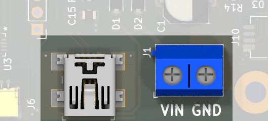
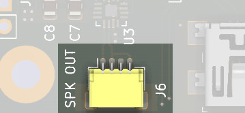
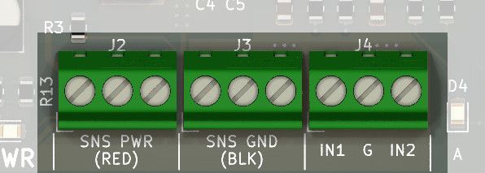
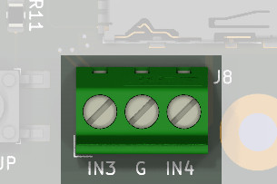

# SoundBytes Custom User Manual

!!! note "Please Note"
    This is a future product and subject to change.  Release date is targeted for January 2026 and
    will be officially announced in our email [newsletter](https://www.iascaled.com/store/). 

## Overview

The SoundBytes Custom is a programmable sound player that plays sounds from
a microSD card in response to various trigger events.  Up to four triggers
can come from sensors, switches, detectors, Arduinos, etc. and each trigger
can play a different sound.  It supports various playback modes ranging from
ambient background sounds, triggered sound effects, and a special
beginning-middle-end mode for repeating effects with lead-in and lead-out
sound clips.

Complete with control board, speaker, and microSD card, the SoundBytes
Custom is a turney solution for adding sound to your model railroad, module,
diarama, or other display.

### Features

* Custom sounds loaded using a microSD card
* Four independent triggers with individual sounds
* Features four playback modes: ambient, one-shot, continuous, and beginning-middle-end
* Triggerable by a switch, pushbutton, Arduino, or any other [open-collector](/Tips%20and%20Tricks/Articles/opencollector/) output
* Compatible with [TrainSpotter](https://www.iascaled.com/TrainSpotter) and [ATOM](https://www.iascaled.com/Atom) detectors
* Comes complete with speaker, control board, and microSD card
* Powered from 5V to 24V DC

### Typical Applications

* Ambient background sounds  
* Triggered sound effects  

---

## Quick Start Guide

### Step 1 - Power

The SoundBytes Custom can be powered from 5V to 24V DC, applied through connector J1
(positive to VIN, negative to GND).  Alternatively, the mini USB jack can be
used to power the Squealer, either from a USB charging block or a laptop/PC.

### Step 2 - Speaker

The speaker attaches to connector J6 (SPK OUT) on the board.  The plastic
speaker enclosure can be mounted above or below the layout.  For better
sound fidelity, bore a 3/8" hole in the scenery or benchwork, and position
the speaker enclosure with the opening on the side facing up.  Camouflage
the hole with scenery.  However, this is user preference and may involve
some experimentation.

### Step 3 - Trigger Input(s)

Various input methods can be used to trigger the SoundBytes Custom.  In all
cases, the input should be connected to GND to trigger the module.  This
can be done with a switch, a push button, a
[TrainSpotter](https://www.iascaled.com/TrainSpotter) or 
[ATOM detector](https://www.iascaled.com/Atom),
or many other devices.  And Aruino or other electronic module can also be
used, but the output should be of an [open collector](/Tips and Tricks/Articles/opencollector/) style output.

!!! warning "Maximum Voltage"
    Do not apply more than 3.3V to the trigger inputs.  The SoundBytes
    Custom may be damaged by higher voltages.

The SoundBytes Custom has four trigger inputs.  These inputs are IN1, IN2,
IN3, and IN4 on the terminal blocks around the perimeter of the board.  The
G terminals provide a convenient GND location to which the IN terminals can
be connected via the trigger device.

Additionally, power and GND for powering sensors (like a TrainSpotter or ATOM
detector) can be found on the SNS PWR and SNS GND terminal blocks,
respectively.

### Step 4 - Sound File(s)

Add sound files to the microSD card.  See the [Sound Files](#sound-files)
section below for details.

---

## Operation

After powering up, the blue LED will blink four times to indicate the
SoundBytes Custom is ready.  If no microSD card in inserted, or no valid
sound files are found on the card, the blue and orange LEDs will blink
alternately.

!!! note "Note"
    When removing the microSD card to update the files, the recommended
    procedure is to first power down the SoundBytes Custom, remove the card,
    make your changes, re-insert the card, and then re-apply power. 
    There is a small (but not zero) chance that removing or inserting the
    card while the SoundBytes Custom is powered will corrupt the contents of
    the card.  In any case, the SoundBytes Custom must be rebooted (powered
    on) after the card is re-inserted.

### Volume Control

The volume has 30 levels and comes preset at level 20.  Level 0 is mute. 
There are ten levels above 20 to amplify custom audio tracks with low gain,
but these levels should be used with caution as they may cause distortion.

To change volume, press the VOL UP or VOL DN button.  The amber LED will
blink briefly in response to pressing the button.  When setting volume level
20, the amber LED will blink somewhat longer than normal to indicate it is
the default level.

### Sound Files

Sounds can be loaded using a microSD card.  The sound files need to be put
in folders, with specific folder names, on the microSD card.  See the 
[Modes of Operation](#modes-of-operation) section for details.

The sounds must meet the following requirements:

* WAV file named with .wav extension (e.g. mp3 or other formats will not work)
* 16-bit, mono format
* 8, 16, 32, or 44.1kHz sample rate

!!! note "Note"
    The microSD card must also be formatted as FAT.  Most cards come
    from the factory pre-formatted, including the card supplied with the
    SoundBytes Custom, so no additional formatting is required.

### Option Files

For some modes of operation, additional files (option files) are required to
be present on the microSD card to select the mode and/or configure the
behavior of the sound player.  These option files must have specific, and
exact, filenames.  The contents of the files, however, does not matter -
they can be empty.  Details of the specific option files needed can be found
in the [Modes of Operation](#modes-of-operation) section.

!!! warning "Filename Extensions"
    Windows defaults to hiding filename extensions when viewing files on the
    microSD card.  The ".opt" extension in the option filename must be
    present and cannot be followed by any other characters.  The best way to
    verify this is by turning off the hiding of filename extensions in
    Windows Explorer.  Do this under Options, select the View tab and then uncheck
    the box for "Hide extensions for known file types".

---

## Modes of Operation

### Ambient Mode

In Ambient Mode, the SoundBytes Custom will continuously play the sound
files in random order.  When triggered by any input (all four trigger
inputs behave the same in Ambient Mode) the volume will be
unmuted with a brief fade in, allowing the sound to play through the
speaker.  After the trigger goes away, the volume will be muted with a brief
fade out.

Even while muted, the sound files continue to play internally,
even though no sound is emitted by the speaker.  This provides a level of
inherent randomization to the sound once the module is triggered.

!!! note "Continuous Play"
    If you want the sound to play continuously anytime the SoundBytes Custom
    is powered, then simply connect one of the trigger inputs to the G (GND)
    terminal with a wire.

To configure Ambient Mode, a folder named **ambient** should be present in
the root directory of the microSD card.  The sounds in this folder will be
played in a random order.

Whenever a folder named **ambient** is found on the microSD card and valid
files are present within it, Ambient Mode will be selected regardless
of any other folders or files present on the card.  This means Ambient
Mode takes precedence over the other modes of operation below.

### Triggered Mode

If the device is not in [Ambient Mode](#ambient-mode), then it defaults to triggered mode. 
In triggered mode, the playback of sounds depends upon the state of the four
trigger inputs.  Each trigger input can activate a different set of sounds,
each with different behaviors as detailed below.

For triggered mode, folders named **event1**, **event2**, **event3**, and/or
**event4** should be present on the microSD card.  The specific trigger input
activated determines the folder, and the sounds contained within, which
will be played.  For example, if the IN3 trigger input is activated, then
the sounds from the **event3** folder will be played.

!!! note "Note"
    Only one trigger will be detected and acted upon at the same time.  Only
    the sound(s) for the first trigger will play.

#### One-Shot Triggered Mode

In One-Shot Triggered Mode, a randomly selected sound file from the event
folder will be played.  Playback will end when the sound file completes
playing, regardless of the state of the trigger input.  Playback will not
repeat automatically, but can be retriggered by releasing the trigger input
and then re-activating it.

##### Option Files

| Option File     | Description |
| --------------- | ----------- |
| (none)          | No option files should be present for One-Shot Mode |

#### Continuous Triggered Mode

When initially triggered, Continuous Triggered Mode will randomly play a
sound file from the corresponding event folder.  After finished playing, if
the trigger is still active, then either the same sound file will be
repeated or a newly selected sound file will be played (this behavior is
determined by the option files below).  Sounds continue repeating
indefinitely while the trigger input is active.

##### Option Files

| Option File     | Description |
| --------------- | ----------- |
| continuous.opt  | Must be present to select Continuous Mode. |
| shuffle.opt     | (Optional) Determines the behavior when a sound file finishes playing and the trigger is still active.  If this option file is present, then a randomly selected file will be played next.  If not present, then the first selected file will be repeated in a loop. |
| level.opt       | (Optional) If this option file is present, then the volume is immediately muted with a brief fade out and playback stops when the trigger is released.  Otherwise, playback continuues through the end of the currently playing sound file. |

#### Beginning-Middle-End Mode

For special use cases, Beginning-Middle-End Triggered Mode allows an initial
beginning sound to be played, followed by an indefinite series of middle
sounds, wrapping up with an end sound.  This can be used for things like
whistles or the sound of a train approaching, passing, and leaving.

When the trigger input first activates, the beginning sound is played.  If
the trigger input is still active at the end of the beginning sounds, then
the middle sound(s) will play in a random order.  Once the trigger input
goes away, then the end sound will be played.  If the trigger input is not
active at the end of the beginning sound, then the middle sound(s) will be
skipped and the end sound played.

If the sound files all have the same sample rate, then playback in
beginning-middle-end mode is seamless.  This means transitions between the
various sounds happen without any delays.

Specific filenames are required for proper operation.  The beginning and end
sound files must be named exactly as follows:

* begin.wav: the beginning sound
* end.wav: the end sound

Any other files in the folder will be randomly played for the middle
sound(s).

##### Option Files

| Option File     | Description |
| --------------- | ----------- |
| bme.opt         | Must be present to select Beginning-Middle-End Mode. |

---

## Specifications

**Input Power:**  5 to 24 volts DC  
**Size (Control Board):** 3.75"(L) x 2.25"(W) x 0.5"(H)  
**Size (Speaker):** 1.25"(L) x 1.25"(W) x 1"(H)  

---

## Open Source 

Iowa Scaled Engineering is committed to creating open designs that users are free to build, modify,
adapt, improve, and share with others.

The design of the SND-PLAYER hardware is open source hardware, and is made available under the
terms of the [Creative Commons Attribution-Share Alike v3.0 license](http://creativecommons.org/licenses/by-sa/3.0/). 
Design files can be found in the [ckt-soundplay](https://github.com/IowaScaledEngineering/ckt-soundplay) project on 
GitHub.

The firmware for the SND-PLAYER is free software: you can redistribute it and/or modify it under the 
terms of the GNU General Public License as published by the Free Software Foundation, either [version 3 of the 
License](https://www.gnu.org/licenses/gpl.html), or any later version.  Firmware for the snd-player can be 
found in the [snd-player](https://github.com/IowaScaledEngineering/snd-player) project on GitHub.
