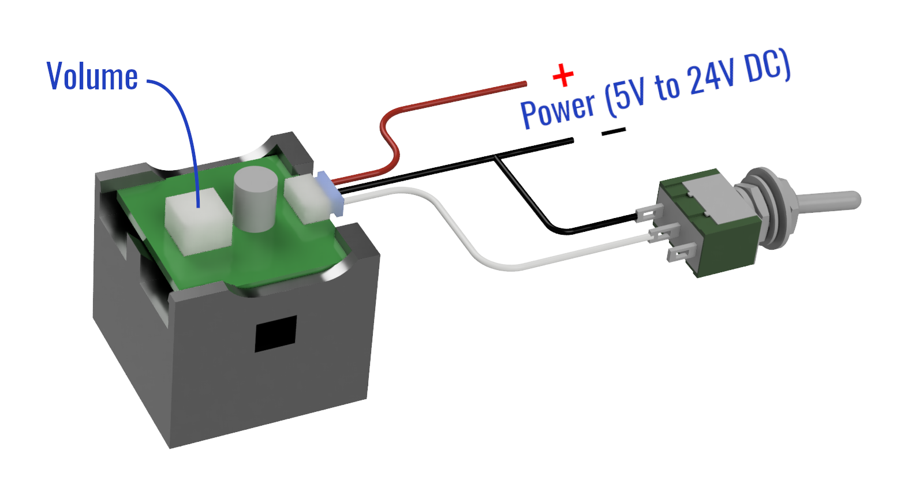

# User Manual {align=right style="height: 75px; margin-top:0px; margin-bottom: 0px"}

## Overview

[SoundBytes](https://www.iascaled.com/store/SoundBytes) are simple, fully
self-contained sound modules that play ambient sound effects for your model
railroad.

### Features

* Easy to install and use
* Powered from 5V to 24V DC

### Typical Applications
* Triggered sounds effects
* Ambient layout sound

---

## Quick Start Guide

The SoundBytes module can be hidden under the layout, or above the layout
in a building or scenery.  Since each layout is different, experiment
to figure out what works (and sounds) best for your application.

When installing under the layout, double-sided tape can be used to attach
the module to the underside of the layout.  Apply the tape to one of the
smooth sides of the black speaker enclosure and attach it to the benchwork
or underside of the track base.

### Power

Power should be clean 5V to 24V DC.  This can come from a wall wart, an
auxiliary bus on the layout, or a [DCC power adapter](https://www.iascaled.com/store/CKT-DCCPWR). 
Connect the red wire to the positive terminal of the power source and the black wire to the 
negative terminal.  Be careful to not reverse the power leads as this will
cause damage.

!!! warning "Please Note"
    Do not use an old power pack!  These will
    [damage](https://www.iascaled.com/blog/your-old-power-pack-isnt-a-dc-supply/)
    modern electronics.

---

## Triggering

To trigger the sound, connect the white (or blue) wire to the black wire. 
This can be done using a pushbutton, switch, [IR detector](https://www.iascaled.com/TrainSpotter), 
[block detector](https://www.iascaled.com/ATOM), PIR sensor, or any number
of other devices.  Depending on the SoundBytes model, it may or may not have
a blue wire.  For those that do, the blue wire may activate a different
sound, again depending on the model.  See the table below for more details.

| Sound Module | White Wire | Blue Wire |
| ------------ | ---------- | --------- |
| [Crossing Bell](https://www.iascaled.com/store/SND-XBELL) | Play bell            | N/A |
| [Cicada](https://www.iascaled.com/store/SND-BUG)          | Play cicada sound    | N/A |
| [CTC Bell](https://www.iascaled.com/store/SND-CTCBELL)    | Ring bell once       | N/A |
| [Transformer Hum](https://www.iascaled.com/store/SND-HUM) | Play humming sound   | N/A |
| [Outhouse](https://www.iascaled.com/store/SND-OUTHOUSE)   | Play sound clip once | N/A |

---

## Volume Control

The volume is adjustable using the square, white potentiometer on top of the
board.  Turn it with a small screwdriver to adjust the volume up or down.

---

## Specifications

**Input Power:** 5 to 24 volts DC  
**Input Supply Current (idle):** 20mA  
**Input Supply Current (playing):** 80mA  
**Input Supply Current (max):** 160mA  

---

## Open Source 

Iowa Scaled Engineering is committed to creating open designs that users are free to build, modify,
adapt, improve, and share with others.  

The design of the SoundBytes hardware is open source hardware, and is made available under the
terms of the [Creative Commons Attribution-Share Alike v3.0 license](http://creativecommons.org/licenses/by-sa/3.0/). 
Design files can be found in the [ckt-dingdong](https://github.com/IowaScaledEngineering/ckt-dingdong) project on 
GitHub.

The firmware for the SoundBytes is free software: you can redistribute it and/or modify it under the 
terms of the GNU General Public License as published by the Free Software Foundation, either [version 3 of the 
License](https://www.gnu.org/licenses/gpl.html), or any later version. Firmware for the SoundBytes can be 
found in the [ckt-dingdong](https://github.com/IowaScaledEngineering/ckt-dingdong) project on GitHub.

