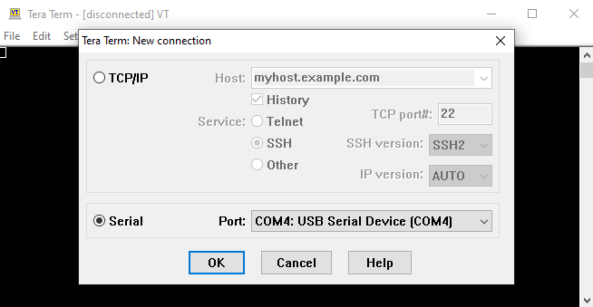
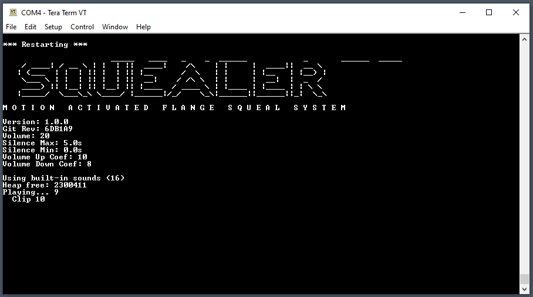

# Advanced Configuration {align=right style="height: 75px; margin-top:0px; margin-bottom: 0px"}

## Overview

While the Squealer comes pre-configured with settings that work for the vast
majority use cases, it does have the capability to adjust some parameters to
tailor its performance for specific situations.  These parameters include:

* Random silence between squeal sounds
* Fade up time
* Fade out time

!!! warning "Please Note"
    Making these adjustments does require a basic level of familiarity with
    computers and the Windows operating system, and a some experience with
    installing software, connecting USB devices, and interacting with a text
    terminal.  While we would love to support every customer in this effort,
    making these adjustments is considered an advanced topic and our ability
    to provide direct technical support (other than through this guide) may
    be limited.

## Step 1 - Install Tera Term

To interact with the Squealer, a terminal emulator is required.  For most
Windows users we recommend [Tera Term](https://ttssh2.osdn.jp/index.html.en). 
The latest installation executable can be downloaded from GitHub here:

[https://github.com/TeraTermProject/osdn-download/releases](https://github.com/TeraTermProject/osdn-download/releases)

Download the .exe file and follow the prompts in the setup process.

!!! note "Alternative Terminal Emulators"
    If you have a different preferred temrinal emulator, by all means use
    it.  The rest of this guide will use Tera Term on Windows as an example,
    but the core functions still apply regardless of the terminal program
    used.

## Step 2 - Connect the Squealer

Using a Mini USB cable, connect the Squealer to your computer.  Mini USB
cables can be found at most electronics stores, or places like Amazon.

Since the Squealer enumerates as a Communications Device Class (CDC), no
drivers are required.

## Step 3 - Launch Tera Term

When Tera Term launches, it will prompt to create a new connection.  Select
the **Serial** radio button.  The **Port** box should list a COM port.  If
it doesn't, check your connection with the Squealer board and restart Tera
Term.

**Note:** COM4 above is only an example.  The number listed for you may be different.

If only a single COM port is listed, then click **OK** and continue to the next step.

In the event multiple COM ports are listed, you will need to determine which one
corresponds to your Squealer board.  Disconnect the Squealer board, restart
Tera Term, and note which COM ports are listed.  Then reconnect the Squealer
board, restart Tera Term again, and not which COM port is new to the list. 
That's the one to select for the Squealer.  Select it and click **OK**.

## Step 4 - Configuration

After clicking **OK** above, the terminal window should appear.  You may see
some diagnostic text appear in the window.  This is normal and tells you
what the unit is currently doing.  Press the 'q' key to reset the Squealer
and print its setup information.

In the information listed are the four settings that can be adjusted:

* Silence Max
* Silence Min
* Volume Up Coef
* Volume Down Coef

**Silence Max** can be adjusted up and down using the 'a' and 'z' keys while
**Silence Min** can be adjusted using the 's' and 'x' keys.  These settings
control the range of the random silence inserted between each squeal clip,
in seconds.  Smaller values result in less silence.  If both settings are
set to the same value then there will be no randomness to the silence - it
will always wait that amount between clips.

The Volume Up Coef and Volume Down Coef control how quickly the sound ramps
up when triggered and down when untriggered.  These values are unitless and
larger values result in *faster* ramp times.  It is best to set these
empiracally - try a setting, see if you like it, then adjust again if needed.

The 'd' and 'c' keys set Volume Up Coef and the 'f' and 'v' keys set Volume
Down Coef.

!!! note "Default Values"
    The default values for each setting are:
    
    Silence Max = 5.0s

    Silence Min = 0.0s

    Volume Up Coef = 10

    Volume Down Coef = 8

## Saving Values

When you make a change to one of the values, it is automatically saved to
the non-volatile memory on the Squealer.  No special steps are needed to
save the values and it will power up next time using the values you set.
