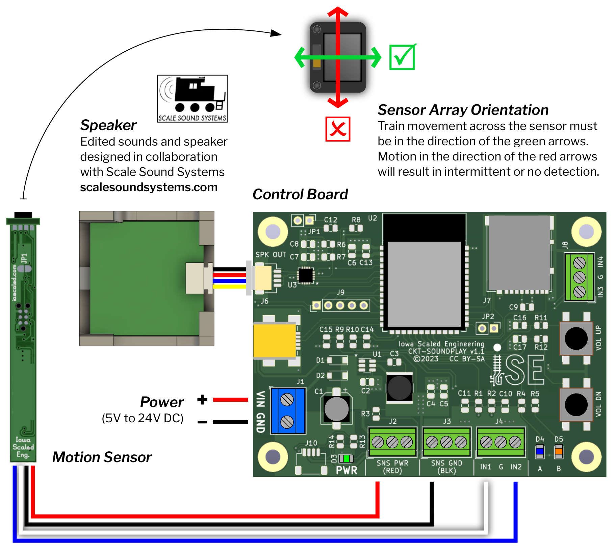

# User Manual {align=right style="height: 75px; margin-top:0px; margin-bottom: 0px"}

## Overview

The [Squealer](https://www.iascaled.com/store/SND-SQUEAL) is a true
motion-detecting flange squeal system.  Using professionally recorded and
edited flange squeal, the Squealer brings authentic trackside sound of steel
wheels against rails for ultimate realism.  The system uses a micro motion
detector between the ties to sense train movements and play either the
built-in professional sounds or user-defined sounds for maximum flexibility. 
Modelers now have the ability to recreate all the trackside audio ambience
that has been missing from our model worlds.

Placed in locations on the layout where flange squeal is most likely to
occur, the Squealer takes the immersive layout experience to a new level. 
Use individually (with one or more sensors) or place several Squealer
systems together to get an all-encompassing stereo effect.  The
professionally recorded and edited built-in sounds provide a basic sound
landscape for most situations, but custom sounds can also be loaded using a
microSD card.  The possibilities are only limited by your imagination!

### Features

* True motion-detecting operation: only squeals when something is moving
* Simple, discrete under-track installation
* Professionally recorded and edited flange squeal sounds play randomly
* Sounds fade smoothly when activated or deactivated
* Custom sounds can be loaded using a microSD card
* Comes complete with sensor, speaker, and control board
* Powered from 5V to 24V DC
* Additional [motion sensors](https://www.iascaled.com/store/CKT-MOTION) available

### Typical Applications

* Mainline curves
* Yards
* Tight industrial trackage

---

## Quick Start Guide

### Power

The Squealer can be powered from 5V to 24V DC, applied through connector J1
(positive to VIN, negative to GND).  Alternatively, the mini USB jack can be
used to power the Squealer, either from a USB charging block or a laptop/PC.

{align=right}
### Sensor Installation

1.  Drill a 1/16" pilot hole down through the benchwork

2.  Drill a 3/8" hole up to just under the ties

3.  Align the motion sensor with the top of the ties.  Use a piece of paper
towel or tapered shim and gently wedge into the hole to hold the sensor in
place

The motion sensor is powered from the Squealer board.  The red wire from the
motion sensor connects to J2 in any of the RED terminals.  Similarly, the
black wire from the sensor connects to J3 using any of the BLK terminals. 
The sensor output wires (white and blue) connect to IN1 and IN2 terminals on
J4 respectively.  Note that the center terminal on J4 is ground and
shouldn’t be used.

Position the sensor below the rail even with the tie height.  Make sure the
full face of the emitter opening and imaging array is clear of any ballast
or obstruction.

Although the sensor and the control electronics are relatively robust,
standard precautions should be taken — avoid static electricity, don’t let
it get wet, and keep conductive materials away, etc.

Additional sensors may be connected the same way as above.  Terminals IN3
and IN4 can also be used for the sensor output wires (white and blue) if
more space is needed.  Although a large number of sensors can be connected
to one board, practically speaking, four or five is probably the most that
make sense in most situations since you want the speaker to be reasonably
close to where the sound is triggered.  More than that, and you will likely
be happier having multiple Squealer modules spaced around, connected to the
nearest sensors.

### Speaker Installation

The speaker attaches to connector J6 (SPK OUT) on the board.  The plastic
speaker enclosure can be mounted above or below the layout.  For better
sound fidelity, bore a 3/8" hole in the scenery or benchwork, and position
the speaker enclosure with the opening on the side facing up.  Camouflage
the hole with scenery.  However, this is user preference and may involve
some experimentation.

---

## Operation

After powering up, the blue LED will blink to indicate the Squealer is
ready.  If using the built-in sounds (ie: no microSD card), the blue LED
will blink twice.  If a microSD card is inserted with valid WAV files on it,
then the blue LED will blink four times.

Sound is muted until the sensor detects motion.  Once detected, the volume
will fade up to the set level.  Note that there are random silence spaces
built into the program, so sound may not play immediately.  However, the
blue LED on the Squealer board will always indicate the current detection
status.

### Volume Control

The volume has 30 levels and comes preset at level 20.  Level 0 is mute. 
There are ten levels above 20 to amplify custom audio tracks with low gain,
but these levels should be used with caution as they may cause distortion.

To change volume, press the VOL UP or VOL DN button.  The amber LED will
blink briefly in response to pressing the button.  When setting volume level
20, the amber LED will blink somewhat longer than normal to indicate it is
the default level.

---

## Custom Sounds

Custom sounds can be loaded into the Squealer using a microSD card.  The
microSD card must be formatted as FAT.  The sounds must also meet the
following requirements:

* WAV file named with .wav extension (e.g. mp3 or other formats will not work)

* Place .wav file(s) in the main directory of the microSD card (all other sub-directories
  and their contents are ignored)

* 16-bit, mono format

* 8, 16, 32, or 44.1kHz sample rate

The Squealer will load all valid files found on the microSD card and begin
playing them in random order.

---

## Specifications

**Input Power:**  5 to 24 volts DC  
**Size (Control Board):** 3.75"(L) x 2.25"(W) x 0.5"(H)  
**Size (Speaker):** 1.25"(L) x 1.25"(W) x 1"(H)  
**Size (Motion Sensor):** 2.25"(L) x 0.25"(W) x 0.25"(H)

---

## Open Source 

Iowa Scaled Engineering is committed to creating open designs that users are free to build, modify,
adapt, improve, and share with others.  

The design of the Squealer hardware is open source hardware, and is made
available under the terms of the 
[Creative Commons Attribution-Share Alike v3.0 license](http://creativecommons.org/licenses/by-sa/3.0/). 
Design files can be found in the [ckt-soundplay](https://github.com/IowaScaledEngineering/ckt-soundplay), 
[snd-squeal](https://github.com/IowaScaledEngineering/snd-squeal), 
[ckt-motion](https://github.com/IowaScaledEngineering/ckt-motion), 
[ckt-irsense](https://github.com/IowaScaledEngineering/ckt-irsense), 
and [ckt-dingdong](https://github.com/IowaScaledEngineering/ckt-dingdong)
projects on GitHub.

The firmware for the Squealer is free software: you can redistribute it and/or modify it under the 
terms of the GNU General Public License as published by the Free Software Foundation, either [version 3 of the 
License](https://www.gnu.org/licenses/gpl.html), or any later version. Firmware for the
Squealer can be found in the [snd-squeal](https://github.com/IowaScaledEngineering/snd-squeal)
and [ckt-motion](https://github.com/IowaScaledEngineering/ckt-motion) projects on GitHub.
