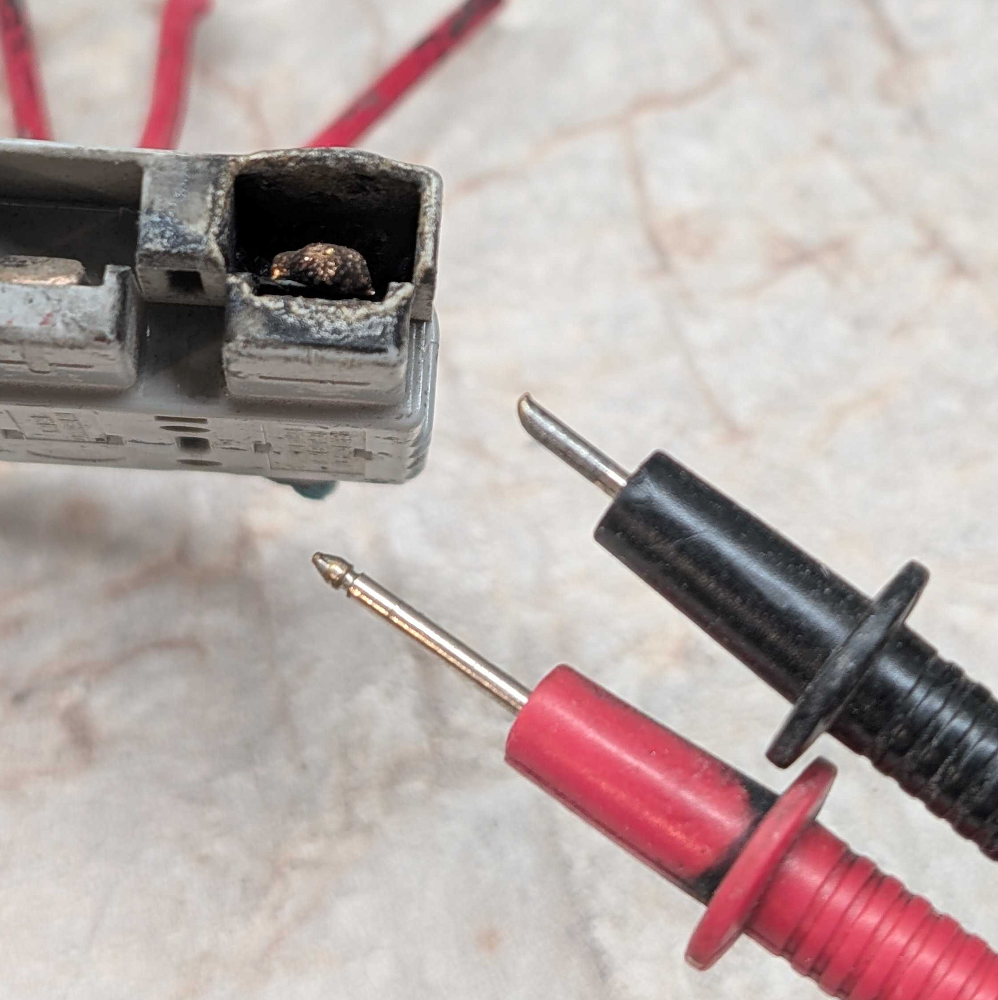
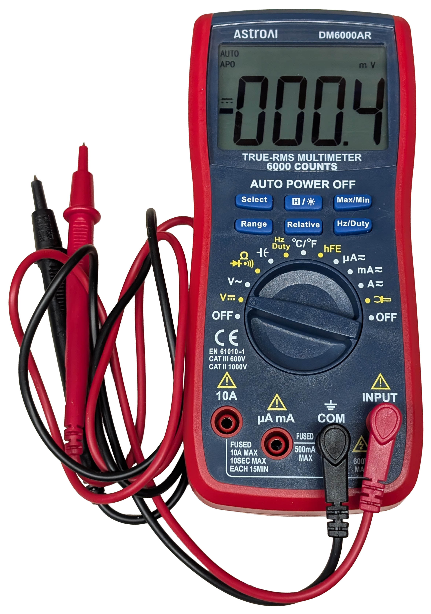
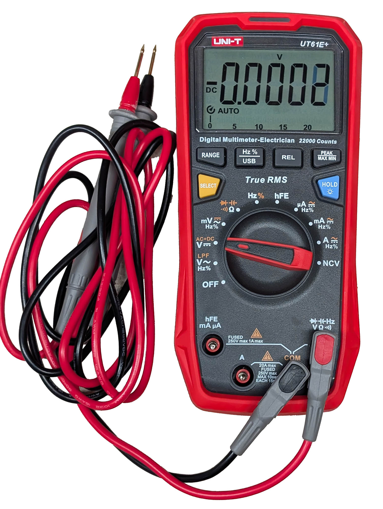

# The Modeler's Electrical Toolkit: Multimeters

## Overview

A digital multimeter (DMM) is a tool we think really all modelers should have.  Even if you're just doing a simple switching layout with two wires from your DCC system to the track, being able to troubleshoot dead spots, or bad decoder connections, requires a meter.

Pretty much any meter on the market will work for basic  model railroad use.  You're going to be dealing with 12-18V at relatively low currents (5 amps or so), so safety ratings aren't a primary concern.  Almost any meter on the market is going to be accurate enough for the purpose, given most of the time if you're within 5% that's good enough.  If you're doing other things, like ever measuring mains voltage, you need to have a few more considerations.

Key features I'd look for:

* Basic Stuff - At least 3-1/2 digit, meaning it will display values from 0-1999 before switching ranges.  Almost any meter meets that today.  4-1/2 digit meters are nicer, but not really needed for model railroad use.  The meter should measure DC and AC voltages and currents, as well as resistance and continuity.  Personally, I think everything else is probably things that the average modeler will never use.  Temperature, frequency, and capacitance are unlikely to be useful in a model railroad setting but have uses elsewhere, and literally no one in the last 30 years has used the hFE transistor test functionality.
* Good Autoranging - This means if you're measuring a 2V or a 20V signal, the meter will pick the appropriate range to give you the most digits of measurement.  Older meters had what's known as "manual ranging", where if you were measuring a 1.5 volt signal, you'd pick the 2V range and then get a reading like 1.547V, but if you measured it on the 20V range you'd only get 1.54V, or the 200V range would give you 1.5V.  There are still manual ranging meters out there, and some people (Michael) prefer them in some cases, but for general use I highly recommend good, fast autoranging meters.
* Fast Continuity Test - Continuity test allows you to check if you have a connection between two points.  Ideally, you touch the probes to the two points and a beep goes off quickly if they're connected.  Some meters don't beep, and some have a notable delay before the beep sounds, so if you move too fast you may think the wires aren't connected when they actually are.  Ideally you want a meter with a nice, loud beep that triggers quickly.
* Powered by AA batteries - Personally, I hate 9 volt batteries.  They don't last long, they're expensive, and I never seem to have a spare. With AA (or AAA) batteries, I always have some around, especially since I run a pile of rechargeable and there's always fresh ones in the hopper.  AAAs are okay, too, but they won't last as long.
* Automatic Power-Off - Most meters have it, but if it doesn't, I guarantee you'll kill batteries in no time because you forget to shut the thing down.  
* A good, brightly-colored shock-resistant rubber bumper.  You will drop the meter.  You will set it down and lose it.  Having a brightly colored rubber bumper around it helps with both of these.

Some nice-to-have features that I'd also recommend considering:

* Backlit display - Under the layout, it can be dark, and as we get older it's nice to have a bright display to look at.   
* "Incorrect Probe Connections" Warning - Most of us have tried to measure voltage with the probes in the current measurement position, which leads to blown fuses, fried probe tips, and sometimes damage to the meter or the user. See [*A Note on Safety*](#a-note-on-safety) below.
* True RMS rated up to at least 6-8kHz.  RMS (root mean square) is a way of accurately measuring alternating current and voltage waveforms.  Cheap meters just measure the peak voltage and assume it's a 60Hz sine wave.  That works if you're measuring any mains-derived AC power, but absolutely doesn't work for a 6-8kHz DCC square wave.  Beware that some True RMS meters only work to 1kHz or so.  
* A CAT III Safety Rating to at least 600V - My meters generally get used with low voltage, but I occasionally have to go poking around mains-level wiring.  For that, I want to make sure my meter has appropriate safety testing and rating done.  A 600V CAT III-rated meter should be safe for anything on your side of the breaker box when used correctly.  Reputation counts here.  I trust - with my safety - that a Fluke or a Keysight meter has absolutely been through correct safety testing to earn the rating.  Some weird brand from China that claims CAT III?  Not so much.

### A Note on Safety
Most people don't think of safety as a key feature when choosing something like a meter.  For model railroad use, you're unlikely to run into an unsafe situation.  The power levels we deal with in our hobby just aren't an issue.  However, since you may use your meter to do other things around the house, it's worth mentioning.

There's two main considerations.  The first is really making sure that you don't create an unsafe situation unintentionally, and the other is minimizing harm when everything goes wrong.

In the key features section, I mentioned having a warning when probes were inserted incorrectly.  That's avoiding an unsafe situation.  When measuring current, it must flow throw the meter, and therefore you want the meter to appear with as little resistance as possible to avoid messing with the measurement.  Basically when it's in current mode, you want it as close to a piece of wire as possible from one probe to the other.  That makes it a dead short if you try to then put it across a power supply to measure voltage.  A good meter will audibly warn you that your probes are in the wrong spot when you change the selector switch so that you don't do this.

[{ align=right width=250 }](img-tools/tools-dmm-probedamage.jpg)
There was an incident in college where Michael did this across an electric vehicle pack.  It was an early morning in Indianapolis and nothing had gone right, and in a hurry he changed to voltage measurement and forgot to move the probes out of current measurement.  This particular meter did not have an audible warning. In doing so, he managed to vaporize most of a probe tip and give himself nasty burns all over the hand that was holding it, along with creating a flash and bang that scared the crap out of the rest of us.  That picture on the right is the actual connector and probes.  A few milliseconds before the incident, those probes were the same length, and that Anderson connector was nearly brand new.  

That's where the other part comes in.  Meters are designed to get a category rating (CAT) - how much energy they can be connected to at a given voltage and not pose undue risk to the user.  As rough guidelines...  CAT I is generally low voltage, low power bench electronics only.  CAT II is roughly anything on a 120V branch circuit in your house.  CAT III is anything on your side of the breaker box.  CAT IV is anything on the utility company's side, up to the voltage rating.  Good quality meters will be at least CAT III up to 600 volts.  The meter in the incident above, being well designed, handled it with relative grace.  Nothing exploded or caught fire.  Michael still has it, it actually still works just fine.  

## Meter Recommendations

### The Most Terrible Meter, But I Have Six

[{ align=right width=250 }](img-tools/tools-dmm-hf.jpg)

Harbor Freight offers a $8 DMM. They fail nearly every criteria above.  Powered by a 9V, and doesn't automatically shut off so it's prone to killing them.  Not autoranging.  No beeper at all.  Not RMS.  No rubber bumper.  The safety rating is "be appropriately terrified" and there's a sticker that basically says that on the back.   Yet I probably have a half dozen.  Why?  They're ridiculously cheap (often free to $5) and they're good enough for emergency, low voltage use.  I keep one in the emergency bag of tools in all of my cars.  If it dies?  Toss it and get another one.  If you're strapped on cash, this is the meter for you.  Just please, never use it to measure anything above 20V - at least if you value your hand.

### Budget Choice

[{ align=right width=250 }](img-tools/tools-dmm-dm6000ar.jpg)

For budget, I'm considering things under $50.  There's a million options of weird Chinese brands here.  They come and go faster than I could keep this updated.  That's okay, because you're not going to spend time or money on service or calibration for most meters in this class - you'll just replace it if it dies.

The things I would look for here are display quality and size.  You want a clear LCD display with big digits, without a lot of mumbo-jumbo around them..  

The ISE toolbox has an AstroAI DM6000AR in it.  It's about $26 on Amazon.  It's a 3-1/2 autoranging meter in a case that's comfortable to hold with a big, easy-to-read display.  Continuity mode is fast with a nice loud buzzer, and basic DC measurements of current and voltage are reasonably fast and accurate.  The probes are decent quality.

Now the downsides - you didn't think our budget choice would have everything, did you?  It runs on a 9V battery.  The backlight is an terrible LED blue that's hard on the eyes, but it is bright (which is part of the problem).  If they'd just made the LEDs white or yellow, it would have been much easier on the eyes.  Despite its claims of "true RMS" it doesn't do RMS correctly at DCC frequencies - a quick test against my test track showed 2.83 volts as opposed to the correct answer of 12.1 volts.

### Mid-Range Choice

[{ align=right width=250 }](img-tools/tools-dmm-ut61eplus.jpg)

"Mid-range" in this case is somewhere around $100.  For this I'd expect it to hit most of the features and be a quality tool that will last decades.  

In this range, I'd recommend something like the Uni-T UT61E+.  Uni-Trend is a Chinese instrument brand that has been around for a while and generally builds some decent tools. They're not high end, but the general consensus is that they're generally solid tools.  

So why the UT61E+?  It checks most of the boxes on the want list, and can usually be found for less than a C-note.  It's a 4-1/2 digit meter with good basic accuracy.  It runs on AAA batteries that are easy to change.  The display has very large digits and is backlit.  Autoranging is relatively quick.  It's solidly built, but still nice and light.  Continuity test is super fast and the beeper is nice and loud.  It's rated as Cat III to 1000V for voltage measurement, and the interior suggests it might actually be okay with that.  (Note that current measurement is only to 250V.)

Be aware that it also comes in A, B, C, and D flavors with very different features.  Also, the plus is important.  There was a straight UT61E before, and the plus improved a bunch of features (like a much better screen and better internal protection circuitry).

Here's the real kicker, though - it's rated for true RMS measurement of current and voltage up to 10kHz.  That's more than fast enough to make accurate DCC measurements.  At the price point, that's really unusual.  Normally true RMS at frequencies above maybe 400-1000Hz is a feature reserved for much more expensive meters.  It actually seems to live up to those specs, too.  I compared it with both my regular meter and my bench meter - both of which can read DCC voltages and currents very accurately - and it's only off by a few percent.

Really the only thing on my want list that it doesn't have is a beeper to warn you that your probes are in the wrong ports. I lived without that for decades, and if you're not poking around high energy sources carelessly, you'll be fine.

### The High End

[{ align=right width=250 }](img-tools/tools-dmm-u1282.jpg)

Michael and I both use Keysight U1282A meters for our main portable DMMs.  They're great meters, and check all the boxes on the wanted features list, but they're solidly the price of buying a handful of top end, DCC/sound locomotives.  They're a professional level tool and have a price tag to match.

So what do you get for your money?  These things are tanks, and they're absolutely bulletproof even in all day, every day use.  They have weather sealing against moisture and dirt ingress.  The safety ratings stamped on the case I trust have been tested appropriately.  They should hold their accuracy better than cheaper brands over time.

Flukes are also great meters, but but in my opinion they're more targetted at electricians than bench electronic work.  Still, something like a 177 or 87V or 289 is a high quality meter that will last you a lifetime.  I've had a Fluke 289 for about 15 years and it's a workhorse as well.  

On the lower price end of "high quality meters" you have the Brymens, B&K Precisions, and Extechs of the world.  They're generally good meters for a couple hundred bucks, rather than pushing up next to a grand.  Honestly if you want to splurge, that's where I'd go first.  Most modelers will get by just fine with a budget or mid-range meter for their entire life.

## How to Use a Multimeter

Honestly there's so much written and filmed on this subject that there's little point in me re-writing it.  The challenge has been finding one that covers the basic measurements (voltage, current, resistance, continuity) focusing on electronics work, rather than how an electrician would use it.

After watching a good number of the various multimeter tutorials on Youtube, I would [recommend watching this one](https://www.youtube.com/watch?v=EvAq9zqRB5I).