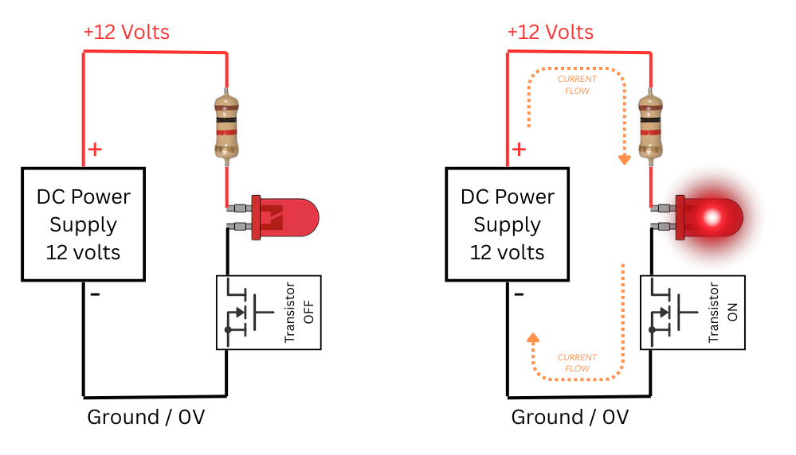
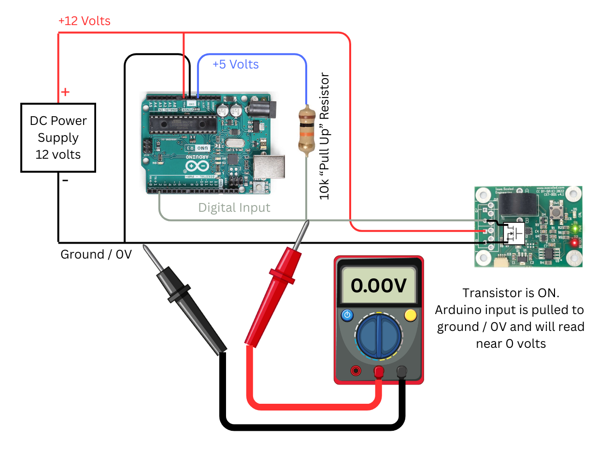

# Let's Talk About Open Collector Outputs

## Overview

Many of our products, such as the ATOM and various TrainSpotter detectors, use what are known as "open collector" outputs.  Since this is often a source of confusion for model railroaders, we'll talk about what these really are, and explain them in a simple way that anybody should be able to understand.

## But First, Definitions

In this article, we'll often refer to "ground".  This is not the third pin on your wall outlet, or what's known as "safety ground" or "earth ground".  Ground in a DC circuit is just the point that we define as 0 volts and measure all other voltages against.  Typically this is the negative side of the power supply in simple DC circuits that model railroaders will be messing with.

Contrary to what some snooty physicists will tell you (who are technically correct, but still snooty physicists), electrical current flows from positive to negative.  This is opposite the way the electrons are actually moving through the circuit, but it's the way we've defined electrical current for hundreds of years and all of the conventions are set up to work that way.

## Lighting an LED

Let's start with a very simple circuit, some Electricity 101 stuff.  Electricity flows in loops.  Current flows out of the positive side of a DC power supply, through some load, and back to the negative side.  If the loop isn't complete, no current can flow and everything shuts off.

That power supply could be a battery or a wall wart or even a power pack.  In our example here, we'll just have a "DC Power Supply - 12 Volts" as a box on the left because it doesn't really matter what it is.  Just know that it puts out 12 volts DC with positive connected to the red wire along the top, and ground or the negative side connected to the black wire along the bottom.

Here we have the most basic of circuits.  Current leaves the power supply, goes through a resistor and an LED, and returns to the negative side.  The resistor is there to limit the current that goes around the loop, because otherwise too much current destroys the LED.

Now, if we break the connection between the LED and ground, current stops flowing and the LED shuts off.

Rather than physically disconnecting wires, we have these handy things called toggle switches.  With the quick flick of a lever, internally it connects or disconnects the two terminals.  If we drop one of those in the gap, we can now use the switch to either open or complete the circuit, turning off or on the current and the LED as we desire.

## Transistors

Transistors aren't scary!  For the purposes of our discussion here, they're just like little switches, except rather than a lever moving contacts apart to open the circuit, they use electric fields in tiny bits silicon to do the same thing.  There's a whole lot of math and chemistry behind making these tiny miracles work that can make entire careers for semiconductor physicists, but we aren't going to go there.  We're not even going to talk about all the different types of transistors.  We're going to keep this very simple.

For what you need to know here, a transistor is just like a toggle switch that can be turned on or off by other electronics.  It can be "OFF" and no current will flow - it acts like an open circuit or a toggle switch where the contacts inside are pulled apart.  Or it can be "ON" and acts like a switch where the contacts are touching and current can flow.

So now we see our same circuit, but we've swapped in a transistor instead of our toggle switch.  This symbol is what's known as an N-channel metal oxide semiconductor field effect transistor, or MOSFET.  Don't worry, no quiz later and you don't need to remember that.  Just know that the top and bottom terminals are like the terminals on the toggle switch.  The terminal on the right, which isn't shown connected, is how we control the transistor "switch" with other electronics.

As you can see, it works exactly the same as it did with the toggle switch!  Turn the transistor off and it acts like an open switch, breaking the circuit.  Turn the transistor on and it acts like a closed switch, completing the circuit and allowing current to flow, turning on the LED.

There are a couple important differences between a standard toggle switch and a transistor for what we're doing here:

* Transistors only switch current in one direction.  That's why we have one side of them always tied to ground - so that they can switch current coming from the positive side of the supply.
* Transistors have maximum voltage and current limits that we care about.  Technically toggle switches have voltage and current limits as well, but we usually don't think of them because they're so far beyond how we typically use them.  There is a maximum voltage and a maximum current that can be applied to a transistor before it becomes a smoking crater.  The maximum current is important when the transistor is on and conducting current, and the maximum voltage is usually important when the transistor is off.

For ATOM and TrainSpotter sensors, our output transistor can handle up to 40 volts when it's and 250 milliamps of current.  In our little example here, if the transistor is OFF, it's essentially seeing 12 volts across it coming from the supply.  That's well within safe limits.  If it's ON, we see about 12 milliamps, because the 1k-ohm resistor in the circuit the current to that (12 volts / 1000 ohms = 12 milliamps).

## Why is it Open Collector?

Glad you asked.  This is where the snooty physicists show up again, because they came up with transistors and think of electron flow and not current flow.  The side of the transistor attached to ground is called the "emitter" or the "source" because that's where the electrons come from - the negative or ground side of the power supply  The side that we're using as the other half of the switch is known as the "collector" or the "drain" depending on the type of transistor, but it doesn't really matter here.  Since nothing is connected to it internally, it's "open" if the transistor if off.  Thus, it's an "open collector" output, just waiting for you to hook something up to it.

If the transistor is not turned on, we refer to the disconnected output as "floating" because it's not connected to anything and cannot conduct current.  It's like the wire hanging off the LED that was disconnected in one of our early examples.

## A Practical Example

Let's look at the ATOM block detector, which has two open collector outputs.  (Technically they're open drain, because the output transistors are MOSFETs.)

I've overlaid the transistor symbol we've been using on a picture of an ATOM detector board.  One side is, as always, connected to the ground power supply terminal.  The other side is connected to the D (or detecting) output, and it turns on when the ATOM is detecting a train in the block.

Of course the ATOM itself needs power to function.  So we have to hook up both the +12V power supply line and ground to the two power supply terminals (+V and GND).

At that point, we can put the bottom of our LED into the D terminal.  Just like with the toggle switches and basic transistor examples, on the left we see where the transistor is off and the output is "open" or "floating" and nothing is happening.  No current flows, and the LED remains off.  On the right, we see one where the detector has picked up something and turned on the output transistor.  The output is now like a closed switch to ground, with the transistor conducting and allowing current to flow through the LED.

A couple of notes.  You'll notice I said there are **two** open collector outputs on the ATOM.  That's true.  One is labeled D, which we've just talked about.  The other is labeled the /D (or not detecting) output.  It works just the same, except it's turned on when nothing is detected.  Our TrainSpotter detectors - other than the TrainSpotter M motion detector - work exactly the same.  The red and black wires are power and ground respectively.  The white wire corresponds to the D output terminal, and the blue wire corresponds to the /D output.  The motion detector has one output for motion detected moving right, and one for motion detected moving left.

## Cool Tricks - Paralleling

One of the coolest things about open collector outputs is that it allows you to parallel multiple sensors and if any of them turn on, it completes the circuit.  I'm going to go back to toggle switches here, just in case the whole transistor thing didn't quite click yet.  Everybody gets toggle switches.

Here we have two toggle switches in parallel.  If all of them are off, the circuit is broken, no current flows around the loop, and the LED remains off.  But if we turn any of them on, current now has a path back to the power supply and the LED lights.  So turn on one, turn on all, it doesn't matter - if any of them are on, the LED comes on.

The same works with transistors.  If you hook two ATOM or TrainSpotter detectors together in parallel, the output will complete the circuit if any of them are triggered.  This is how things like the RoadReady Basic crossing controller work.  If either of the TrainSpotters detects a train sitting over it, it turns on the output and makes the crossing go.  This is also what's called a "logical OR" because if sensor 1 OR sensor 2 OR sensor 3 is active, the whole thing is active.

## Beyond LEDs

LEDs are great and all, but often we want to connect to more complex electronics, such as the input on an Arduino microcontroller or similar.  Think about a crossing flasher.  We want to know when any of the sensors are picking up a train in order to figure out whether to run the flashing lights and bell.

Usually that involves sensing the voltage on an input wire to see if something is “high” (close to 3.3V or 5V, depending on the part) or “low” (close to ground, or 0V).  One of those states will indicate the sensor is picking up something, and the other will indicate all clear.

In this example, we’ll use one of the digital input wires on an Arduino to read the status of an ATOM block detector.

In the inactive state, the transistor on the D output is off, meaning it’s like an open switch.  As we talked about earlier, this makes the output “floating," meaning it’s not at any specific voltage but just disconnected from everything.  That doesn't work well for the Arduino, because a floating output could be at almost any voltage, even near ground.  The Arduino is reading the voltage and needs something specific.  In order to make sure it floats to a "high" level, we add a large value resistor, like 10k-ohm, to the voltage we want it to sit at when the switch is open.  This “pull up” resistor gives the floating input a very gentle nudge to 5V, so it predictably reads as high, but no current flows because the switch is off.  The Arduino sees this as a "high" input condition, and knows that nothing is tripping the detector.

If the detector picks up something and turns the transistor on, that "transistor switch" connects the bottom of the pull-up resistor – and the digital input – directly to ground.  That causes some current to flow through the resistor, but because it’s a large value resistor, the current is minimal.  That’s why we use large value resistors for pull-ups – to minimize the amount of power we burn.  But now the Arduino sees a low input and knows that the detector picked up something.

This is very similar to how the inputs on many of our modules work, including the SoundBytes, RoadReady, Squealer, and SimpleSig line.  Many of these are just a microcontroller input similar to the Arduino example above that has a pull-up resistor.  By default, it "floats" high and is inactive.  The module is activated by a switch or an open collector output transistor pulling it to ground.

## Cool Tricks - Different Voltages

The Arduino example points out one of the very cool features of open collector outputs – we can have a very different voltage on them than the power supply for the system.  If you put 12V on an Arduino input pin, you’d very quickly have a smoking crater and have to go buy a new one.  Their inputs only tolerate a maximum of 3.3V or 5V, depending on the model.  But since they share the same ground, we can run the output pulled up to 3.3V or 5V while the ATOM is powered by 12V.

The same goes in reverse, as well.  We could power the ATOM with 5V (its minimum power supply voltage), and want to switch a light that’s powered by 12V.  As long as they share a ground and you don’t exceed the current rating of the transistor, you can do it safely.

!!! warning "Beware of Relays!"
    A note of caution.  Be careful of driving relays with transistors without "snubber diodes".  When a relay de-energizes, the magnetic energy stored in the coil becomes electrical energy and causes a big voltage spike, often reaching several hundred volts for a short time.  This commonly kills transistors.  A "snubber diode" is needed to safely shunt that energy and keep the voltage from spiking.

## Summary

That's all there is to it!  Don't be scared of the name - open collector outputs are easy to use for a variety of applications!  Just remember, they're a switch to ground with some voltage and current limits.  They're a very common way that all sorts of sensors - not just from ISE but across the world of electronics - connect to bigger systems.

