# Using TrainSpotters and SoundBytes With Other Crossing Modules

One of the questions we get somewhat frequently is how to use the TrainSpotter infrared detectors and SoundBytes crossing bells with other vendors' grade crossing modules.  While we offer our own [basic](https://iascaled.com/store/CKT-XING-BASIC) and [advanced](https://iascaled.com/store/CKT-XING-ADV) crossing controller options, there's no reason to rip out what you've already got if it does most of what you need.  Sometimes you just want to upgrade the thing that's giving you issues, and our TrainSpotter sensors and SoundBytes bells can improve your detection and sound!

This guide will show you what's possible for some of the more popular crossing control modules, and show how to connect them up to each. Specifically, we're going to look at Logic Rail's Grade Crossing Pro/2, Azatrax's MRX3, the WeHonest master control board, and a common, cheap Chinese flasher module from eBay.

[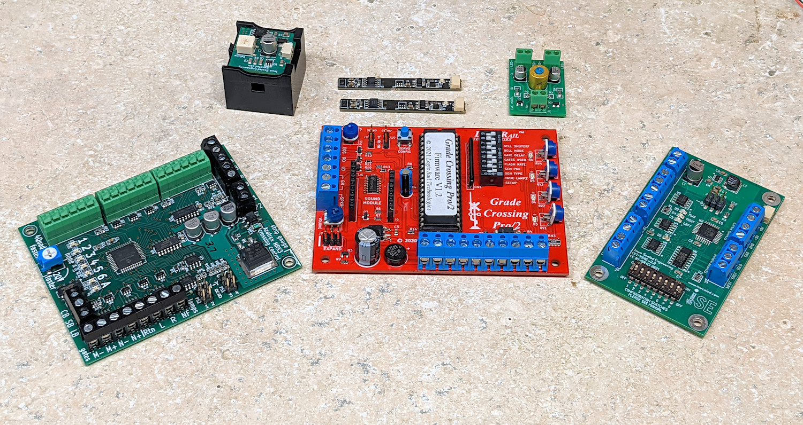](img-tsc/xing-compare.jpg)
*Some popular crossing modules with two TrainSpotters and a SoundBytes bell.*

## Logic Rail Technologies – Grade Crossing Pro/2

The Grade Crossing Pro/2 is Logic Rail's latest version of their grade crossing controller.

### Upgrading to TrainSpotter Detection

By default, the GCP/2 comes with either photocell sensors (the $47.95 GCP/2 version) or infrared (the $59.95 GCP/2-IR), and can also be purchased without sensors for $39.95. Photocell detectors are always going to need room light to function reliably and are finicky, requiring you to manually set sensitivity with the onboard potentiometers, so they're never a great choice. If you go with the GCP/2 infrared sensors, each sensor set requires mounting a pair of devices – an LED and a phototransistor – and making sure they stay in alignment.  The GCP/2 uses a modulated IR scheme, so it should be solidly immune to room lighting and other interference.

The GCP/2 is easily upgraded to TrainSpotters, if you prefer their simpler single hole mounting and no alignment issues.  Logic Rail brings out all the signals we need. Just mount each TrainSpotter in the same place you would mount the normal GCP/2 sensor, connect the red wire to the +5V terminal, the black wire to the GND terminal, and the white wire into WF / WN / EN / EF as appropriate based on where the sensor is located. I've circled the appropriate connections in green in the picture. You will also need to set the dip switches so that “SEN TYPE” is OFF (towards the text label) and “SEN POL” is ON (away from the text label).

[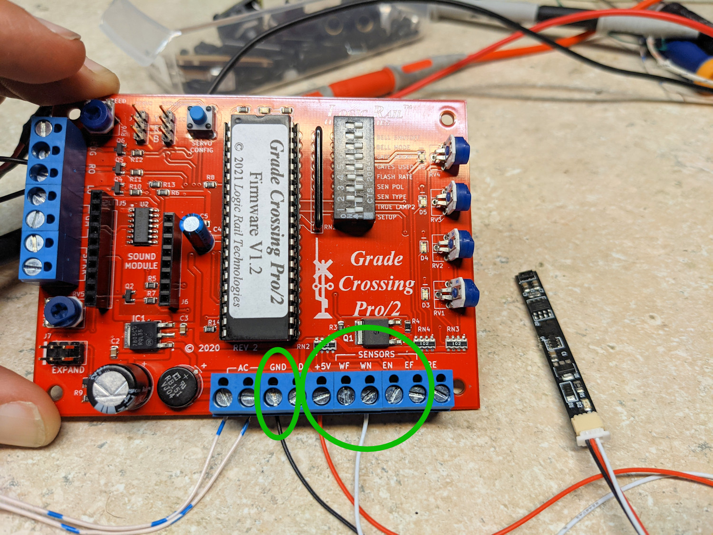](img-tsc/gcp-ir-conn-1.jpg)
*Connecting a TrainSpotter to the GCP/2*

### Upgrading to a SoundBytes Bell

Logic Rail offers an assortment of bells that you can plug directly into the board. However, you might find that you like ours better, since we offer a broader range of exact prototype recordings and offer an integrated speaker. So if you want to hook up a SoundBytes bell, here's what it's going to take.

The bell is a bit trickier, as unlike the detection inputs, Logic Rail didn't bring out all the signals to the terminal blocks that we need to make it work.  

For both options, the SoundBytes needs to get power.  Connect the red wire to the +5V terminal and the black wire to the GND terminal.  From here, there's two options on where to connect the white (activate bell) signal.

**Option A:** The most correct option - and the way that Logic Rail drives their own bell - is from pin 6 of the expansion header. I just used a spare 2-pin cable I had lying around, and hacked one wire/pin out of the connector. These 0.1″ connectors are frequently called “DuPont” connectors for reasons that elude me, but they're easy and cheap to buy on Amazon. You could also solder to the pin, but that seems messy if you might want to eventually add a second track module or something that Logic Rail intended you to plug in there.  Logic Rail confirms that they'll also sell you just the 6-pin cable to plug into the socket. The cable is available from [their online store](https://www.logicrailtech.com/xcart/product.php?productid=16352&cat=&page=1).

[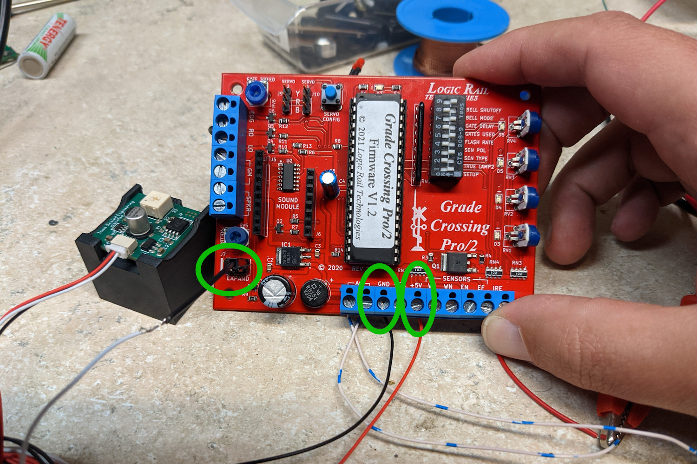](img-tsc/gcp-bell-conn-1.jpg)
*Connecting a SoundBytes to the GCP/2 - Grab power and ground from the GND and +5V terminals*

[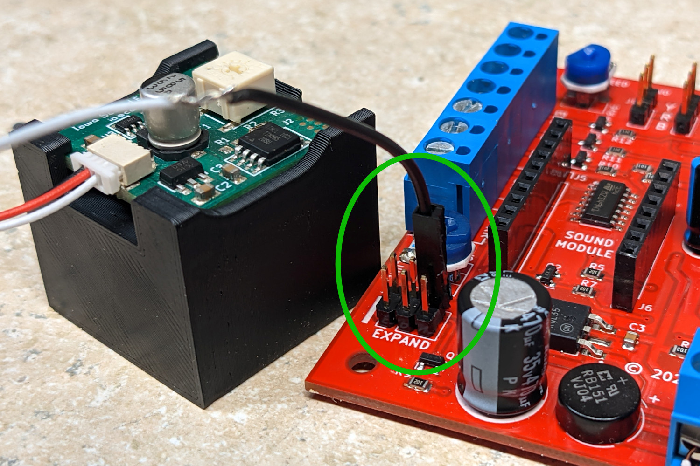](img-tsc/gcp2-bell-conn.jpg)
*Connecting a SoundBytes to the GCP/2 - The activate wire (white) needs to come from a pin on the expansion header*

**Option B:** If you want to cheat a bit and you're not using the GCP/2's EOG (the end of gate – aka, the constant on light – terminal), you can connect the white wire there as well. If you are using it to drive LEDs or anything else, don't do this – you'll fry up the SoundBytes module like an egg on a Death Valley sidewalk in August. But if you're not using it for anything else, it's perfectly safe. The downside is that the bell will ring any time the gate lights are on, meaning any bell options set on the board will no longer apply.

[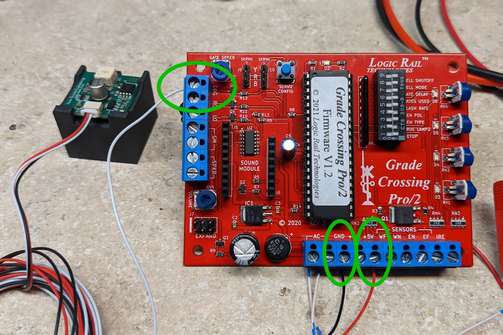](img-tsc/cheat-bell-connection.jpg)
*Cheating on the bell connection*

## Azatrax – MRX3

The MRX3 is Azatrax's latest solution in the grade crossing control space.

### Upgrading to TrainSpotter Detection

Unfortunately, it's not easy to upgrade the MRX3 to TrainSpotter detectors. The EB and WB inputs that can be used for current-based detectors don't have the same delayed timeouts as are built into the onboard optical detectors, so they release the crossing as soon as the IR detector no longer senses something. The onboard detectors use a very clever (no, seriously – *very* awesomely clever) mechanism for determining which IR sensors are attached and how they're configured. Unfortunately it precludes any easy way to connect TrainSpotters – sorry. On the other hand, Azatrax's mechanism for detection works quite well.

### Upgrading to a SoundBytes Bell

Fortunately attaching a SoundBytes bell is actually easier on the MRX3 than it is on the GCP/2, at least assuming you're powering the board with DC and not AC power. (If you're powering it with AC, you're a bit out of luck.) And by DC, I definitely don't mean an [old crappy power pack](power-pack.md). All you need to do is connect the black wire from the SoundBytes to the negative power supply line, and the red wire to the positive power supply line coming into the power terminals (P1/P2). Then connect a line from the negative power supply to the CB terminal on the MRX3, and connect the white wire from the SoundBytes to LB or SB as appropriate for the bell behaviour you want.

[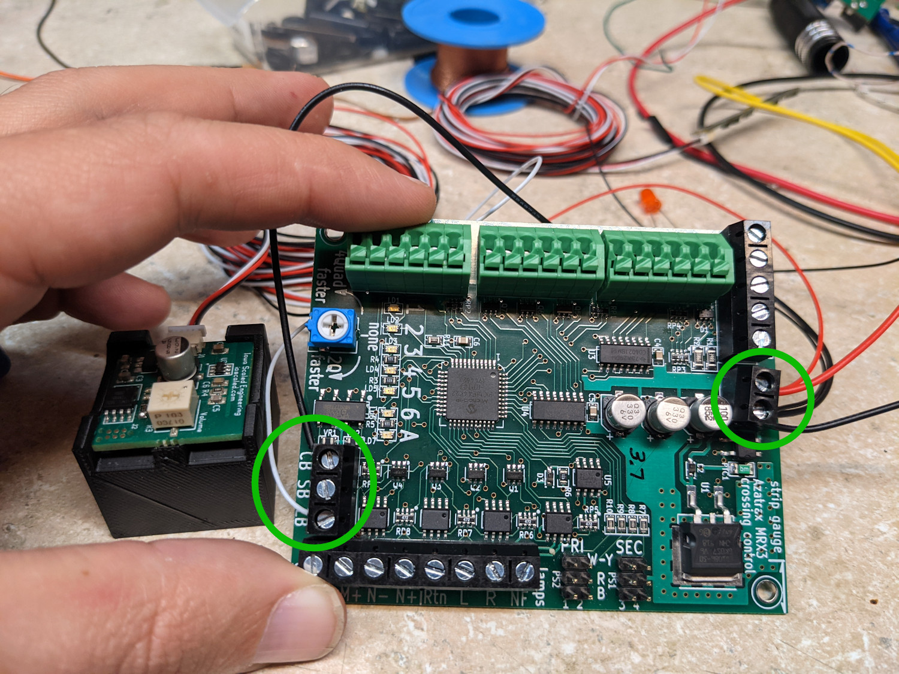](img-tsc/mrx3-bell.jpg)
*Connecting a SoundBytes bell to an MRX3*

## WeHonest Master Board

WeHonest is a popular Chinese manufacturer of model railroad signals.  They offer a "master control board" that can be used to control grade crossing signals, block signals, or other illumination.  Their stock solution for grade crossings involves three different boards, and provides an "island-only" type crossing.

### Upgrading to TrainSpotter Detection

This should work for both master boards intended for grade crossings as well as master boards intended for block signal animation.

The positive power supply for the TrainSpotter (red wire) will come from the V+ terminal block on the right side of the board.  The negative will come from the C terminal of either IR sensor connector.  The white wire from the TrainSpotter(sensor output) should then be connected to the R (center) terminal.  The T terminal of the IR sensor connector remains unconnected.  

The board comes with two sensor ports.  You can connect sensors to only one or each of them depending on your application - see the WeHonest documentation for which sensor should be connected for your use case.  In addition, you can connect multiple TrainSpotters in parallel to either port if you need to increase the amount of area detected.  This means all of the like-colored wires connected together - so for example, all the reds go to the V+ terminal, etc.

You'll probably need to chop their existing IR sensor harnesses to make this work, or find compatible connectors and wiring harnesses.  

[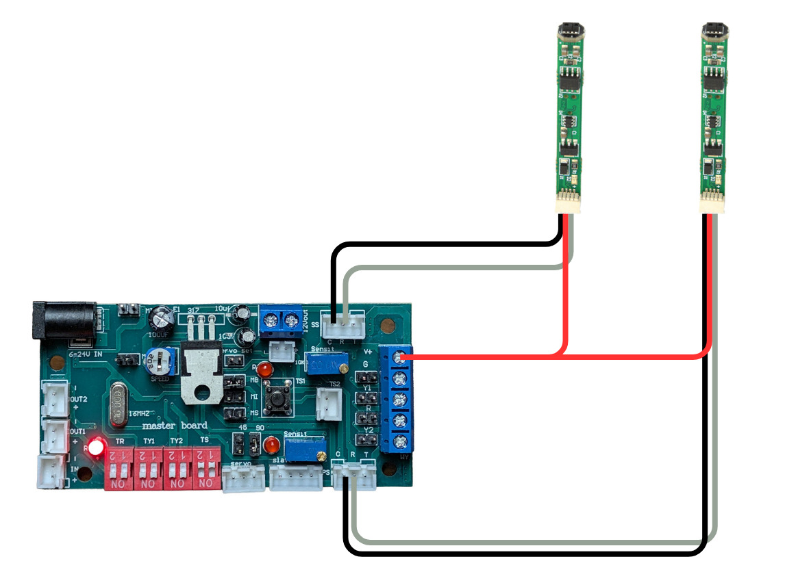](img-tsc/wehonest-irsense.jpg)
*Connecting TrainSpotters to the WeHonest Master Board*

### Upgrading to a SoundBytes Bell

The SoundBytes bell will connect in much as WeHonest's own sound module does - to the top output that's powered when something is detected.  The only catch is that the white wire also needs to be connected to the negative terminal to activate the bell.

[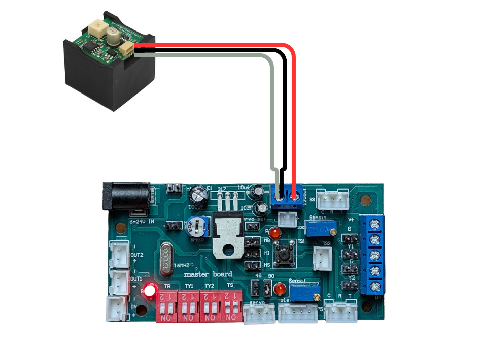](img-tsc/wehonest-bell.jpg)
*Connecting a SoundBytes bell to the WeHonest Master Board*

!!! warning Polarity is Important
    Note the position in which the wires are connected to the terminal block.   With the block at the top, the black and white wires go in the left, and the red goes on the right.  If you get these wrong, the bell module will be destroyed in fractions of a second!

## Cheap Chinese Flasher Module

[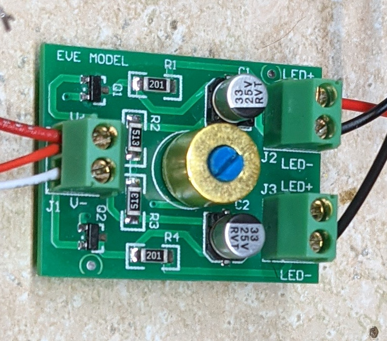](img-tsc/ccm.jpg)
*A typical cheap Chinese flasher module from eBay*

On eBay or other various purveyors of the finest in cheap Chinese tech, you'll often find somewhat crude grade crossing signals accompanied by a small PCB with three 2-position terminal blocks and a gold can with a tiny adjustment screw in the middle that flashes the lights. These things don't come with any sensors or bells, so in essence we're not so much doing an upgrade as adding features they don't even have. But, a number of modelers seem to gravitate to them since they're cheap, and for the most part they work. So I'll show you how to make them work.

The first thing to know is that they're really dumb modules – there's no microcontroller at all. It's just a blinker. So any of the advanced “start flashing on approach, time out if it doesn't hit the island circuit, etc.” behaviour that the GCP/2 and MRX3 have isn't present. So, that means to make them work effectively, we have to add as many IR sensors as it takes to make sure we have good coverage over all the places where we want a train to trigger the lights. On a small branchline with signals triggered just before the train enters the crossing, one on each side might be sufficient. If you're modeling higher speed track, you're probably going to want more sensors further out from the crossing with some significant turn-off delay.

The TrainSpotter normally turns back its “not detecting” state about 0.1 seconds after the train passes off the sensor. This is known as the “turn off delay”, and it's somewhat adjustable. On the standard TrainSpotters (normal and right angle), there's two metal pads on the back marked “JP1”. If you bridge these with a dollop of solder, it increases the turn-off delay to 5 seconds from 0.1s. If you're using the 2-piece TrainSpotter then there's a small potentiometer that allows you to dial in the turn-off delay you want, from 0.1s all the way to 25s.

To make this work, we're literally just going to use the TrainSpotters to switch the power to the Chinese flasher module. So, to do this, you connect the positive side of your DC supply to the positive input of the flasher module, and to all the red wires of all your TrainSpotter sensors. You then connect all the white wires of your TrainSpotters together, and put that into the negative power supply connection on the flasher. Finally, connect all the black wires from your TrainSpotters together and tie them to your negative power supply. Using this method, you can connect as many TrainSpotters as you need together to cover your crossing.

Here's how to connect it all up – the LEDs hanging off the board are just my way of testing that the LED outputs are working. Also, please actually solder and insulate your black wire ground connection, as opposed to just twisting it together and leaving it flapping around to short out, as I did in this example:

[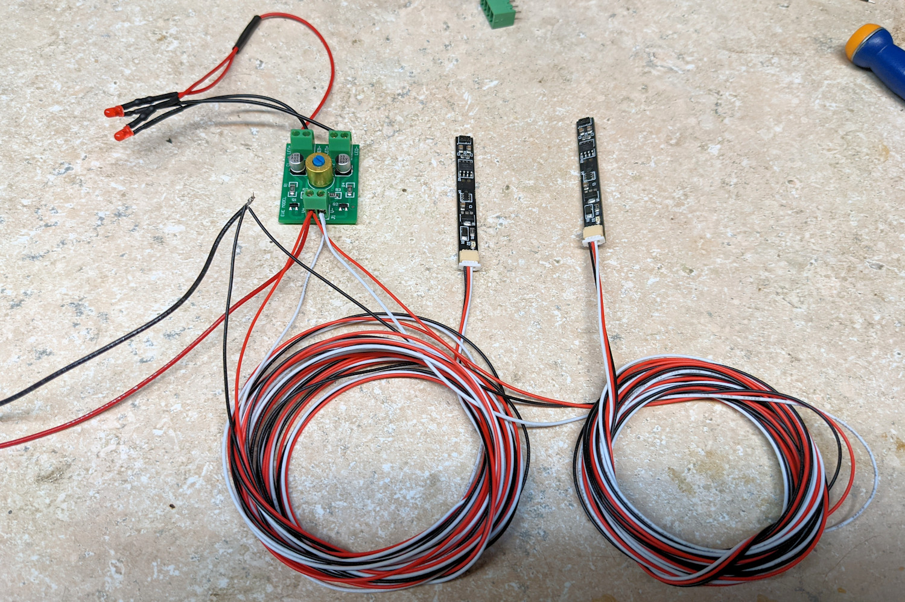](img-tsc/ccm-ir-conn.jpg)
*A Chinese flasher module with two TrainSpotters connected, one for each side of a crossing.*

### Adding a Bell

Adding a bell to this setup is incredibly simple. Connect the red wire from the bell in with the rest of the red wires at the positive power connection. Connect the white and black wires from the SoundBytes module together, and hook them to the white wires coming off the TrainSpotters.

[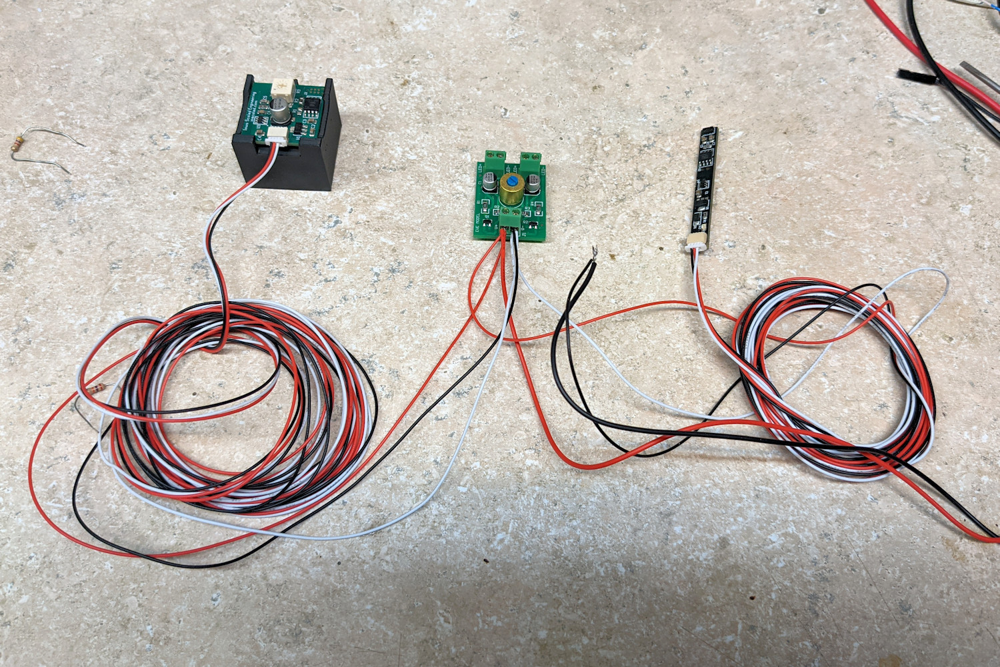](img-tsc/ccm-bell-conn.jpg)
*A bell and a TrainSpotter connected to a Chinese flasher module*

