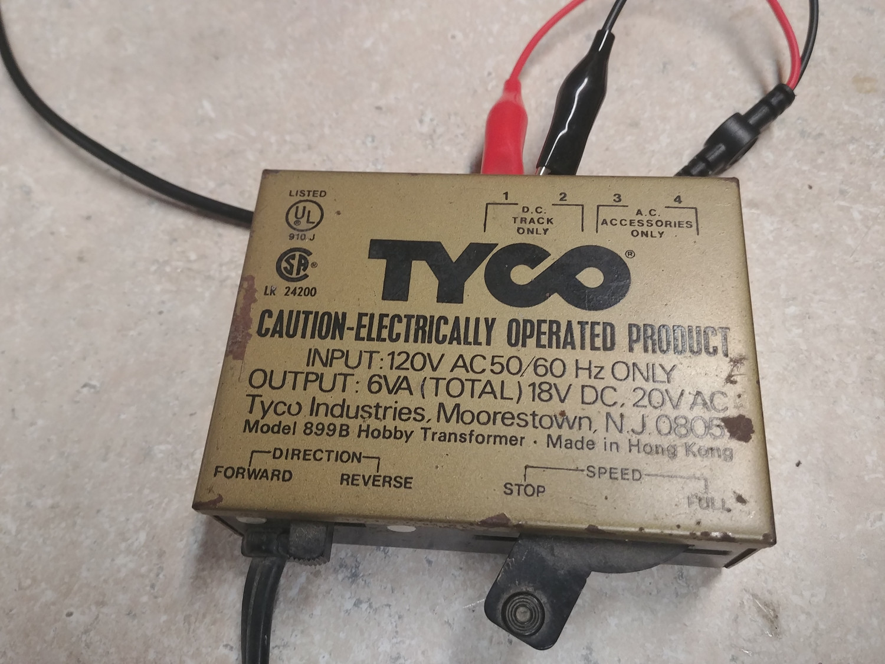
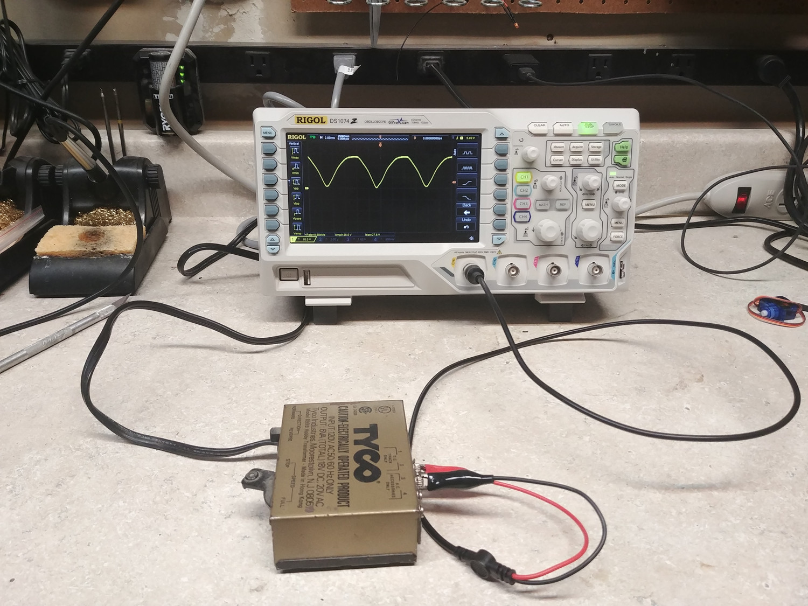
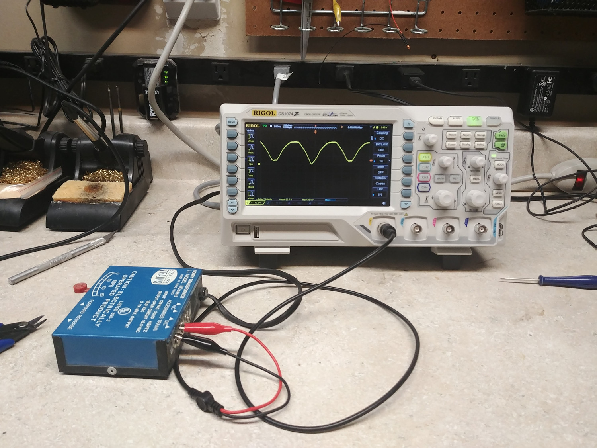
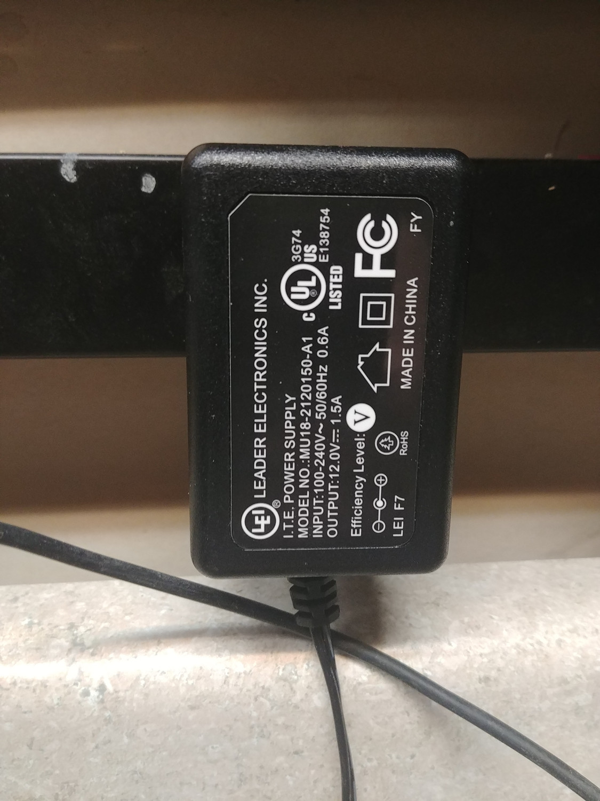

# Your Old Power Pack Isn’t a DC Supply

***Please don’t power electronics from your old “DC” power pack.***

It’s a rare day when I see a layout that doesn’t have a cheap train set power pack powering some accessory somewhere in a corner.  It makes me shudder every time I see it, because if it’s powering any electronics, that’s just asking for trouble.  I understand it – most model railroaders aren’t electronics people, and we’re all a little cheap and like to get every possible decade of use out of something that we can.  But it’s a bad, bad idea, and I’m here today to explain why.

The problem is that these old packs were designed to do one thing – apply track power and spin a motor – and weren’t even terribly good at that.  The “DC” that they put out can only barely be called that.  It’s full-wave rectified AC from the transformer that’s probably going through a primitive rheostat and sent straight to the output.  There’s no filtering and no regulation at all.  At low load (such as a modern piece of electronics), this means you get DC that cycles between near 0 volts and around 26-30 volts at 120 times per second, even with the “throttle” barely turned on.  Often the electronics blow up from being pushed beyond their ratings, the customer doesn’t understand why, the manufacturer and product get blamed, and nobody’s happy.   So I’m here today to explain it and tell you: throw that power pack away!

## Putting Two Golden Oldies to the Test

Michael and I were digging through his old stuff, and found a couple old power packs.  I decided I’d power them up and measure their outputs to show you what I mean.  Our first test subject is a Tyco model 899B Hobby Transformer, which states that it can do 18VDC and 20VAC. 

I connected it to my scope to the DC terminals (channel 1 – yellow) and just barely cracked the throttle – just enough to turn it on.  Sure enough, there’s the dreaded waveform.   It peaks out at 28.8V.   That’s well above the rated input voltage of many model railroad electronics products, including things like our [TrainSpotters](https://www.iascaled.com/TrainSpotter) or [Block Detectors](https://www.iascaled.com/store/ModelRailroad/DCCBlockDetectors) or [SoundBytes](https://www.iascaled.com/store/SoundBytes) modules. 

The old Tyco powerpack hooked up to my scope:

The scope image from the Tyco power pack. Note the waveform going from 0-28.8V at roughly 120Hz:

Could this be a fluke?  Could this just be a failed power pack that something’s wrong with internally?  Let’s test our Life-Like Trains model 08615 Hobby Transformer as well.  It lists on the case that it’s rated for an open circuit voltage of 16.5VDC, so it should be a bit less than the Tyco.   Again, I connected it to the scope and barely cracked open the throttle.  Sure enough, there’s 26.4V on the output.  Slightly less than the Tyco, but still not a safe voltage for something rated for a maximum of 16VDC or so.

Scope image from the Life Like power pack. The blue line is clean 12VDC:

## Better Options

{align=right style="width: 25%; margin-top:0px; margin-bottom: 0px"}

Power supplies have come a very long way since these packs were manufactured.  Thanks to the power demands of modern electronics combined with increasing calls for energy efficiency, modern AC/DC power adapters (lovingly called “wall warts” as they block the adjacent outlets) are exceptionally good, available, and inexpensive.  Most modern units are small “switch-mode power supplies”, meaning they don’t contain a big heavy transformer but rather a very small one that’s operated at a high frequency to convert AC mains power into well-regulated DC. 

I had a Leader Electronics 12V, 1.5A supply sitting on my bench from testing some signaling equipment for my own layout.  This thing weighs four ounces (as opposed to 20 ounces for the Life Like and 16 for the Tyco), is half the size, and puts out 3x the power that either power pack does.  It also provides this power at >80% efficiency, as opposed to the old packs that will get hot if you run them near their ratings.  I connected it to a second scope channel to show you what 12VDC should really look like.  It’s the blue line in the Life Like scope image above.  It’s flat and perfect and at almost exactly 12V.  That’s what DC power should look like.

I don’t know where I got that one, but a comparable wall wart such as the [Qualtek QFWB-18-12-US01](https://www.digikey.com/en/products/detail/qualtek/QFWB-18-12-US01/8260127) from Digikey is less than $9.   (You can buy wall warts from many questionable sources that may work fine, but often they lack safety testing or they’ve just slapped a bunch of regulatory approval marks on without actually doing the testing.  I prefer to buy from an authorized distributor and a known manufacturer so I’m sure the UL safety testing was actually done.  These things plug directly into mains current, after all.)

Of course wall warts are just the beginning of what’s possible in terms of powering the accessories on your layout.  With the advent of inexpensive small switching power supplies in the last 20 years, I’ve been advocating for a single accessory power bus that’s regulated down to the voltages you need where you need them.  My own Copper River & Northwestern uses a centralized 24VDC power bus for everything that’s not track power, and then there are regulators at each local town or siding to convert that to the voltage or voltages needed locally.  You can read more about that on the [CRNW’s Website here](https://www.copperriverrailway.com/powering-the-layout/).

**So, in summary, if you’re thinking about using that old power pack in the junk bin to power some new electronics on your layout, please reconsider.  Leave the power pack in the junk box, or send it to power pack heaven (or the nearest garbage can or recycler) and buy a modern power supply.  If you need one, [we even offer a 12V, 3A supply you can add to your order](https://www.iascaled.com/store/Hobbyist/PowerSupplies).**
