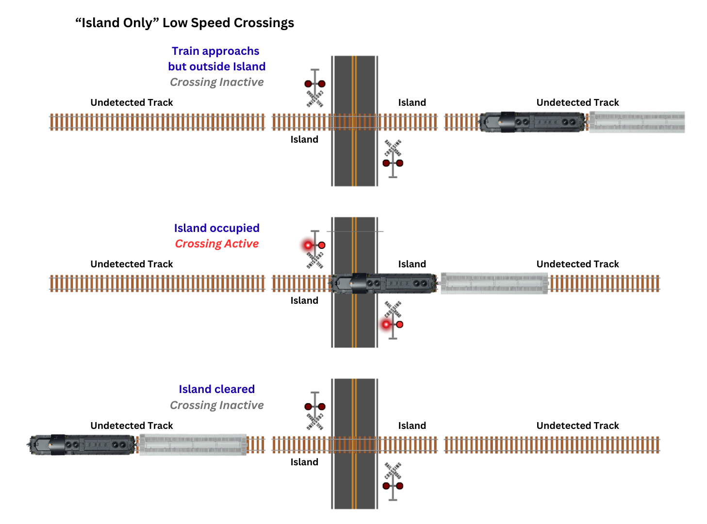

# Let's Talk About Grade Crossings

## Overview

Let’s talk about railroad grade crossings – otherwise known as level crossings to our friends outside North America.

## The Prototype - A Bit of History

Before we dig into how to model grade crossings, let's talk about the prototype and the history of grade crossing protection systems for a bit.  This is all going to be about North American grade crossing practice because that's what I'm most familiar with, and what most of our audience is likely trying to model.  Other countries and regions of the world will vary, sometimes significantly.

### Passive Protection

At the very minimum, every public crossing is going to have passive signage.  These are referred to as "passive crossings" since there are no active devices to warn drivers of an approaching train.  Drivers are responsible for seeing the sign and evaluating if the crossing is clear.

The crossbuck sign became common in the early 20th century, replacing a myriad of railroad or state-specific crossing warning signs.    Ever since the first Manual on Uniform Traffic Control Devices (MUTCD) in 1935, the standard has been for black letters on a white background.  However, early versions often had different angles, running in the 50 degree range, rather than the modern 90 degree perpendicular design.   In some places, black crossbucks with white lettering existed before standardization.  Glass retro-reflectors – colloquially referred to as “cats eyes” - started appearing in railroad crossing signs in the 1920s to help increase night visibility.   By the late 1940s these were replaced with reflective buttons as they were more effective and easier to manufacture, and then eventually retro-reflective sheeting.  Our modern crossbuck has been the standard since the 1970s, but as with many things road and rail-related, grandfathered examples of older designs persist and are only replaced when there's a need to do so.

For modern crossings, a passive crossing sign is often good enough if traffic is low, visibility is good, and trains are infrequent.  This will consist of a standard crossbuck and the small blue emergency notification system contact sign, and there will be a circular yellow warning sign ahead of it as well as pavement markings in many cases.  As a note to those modeling, the 2000 edition of the MUTCD specified that 2-inch reflective strips were to be applied to the backs of crossbucks as well as the front and back of the support posts, further enhancing visibility.

*Passive grade crossing protection near Garlock, CA.  Photo by Horst Frank, and used under a Creative Commons Attribution-Share Alike 2.0 license*

### Active Protection

For crossings that need additional protection, we move up to what's known as "active crossing protection."  The first active crossing protection was human-powered.  There would be a small gatekeeper shack near the crossing, and upon the approach of a train, the gatekeeper would go out and flag the crossing.  With particularly hazardous crossings, this sometimes involved manually-operated mechanical gates.  These were first patented in 1867 in the US.  Usually because of the sheer weight of large, wooden gates, this involved a large counterweight and a crank mechanism.   These gates would completely closing off the crossing, and were often four quadrant with entry and exit gates for both lanes, requiring the gatekeeper to walk around and lower each one.

*A large manual crossing gate still in use in 2025 on the Conway Scenic Railroad in New Hampshire.*

Since labor was expensive and prone to failures (like failing to notice a train, or nodding off), automated systems were pursued.  Electrical track circuits had been invented in 1872 as a way to detect the presence of a train in a block of track.  The very earliest warning devices were just a bell mounted to a pole, triggered by these simple track circuits.  In 1930, a survey by the American Association of Railroads found 60 different types of railroad signals in service on their member roads.  As a result, they started a committee to standardize.  That committee recommended picking two types of common signals – the wig-wag and the two horizontal red light signal, what we today would identify as a railroad crossing signal.

*An example of one of the myriad of early grade crossing signals, this one seen in a 1916 Hall Switch & Signal ad using their "banjo" style signals.*

The magnetic flagman, otherwise commonly known as a “wig-wag” signal, consisted of a round banner with a red light in the middle that would swing back and forth when activated.  The motion would also cause a hammer to hit a bell as it swung back and forth, giving a slow audible warning.  These were first commercialized by the Magnetic Signal Company on the West Coast in 1914, but subsequently Western Railroad Supply, Union Switch & Signal, and other smaller manufacturers got into the market as well, producing similar versions for their customers across the Midwest and East.  Some where cantilevered over the road, waving the banner under the motor.  Some were short and mounted on the roadside (or in the median), and waved the banner above the mechanism.  New wig-wag installations stopped in 1949, when new highway signal requirements rendered them obsolete.  However, existing installations were grandfathered in, and many survived into the 1980s and 1990s.  (Colorado's last wig-wag at Delhi was only removed from service in 2021.)

*Many manufacturers made wig-wag signals in a wide variety of styles.*

The first flashing red light signal – what we would recognize as a railroad crossing signal here in the US – was installed on Woodbridge Avenue in Sewaren, NJ, in 1913.  It was a simple device with tiny 5-3/8” lenses and a narrow beam width.  In 1923, they went to an 8-3/8” lens a different color of red from railroad signals, so as to allow more light through.  A 160 degree beam, created by a reflector-type assembly, came along from US&S in 1928.  Modern practice calls for 12” lamps.  The first automatic “short arm” gates – meaning they only covered a single lane – were added in July of 1936.

*Even after standardization, grandfathered equipment persisted.  This Rio Grande signal in 1960s Leadville still had a black crossbuck with glass "cat eye" reflectors, likely left over from before active protection was added.*

Anywhere that visibility is impaired approaching a crossing, or there’s a high number of cars or trains using a crossing, or there’s significant risk due to regularly scheduled passenger trains, heavy trucks or hazmat traffic, some active warning devices are likely to be recommended.  There’s no absolute checklist for determining what devices should be used – that’s largely left to traffic engineering to determine what’s appropriate – but it can range from simple flashing lights and a bell to lights/bell/gates to something with four-quadrant gates, a divided median, and connected to local traffic signals to clear intersections and traffic ahead of train arrival.

The bare minimum for a modern active warning warning is flashing lights.  From there, you get cantilevered flashing lights for roads with multiple lanes in each direction, or for roads with limited visibility where getting the signals higher may help oncoming drivers.  Bells are usually also applied at crossings, but are not strictly required in every case.  Bells are most effective for pedestrians and cyclists, who may not be paying attention to highway crossing signals, particularly if they’re on the sidewalk.  Within the US, Federal regulations require warning devices to be active for an absolute minimum of 20 seconds before the train occupies the crossing.

Gates are often added as an additional margin of safety to prevent people from ignoring the signals or trying to beat the train.  While they don’t actually stop anyone - and in fact are now actively designed to pivot or break away in the event of a collision - they provide an in-your-face deterrent to running the crossing that will, at a minimum, scratch up your paint.  Plus, gates are required to have at least 3 lights and to be retro-reflective, so they may get a driver’s attention when a crossing light off to the side doesn’t get noticed.

When a crossing is activated, the lights must be on for no less than 3 seconds before the gates start to descend, and must be fully down at least 5 seconds before the arrival of the train.  Consequently, the approach timing needs to be adjusted to take this into account.

### Modern Improvements

Two-quadrant gates, as are most common, only block drivers from entering the crossing.  Some newer crossings that either are designated quiet zones (no train horn will sound) or have higher speed operation will employ four-quadrant gates to fully close off the track area and prevent particularly aggressive drivers from swerving around the entrance gates.

One of the other more recent innovations is a wayside horn system.  These consist of an electronic “horn” that is aimed down the highway in both directions and provides a similar pattern to a locomotive horn.  Because it’s focused, however, it minimizes the amount of sound going in unproductive directions, such as toward surrounding residences.  These must sound at least 15 seconds before a train’s arrival and must continue until the train occupies the crossing.  If multiple tracks are present, it must sound again upon the approach of a train on the other track, even if the first track is already occupied.

These quiet zone crossings often have a flashing X signal pointed so that approaching train crews can see it.  This reminds the crew that it is a quiet zone crossing, and is wired in such a way that it verifies the crossing is functioning.  If the X is not flashing when the crew approaches the crossing, they must sound the horn as a precaution since they have no assurance that the automated equipment is functioning properly.  (They can obviously always use the horn if they see some hazard present itself, such as a trespasser.)

Of course, the ultimate in grade crossing protection is no grade crossing at all - meaning, a bridge.  While railroads would love to reduce the number of crossings, bridges are expensive and often impossible to fit into the existing road footprint.  So for the forseeable future, grade crossings and their protection systems will be part of our world, both model and prototype.

*A wayside horn and the flashing X sign to let the crew know it's functional is a modern addition to active crossing protection.  Photo by "Natfoot footnat" on Wikimedia Commons and used under a Creative Commons Attribution-Share Alike 4.0 license*

## Signal Control Logic

So now that we've learned a bit about the history of grade crossing protection, let's talk about how the sensors and control systems work that trigger them.  We'll keep this up at the level of how the controls function, and not necessarily how they work under the covers or some of the other details that don't really pertain to modeling, like redundancy and event logging.

### Island-Only Crossing Circuits

The simplest use a single basic track circuit to detect the presence of a train and activate the warning devices.  This is known as an “island only” system.  What’s an island?  The “island” is the part of the track that’s actually crossing the road and immediately adjacent.  If a train is present in that section of track, the warning systems need to remain active because the train is either fouling the road or could move and foul the road with insufficient time for drivers to stop.  If any rail vehicle is within in the island, the warning devices should always be activated.

### Adding Approach Circuits

Island-only circuits actually work pretty well on industrial spurs and low speed track, because the island is short.  The problem is as train speeds go up, the island needs to be longer to guarantee that 20 second warning time. However, that means the signals stay active long after the train has passed out of view, which frustrates drivers and leads them to ignore crossing signals, which is a dangerous behaviour to train into people.  The solution is to add two additional track detection areas called “approach circuits” on each side of the island.

The basic idea is that a train going track speed will enter an approach circuit perhaps 23 seconds before it reaches the crossing.  That allows a few seconds for the equipment to react to the train’s presence and the minimum 20 seconds of crossing activation before the train arrives.   This approach is what’s known as a “fixed start” crossing design, because the crossing always activates at a fixed distance. 

Because the crossing can also tell which way a train is moving based on which approach activates first, it can also deactivate the crossing as soon as the island clears, and lock out the opposing approach so that it doesn’t retrigger.  Many also include a timeout, such that if the train activates the approach but doesn’t reach the island within a prescribed amount of time, the crossing gets released. 

### Predictors

Modern crossings usually aren't just fixed-length approach and island circuits.  Since trains are often highly variable in speed, a device called a "predictor" is often used for the approaches.  This measures the time it takes a signal sent from the grade crossing to hit the short in the track (the train wheels bridging the rails).  By measuring how far out the train is and how quickly that distance is changing, the predictor can be triggered to activate the crossing when the train is exactly some amount of seconds from the crossing.  These aren't necessarily a modern innovation - I've found published literature about them going back to the early 1960s, although in those days they were much cruder than modern implementations.

So far, modeling preditors is somewhere between impractical and impossible.  Since we also usually deliver power and commands over the rails, sending out a pulse and measuring the time for a reflection is nearly impossible.  No scale drivers are inconvenienced if our signals are on a few seconds too long or endangered if they're on a bit too little.  The massive amount of added electronic complexity and installation headaches just aren't worth it.

## Crossing Detection in the Model World

As much as many of us may be devoted to faithfully replicating the prototype, we almost all make concessions in terms of distance.  Very few of us have either large enough basements or short enough prototypes to model them at their true length.  It’s all compromises between desires, size, cost, and effort.  Or as model railroaders have long put it, “Givens and Druthers.”

That carries over to signals, particularly crossing signals.

With crossing signals, we often want to use optical detection because it’s easier to install than cutting more gaps in our track and resistors on all of our axles.  Optical detection is a compromise, because we don’t really want to know “is a train above the detector,” but rather “is a train in this section of track.”   Even with optical sensors, doing full approach circuits is a lot of work.   A single track with approach islands requires installing at least four detectors.  Double track will require eight. 

A minimum warning of 20 seconds on the prototype doesn’t seem like much, but in N scale that’s 5.5 feet at 30 scale mph.  In HO, that same 20 seconds at 30 scale mph is 10 feet!  While it’s correct, my experience is it feels far too long on the model because our distances are compressed.  Plus, that might put the start of an approach circuit squarely in the middle of yard on the opposite side of a peninsula or some such. 

The RoadReady Basic is an “island only” type of controller and includes a bell, speaker, and drivers for any common anode LED crossing signals (which is pretty much all signals on the market today).  It’s active any time one of the detectors is active, and will remain active for a programmable timeout afterwards.  It only requires installation of two detectors, one on each side of the crossing.  It can also be expanded to cover as many tracks as you need just by adding more detectors.  It's designed to be realistic, yet simple to install for most model railroaders.

The RoadReady Advanced includes all the same features as the basic version - island sensors, bell, speaker, and LED drivers - but also includes support for east and west approach sensors with a programmable timeout for trains that stop before the island.  It will also include drivers for gates.  It's intended for a single main track.  (The RoadReady Advanced is slated for this coming winter 2025/2026.) 

The RoadReady Track Expander allows you to add one or two additional tracks with approach logic to either the base RoadReady Basic or Advanced unit.  It will be out at roughly the same time as the Advanced unit.  If you need to add a second or third mainline to your Advanced, or if you decide later you need to add approach logic to your Basic unit, the Track Expander is the thing you need.

## Learning More

To learn more about how to signal and sign your modern grade crossings (for US modelers, anyway), I strongly recommend two documents which provide much of the standards and guidance needed for US crossing design.

The first – which is a set of traffic signing standards which must be adhered to – is known as the Manual on Uniform Traffic Control Devices (MUTCD).  This is the bible of traffic signage within the US, and why you can drive all around the US and easily comprehend the road signate.   Some states have minor variations on the MUTCD, but for the most part, it’s just that – minor.  The MUTCD came into existence in 1935 as drivers ventured further from home, and the variations causing safety issues when drivers could not process and comprehend different signs in the split second needed to do so and operate their vehicles safely.  The MUTCD is maintained by the US DOT Federal Highway Administration (FWHA) and is currently in its 11th iteration, [downloadable here as a PDF](https://mutcd.fhwa.dot.gov/kno_11th_Edition.htm).

The second document is a set of recommendations and best practices laid out by traffic experts working with the FWHA and is known as the [Highway-Rail Crossing Handbook](https://highways.dot.gov/safety/hsip/xings/highway-rail-crossing-handbook-third-edition), now up to its Third Edition.   It’s not a standard, and it’s not prescriptive.  Its focus is presenting what experts in the industry believe to be important considerations and recommendations for designing safe and effective crossings.  Again, since it’s produced by the US government, it’s publicly available here. 

Another great modeling resource is the [FHWA’s Standard Highway Signs](https://mutcd.fhwa.dot.gov/kno-shs_2024.htm).  You can literally download and print all of the standard signs from beautiful vector artwork.  Additionally, the specification document for all of these signs – the Standard Highway Signs 2004 Edition and 2012 Supplement – provide guidance on exactly how each of these is laid out.  Modern modelers can’t get more accurate signs than this!

