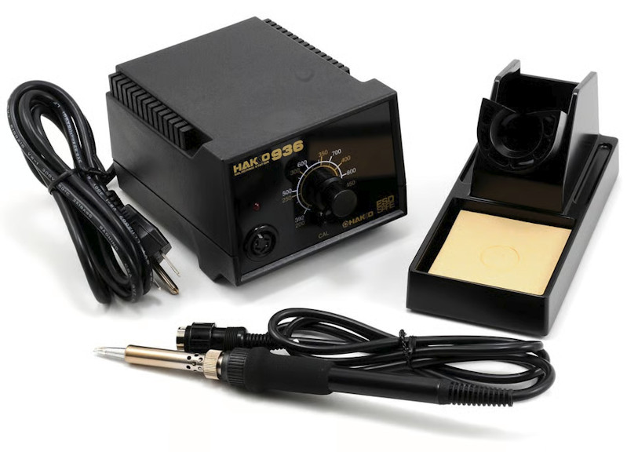
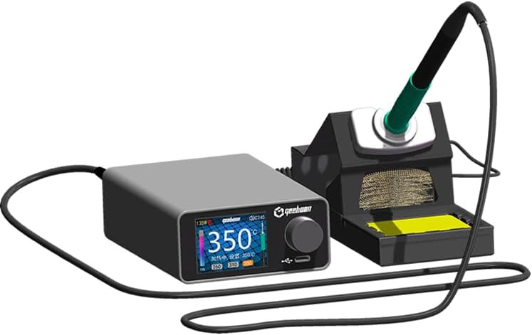
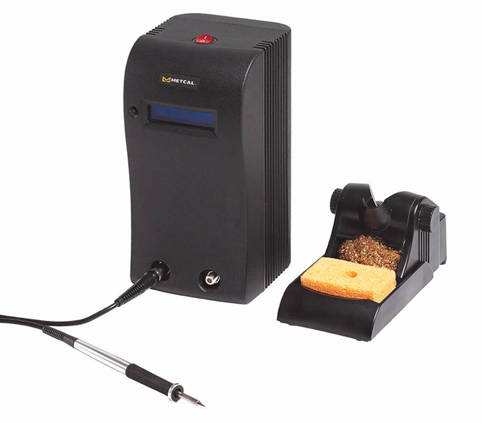
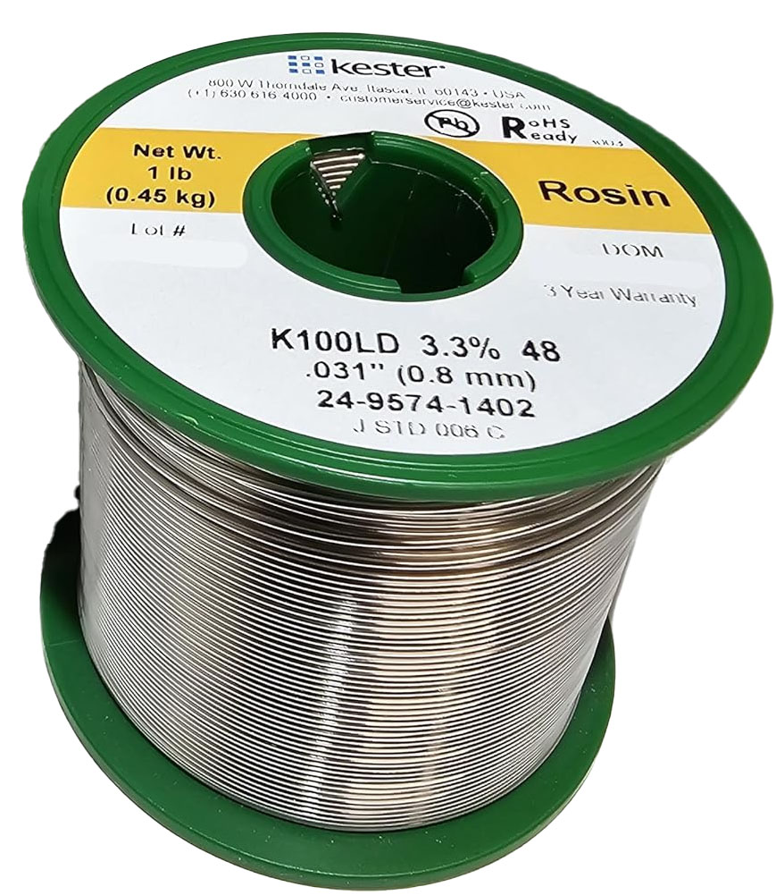
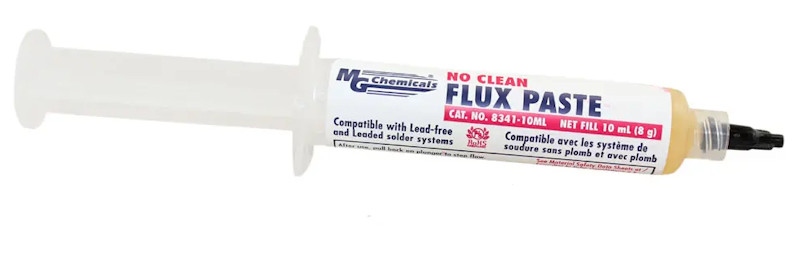
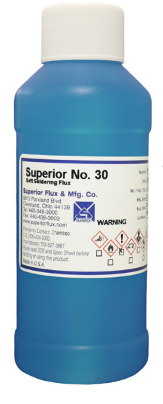
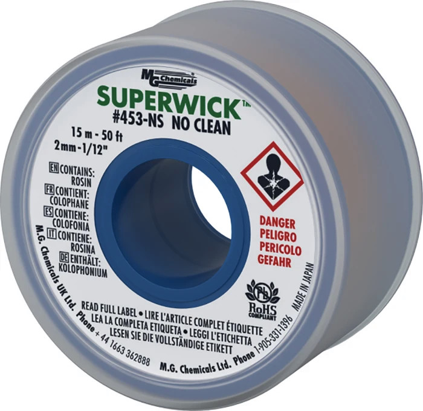

# The Modeler's Electrical Toolkit: Soldering

## Overview

Nearly every model railroader will need to solder electrical connections.  Let's face it, electricity makes our models go, even if you're running just straight DC or dead rail.  Plus, there's the more mechanical uses of soldering, such as hand-laying trackwork or making some repairs on brass models.  Soldering is a fundamental skill needed for model railroading.

There are three key pieces to making successful solder joints:

* The right soldering iron & tip
* The right solder and flux
* Clean work pieces and good technique

Since this is a series about what tools a modeler should have, we'll be talking about the first two.  The third has been wonderfully covered by lots of online tutorials who have done a far better job than I would have.  

## Soldering Irons

If you're using an iron where the cord coming out plugs straight into the wall, or anything that could be vaguely described as a soldering "gun", put it down and no circuits get hurt.  Soldering guns are fine for attaching big wires (like 12 gauge or larger) together where you need lots of heat fast.  

For electronics work, you really want a soldering station.  It should have a good comfortable handpiece (the thing you hold - often called the "iron"), easily replacable tips and elements, temperature control, and be roughly in the 40-80W power range.  It should have a stand to keep the handpiece in while you're not using it, and that stand should have a sponge and brass wool to clean the tip.  

A nice-to-have feature is a system that powers down the tip while the handpiece is in the holder.  Soldering tips degrade with time and use, and they degrade much, much faster when they're at operating temperature.  By allowing the tip to drop to an idling temperature (often around 150-200C) while it's in the stand, this helps prolong the life of your soldering tips.

Modern soldering handpiece tech basically comes in two categories:

* Passive replacable tip that fits over a separate, fixed heating element in the handpiece
* Cartridge that fits into the handpiece that contains the heating element and temp sensor

Older designs like the Hakko 936/937/FX888 and Weller WE1010 series use this passive tip design.  They have a ceramic heat element that stays in the handpiece, and then slip a replacable metal tip over it.  This works fine, but because there's a gap between the heating element and the tip itself, they're often slow to heat up and struggle to hold a constant working temperature when soldering larger workpieces.  They have the advantage of being inexpensive, however, are often "good enough" if you're not working on high end equipment all day, every day.  

Cartridge-based tips are what nearly all production soldering systems use these days.  With these, the tip that does the soldering has an integrated heating element and plugs into the handpiece.  Because the heating element is directly and tightly coupled to the tip, they heat very quickly (often in a few seconds) and hold temperature extremely well because they can quickly transfer a lot of heat directly to the tip.  

There's two basic technologies for cartridges.  The more common design works by passing electrical current into the cartridge and reading the temperature back using an embedded temperature sensor.  This allows the base to quickly apply more or less power, and allows easy control of the temperature using a knob on the base.  A second type - used by Metcal and Thermaltronics - uses the Curie point of the material in the tip.  (Note - some others are starting to explore this now, such as Hakko with their RF induction line.)  This property allows the tip to absorb radio frequency energy (sent from the base to the handpiece through the cord) at amazing rates when it's below the setpoint temperature, but it stops the instant it reaches operating temperature.  This makes the tips extremely fast heating and very accurate in terms of holding temperature.  The downside is that because the temperature is set by the material properties of the tip, you need different tips for different temperatures.  

No matter what system you choose, one important consideration is the variety of tips that you want.  My personal recommendation is start witha 1.8mm (or so) chisel tip and get some others as your needs require.

### Recommendations

#### Budget Choice

[{ align=right width=300 }](img-tools/tools-solder-hakko936.jpg)

For budget options, the older Hakko 936/937/FX888 irons are still a great option.  The Hakko 936/937 and knock-offs (and oh, are there a lot of knock-offs) was my favorite iron for years and years.  It was later replaced by the FX888, but it's essentially still the same iron, just with a fancier control box.  These things were the workhorses of their day.

I still have two that I use regularly for under-the-layout stuff, or if I need to take an iron with me to go fix something.  The oldest is approaching 30 years old this year, as I got it in college, and still works like a champ.  It has been through probably 100+ tips over the years, because they do wear out.   The problem is that soldering stations themselves are no longer made by Hakko, but they're nearly bulletproof and are plentiful on the used market.  There were also dozens of knockoffs made, and given the simplicity of the design, the knockoffs were nearly all good.  The Yihua 939D+ is an example of this, and can be found new on Amazon for $55 or so in the US.

One place I would not cheap out is on the tips, which are known typically as "900M tips."  The knockoff tips aren't as good metallurgically as the original Hakko designs.  Genuine tips just work better and last longer, and in my opinion, are worth the extra cost.  

#### Mid-Range Choice

[{ align=right width=300 }](img-tools/tools-solder-tc22.jpg)

If you get into the $100 range, I would look at the Geeboon TC22.  While looking for a budget-friendly cartridge-based soldering iron for recommendations, this one just kept coming up in online reviews.  It's a base, handpiece, and stand that use standard JBC-style cartridges.  (JBC makes high end production soldering stations.) So I ordered one off Amazon with a T245/C245 handpiece for $93.  

All I can say is that I'm seriously impressed so far.  It heats incredibly quickly - not quite Metcal fast.  It senses when the iron is in the stand and puts it into sleep, where it allows the iron to cool in order to prolong the tip life.  After ten minutes of being in the stand, it will also shut the iron off completely so it doesn't remain hot if you go off and leave the power on.  All of those times and temperatures are programmable.  

Be sure you check which handpiece you're getting when you order.  They offer multiple handpieces for these, which allow you to use different sized tips.  I got the T245 handpiece with mine, which works with C245 cartridges.  These are sort of the largest range and good for general soldering.  If you need to do more precision stuff, the T210/C210 line is better for much smaller cartridges.  For most model railroad applications, the T245/C245 cartridge size is probably the one you want.  Changing from one handpiece to another is as simple as unplugging one from the back of the base and plugging in a new one.  

The one I got came with some huge honking tip, but I also ordered a 2.2mm chisel tip and swapped it out.  Much better.  

#### High End Choice

Here there's a lot of personal preference, but get ready to spend some money.  Fully outfitted with the soldering station, handpieces, and some tips, you're probably looking at $600-$1200 in this range for new stuff.  However, equipment in this range is a serious industrial grade tool and holds up well from years of constant, daily use.  If you can find some used equipment, it's often just fine and can save you substantial cash.

[{ align=right width=300 }](img-tools/tools-solder-mx5210.jpg)

Metcal and Thermaltronics are great.  That's what we use.  The downside is that the tip temperature is set by the cartridge, so you inevitably build up a collection of 5-10 tips to switch between tip shapes and temperatures.  The good news is that the cartridges are relatively cheap ($20 or so), easy to get through Amazon, and last a good long while.  We both have MX-5211 setups, which allow us to keep two different handpieces hot at the same time.  

My go-to tip style is a 1.8mm chisel tip for most work - a Thermaltronics M7CH176 or Metcal STTC-137, which operate at 390-413C.  When I need to solder terminal blocks or larger stuff that really sucks up the heat, I switch to a Thermaltronics M8CH176 (equivalent to Metcal STTC-837).  It's still a 1.8mm chisel tip, but operates at a higher temperature that helps get things going faster.  It makes fast, quality joints with lead-free solder even with things with large thermal mass.  We also have a variety of other tips, such as smaller chisel tips and bent sharp tips, for doing more delicate stuff.

(Note that Metcal and Thermaltronics offer both high frequency and low frequency soldering systems.  They're not compatible.  The high frequency systems like ours, run at 13.56MHz and heat faster with smaller cartridges.  The low frequency systems are a little slower to heat, but significantly cheaper.  In fact, Thermaltronics just launched what I would describe as a "mid-range" low frequency system with the TMT-1000 at $160, but I have not tried one yet.)

Having now used the JBC-style cartridges with our mid-range pick, I'd also look at JBC stations for a high end pick.  Something like the CD-1BQF or CDE-1BQA can actually deliver a lot more power to the tip than our Metcal/Thermaltronics setups.  

Once you get in this range, there are lots of other offerings out there as well.  A lot of it is what manufacturer and cartridge system you prefer.

### What We Use

Both of us now use Metcal MX-5000s at the bench with (usually) 1.8mm chisel tips for typical through-hole work.  These aren't cheap, but they're absolutely glorious tools.  They use radio frequency energy to heat the tip directly, which means they're hot almost instantly and can pump a lot of energy into a workpiece without going over temperature.  However, if you're not an electronics professional, they're far, far overkill.

We both still use our Hakko 936s and (in Nathan's case) FX888 for work off the bench, like working on the layout.  They're solid, quality tools that have done a great job for decades.  Both of us bought ours in college and they're still going strong 30 years later, though obviously we've changed the tips more times than we can count. 

For portable use, we recently picked up a Pinecil, which can be powered off a 65W USB-C charger that supports the PD (power delivery) standards.  It's actually a decent bit of kit, but I wouldn't want to use it all the time.  Still, it fits neatly in our toolkit for making quick repairs at shows, and is much smaller and lighter than the old Hakko 936.

#### Others

There's a million different soldering iron brands out there and I'm sure there are excellent tool brands I haven't tried.  

What about Wellers?  In my opinion, their low and mid-range options are highly overpriced for what they are, and they only become competitive once you get to the professional/high end choices.  Something like the WE1010NA hasn't moved on substantially from the designs of 30 years ago.  It's roughly the same tech as the Hakko 936/937/FX888, and the used Hakkos (and knockoffs) are a third of the price. By the time you get to modern solutions like a WT1010N and similar cartridge systems, they're up in the high end price range.

## Wire Solder

[{ align=right width=250 }](img-tools/tools-solder-k100ld.jpg)

For electronics work, you want a small diameter rosin-core wire solder.  That means that it's a small wire made out of the soldering alloy with a core in the middle of rosin flux to clean the joint and assure good contact as you solder. 

If you're doing electronics work, there's pretty much three characteristics you need to consider when choosing a wire solder:

* [Solder Alloy](#solder-alloy)
* [Flux Type](#flux-type)
* [Solder Wire Diameter](#solder-wire-diameter)

### Solder Alloy

#### Lead Solder Options

Your option for leaded solder composition is pretty much what's known as 63/37.  That's the ratio between tin (63%) and lead (37%) in the alloy.  You specifically want this ratio because it's what's known as a eutectic alloy.  That means the whole thing freezes and melts at one specific temperature - 183C.  

There's another type of leaded electronics solder called 60/40, which is, as you'd expect, a 60% tin, 40% lead mixture.  Unlike 63/37, which melts and freezes at a single temperature, 60/40 has a plastic range.  It gives it a thick, goopy state between pure liquid and pure solid because it doesn't all freeze at once.  Because of the crystal forming over an extended temperature range, it's easier to get a cold joint if anything moves while it's in the goopy phase.  I honestly don't recommend it - for anything.

!!! warning "About Lead in Solder"
    I'm not here to tell you to stop using leaded solder.  I have both types on my bench, and still use both.  Lead is bad for biology, there's no doubt about that.  It causes a host of developmental, neurological, cardiovascular, reproductive, and other issues.  It does so insideously by accumulating in bones and organs and persists over decades, slowly causing damage.  Just be aware of it.

    When doing electronics soldering, the only real way you get lead in your system is by ingesting it.  It doesn't come through your skin, and at the temperatures you're soldering, it doesn't vaporize.  (Lead vaporizes at 1750C, and it would be rare to solder over 450C.)  The biggest danger is surface contamination - dust and particles that come off the surface or get wiped off the iron and then get on your skin and transferring to whatever you're eating and ingesting.  Which means yes, wash your hands when you're done handling it and clean any surfaces you were soldering on before you drop your sandwich down on the bench.

    So why still use it?  Lead-free takes a certain amount of skill to make a good joint because it takes more heat, and it just never wets as well.  Leaded works beautifully where you can't get a hot enough or clean enough workpiece.  You can make decent joints on some really crap materials.  Plus, it's more ductile and less prone to brittle fracture in applications where fatigue is an issue.  However, if you're just learning now, I'd start with lead free and just learn the techniques to work with it.  It's come a very long way since the early days, where it was terrible to use.

#### Lead Free Options

Lead-free solder usually has a melting point that's 35-45C hotter than leaded.  That means to get it to wet and flow correctly, you'll probably need to get the workpiece up to the 245-250C range at least.  Most industry standards suggest setting your tip temperature to 375-400C.  That's fine for small electronics work - surface mount components and attaching small wires to boards.  However, when soldering bigger stuff, I tend to run higher than that unless there's risk of damaging something.

SAC305 - This is the OG of lead-free solders, and was developed by researchers at our alma matter, Iowa State University, back in the early 1990s.  It's usually 3% silver, 0.5% copper, and the remaining 96.5% is tin.  It is a eutectic solder, with a melting point around 220C.  While the most widely used in industry, it has the downside of being expensive due to the silver content (particularly since silver has recently quadrupled in price), dissolves away copper from tiny PCB traces if left molten too long, and produces ugly, dull joints that are sometimes hard to distinguish from cold joints.

K100LD is Kester's solution to the cost and ugly finish problem of SAC305.  It's 0.7% copper, 99.3% tin, and a trace of bismuth and nickel.    

SN100C is a similar majority-tin alloy from Nihon Superior, but with slightly different trace elements (germanium instead of bismuth, best I can tell).  

Both of the 99+% tin solder alloys require slightly more heat, with a melt point of 227C.  That said, I much prefer K100LD to SAC305, because it produces much more attractive, shiny joints that are easier to distinguish from bad or "cold" joints.

### Flux Type

Flux is your friend.  Metals left out in the atmosphere build up an oxide and general gunk layer on them.  In order to make a good solder joint, you need to remove all of that and get good clean metal for the solder to wet against.  If it's particularly bad, the first step is a physical cleaning, but normally flux is how you get there.  It destroys the gunk layer and protects the joint from additional oxidation (due to elevated temperatures) while you're soldering.

You want rosin core flux and nothing else for almost all electronic work.  "Rosin core" means that your solder wire has rosin right in the wire, meaning it's cleaning your joint as you apply the solder.  Usually, no extra flux will be needed or desired.

!!! warning No Acid Fluxes
    Whatever you do, avoid using any sort of acid or plumbing flux, or flux-core solder intended for plumbing or HVAC use.   They're incredibly aggressive, the residues remain intensely corrosive over time if not removed, and can often be reactivated by electrical current.

Rosin flux comes in multiple types, but in general it boils down to "no-clean", "mildly activated" or just plain "activated".  Those increase in strength in the order listed.  

No clean is the weakest, and is intended for joining components that are relatively new, clean, and have little oxide build-up on them.  Because it's relatively weak, there's almost zero chance of it causing corrosion long term.  After being heated, any flux residue forms a hard, usually clear, mass that locks up any nasties and prevents them from attacking the metal.  It also removes a cleaning step in PCB manufacturing to wash off excess flux, which is why it's become very popular in making circuit boards.

Mildly activated is a step up from that, and at the top of the pile is just plain activated.  Fortunately, we live in the glorious future, and there are now activated fluxes like Kester 44 and 48 that don't need to be cleaned off to prevent corrosion under normal conditions.  Since 44 (and now 48) are legendary at being able to flux up nearly anything, I highly recommend just using them.

The other thing to consider is that wire solders come with various amounts of flux, generally identified as a percentage of their core size.  Just go with the common 3-3.5% range.  

[{ align=right width=250 }](img-tools/tools-solder-flux.jpg)

Sometimes you just need more flux than what's in the solder.  That's often true if you need to get some really cruddy stuff to form a good joint, or if you've got a large surface area that you need to make solder-friendly.  It's also great for applying to already-soldered joints that you need to melt and rework.  For this, a no-clean rosin flux paste meant for electronics repair works wonders.  Common name brands would be things like MG Chemicals 8341 (which is what we use) or Chip Quik SMD291.  I generally squeeze a little out of the syringe onto a paper towel, and then use micro-brushes to spread it where I need.  Even though technically it's a "no clean," I often find it remains sticky, and will clean it off when I'm done using 91% isopropyl alcohol and an old toothbrush.

[{ align=right width=100 }](img-tools/tools-solder-supersafe30.jpg)

When soldering things like rails, I use [Superior Flux No. 30 "SuperSafe"](https://superiorflux.com/products/superior-no-30-supersafe-soldering-flux/) - aka blue juice - to really get things going.  It's an organic acid flux, not a rosin flux.  That means it will corrode things if not cleaned, but it's much milder than strong acid fluxes like plumbing flux.  Additionally, it's completely water soluable, so you don't get weird clear rosin masses left of the trackwork that you have to remove.  If you're hand-building trackwork, this stuff will change your life in the way it makes solder wet to surfaces.  Just clean it with a warm water solution afterwards.  I just use a micro-brush to apply it to the joint area and then hit it with the iron and solder.

### Solder Wire Diameter

In general, a diameter of 0.031" is good, all-around electronics solder.  For smaller work, 0.020" may be helpful as it'll apply less material to extremely small joints on PCBs or surface mount components.  However, the smaller solder will be annoying for joining larger items, like wires.  I've personally never found much use for anything larger than 0.031" in electronics work.

### What We Use

For wire solder, we use [Kester 24-9574-1402](https://www.kester.com/products/product/48-flux-cored-wire) (K100LD lead free, 0.031" diameter, 48-series activated flux) for everything ISE-related.  It produces nice, shiny joints and has a flux that's aggressive enough to handle most scenarios.  Plus, Kester specifies that it does not have to be washed/cleaned to prevent corrosion, so despite being an activated flux, we don't have to wash boards afterwards.

We've tried Kester 24-9574-7618 in the past.  It too is a K100LD alloy, 0.031" diameter lead free solder.  However, it has a 275-series "no clean" flux, which isn't nearly as aggressive.  We found it tough to work with if the parts aren't bright shiny clean and perfect.

For leaded, the product we use for personal stuff is actually obsolete and can no longer be purchased.  However, something like a Kester 24-6337-0027 (63/37 alloy, 0.031" diameter, 3.3% 44-series activated flux) is comparable, and roughly the leaded equivalent of our lead-free choice.

One thing that most people don't realize is that unused solder has a lifespan.  Obviously the metal itself doesn't, but the flux inside apparently does.  Technically Kester says that it's 3 years.  For lead-free, we've never even gotten close to testing that because we go through rolls so fast.  For leaded, the roll I use is half gone and it's 10 years old this year.  It still works fine.  But if yours doesn't, it might be because the flux has gone bad and needs to be replaced.

## Solder Paste

For model railroaders, solder paste isn't as important.  It's basically a whole bunch of tiny little solder balls in a flux compound that makes a paste. Primarily it's used in building PC boards with surface mount components.  You stencil the solder paste on and then set all the components in it.  When the whole thing is heated in a reflow oven, the flux and solder melt and solder all the components to the board.  

There are some cases where it's handy, though, particularly if you are working on making a joint that would need you to have a couple extra arms to hold everything in place.  You can put a little paste on a joint first, then set the pieces together and heat them until everything melts.  

Here's the downsides - it's expensive (a 500 gram jar of Kester NXG1 that we use costs roughly $250 these days), it has a definite lifespan (usually about six months), and almost all formulations have to be refrigerated.   There are some formulations that you can get in much smaller syringes, and Chip Quik offers some formulations that are advertised as room temperature stable.  For example, Chip Quik's TS391SNL is a half ounce (15 gram) syringe filled with SAC305 paste with a no-clean flux that is specified to have a life greater than a year stored at room temp.

## Supporting Supplies

Aside from some extra gel rosin flux as we talked about above, there are some other supplies that can make your soldering life easier.

[{ align=right width=250 }](img-tools/tools-solder-solderwick.jpg)

The first is desoldering braid.  This is copper braid impregnated with flux that can be used to suck excess solder off of a joint.  It's handy for cleaning up pads once you've removed a wire or a component, or for removing a solder bridge between two pins when you get too much solder on it.  Life is too short to deal with crappy, no-name solder wick.  Get the good stuff and make your life better.  We use [MG Chemicals Superwick #453 with no-clean flux](https://mgchemicals.com/products/soldering-supplies/desoldering-braids/solder-wick/).

Another handy thing is a silicone mat to protect your workbench from excess heat.  Plus, it also is sticky enough to help hold work pieces in place without being obnoxious.  We just use a generic translucent white silicone desk pad that measures 14"x9" that we picked up from Amazon.  As long as it's thick and rated for 500C heat, you should be fine.

Brass wool and sponges are used for cleaning your tip.  Normally I use a few stabs of the tip into brass wool, as it scrapes off excess solder and detritus from the tip without being too harsh, and leaves some layer of solder on it as protection.  When you really need an absolutely clean tip, though, there's nothing like a wet sponge to wipe it against.  However, the thermal shock of being pushed into a wet sponge does take its toll on the tip and will eventually lead to small cracks, which will corrode and cause the tip to fail sooner.

If you get a tip that won't take solder - usually because it was left on and oxidized badly - you need something like Tip Tinner.  This shouldn't be used routinely, but can sometimes salvage an otherwise unusable tip.  It's basically a highly aggressive flux that contains tiny solder balls.  To use it, you just get the tip hot and thrust it into the material.  Avoid the flux fumes burning off - they're nasty stuff.  Pull it back out and wipe it off on your brass wool, and then repeat until the tip wets with solder again.  If it doesn't, then your tip is fried and will need to be replaced.

That's most of what I'd recommend.  Having some "helping hands" - alligator clips on arms - can occasionally be handy for holding pieces in place while you solder.  A fume extractor - or even a small bench fan - is good to keep from breathing in the flux that burns off.  Ours are just 3D-printed brackets with big computer-style fans and carbon filters installed in them.  Honestly, some sort of magnifying visor is also great, particularly as we all get older and our near vision gets worse.  It's hard to solder something when you're an arm's length away just to see it.

