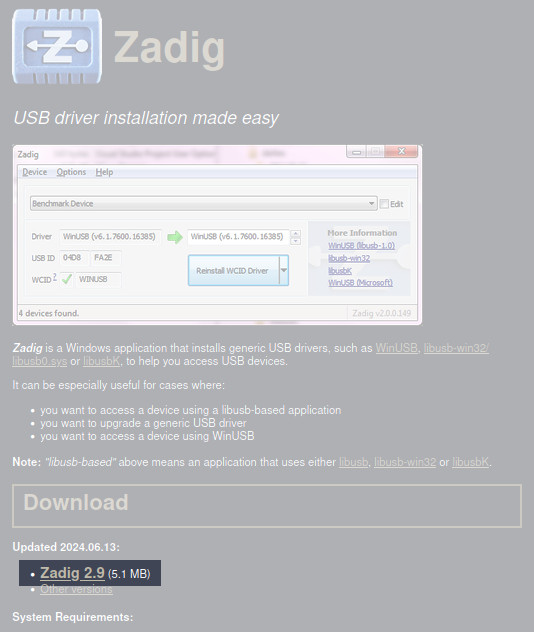
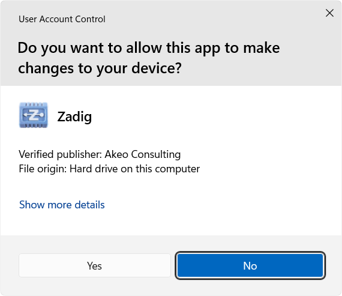
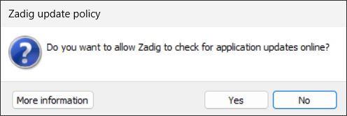
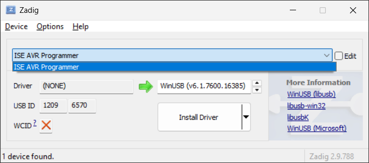
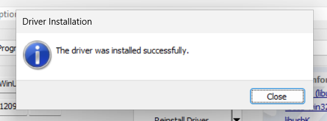
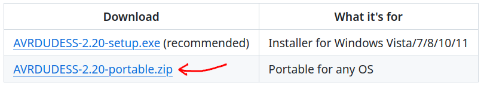
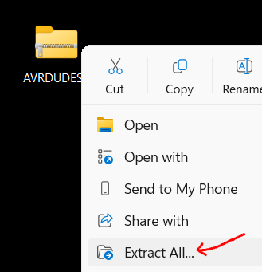
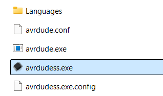

# AVR Programmer Method

## Step 1: Get The Programmer

These instructions are written assuming you are using one of our
[CKT-AVRPROGRAMMER](https://www.iascaled.com/store/CKT-AVRPROGRAMMER)
devices.  While other, similar AVR programmers can be used, those are not
officially supported (i.e.  you are on your own / use at your own risk). 
Once you have the programmer board, proceed to Step 2.

!!! note
    These instructions are written assuming you are using the Windows
    operating system.  While technically possible to update using a Mac, we
    are not Mac users, and therefore don't have the hardware to write a
    detailed set of instructions.  Maybe this will change in the future, but
    for now, please find a Windows machine or someone technically adept to
    help you.  If you are a Linux user, then we assume you already know what
    to do...

## Step 2: Install The Driver

Driver installation only needs to be done once.  If you have already
installed the drivers before on the computer you are using, you can skip to
Step 3.

### a) Download

Download the latest version of the Zadig driver installer from:

<https://zadig.akeo.ie/>

The latest version might be different than what is shown above - that's ok. 

### b) Run Zadig

Once the download completes, locate the file you just downloaded.  Double
click on it to run it.

You may get a User Account Control dialog.  If so, click Yes to allow the
program to run and make changes to your computer:

If it asks to check for application updates online, click No:

### c) Plug in Programmer

Next, plug the programmer into a USB port on your computer.  The red and
blue LEDs should light up on the programmer.  If they don't, then stop here
and figure out why.  Is the USB cable plugged in securely to both the
computer and programmer board?  Is it a good USB port on the computer?  Make
sure the red and blue LEDs light up on the programmer before continuing.

### d) Install the Driver

With the programmer connected (and LEDs lit), the Zadig window should now
show ISE AVR Programmer as an option.  There might be other devices listed,
too, but select ISE AVR Programmer:

The other fields should auto-populate as shown above.  Click the Install
Driver button to begin the driver installation.  This may take some time, so
please be patient.  When complete, you should get a message saying the
driver installation was successful:

Click the Close button, then close the Zadig program.

If you encounter any errors, or the installation does not succeed for any
reason, first try rebooting your computer and repeating the installation
process above.  If the driver still does not install, then don't proceed. 
You will need to first troubleshoot why the driver is not installing
correctly.

!!! warning "Please Note"
    Unplug the programmer and replug it into the USB port before continuing. 
    This makes sure the drivers are properly loaded after installation.

## Step 3: Download AVRDUDESS

Download the latest AVRDUDESS program from:

<https://github.com/ZakKemble/AVRDUDESS/releases>

Select the portable ZIP version:

Extract the downloaded ZIP file on your computer:

Open the folder where the files were extracted and double click on the
avrdudess.exe program to open it.  Note: be sure to double click on
avrdudess.exe, not avrdude.exe.

## Step 4: Install the Firmware

This next step, where the actual firmware gets installed, is product
specific.  Please refer to the specific update instructions on the product
page for details:

[ProtoThrottle](../../ProtoThrottle/Firmware Update/throttle.md)
