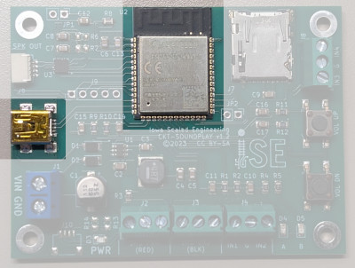
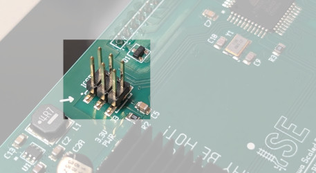
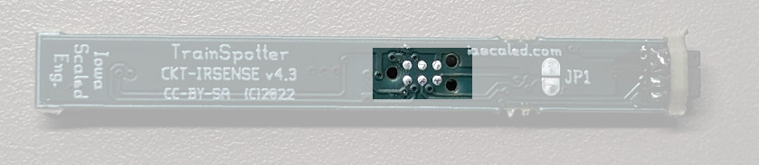

# Updating Firmware

## What is Firmware?

Firmware is software (computer instructions) that provides low-level control
of hardware.  Many of our devices (the hardware) are programmable and need
this firmware to operate correctly.  While most of them come pre-programmed
with the latest firmware, sometimes updated firmware is released to add new
features or fix bugs.  This guide will help you through that process.

## Firmware Update Process

The firmware on our devices can be updated in one of several ways:

1. Send the device to us, with return shipping, and we will update the firmware to the latest version (contact us as support@iascaled.com first for return instructions).
1. Find us at a show, where we typically have a laptop and programmer, and can do the update on-the-spot.  It is best to contact us in advance to let us know you plan to do this.
1. Update the device yourself using the instructions below.

If you choose option #1 or option #2, then stop here.  There is no need to
continue reading.  Just follow the instructions above.  However, if you're
adventurous, then keep reading.

Each programmable product can be updated using one of several methods below. 
The first step is to determine which method to use for that particular
product.

## Which Programming Method?

Our products generally have one of three different programming methods and
can be identified by the connector on the board.

### USB Update

These products can be identified by the micro USB connector on the board,
and typically an ESP32 microcontroller, also on the same board.  While each
board might look a little different, look for the two highlighted components
below:

Products using this method include:

- Squealer
- SoundBytes Custom
- ProtoThrottle Receiver for ESU CabControl, JMRI WiFi Throttle, and Digitrax LNWI

For these products, follow the [USB Update](usb-update.md) instructions.

### 6-Pin Header

Some products have a 6-pin header used for updating the firmware.  The
header looks similar to the one shown below, although the location and other
components on the board may varry:

Products using this method include:

- ProtoThrottle
- ProtoThrottle Receiver for NCE Cab Bus and Lenz XpressNet
- Motorman

For these products, follow the [AVR Programmer](avr-programmer.md) instructions.

### TagConnect Pads

Some products have a 2x3 (or 2x5) grid of pads on the circuit board itself:

These products are generally not intended to be updated by the end user and
require a specialized connector.  If you want to venture down this path, you
are generally on your own (i.e. not officially supported) and must obtain
the correct Tag-Connect programming cable yourself (TC2030-IDC-NL or
TC2050-IDC).  The update instructions are then the same as for the [AVR
Programmer](avr-programmer.md), but using the Tag-Connect cable instead
of the standard cable with the 2x3 header.
